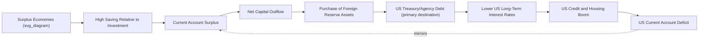

## Global Imbalances and Reserve Accumulation

### Overview

Global imbalances refer to the persistent, large current account surpluses and deficits accumulated by different economies in the global economy — most prominently the large and sustained US current account deficit alongside large surpluses in China, Japan, Germany, and oil-exporting economies, particularly pronounced from the late 1990s through the 2008 Global Financial Crisis and persisting in evolving forms since. Reserve accumulation — the buildup of foreign exchange reserves, predominantly in US dollar-denominated assets, by surplus economies and crisis-conscious emerging markets — is both a symptom and a mechanism of these imbalances. This topic connects directly to the Lucas Paradox ("uphill" capital flows), the 2008 Global Financial Crisis (the "savings glut" as a contributing precondition), and the Asian Financial Crisis (reserve accumulation as post-crisis self-insurance).

### Defining and Measuring Global Imbalances

**Key Points**

- The **current account balance** of a country equals its trade balance (exports minus imports of goods and services) plus net income and net transfers from abroad; by the balance-of-payments identity, a current account surplus corresponds to net capital/financial outflows (the country is a net lender to the rest of the world), and a deficit corresponds to net capital inflows (a net borrower).
- "Global imbalances" specifically refers to the phenomenon where these current account positions become unusually large and persistent for major economies simultaneously, such that the sum of large deficits (led by the US) is mirrored by large surpluses concentrated among a relatively small number of economies (China and other East Asian economies, Germany, oil exporters) — a pattern of concern because of its scale and persistence rather than the mere existence of current account imbalances per se (which are a normal feature of any open economy at any given time).
- A useful national accounting identity frames the current account as the gap between national saving ($S$) and investment ($I$):

$$CA = S - I = (S_{private} - I_{private}) + (S_{government} - I_{government})$$

This identity underlies much of the debate about the causes of imbalances — a large US current account deficit reflects, by definition, that US national saving fell short of US investment, while China's surplus reflects Chinese saving exceeding Chinese investment, even though Chinese investment rates were themselves very high in absolute terms.

### Historical Evolution of Global Imbalances

**Key Points**

- Prior to the mid-1990s, global current account imbalances among major economies were comparatively modest by historical standards relative to what developed subsequently.
- From the late 1990s through 2007-08, the **US current account deficit** widened dramatically, reaching approximately 5-6% of US GDP at its pre-crisis peak (2005-2006), an unusually large and sustained deficit for an advanced reserve-currency-issuing economy.
- Mirroring this, **China's current account surplus** grew substantially through the 2000s (reaching roughly 8-10% of Chinese GDP at its 2007 peak), alongside sustained surpluses in Japan, Germany, and major oil-exporting economies (particularly during the 2000s commodity price boom).
- Following the 2008 GFC, global imbalances narrowed somewhat (the US deficit and China's surplus both declined as shares of GDP from their pre-crisis peaks), though [Inference] economists differ on the extent to which this narrowing reflects durable structural rebalancing (e.g., genuine shifts in Chinese domestic consumption and investment patterns, US household deleveraging) versus cyclical factors that could partially reverse over time.

### Causes of Global Imbalances: Competing Explanations

**The "Global Saving Glut" Hypothesis**

- Associated prominently with a 2005 speech by then-Federal Reserve Governor Ben Bernanke, this hypothesis attributes the pre-2008 imbalances primarily to a **surge in desired global saving**, particularly in East Asian economies (post-Asian-Financial-Crisis precautionary reserve accumulation) and oil-exporting economies (recycling elevated oil revenues), which was not matched by correspondingly high desired investment in those same economies — the resulting excess saving flowed into global financial markets, disproportionately into US assets given the depth, liquidity, and perceived safety of US financial markets (particularly Treasury and agency debt).
- Under this view, the causal arrow runs primarily from foreign saving behavior to the US current account deficit — essentially, capital inflows into the US kept US long-term interest rates lower than they otherwise would have been, which (alongside domestic financial innovation and regulatory gaps) contributed to the US housing and credit boom detailed in the 2008 GFC case study.

**The "Bretton Woods II" Hypothesis**

- An alternative framework (associated with economists Michael Dooley, David Folkerts-Landau, and Peter Garber) argues that China and other East Asian economies deliberately pursued **export-oriented growth strategies** involving managed, undervalued exchange rates, requiring sustained central bank intervention (purchasing dollar assets) to prevent currency appreciation — drawing an analogy to the original Bretton Woods system's role in supporting post-war reconstruction-oriented growth strategies via a similar (though formally different) fixed-exchange-rate-anchored arrangement.
- Under this view, the causal arrow runs more from deliberate exchange rate and trade policy choices in surplus countries toward the resulting imbalances and reserve accumulation, rather than purely from autonomous private saving behavior.

**US-Centered Explanations**

- An alternative or complementary domestic explanation emphasizes factors originating in the US itself: persistent US fiscal deficits (particularly in the early-to-mid 2000s, sometimes discussed under the "twin deficits" framing linking fiscal and current account deficits), low US household saving rates, and the dollar's unique role as the primary global reserve currency, which structurally supports sustained foreign demand for dollar assets regardless of surplus-country policy choices (a version of the "exorbitant privilege" argument, discussed further below).
- [Inference] Most mainstream analyses treat these explanations as complementary rather than mutually exclusive — surplus-country saving behavior/exchange rate policy, deficit-country fiscal and private saving behavior, and the dollar's reserve currency status likely interacted to produce the scale of pre-2008 imbalances, and disentangling the relative causal weight of each remains an area of ongoing empirical and theoretical debate among international economists.

### Diagram: Global Imbalances Mechanism

### Reserve Accumulation: Motives and Mechanics

**Key Points**

- **Precautionary/self-insurance motive**: Following the severe costs of the 1997-98 Asian Financial Crisis (detailed in the dedicated case study), many emerging economies deliberately built large foreign exchange reserve buffers to reduce vulnerability to future sudden stops, reducing reliance on potentially slow or conditionality-laden IMF assistance — a policy response often summarized as "self-insurance."
- **Mercantilist/competitiveness motive**: Reserve accumulation can also result from deliberate exchange rate management — a central bank purchases foreign currency (accumulating reserves) specifically to prevent domestic currency appreciation that would otherwise occur given trade surpluses or capital inflows, thereby preserving export competitiveness (directly connecting to the Bretton Woods II hypothesis above).
- **Reserve adequacy metrics**: Common benchmarks used to assess whether reserve holdings are "adequate" include the **Greenspan-Guidotti rule** (reserves should cover at least 100% of short-term external debt) and import-coverage ratios (reserves sufficient to cover a given number of months of imports, traditionally 3 months as a baseline adequacy threshold, though this metric is now considered less relevant for economies with significant capital account exposure compared to short-term-debt-based metrics).
- **Composition of reserves**: The vast majority of global foreign exchange reserves have historically been held in US dollar-denominated assets (predominantly US Treasury securities), reflecting the dollar's role as the primary global reserve currency, though the euro, Japanese yen, British pound, and more recently the Chinese renminbi constitute smaller shares of global reserve holdings, with some gradual, closely-watched diversification trends over time.

### The Sterilization Problem

**Key Points**

- When a central bank purchases foreign currency to prevent domestic currency appreciation, this intervention mechanically increases the domestic money supply (the central bank creates domestic currency to purchase the foreign assets) — if unaddressed, this can fuel domestic inflation and asset price bubbles.
- To offset this effect, central banks conduct **sterilization**: simultaneously selling domestic-currency-denominated securities (e.g., central bank bills) to absorb the excess domestic liquidity created by the foreign exchange intervention, keeping the domestic money supply roughly unchanged despite the reserve accumulation.
- [Inference] Sterilization is not costless or perfectly effective at scale: it requires a sufficiently deep domestic bond market to absorb the sterilization securities, can create quasi-fiscal costs for the central bank if domestic interest rates exceed the yield earned on foreign reserve assets (a "negative carry" cost), and becomes progressively more difficult to fully offset as the scale of required intervention grows very large relative to the domestic financial system, a challenge widely discussed in the context of China's large-scale reserve accumulation during the 2000s.

### China as the Central Case Study

**Key Points**

- China's foreign exchange reserves grew from under $200 billion in the late 1990s to a peak of roughly $4 trillion around 2014, by far the largest reserve holdings of any single country in history, reflecting the scale and duration of China's current account surpluses and managed exchange rate policy over this period.
- China's exchange rate regime evolved from a fixed peg to the US dollar (pre-2005) to a managed float with a gradually widening trading band (post-2005 reforms), with the renminbi undergoing gradual, managed appreciation over the 2000s-2010s even as substantial reserve accumulation continued.
- [Inference] The scale of Chinese reserve accumulation and its investment in US Treasury securities is widely regarded by economists as having contributed meaningfully to holding down US long-term interest rates in the pre-2008 period (the "global saving glut" channel), though there is no full consensus on the precise quantitative magnitude of this effect relative to other contributing factors such as Federal Reserve monetary policy and US financial market dynamics.
- China's reserve accumulation trajectory has been comparatively stable to declining since its mid-2010s peak, reflecting a combination of more flexible exchange rate management, capital outflow pressures at various points, and gradual rebalancing of the Chinese economy toward greater domestic consumption, though full "rebalancing" remains an ongoing and actively debated policy objective rather than a completed process.

### The Dollar's "Exorbitant Privilege"

**Key Points**

- The persistent willingness of the rest of the world to hold large quantities of US dollar-denominated reserve assets, despite sustained US current account deficits, reflects what French Finance Minister Valéry Giscard d'Estaing termed (in the 1960s, originally directed at the Bretton Woods system) the dollar's **"exorbitant privilege"**: the US's unique ability to finance persistent external deficits by issuing its own currency-denominated liabilities, which the rest of the world willingly holds as a reserve asset, rather than facing the balance-of-payments constraints a non-reserve-currency country would encounter.
- This privilege is generally attributed to the depth, liquidity, and perceived safety of US financial markets, the dollar's dominant role in global trade invoicing and financial contracting, and network effects reinforcing the dollar's incumbency as the primary global reserve currency — a status not automatically available to any economy simply by virtue of running current account surpluses or possessing a large economy.
- [Speculation] Some economists and policymakers have periodically raised questions about the longer-term sustainability of the dollar's exorbitant privilege given persistent large US fiscal and current account deficits, gradual reserve diversification trends, and the emergence of alternative reserve currency candidates (the euro, and more speculatively the Chinese renminbi), though as of recent data the dollar's dominant reserve currency position has shown considerable persistence, and forecasts of imminent displacement have a long history of not materializing on the timelines predicted.

### Risks Associated with Persistent Global Imbalances

**Key Points**

- **Financial stability risk**: As detailed in the 2008 Global Financial Crisis case study, large capital inflows into deficit countries (facilitated by surplus-country reserve accumulation and private capital flows) can fuel unsustainable domestic credit and asset price booms, a contributing precondition to the 2008 crisis.
- **Disorderly adjustment risk**: A persistent theoretical concern (though one that has not fully materialized to date) is that a sudden loss of confidence in dollar assets by surplus-country reserve holders could trigger a rapid, disorderly depreciation of the dollar and disruptive adjustment in global capital markets — sometimes discussed under the framing of a potential "hard landing" for global imbalances, contrasted with a more gradual, "soft landing" adjustment path.
- **Protectionist and trade policy tensions**: Persistent bilateral trade imbalances (particularly the US-China bilateral trade deficit) have been a recurring source of trade policy tension and have factored into tariff and trade negotiation disputes, reflecting the political economy dimension of imbalances beyond their purely macroeconomic characteristics.
- **Constraints on domestic policy in surplus economies**: Large-scale reserve accumulation and associated sterilization can create domestic distortions (asset bubbles if sterilization is imperfect, quasi-fiscal costs, delayed exchange rate and financial sector reform) in the surplus economies themselves.

### Policy Responses and Rebalancing Proposals

**Key Points**

- **Exchange rate adjustment**: Gradual appreciation of surplus-country currencies (as China pursued, in managed form, from 2005 onward) is a standard textbook rebalancing mechanism, though politically sensitive given export-sector competitiveness concerns.
- **Domestic demand rebalancing in surplus economies**: Policies to boost domestic consumption relative to saving and investment in surplus economies (e.g., strengthening social safety nets in China to reduce precautionary household saving, a long-standing recommendation in international policy discussions) are frequently proposed as a demand-side complement to exchange rate adjustment.
- **Fiscal adjustment in deficit economies**: Reducing fiscal deficits in deficit countries (addressing the "twin deficits" dimension) is a standard complementary policy lever, though its effectiveness in fully resolving external imbalances depends on private saving-investment behavior responding as theory predicts (an empirically contested proposition).
- **International coordination efforts**: The G20's elevation as the primary global economic coordination forum after the 2008 GFC (detailed in that case study) included explicit discussion of global imbalance rebalancing as a shared policy objective, though binding international coordination mechanisms for addressing imbalances remain limited, with adjustment continuing to depend substantially on individual national policy choices.

### Comparative Summary Table

| Dimension | Global Saving Glut View | Bretton Woods II View | US-Centered View |
| --- | --- | --- | --- |
| Primary causal driver | Excess desired saving in surplus economies | Deliberate export-oriented exchange rate policy | US fiscal deficits, low household saving, dollar reserve status |
| Role of exchange rate policy | Secondary/consequence | Central/deliberate | Secondary |
| Policy implication | Address saving-investment gaps in surplus economies | Currency revaluation in surplus economies | US fiscal consolidation, structural saving reform |
| Relationship to 2008 GFC | Direct contributing precondition (low US rates) | Indirect (via same low-rate channel) | Domestic US regulatory/financial factors emphasized more heavily |

**Related Topics**

- The Lucas Paradox and "uphill" capital flows (directly related empirical pattern)
- The 2008 Global Financial Crisis: pre-crisis macro-financial preconditions
- The "twin deficits" hypothesis (fiscal and current account deficits)
- Exchange rate regimes: managed floats and sterilized intervention mechanics
- The dollar's reserve currency status and "exorbitant privilege"
- China's exchange rate policy and gradual renminbi internationalization
- Reserve adequacy metrics and the Greenspan-Guidotti rule
- The 1997-98 Asian Financial Crisis (precautionary reserve accumulation motive)
- G20 governance and international macroeconomic policy coordination