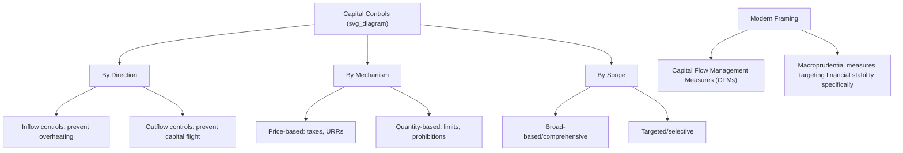

## Capital Controls in Theory and Practice

### Overview

Capital controls are government-imposed measures that restrict, tax, or otherwise regulate cross-border capital flows — either inflows, outflows, or both. This topic builds directly on the capital account liberalization case study earlier in this chapter, focusing specifically on the theoretical rationale for controls, their instrument design, and the accumulated empirical evidence on their effectiveness. The subject has undergone a significant rehabilitation in mainstream international economics since the 1990s, moving from the "Washington Consensus" era view of controls as inherently distortionary and undesirable toward the IMF's 2012 "Institutional View" explicitly endorsing targeted capital flow management measures (CFMs) under defined circumstances.

### Taxonomy of Capital Controls

**By Direction**

- **Inflow controls**: restrictions or taxes designed to limit or discourage capital entering a country, typically deployed to prevent overheating, currency overvaluation, or excessive short-term/speculative inflow accumulation during boom periods.
- **Outflow controls**: restrictions designed to limit or discourage capital leaving a country, typically deployed during crisis periods to prevent disorderly capital flight, currency collapse, or reserve depletion (as in Malaysia's 1998 measures, detailed in the Asian Financial Crisis case study).

**By Mechanism**

- **Price-based (market-based) controls**: taxes, levies, or unremunerated reserve requirements that alter the financial cost of a transaction without prohibiting it outright — investors remain free to transact but face an explicit cost, allowing the market to allocate around the tax while discouraging the targeted flow at the margin.
- **Quantity-based (administrative) controls**: outright limits, quotas, licensing requirements, or prohibitions on specific categories of transactions — a binding restriction rather than a price signal, generally considered more distortionary but also more immediately effective in an acute crisis when speed matters more than allocative efficiency.

**By Scope**

- **Broad-based/comprehensive controls**: apply generally across most or all capital account categories (historically common in developing economies prior to widespread 1980s-1990s liberalization).
- **Targeted/selective controls**: apply to specific transaction types, maturities, or sectors (e.g., short-term debt specifically, or foreign-currency-denominated bank liabilities specifically) — the dominant modern policy design approach, reflecting the sequencing lessons discussed in the capital account liberalization case study (favoring restrictions on short-term, volatile flows over FDI).

### Diagram: Capital Controls Taxonomy

### Theoretical Rationale for Capital Controls

**Key Points**

- **Trilemma-based rationale**: Per the Impossible Trinity (discussed extensively in the Asian Financial Crisis case study), a country wishing to maintain a fixed or managed exchange rate while retaining independent monetary policy must restrict capital mobility — capital controls are, in this framework, a direct and logically necessary tool for achieving a specific desired combination of exchange rate and monetary policy objectives, rather than simply a distortion to be minimized.
- **Second-best theory rationale**: Given the existence of other market failures or distortions (currency mismatches, moral hazard in bank lending, imperfect information, absent domestic hedging markets), capital controls can, in principle, improve welfare relative to a fully liberalized capital account by addressing the specific distortion directly — a standard "second-best" economic argument that a targeted intervention can be superior to no intervention when a first-best (removing the underlying distortion itself) is not readily achievable.
- **Preventing procyclical boom-bust dynamics**: As discussed in the capital account liberalization case study, capital inflows are frequently procyclical, amplifying rather than smoothing domestic business cycles; inflow controls (particularly on short-term, speculative flows) can in principle reduce this procyclicality by "leaning against" excessive inflow surges during boom periods.
- **Preserving policy space during crises**: Outflow controls can, in principle, provide breathing room for a country to implement orderly macroeconomic adjustment (interest rate policy, fiscal measures) without the immediate pressure of accelerating capital flight, as in the Malaysian 1998 case.
- **Revenue generation**: A secondary, less emphasized rationale — some price-based controls (e.g., financial transaction taxes) generate fiscal revenue as a byproduct, though this is rarely the primary stated policy objective.

### Theoretical Costs and Counterarguments

**Key Points**

- **Allocative efficiency losses**: Controls impede the efficient international allocation of capital toward its highest-return uses, the core theoretical cost identified in the capital account liberalization case study's discussion of benefits foregone.
- **Circumvention and evasion**: Sophisticated market participants often find ways to route around controls (through misinvoicing of trade transactions, derivatives structuring, or offshore intermediation), potentially reducing the controls' practical effectiveness over time even as they impose compliance costs and market distortions on less sophisticated participants who cannot easily circumvent them.
- **Signaling and credibility costs**: The imposition of controls (particularly on outflows during a crisis) can be interpreted by international investors as a signal of policy weakness or a precursor to further restrictive measures (including potential outright expropriation), potentially damaging a country's longer-term ability to attract foreign investment even after controls are lifted — a reputational cost distinct from the controls' immediate mechanical effects.
- **Rent-seeking and corruption risk**: Administrative, quantity-based controls in particular can create opportunities for rent-seeking behavior (bribery for licenses or exemptions) and corruption, especially where regulatory institutions are weak.
- **Delayed necessary adjustment**: Controls used to defend an unsustainable exchange rate or fiscal position can, in principle, simply postpone rather than prevent a necessary macroeconomic adjustment, potentially making the eventual adjustment larger and more disruptive if underlying imbalances are not addressed during the period controls buy time for reform.

### Historical Evolution of the Mainstream View

**Key Points**

- **Pre-1980s**: Capital controls were common and largely unremarkable policy tools among both advanced and developing economies, consistent with the original Bretton Woods system's general acceptance of capital account restrictions (in contrast to its emphasis on current account convertibility).
- **1980s-1990s "Washington Consensus" era**: Mainstream policy advice, including from the IMF, shifted decisively toward viewing capital account liberalization as a generally desirable objective, with controls increasingly viewed as inefficient, distortionary relics to be phased out as part of broader market-oriented reform packages.
- **Post-1997-98 Asian Financial Crisis reassessment**: Malaysia's 1998 experience with outflow controls (detailed in the Asian Financial Crisis case study) — widely perceived at the time as having produced a reasonably orderly recovery without the severe social costs associated with IMF-program countries — significantly influenced renewed academic and policy interest in controls as a legitimate crisis-response tool, even as it remained a minority or controversial position within mainstream institutions through the early 2000s.
- **Post-2008 GFC and the IMF's 2012 "Institutional View"**: The scale and volatility of capital flows during and after the 2008 crisis, combined with a growing body of empirical research (including influential IMF staff research from economists such as Jonathan Ostry and colleagues in the early 2010s) finding that certain CFMs could usefully reduce financial stability risks without substantial offsetting costs, led the IMF to formally adopt an Institutional View in 2012 explicitly endorsing capital flow management measures under specific circumstances — a substantial and historically notable shift in the institution's official stance.

### The IMF's 2012 Institutional View: Key Provisions

**Key Points**

- The Institutional View establishes that capital flows can bring substantial benefits but also carry risks, and that CFMs may be appropriate as part of the policy toolkit — but generally as a **complement to, not a substitute for, warranted macroeconomic policy adjustment** (i.e., controls should not be used to avoid necessary exchange rate, fiscal, or monetary adjustments that are otherwise appropriate).
- CFMs are considered more appropriate when: the exchange rate is not significantly undervalued, reserves are already adequate, macroeconomic policy space (monetary and fiscal) is limited or has already been fully utilized, and the capital inflow surge is judged temporary or driven predominantly by external "push" factors rather than domestic fundamentals.
- The framework draws a distinction between measures applied to residents versus non-residents, and between measures that discriminate by currency of denomination versus residency of the transacting party — reflecting the technical complexity of designing controls that target specific risks without excessive collateral distortion.
- [Inference] The 2012 framework represents an attempt to formalize a middle-ground position — rejecting both the earlier "liberalization is always beneficial" orthodoxy and a return to broad-based, indiscriminate capital controls — though the framework has itself been critiqued by some economists and civil society commentators as still overly cautious in its endorsement of controls relative to the accumulated crisis evidence, while others view it as an appropriately calibrated, evidence-based evolution of IMF policy.

### Empirical Evidence on Effectiveness

**Key Points**

- **Effect on flow composition**: A relatively robust empirical finding across multiple country studies (including the widely cited Chilean unremunerated reserve requirement experience of the 1990s, detailed in the capital account liberalization case study) is that price-based inflow controls can shift the composition of capital inflows toward longer maturities, reducing short-term debt exposure specifically.
- **Effect on aggregate flow volume**: Evidence on whether controls meaningfully reduce the *total volume* of capital inflows (as opposed to merely shifting composition) is considerably more mixed, with some studies finding limited or temporary aggregate volume effects that diminish as market participants adapt or find circumvention channels over time.
- **Effect on exchange rate pressure**: Evidence on whether inflow controls meaningfully reduce currency appreciation pressure is similarly mixed; some studies find modest, statistically significant effects, while others find limited impact once other confounding macroeconomic factors are controlled for.
- **Effect on financial stability**: More recent research, particularly IMF staff work following the 2012 Institutional View's adoption, has found somewhat stronger evidence that targeted macroprudential-style CFMs (e.g., limits on foreign-currency bank lending) can reduce specific financial stability risks (such as credit booms fueled by foreign-currency borrowing) even where effects on aggregate flow volume or exchange rate levels are more limited — suggesting the financial-stability rationale for CFMs may currently have somewhat stronger empirical support than the traditional macroeconomic-management rationale.
- [Inference] A general pattern across the empirical literature is that CFM effectiveness appears highly context- and design-dependent — the same instrument type can show different effectiveness across countries and time periods, complicating simple, generalizable conclusions about "whether capital controls work," and reinforcing the modern policy framing that treats controls as one tool among several to be calibrated to specific circumstances rather than judged in a uniform binary fashion.

### Illustrative Country Case Comparison

| Country/Episode | Type of Control | Period | Primary Objective | General Assessment |
| --- | --- | --- | --- | --- |
| Chile | Price-based (URR on short-term inflows) | 1991-1998 | Shift inflow composition toward longer maturities | Widely viewed as a relatively successful composition-shifting example |
| Malaysia | Quantity-based (outflow restrictions, fixed peg) | 1998-2001 | Halt capital flight, regain monetary autonomy during crisis | Contested; associated with relatively orderly recovery, causal attribution debated |
| Brazil | Price-based (IOF tax on portfolio inflows) | 2009-2013 | Limit currency appreciation, moderate inflow surge | Mixed evidence on aggregate volume/exchange rate effects |
| Iceland | Quantity-based (comprehensive outflow controls) | 2008-2017 | Prevent disorderly krona collapse post-banking crisis | Generally viewed as necessary given crisis severity; gradual, carefully sequenced removal over nearly a decade |
| China | Comprehensive administrative controls (evolving) | Ongoing, various periods | Manage exchange rate, financial stability, gradual liberalization pace | Long-standing, gradually evolving rather than a discrete "episode"; central case for managed, sequenced liberalization |

### Iceland's Post-2008 Capital Controls: A Detailed Illustration

**Example**

Following the near-total collapse of Iceland's oversized banking sector in October 2008 (the three major Icelandic banks' combined assets had grown to roughly ten times Iceland's GDP prior to failure), Iceland imposed comprehensive capital controls in November 2008 to prevent a disorderly krona collapse and capital flight, working in conjunction with an IMF-supported program. [Inference] These controls remained in place, with only very gradual and carefully sequenced relaxation, for nearly a decade (substantially lifted by 2017), illustrating that outflow controls imposed during an acute crisis may need to remain in place considerably longer than initially anticipated when the underlying banking-sector and balance-of-payments adjustment challenges are severe, and that the removal of controls itself typically requires a carefully sequenced approach analogous to (but in the reverse direction of) the liberalization sequencing principles discussed in the capital account liberalization case study.

### Diagram: Effectiveness by Instrument Type and Objective

<svg xmlns="http://www.w3.org/2000/svg" viewBox="0 0 800 380" font-family="sans-serif">
<text x="400" y="26" text-anchor="middle" font-size="16" font-weight="bold">CFM Effectiveness by Objective (svg_diagram)</text>

<text x="120" y="60" font-size="12" font-weight="bold">Objective</text>

<text x="420" y="60" font-size="12" font-weight="bold">Typical Evidence Strength</text>

<line x1="20" y1="70" x2="780" y2="70" stroke="#9ca3af" stroke-width="1" />

<text x="120" y="100" font-size="12">Shift inflow composition</text>

<rect x="380" y="85" width="300" height="18" rx="3" fill="`#bbf7d0`" />

<text x="530" y="98" text-anchor="middle" font-size="11">Relatively strong</text>

<line x1="20" y1="115" x2="780" y2="115" stroke="#e5e7eb" stroke-width="1" />

<text x="120" y="145" font-size="12">Reduce aggregate inflow volume</text>

<rect x="380" y="130" width="180" height="18" rx="3" fill="`#fde68a`" />

<text x="470" y="143" text-anchor="middle" font-size="11">Mixed</text>

<line x1="20" y1="160" x2="780" y2="160" stroke="#e5e7eb" stroke-width="1" />

<text x="120" y="190" font-size="12">Reduce exchange rate pressure</text>

<rect x="380" y="175" width="150" height="18" rx="3" fill="`#fde68a`" />

<text x="455" y="188" text-anchor="middle" font-size="11">Mixed/modest</text>

<line x1="20" y1="205" x2="780" y2="205" stroke="#e5e7eb" stroke-width="1" />

<text x="120" y="235" font-size="12">Reduce financial stability risk (macroprudential)</text>

<rect x="380" y="220" width="260" height="18" rx="3" fill="`#bbf7d0`" />

<text x="510" y="233" text-anchor="middle" font-size="11">Moderate-to-strong</text>

<line x1="20" y1="250" x2="780" y2="250" stroke="#e5e7eb" stroke-width="1" />

<text x="120" y="280" font-size="12">Halt acute crisis-period capital flight</text>

<rect x="380" y="265" width="220" height="18" rx="3" fill="`#fde68a`" />

<text x="490" y="278" text-anchor="middle" font-size="11">Context-dependent</text>

</svg>

### Design Principles for Modern Capital Flow Management

**Key Points**

- **Targeted rather than broad-based**: Modern best-practice design favors controls targeted at specific risk categories (short-term debt, foreign-currency lending) rather than blanket restrictions across all capital account categories.
- **Temporary and state-contingent**: Controls are generally recommended as a response to identifiable, ideally temporary conditions (excessive inflow surges, acute crisis periods) rather than as a permanent structural feature, with a credible removal path to preserve longer-term investor confidence.
- **Complementary to macroeconomic adjustment**: Consistent with the IMF's Institutional View, controls are best framed as buying time or addressing specific market failures alongside — not instead of — warranted exchange rate, fiscal, and monetary policy adjustments.
- **Transparent and rules-based where possible**: Price-based, transparent, rules-based measures (such as a clearly defined tax rate) are generally viewed as less prone to rent-seeking and easier for markets to price around predictably than opaque, discretionary administrative controls.
- **Coordinated with macroprudential and financial regulation**: Given the empirical evidence suggesting financial-stability-oriented CFMs may have relatively stronger effectiveness, integrating capital flow measures with broader macroprudential regulatory frameworks (rather than treating them as a separate policy silo) is an increasingly emphasized design principle.

**Related Topics**

- Benefits and risks of capital account liberalization (foundational related case study)
- The Impossible Trinity / trilemma and exchange rate regime choice
- The IMF's 2012 Institutional View on capital flows (detailed provisions)
- Chile's unremunerated reserve requirement (1991-1998) case study
- Malaysia's 1998 capital controls episode (Asian Financial Crisis case study)
- Iceland's 2008-2017 capital controls experience
- Macroprudential regulation and financial stability policy
- Sudden stops and capital flow reversals (related case study)
- Sequencing of capital account liberalization and financial sector reform