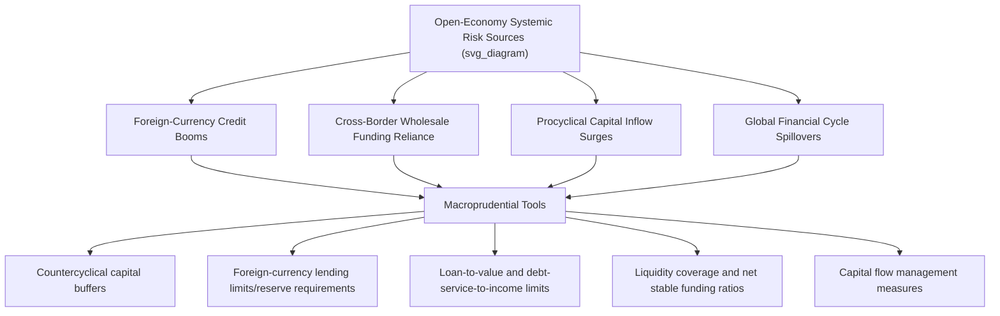

## Macroprudential Policy in Open Economies

### Overview

Macroprudential policy refers to the use of regulatory tools to safeguard the stability of the financial system as a whole, as distinct from traditional microprudential regulation, which focuses on the safety and soundness of individual institutions. In open economies with cross-border capital mobility, macroprudential policy takes on additional international dimensions: it must contend with capital flows, cross-border spillovers, exchange rate interactions, and the constraints imposed by the Impossible Trinity. This topic synthesizes and extends themes from the capital account liberalization, capital controls, and sudden stops case studies earlier in this chapter, framing macroprudential policy as a distinct but complementary tool for managing financial stability risk in internationally integrated economies.

### Macroprudential vs. Microprudential Regulation: A Foundational Distinction

**Key Points**

- **Microprudential regulation** aims to ensure the safety and soundness of individual financial institutions (capital adequacy, individual bank risk management), treating systemic risk as, at most, the simple sum of individual institutional risks.
- **Macroprudential regulation** explicitly targets **systemic risk** — risk to the financial system as a whole, arising from the interaction, correlation, and interconnectedness of individual institutions' behavior (e.g., common exposures, procyclical credit cycles, fire-sale externalities) — recognizing that a financial system can become fragile even if each individual institution appears well-capitalized in isolation.
- This distinction was significantly reinforced by the 2008 Global Financial Crisis (detailed in the dedicated case study), which demonstrated that individually well-capitalized-appearing institutions could collectively generate systemic fragility through correlated exposures (to US housing, to short-term wholesale funding) and dense interconnection (as illustrated by the Lehman Brothers and AIG episodes).
- The core macroprudential insight is often summarized as addressing the **"fallacy of composition"** in financial regulation: what is individually rational and safe for one institution (e.g., holding correlated assets, relying on short-term funding when it is currently cheap) can be collectively destabilizing when many institutions behave similarly and simultaneously.

### The International/Open-Economy Dimension

**Key Points**

- In a closed or financially autarkic economy, macroprudential policy would primarily address purely domestic credit cycle and interconnectedness risks. In an **open economy**, additional channels of systemic risk arise specifically from cross-border capital flows and international financial integration:
  - **Foreign-currency-denominated credit booms**: domestic borrowers (households, firms, banks) accumulating foreign-currency liabilities during periods of abundant global liquidity, creating currency mismatch vulnerabilities that materialize during a sudden stop or currency depreciation (directly connecting to the "original sin" hypothesis discussed in the sudden stops case study).
  - **Cross-border bank funding fragility**: domestic banks relying on short-term cross-border wholesale funding (as European banks did with US dollar funding markets prior to 2008, detailed in the GFC case study), creating a funding-liquidity vulnerability transmitted internationally rather than purely domestically generated.
  - **Capital-flow-driven asset price and credit cycles**: as discussed in both the capital account liberalization and global imbalances case studies, capital inflows are frequently procyclical, and large inflow surges can fuel domestic credit and asset price booms independent of purely domestic monetary or fiscal conditions.
  - **Cross-border spillovers of domestic macroprudential policy**: a country's macroprudential tightening can, in principle, redirect capital flows and credit activity toward other jurisdictions or toward unregulated ("shadow") channels, creating leakage and requiring international coordination considerations distinct from a closed-economy setting.

### Diagram: Macroprudential Policy Channels in Open Economies

### Core Macroprudential Tool Categories

**Countercyclical Capital Buffers (CCyB)**

- A Basel III innovation (see the 2008 GFC case study for broader Basel III context) requiring banks to build additional capital buffers during periods of excessive credit growth, which can be released during downturns to absorb losses and sustain lending — designed explicitly to "lean against" the credit cycle rather than simply requiring a static capital level.
- In an open-economy context, CCyB decisions can have cross-border reciprocity implications: under Basel III's jurisdictional reciprocity arrangements, a bank's home regulator is expected to apply the buffer rate set by the host country where its foreign exposures are located, addressing potential regulatory arbitrage/leakage.

**Foreign-Currency-Specific Measures**

- Differentiated (typically higher) reserve requirements on foreign-currency-denominated bank liabilities compared to domestic-currency liabilities, designed to internalize the currency mismatch risk that foreign-currency lending creates.
- Limits or caps on foreign-currency lending to unhedged borrowers (borrowers without foreign-currency revenue streams to naturally offset the currency risk), directly addressing the "original sin"/currency mismatch mechanism central to many emerging-market crises.
- [Inference] These measures are generally regarded, based on the empirical literature discussed in the capital controls case study, as among the more empirically well-supported categories of macroprudential intervention specifically for open, capital-account-liberalized emerging markets, given their direct targeting of the currency mismatch channel most closely associated with crisis severity in historical episodes.

**Borrower-Based Measures**

- **Loan-to-value (LTV) limits**: capping mortgage or asset-backed lending as a percentage of the underlying asset's value, directly targeting asset price bubble risk (particularly relevant given the central role of property bubbles in both the 2008 GFC and several European Sovereign Debt Crisis countries, notably Ireland and Spain).
- **Debt-service-to-income (DSTI) or debt-to-income (DTI) limits**: capping borrower debt burdens relative to income, targeting household-sector credit risk directly.
- These measures are generally applicable regardless of whether credit is foreign- or domestic-currency-denominated, addressing asset price and household leverage risk more generally, though they are often deployed in combination with currency-specific tools in open emerging-market economies facing both risk types simultaneously.

**Liquidity-Based Measures**

- **Liquidity Coverage Ratio (LCR)** and **Net Stable Funding Ratio (NSFR)**, both Basel III standards, require banks to hold sufficient high-quality liquid assets to survive a defined stress scenario and to fund longer-term assets with sufficiently stable funding sources, respectively — directly addressing the cross-border wholesale funding fragility exposed during the 2008 crisis (particularly the European bank dollar-funding freeze detailed in that case study).

**Capital Flow Management Measures (CFMs)**

- As detailed extensively in the dedicated capital controls case study, CFMs (price-based taxes, quantity-based limits) overlap substantially with macroprudential policy when specifically targeted at financial-stability risks arising from capital flow composition or volume, and the IMF's 2012 Institutional View explicitly recognizes this overlap category as a legitimate, and empirically somewhat better-supported, use of capital flow restrictions.

### The Interaction with Monetary Policy and the Trilemma

**Key Points**

- Macroprudential policy is often framed as providing an **additional policy instrument** that can help address financial stability risks that monetary policy alone is poorly suited to manage — for instance, if a small, financially open economy faces a domestic credit boom while also needing to maintain a particular exchange rate or interest rate stance for other reasons (external balance, inflation targeting), macroprudential tools can, in principle, address the credit boom directly without requiring interest rate changes that might conflict with other objectives.
- This is sometimes discussed as effectively adding a "fourth instrument" alongside the traditional trilemma framework (exchange rate policy, monetary policy, capital account openness) — some economists frame well-designed macroprudential policy as partially relaxing the constraints of the trilemma/dilemma by providing a targeted tool for financial stability objectives specifically, allowing monetary policy to focus more purely on its traditional inflation/output stabilization objectives.
- [Inference] However, this "fourth instrument" framing should not be overstated: macroprudential tools have their own effectiveness limits (circumvention, leakage to unregulated channels, calibration difficulty), and most economists view macroprudential policy as a complement to, rather than a full substitute for, appropriate monetary, fiscal, and exchange rate policy — consistent with the IMF's Institutional View framing of CFMs as a complement to warranted macroeconomic adjustment rather than a replacement for it.

### Cross-Border Coordination and Spillover Challenges

**Key Points**

- **Regulatory arbitrage/leakage**: If one country tightens macroprudential requirements on domestic banks, credit demand may migrate to foreign bank branches, unregulated non-bank lenders, or cross-border direct borrowing, potentially undermining the policy's domestic effectiveness unless coordinated across relevant jurisdictions and institution types.
- **Basel III reciprocity mechanisms**: as noted above, international agreements requiring foreign banks' home regulators to apply host-country countercyclical buffer requirements to relevant foreign exposures represent one institutionalized coordination mechanism addressing this leakage concern.
- **Spillovers from advanced-economy monetary policy**: Consistent with the "Global Financial Cycle" framework discussed in the capital account liberalization and sudden stops case studies, advanced-economy monetary policy (particularly US Federal Reserve policy) can drive capital flow surges into emerging markets largely independent of those countries' own domestic conditions, creating a policy spillover that macroprudential tools in the recipient country must respond to reactively rather than through any direct influence over the originating policy decision.
- **International standard-setting bodies**: The **Financial Stability Board (FSB)**, established in 2009 in response to the 2008 GFC (and building on the earlier Financial Stability Forum), alongside the **Basel Committee on Banking Supervision**, serve as the primary international venues for coordinating macroprudential standard-setting, though implementation and calibration remain substantially at the national or regional level.

### Illustrative Country Examples

**Key Points**

- **South Korea**: Adopted a series of macroprudential measures in the early 2010s specifically targeting foreign-currency-denominated bank liabilities and foreign-currency derivatives positions (including a "macroprudential stability levy" on non-core foreign-currency bank liabilities), directly informed by South Korea's own severe experience during the 1997-98 Asian Financial Crisis (detailed in that case study) and its comparatively severe exposure to the 2008 GFC's cross-border funding freeze despite having no direct subprime exposure.
- **Ireland and Spain (pre-2008)**: Retrospective analysis of the European Sovereign Debt Crisis (detailed in that case study) frequently emphasizes that more robust macroprudential tools — particularly LTV limits and countercyclical capital buffers — might have meaningfully constrained the property-lending booms that ultimately produced severe banking-sector losses and, via the bank-sovereign "doom loop," sovereign fiscal crises in both countries; this retrospective assessment substantially informed the post-crisis European Banking Union reforms (Single Supervisory Mechanism, Single Resolution Mechanism) discussed in that case study.
- **China**: Employs a broad and evolving toolkit of macroprudential measures (including differentiated reserve requirements, LTV limits varying by city and buyer status, and administrative guidance on credit growth) as a central complement to its managed exchange rate and capital account policies, reflecting the country's distinctive combination of extensive administrative capacity and continued substantial (though gradually liberalizing) capital account restrictions.

### Comparative Framework: Macroprudential Tools vs. Related Policy Instruments

| Instrument | Primary Target | Closed vs. Open Economy Relevance | Key Related Case Study |
| --- | --- | --- | --- |
| Countercyclical capital buffer | Bank capital adequacy over the credit cycle | Both, with cross-border reciprocity considerations in open economies | 2008 Global Financial Crisis (Basel III) |
| Foreign-currency lending limits | Currency mismatch risk | Primarily open-economy relevant | Sudden stops; "original sin" hypothesis |
| LTV/DSTI limits | Asset price bubbles, household leverage | Both | European Sovereign Debt Crisis (Ireland, Spain) |
| Liquidity Coverage Ratio/NSFR | Funding liquidity risk | Both, with cross-border wholesale funding especially relevant in open economies | 2008 GFC (dollar funding freeze) |
| Capital flow management measures | Composition/volume of cross-border flows | Exclusively open-economy relevant | Capital controls; capital account liberalization |

### Empirical Evidence and Ongoing Debates

**Key Points**

- [Inference] A growing body of empirical research since the 2008 GFC, including cross-country studies conducted by the IMF, Bank for International Settlements (BIS), and academic researchers, generally finds that macroprudential tools — particularly LTV/DSTI limits and foreign-currency-specific measures — can meaningfully reduce credit growth and financial stability risk indicators, though effect sizes vary considerably across country contexts, tool design, and implementation rigor, and isolating macroprudential policy effects from concurrent monetary and exchange rate policy changes remains a persistent empirical challenge.
- A continuing debate concerns the appropriate **institutional home** for macroprudential policy: whether it should sit within the central bank (leveraging existing financial-sector expertise and independence, as in the UK's Financial Policy Committee housed within the Bank of England), a separate dedicated systemic risk council (as with the US Financial Stability Oversight Council, FSOC, established under Dodd-Frank), or some hybrid arrangement — with different jurisdictions adopting different institutional models reflecting varying legal traditions and pre-existing regulatory architecture.
- Another ongoing debate concerns calibration and **rules versus discretion**: whether macroprudential tools should be governed by pre-announced, rules-based triggers (enhancing predictability and reducing political pressure to delay tightening during booms) or discretionary judgment by regulators (allowing flexibility to respond to evolving and imperfectly-measured systemic risk indicators) — a debate structurally analogous to the long-standing rules-versus-discretion debate in conventional monetary policy.

**Related Topics**

- The 2008 Global Financial Crisis and Basel III origins (foundational case study)
- The European Sovereign Debt Crisis and the bank-sovereign doom loop
- Capital controls in theory and practice (closely related toolkit)
- Sudden stops and the "original sin" hypothesis (currency mismatch rationale)
- The Global Financial Cycle and monetary policy spillovers
- Basel III capital and liquidity standards in detail
- European Banking Union: Single Supervisory Mechanism and Single Resolution Mechanism
- The Financial Stability Board and international regulatory coordination
- Countercyclical capital buffers and credit cycle management