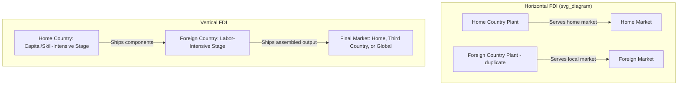
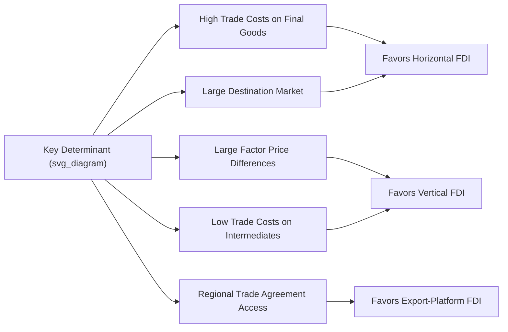

## Horizontal versus Vertical Foreign Direct Investment

### Overview

Horizontal and vertical foreign direct investment (FDI) represent the two principal theoretical categories in the modern economics of multinational enterprises (MNEs), distinguished by the underlying motive for establishing production facilities abroad. Horizontal FDI replicates the same production activity in multiple countries primarily to serve local markets, while vertical FDI fragments the production process across countries to exploit factor cost or resource differences. This distinction, formalized in the trade and FDI theory literature since the 1980s-1990s (notably in work by economists including James Markusen, Elhanan Helpman, and others building the "knowledge-capital model" of the multinational firm), underpins much of modern analysis of global value chains, offshoring, and the interaction between trade policy and FDI location decisions.

### Horizontal FDI: Definition and Motive

**Key Points**

- **Horizontal FDI** occurs when a firm establishes production facilities in multiple countries that essentially duplicate the same activity — producing the same or similar goods/services in each location primarily to serve the local market in that country, rather than to export back to the home country or a third market.
- The core theoretical motive is the **"proximity-concentration trade-off"**: a firm can serve a foreign market either by exporting from a single, concentrated home production facility (incurring trade costs — tariffs, transport costs) or by establishing local production abroad (incurring the additional fixed costs of setting up and operating a second plant, but avoiding trade costs and gaining proximity to local customers, potentially including tailoring products to local tastes or regulatory requirements).
- Horizontal FDI is theoretically predicted to be more attractive relative to exporting when: trade costs (tariffs, transport costs, non-tariff barriers) are high; the destination market is large enough to justify the fixed costs of local production ("market-seeking" motive); and the technology involved does not exhibit extremely strong plant-level scale economies (since horizontal FDI requires duplicating capacity across locations, strong plant-level economies of scale would favor concentrated, export-oriented production instead).
- Classic examples include automobile manufacturers establishing assembly plants in major consumer markets (e.g., foreign automakers building factories in the US, EU, or China specifically to serve those large domestic markets), and consumer goods/retail companies establishing local production or service operations to serve local demand directly.

### Vertical FDI: Definition and Motive

**Key Points**

- **Vertical FDI** occurs when a firm fragments its production process geographically, locating different stages of production in different countries based on where the required factors of production (labor, natural resources, specific inputs) are least costly or most abundant, with the output at each stage typically transported to another location (often back to the home country, or to a third country) for further processing, assembly, or final sale, rather than being sold locally.
- The core theoretical motive is **factor cost arbitrage**, directly related to Heckscher-Ohlin-style comparative advantage logic applied within the firm rather than purely between independently trading firms: labor-intensive stages of production are located in labor-abundant, lower-wage countries, while capital- or skill-intensive stages remain in capital/skill-abundant countries.
- Vertical FDI is theoretically predicted to be more prevalent when: factor price (particularly wage) differences between countries are large; the production process can be technically "sliced" into geographically separable stages (a function of technology and the nature of the product); and trade costs for intermediate inputs and components are sufficiently low to make geographically fragmented production efficient (falling transport and communication costs, alongside trade liberalization reducing tariffs on intermediate goods, have historically been key enabling factors for the growth of vertical FDI).
- Classic examples include electronics assembly (components manufactured in multiple countries, final assembly performed in a lower-wage location such as historically in parts of East Asia), and apparel/textile production (design and marketing retained in the home/developed-country headquarters, labor-intensive stitching and assembly performed in lower-wage developing economies).

### Diagram: Horizontal vs. Vertical FDI Structures

### Formal Comparison Table

| Dimension | Horizontal FDI | Vertical FDI |
| --- | --- | --- |
| Primary motive | Market access ("market-seeking") | Factor cost arbitrage ("efficiency-seeking") |
| Relationship between home and foreign plant | Duplicative — same activity in each location | Complementary — different stages of a single production chain |
| Effect on trade | Substitutes for exports (tariff-jumping) | Generates intra-firm trade in intermediate goods/components |
| Sensitivity to trade costs | High trade costs favor horizontal FDI over exporting | Low trade costs (on intermediates) favor vertical FDI over integrated home production |
| Sensitivity to factor price differences | Relatively less sensitive | Highly sensitive — core driver |
| Typical destination market characteristics | Large, often similar-income markets | Lower-wage, factor-abundant markets |
| Relationship to firm size/skill intensity | Associated with firms possessing transferable intangible assets (brand, technology) suited to replication | Associated with firms able to technically fragment production stages |
| Canonical theoretical model | Proximity-concentration trade-off (Brainard, Markusen) | Factor-proportions/comparative advantage applied intra-firm (Helpman) |

### Theoretical Foundations: Key Models

**Key Points**

- **The proximity-concentration trade-off** (formalized notably in work by economist S. Lael Brainard in the early 1990s) provides the standard framework for horizontal FDI: firms weigh the fixed cost of establishing an additional plant (concentration benefits — economies of scale from producing in one location) against the variable trade costs saved by producing locally (proximity benefits — avoiding tariffs, transport costs, and gaining local market responsiveness). Horizontal FDI is predicted to dominate when proximity benefits exceed the foregone concentration (scale) benefits.
- **Helpman's factor-proportions approach to vertical FDI** (building on earlier work by Helpman in the early 1980s) models multinational firms choosing to fragment production internationally when factor price differences across countries are sufficiently large relative to the (often lower) costs of coordinating and transporting components across international production stages, directly linking the internal organizational structure of the firm to standard trade-theoretic factor abundance logic.
- **The "Knowledge-Capital Model"** (developed by James Markusen and collaborators through the 1990s-2000s) integrates both horizontal and vertical motives into a single unified framework, additionally emphasizing the role of firm-specific intangible assets ("knowledge capital" — technology, brand reputation, management expertise) that can be transferred across borders and applied in multiple production locations at low marginal cost (a "public good within the firm" characteristic), explaining why multinational firms rather than purely arm's-length licensing or trade arrangements often emerge as the organizational form for exploiting such assets internationally — this model is widely regarded as the standard synthesis framework in the academic MNE/FDI literature, capable of generating horizontal, vertical, or mixed ("export-platform") FDI patterns depending on parameter configurations (relative country size, factor endowment differences, trade costs, investment costs).

### Export-Platform FDI: A Hybrid Category

**Key Points**

- **Export-platform FDI** describes a hybrid pattern in which a multinational establishes production in one foreign country not primarily to serve that country's own domestic market (as pure horizontal FDI would predict), nor solely to exploit factor cost differences for inputs shipped back home (as pure vertical FDI would predict), but rather to serve a **third-country market** or a broader regional market from that location — often motivated by regional trade agreements or preferential market access from the "platform" country to surrounding markets.
- A widely cited real-world illustration involves US and Japanese multinational investment in various EU member states historically undertaken partly to gain tariff-free access to the broader EU single market from within one member country, rather than purely to serve that specific member country's domestic demand — the investment location decision is driven by the platform country's trade relationships with third markets rather than solely its own domestic market size or factor costs.
- [Inference] Export-platform FDI is increasingly emphasized in the academic and policy literature as empirically significant, particularly within regional trade blocs and preferential trade arrangements, though it is analytically treated as a distinct third category or as a specific parameter configuration within the broader knowledge-capital model synthesis, rather than a wholly separate theoretical framework.

### Determinants Summary: What Drives the Horizontal/Vertical Choice

**Key Points**

- **Trade costs**: High trade costs on final goods favor horizontal FDI (avoiding tariffs by producing locally); low trade costs on intermediate goods/components favor vertical FDI (enabling efficient cross-border production fragmentation).
- **Factor price differences**: Large cross-country factor price (particularly wage) differences favor vertical FDI; small differences reduce the relative attractiveness of vertical fragmentation.
- **Market size**: Horizontal FDI is more strongly associated with investment into large markets (justifying the fixed cost of local plant establishment); vertical FDI is less dependent on the destination market's own size, since output is typically not primarily sold there.
- **Technology and production process characteristics**: The technical "slicability" of the production process (whether distinct stages can be geographically separated without excessive coordination cost) determines the feasibility of vertical fragmentation; some products/processes are inherently more amenable to vertical fragmentation than others.
- **Trade policy and regional integration**: Regional trade agreements and preferential access arrangements can shift the calculus toward export-platform patterns, as described above, and more broadly, changes in trade policy (tariff levels, non-tariff barriers) directly affect the proximity-concentration trade-off central to horizontal FDI decisions.
- **Firm-specific intangible assets**: Per the knowledge-capital model, the presence of transferable firm-specific assets (brand, technology, management know-how) that can be applied across multiple production locations at low marginal cost is a precondition for FDI (of either type) to dominate over pure exporting or arm's-length licensing arrangements as the firm's preferred international expansion mode.

### Diagram: Determinants Mapped to FDI Type

### Empirical Patterns and Evidence

**Key Points**

- [Inference] Empirical research generally finds that **horizontal FDI has historically been quantitatively larger** in aggregate terms among FDI flows between advanced, similarly-developed economies (e.g., US-EU FDI flows), consistent with the proximity-concentration framework's prediction that horizontal motives dominate when countries have similar relative factor endowments and the primary economic rationale for local production is market access rather than input cost arbitrage.
- **Vertical FDI has been particularly prominent** in specific sectors and country pairings characterized by large factor cost differences combined with technically fragmentable production processes — most notably in electronics, apparel, and certain automotive component manufacturing, and disproportionately associated with FDI flows from advanced to developing/emerging economies, directly linked to the broader phenomenon of **global value chains (GVCs)** and the growth of "trade in tasks" rather than trade in finished goods.
- The empirical distinction between horizontal and vertical FDI in practice is not always sharp: many multinational firms exhibit both types of FDI simultaneously across different product lines, subsidiaries, or stages of their global operations, and the "knowledge-capital model" synthesis is partly motivated by the empirical observation that pure horizontal or pure vertical patterns are less common than mixed strategies in practice.
- [Inference] The relative importance of vertical FDI and associated global value chain fragmentation is widely regarded as having grown substantially from the 1990s through the 2000s, facilitated by falling transport and communication costs and trade liberalization (including WTO accession episodes, such as China's 2001 accession), though more recent years have seen some reconsideration of extensive geographic fragmentation among firms and policymakers, reflecting supply chain resilience concerns highlighted by disruptions including the COVID-19 pandemic and rising geopolitical trade tensions — a trend sometimes discussed under labels such as "reshoring," "nearshoring," or "friend-shoring," representing a potential partial reversal or modification of the vertical FDI/GVC fragmentation trend of prior decades.

### Policy Implications

**Key Points**

- **Tariff-jumping FDI as a trade policy consequence**: Horizontal FDI is frequently a direct behavioral response to trade protection — firms establish local production specifically to avoid tariffs or import quotas, meaning trade policy and FDI policy are closely interlinked rather than independent policy domains; this has historically been an important consideration in trade negotiation contexts, where market access commitments can directly affect multinational firms' location decisions.
- **Vertical FDI and domestic labor market effects**: Vertical FDI's factor-cost-arbitrage motive means that offshoring labor-intensive production stages can have direct labor market effects in both the home country (potential job displacement in the offshored activity, though often offset by gains in the retained higher-skill activities) and the host country (employment and wage effects in the recipient economy) — a topic connecting directly to broader debates about globalization's distributional effects within countries, a significant area of applied international economics research.
- **Global value chain policy considerations**: The growth of vertical FDI and associated global value chains has shifted trade policy discussions toward issues such as tariffs on intermediate inputs (which can cascade through multi-stage international production processes, sometimes termed "tariff escalation" effects), rules of origin in preferential trade agreements (determining how much value-added must originate within the trade bloc for preferential treatment), and the trade policy implications of the "reshoring"/"friend-shoring" trends noted above.

**Related Topics**

- The knowledge-capital model of the multinational firm (Markusen synthesis)
- Global value chains and "trade in tasks"
- Tariff-jumping FDI and trade policy interactions
- Export-platform FDI and regional trade agreements
- Offshoring, reshoring, and friend-shoring trends
- Heckscher-Ohlin theory and factor price differences across countries
- FDI and labor market effects in home and host countries
- Rules of origin in preferential trade agreements
- Foreign direct investment determinants and location theory