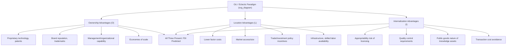
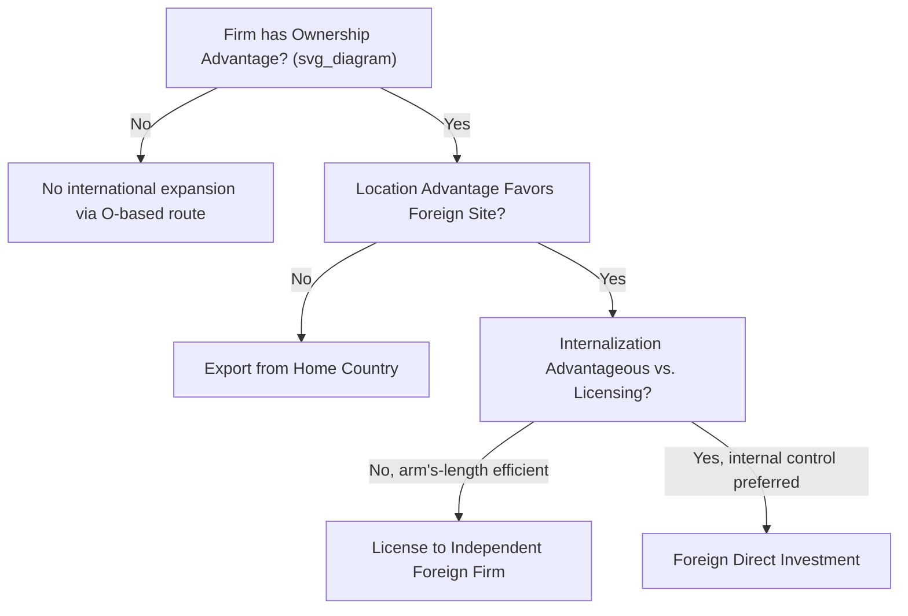

## The Ownership-Location-Internalization Framework

### Overview

The Ownership-Location-Internalization (OLI) framework, also known as the **eclectic paradigm**, is a foundational theoretical structure in international business and international economics developed by economist John Dunning beginning in the mid-1970s (with the canonical formulation typically dated to his 1977 and subsequent papers) for explaining why, where, and how firms undertake foreign direct investment. The framework synthesizes and integrates several previously separate strands of theory — industrial organization theory of the firm, location theory, and internalization theory (transaction cost economics applied to the firm's boundaries) — into a unified set of three necessary conditions that together explain a firm's decision to engage in FDI rather than alternative modes of international market servicing (exporting or licensing).

### The Three Pillars: O, L, and I

**Ownership Advantages (O)**

- Refers to firm-specific assets or capabilities that give a firm a competitive advantage over local (host-country) competitors sufficient to offset the inherent costs and risks of operating in an unfamiliar foreign environment (sometimes termed the "liability of foreignness").
- Examples include proprietary technology and patents, brand reputation and trademarks, superior management or organizational capabilities, economies of scale in production or R&D, access to capital on favorable terms, and other intangible assets that are firm-specific rather than freely available to all firms in a given location.
- This pillar draws directly on **industrial organization theory** and connects closely to the "knowledge-capital" concept discussed in the horizontal/vertical FDI case study — ownership advantages are effectively the firm-specific intangible assets that make international expansion of the firm's own operations (rather than transacting with independent foreign firms) potentially profitable.
- The ownership advantage condition is necessary but not sufficient: a firm might possess valuable ownership advantages yet choose to exploit them via exporting or licensing rather than FDI, depending on the other two OLI conditions.

**Location Advantages (L)**

- Refers to advantages specific to producing or operating in a particular foreign location, making that location preferable to the home country (or to alternative foreign locations) as a site for exploiting the firm's ownership advantages.
- Examples include lower factor costs (labor, land, natural resources — directly connecting to the vertical FDI motive discussed in the previous case study), proximity to a large or growing local market (connecting to the horizontal FDI motive), favorable trade or investment policy (tariffs, tax incentives, special economic zones), availability of complementary local infrastructure or skilled labor, and reduced trade/transport costs relative to serving that market via exports.
- This pillar draws directly on classical and modern **location theory**, and is where the OLI framework directly incorporates the country-level or market-level determinants discussed in trade and FDI location literature (essentially subsuming the proximity-concentration and factor-price-arbitrage logic from horizontal and vertical FDI theory as specific manifestations of location advantage).
- Without a location advantage favoring the foreign site specifically, a firm possessing ownership advantages would be expected to simply serve foreign markets via exports from its home location rather than establishing foreign production.

**Internalization Advantages (I)**

- Refers to the advantages of a firm exploiting its ownership advantages through internal (within-firm, wholly or majority-owned) operations rather than through arm's-length market transactions with independent foreign firms — that is, advantages of FDI specifically over the alternative of **licensing** the firm's technology, brand, or know-how to an independent foreign firm in exchange for royalties or fees.
- This pillar draws directly on **transaction cost economics and internalization theory** (building on foundational work by Ronald Coase on the theory of the firm, and applied specifically to multinational enterprises by economists including Peter Buckley and Mark Casson in the late 1970s): market transactions for certain types of assets — particularly intangible, knowledge-based assets such as proprietary technology or brand reputation — are prone to specific market failures that make arm's-length contracting inefficient or risky.
- Key sources of internalization advantage include: **appropriability problems** (the risk that a licensee could imitate, dilute, or misuse proprietary technology or brand value once granted access, without full contractual protection being feasible or enforceable, particularly in jurisdictions with weak intellectual property protection); **quality control concerns** (maintaining consistent brand or product quality standards is more easily achieved through direct ownership and control than through arm's-length licensing agreements with independent local partners); **the "public goods" nature of certain intangible assets** (knowledge or brand value can be used simultaneously in multiple locations at low marginal cost, but this same characteristic makes it difficult to write complete, enforceable contracts governing its use by an independent licensee); and **transaction cost avoidance** more generally (negotiating, monitoring, and enforcing licensing contracts across international borders and legal systems involves search, negotiation, and enforcement costs that internal firm hierarchy can sometimes avoid).

### Diagram: The OLI Framework Structure

### The Decision Logic: How OLI Determines the Mode of International Expansion

**Key Points**

- The eclectic paradigm's central analytical contribution is framing FDI not as a single decision but as the outcome of **three sequential, jointly necessary conditions**, allowing the framework to also explain why a firm might instead choose exporting or licensing as alternatives to FDI:
  - **Ownership advantage present, but no location advantage abroad, and internalization preferred**: the firm would produce at home and **export** to serve foreign markets, retaining production domestically where it has no reason to relocate but still wanting to keep control of its proprietary assets internally.
  - **Ownership advantage present, location advantage abroad present, but internalization NOT advantageous (arm's-length contracting is efficient)**: the firm would engage in **licensing** or a similar contractual arrangement, allowing an independent foreign firm to use its technology/brand in the advantageous foreign location without the firm itself establishing foreign operations.
  - **Ownership advantage present, location advantage abroad present, AND internalization advantageous**: **FDI is predicted** — the firm establishes its own foreign operations (rather than exporting or licensing) to exploit its ownership advantage in the favorable foreign location while retaining internal control over the advantage itself.
- This logic explains the OLI framework's designation as "eclectic": rather than proposing a single causal mechanism for FDI, it integrates industrial organization (ownership advantages — why firms rather than markets), location theory (location advantages — where), and transaction cost/internalization theory (internalization advantages — why internal hierarchy rather than arm's-length contracting) into a single decision framework covering the full mode-of-entry choice (export vs. license vs. FDI), not merely the FDI decision in isolation.

### Diagram: Mode of Entry Decision Tree

### Connecting OLI to Horizontal and Vertical FDI Theory

**Key Points**

- The OLI framework is broader and more general than the horizontal/vertical FDI distinction covered in the previous case study — it can be understood as the overarching decision framework explaining *whether* FDI occurs at all (versus exporting or licensing), while horizontal/vertical FDI theory (proximity-concentration trade-off, factor-proportions models) specifically explains the *type* of FDI (market-seeking vs. efficiency-seeking) once the OLI conditions have determined that FDI is the preferred mode.
- **Horizontal FDI's location advantage** typically centers on market size and trade cost avoidance (tariff-jumping), directly mapping onto the "L" pillar's market-access category.
- **Vertical FDI's location advantage** typically centers on factor cost differences (particularly labor costs), directly mapping onto the "L" pillar's factor-cost category.
- In both cases, the "O" (ownership advantage, i.e., possessing a transferable firm-specific asset worth exploiting abroad) and "I" (internalization advantage, i.e., preferring internal control over licensing) conditions must also hold for FDI (of either the horizontal or vertical type) to be the predicted outcome — the OLI framework thus provides the necessary "why FDI rather than licensing" logic that the horizontal/vertical models generally take as given or address only implicitly.

### Illustrative Application: A Pharmaceutical Multinational

**Example**

Consider a pharmaceutical company with a patented drug (an **ownership advantage** — proprietary intellectual property) considering how to serve a large emerging-market country with lower manufacturing costs and a sizable domestic patient population (a **location advantage** — combining both market-access and, potentially, some factor-cost elements). If the country has weak intellectual property enforcement, licensing the drug's production to a local firm would create substantial **appropriability risk** (the licensee, or a subsequent unauthorized party, might reverse-engineer and produce unauthorized generic versions, or fail to maintain the company's quality and safety standards) — an **internalization advantage** favoring direct ownership. Under the OLI framework, this combination of factors (proprietary IP as ownership advantage, a locally advantageous production/market location, and high appropriability risk favoring internal control) predicts the firm will establish **wholly-owned foreign production or sales operations (FDI)** rather than licensing local production to an independent third party, consistent with widely observed patterns in the pharmaceutical industry's international expansion strategies, particularly in markets with historically weaker IP enforcement regimes.

### Critiques and Limitations of the OLI Framework

**Key Points**

- **Descriptive rather than strictly predictive**: Critics have argued the framework is more useful as an organizing taxonomy for categorizing the determinants of FDI after the fact than as a strictly predictive model capable of forecasting specific firm-level FDI decisions in advance, since the three OLI conditions are broad categories encompassing many possible specific underlying factors rather than a tightly specified, quantifiable model.
- **Static rather than dynamic**: The original framework has been critiqued as relatively static, better suited to explaining a single cross-sectional FDI decision than to explaining how firms' OLI advantages evolve dynamically over time (for instance, as firms gain international experience, as host-country institutions develop, or as global value chains restructure) — Dunning himself and subsequent researchers extended the framework over time (including incorporating an "investment development path" concept relating a country's OLI-relevant characteristics to its own stage of economic development) to partially address this critique.
- **Overlap and interdependence among the three pillars**: Some scholars have noted that the three OLI categories are not always cleanly separable in practice — for example, certain location advantages (such as agglomeration economies or knowledge spillovers available only within a firm's own network) can shade into ownership-advantage-like characteristics, complicating clean empirical categorization of specific real-world determinants into exactly one of the three pillars.
- [Inference] Despite these critiques, the OLI/eclectic paradigm remains widely regarded, particularly in the international business literature (somewhat more so than in mainstream international economics, which has tended to favor the more formally mathematical knowledge-capital model tradition), as the standard organizing framework for teaching and analyzing the determinants of multinational enterprise activity, valued particularly for its comprehensiveness in integrating multiple theoretical traditions rather than for delivering sharply falsifiable, narrow predictions.

### Comparative Summary: OLI vs. Knowledge-Capital Model

| Dimension | OLI / Eclectic Paradigm (Dunning) | Knowledge-Capital Model (Markusen et al.) |
| --- | --- | --- |
| Disciplinary origin | International business / industrial organization | Formal international trade theory |
| Primary purpose | Explain FDI vs. export vs. licensing mode choice | Explain horizontal vs. vertical FDI patterns and general equilibrium effects |
| Level of formalization | Conceptual/taxonomic | Mathematically formalized general equilibrium model |
| Treatment of firm heterogeneity | Implicit (ownership advantages vary by firm) | Often extended in later literature (e.g., Helpman-Melitz-Yeaple) to explicitly model firm heterogeneity |
| Primary academic audience | International business scholars, management theory | International trade/economics scholars |
| Complementarity | Provides broad "why internal vs. market" (I) logic | Provides formal "where and what type" (L, and O implicitly) predictions |

### Relevance to Broader International Economics Topics

**Key Points**

- The internalization (I) pillar's emphasis on appropriability risk and intellectual property protection directly connects to broader international economics discussions of intellectual property rights, technology transfer, and their treatment in trade agreements (e.g., the WTO's TRIPS agreement), since weak host-country IP protection specifically strengthens the internalization advantage of FDI over licensing, per the OLI logic.
- The location (L) pillar's incorporation of trade and investment policy incentives connects directly to policy discussions of investment promotion, special economic zones, and bilateral investment treaties, all of which function by deliberately enhancing a country's location advantage to attract FDI.
- The framework's integration of transaction cost economics also connects it to the broader theory of the firm and the make-or-buy decision literature in industrial organization, situating multinational enterprise theory within a more general economic framework for understanding firm boundaries, applicable beyond the specifically international context.

**Related Topics**

- Horizontal versus vertical FDI (directly related, complementary case study)
- The knowledge-capital model of the multinational firm
- Internalization theory and transaction cost economics (Coase, Buckley and Casson)
- Intellectual property rights and technology transfer in international trade (TRIPS)
- Bilateral investment treaties and investment promotion policy
- The investment development path and country-level FDI determinants
- Firm heterogeneity in trade and FDI (Melitz-type models)
- Global value chains and multinational production networks
- Licensing versus FDI as international market entry modes