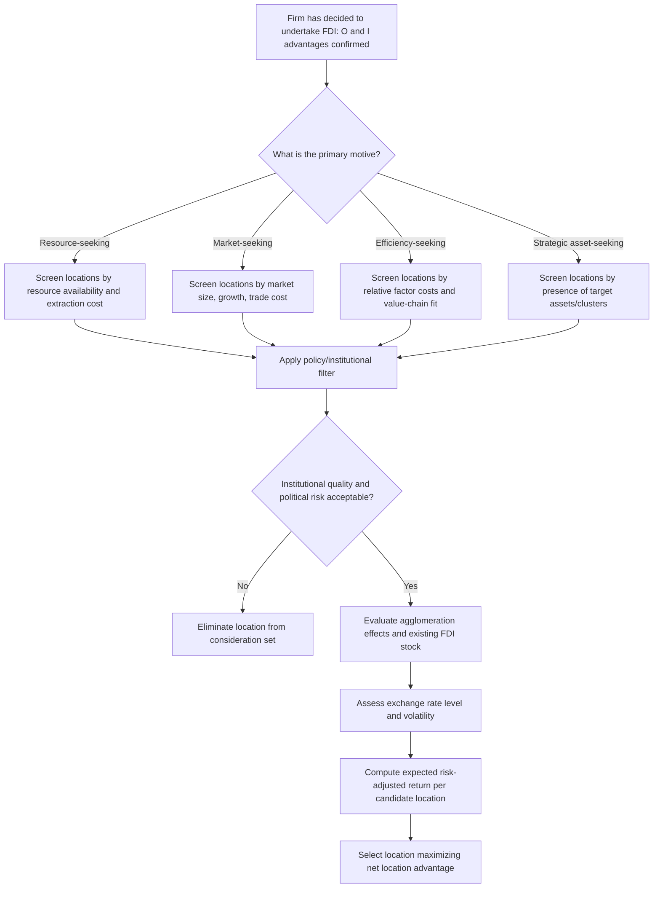

## Determinants of FDI Location Choice

### Overview

Foreign Direct Investment (FDI) location choice refers to the decision process by which multinational enterprises (MNEs) select a host country or region in which to establish production facilities, subsidiaries, or other value-adding operations. This decision is distinct from the decision of *whether* to invest abroad at all (the internationalization decision) — location theory in international economics addresses *where*, conditional on the firm already having decided to engage in FDI.

The dominant analytical framework used to organize location determinants is Dunning's **OLI (Ownership-Location-Internalization) Paradigm**, also called the eclectic paradigm. Within this framework, "L" (Location) factors are the host-country-specific characteristics that make one location preferable to another, given that the firm already possesses ownership advantages (O) and has chosen to internalize rather than license (I).

### Theoretical Foundations

**The OLI Paradigm and the Role of "L"**

Dunning's eclectic paradigm posits that a firm will engage in FDI (as opposed to exporting or licensing) only when three conditions hold simultaneously:

- **Ownership (O) advantages**: firm-specific assets (technology, brand, managerial expertise) that offset the costs of operating abroad
- **Location (L) advantages**: host-country characteristics making production there more profitable than at home or in a third country
- **Internalization (I) advantages**: benefits of controlling the asset within the firm rather than transacting through the market (licensing, franchising)

Location advantages are the central concern of FDI location theory. If O and I advantages favor foreign production, but no L advantage exists for any foreign site, the firm exports instead. If L advantages exist elsewhere but the firm lacks O advantages, indigenous firms in that location will outcompete the entrant.

**Motive-Based Classification of FDI**

Location determinants differ systematically depending on the strategic motive driving the investment. Dunning identifies four canonical motives:

1. **Resource-seeking FDI** — driven by access to natural resources, raw materials, or specific low-cost factor inputs (e.g., extractive industries, agribusiness)
2. **Market-seeking FDI** (horizontal FDI) — driven by access to the host country's domestic market, often to serve local demand directly and avoid trade costs
3. **Efficiency-seeking FDI** (vertical FDI) — driven by cross-country factor cost differences, enabling the firm to fragment production stages across locations according to comparative advantage
4. **Strategic asset-seeking FDI** — driven by the desire to acquire technology, brands, distribution networks, or other strategic assets, often through cross-border M&A

**[Inference]** The relative importance of each determinant category below varies substantially depending on which motive is operative; a resource-seeking firm largely ignores market size, while a market-seeking firm may be indifferent to natural resource endowments.

### Categories of Location Determinants

#### 1. Market-Related Factors

- **Market size**: typically proxied by host-country GDP; larger markets support horizontal FDI by allowing firms to spread fixed costs of foreign entry (plant setup, distribution networks) over more potential sales
- **Market growth rate**: forward-looking firms weight expected future market size, not just current GDP
- **Per capita income**: proxies for purchasing power and demand for differentiated/quality goods, particularly relevant for consumer-goods MNEs
- **Regional market access**: FDI into one country may be motivated by preferential access to a wider regional market (e.g., investing in Mexico partly for access to NAFTA/USMCA markets, or in Poland for EU Single Market access)

This class of determinants is central to the **horizontal FDI / proximity-concentration tradeoff** framework: firms trade off the fixed cost of establishing a foreign plant (concentration favors exporting from one location) against the variable trade costs saved by producing locally (proximity favors FDI). Formally, a firm prefers FDI over exporting when:

$$FC_{plant} < \tau \cdot Q_{export}$$

where $FC_{plant}$ is the fixed cost of establishing foreign production, $\tau$ represents the ad valorem-equivalent trade cost (tariffs plus transport costs), and $Q_{export}$ is the volume that would otherwise be exported. Larger host markets and higher trade costs both raise the right-hand side, favoring FDI.

#### 2. Cost-Related Factors (Factor Endowments)

- **Labor costs**: nominal wage rates adjusted for productivity (unit labor cost); central to efficiency-seeking/vertical FDI where firms locate labor-intensive production stages in low-wage countries
- **Labor skill and quality**: availability of skilled technical or managerial labor, particularly relevant for R&D-intensive or high-tech FDI
- **Natural resource endowments**: presence of minerals, oil, arable land, or other resources central to resource-seeking FDI
- **Capital costs**: cost of local financing and access to capital markets
- **Infrastructure costs and quality**: transport networks, ports, telecommunications, and energy reliability, which affect both fixed setup costs and ongoing operating costs

#### 3. Policy and Institutional Factors

- **Trade policy**: tariffs and non-tariff barriers on the host country's imports raise the cost of serving that market via exports, incentivizing "tariff-jumping" FDI as a substitute
- **FDI-specific policy**: restrictions on foreign ownership, screening requirements, capital repatriation controls, and performance requirements (e.g., local content rules) directly affect entry feasibility
- **Investment incentives**: tax holidays, subsidies, special economic zones (SEZs), and grants offered by host governments to attract FDI
- **Corporate tax rates**: statutory and effective tax rates affect after-tax returns; this determinant is especially salient for FDI structured partly for tax-planning purposes (see profit-shifting discussion below)
- **Bilateral and regional trade/investment agreements**: Bilateral Investment Treaties (BITs) and regional trade agreements (RTAs) reduce policy risk and can reduce trade costs, making member countries relatively more attractive
- **Institutional quality**: rule of law, contract enforcement, property rights protection, and control of corruption. **[Inference]** Weak institutions are generally believed to raise transaction costs and expropriation risk sufficiently to deter FDI even when factor costs are favorable, though the empirical magnitude of this effect varies by study and sector
- **Political stability and risk**: risk of expropriation, civil conflict, or abrupt policy reversal; often incorporated into capital budgeting decisions via a country risk premium added to the discount rate

#### 4. Agglomeration and Network Factors

- **Agglomeration economies**: the tendency of FDI to cluster geographically, driven by:
  - **Knowledge spillovers** between co-located firms (especially in R&D-intensive industries)
  - **Thick labor markets** with specialized skills, reducing search and training costs
  - **Supplier and buyer networks** (forward and backward linkages), reducing input-sourcing costs
- **Existing FDI stock / "FDI begets FDI"**: prior successful entrants in a location signal viability and reduce information asymmetries for later entrants
- **Presence of industrial clusters**: e.g., electronics manufacturing clusters in parts of East Asia, financial services clusters in global financial centers

#### 5. Exchange Rate and Macroeconomic Factors

- **Exchange rate levels**: a depreciated host-country currency lowers the effective acquisition cost of host-country assets for foreign investors (relevant particularly for M&A-type FDI)
- **Exchange rate volatility**: uncertainty about future exchange rate movements can deter FDI due to irreversibility of the investment (real options logic — firms may delay investment when volatility is high, waiting for uncertainty to resolve)
- **Macroeconomic stability**: low and stable inflation, sustainable fiscal and current account balances, reducing the risk of sudden macroeconomic shocks that could erode investment returns

#### 6. Firm- and Industry-Specific Interaction Effects

Location determinants do not operate independently of firm characteristics; their effect is often conditional on industry and motive:

- Resource-seeking firms weight natural resource availability heavily and are relatively insensitive to market size
- Market-seeking (horizontal) firms weight host-market size, growth, and trade costs heavily
- Efficiency-seeking (vertical) firms weight relative factor costs and the ability to fragment the value chain (supported by low coordination and transport costs) heavily
- Strategic asset-seeking firms weight the presence of target firms, technology clusters, or skilled human capital in specific niches

### Formal Modeling: Proximity-Concentration Tradeoff (Extended)

The canonical formalization of the market-seeking FDI decision, drawn from the new trade theory / new economic geography literature (Brainard-type models), frames the choice between exporting and horizontal FDI as follows.

A firm choosing to serve a foreign market compares:

**Exporting profit**:

$$\pi_X = (p - c - \tau)q_X - F_H$$

**FDI (local production) profit**:

$$\pi_I = (p - c_F)q_I - F_H - F_F$$

Where $c$ is marginal production cost at home, $c_F$ is marginal production cost abroad, $\tau$ is per-unit trade cost, $F_H$ is the home fixed cost (already sunk), and $F_F$ is the additional fixed cost of establishing foreign production capacity.

FDI is chosen over exporting when the trade-cost savings exceed the additional fixed cost of duplicating production capacity:

$$\tau \cdot q > F_F - (c_F - c) \cdot q$$

This yields testable predictions: FDI (relative to exports) rises with **trade costs** ($\tau$), rises with **destination market size** (raising $q$), and falls when foreign production costs are much higher than home production costs (large $c_F - c$).

### Diagram: Categorization of FDI Location Determinants (svg_diagram)

<svg xmlns="http://www.w3.org/2000/svg" viewBox="0 0 900 560">
\<style\>
.title { font: bold 20px sans-serif; fill: #1a1a1a; }
.cat { font: bold 14px sans-serif; fill: #ffffff; }
.item { font: 12px sans-serif; fill: #1a1a1a; }
.box { stroke: #333333; stroke-width: 1.5; }
\</style\>
<text x="450" y="30" text-anchor="middle" class="title">Determinants of FDI Location Choice (svg_diagram)</text>
<rect x="30" y="60" width="260" height="150" rx="8" fill="#2c5f8a" class="box" />
<text x="160" y="85" text-anchor="middle" class="cat">Market-Related</text>
<text x="45" y="110" class="item">- Market size (GDP)</text>
<text x="45" y="130" class="item">- Growth rate</text>
<text x="45" y="150" class="item">- Per capita income</text>
<text x="45" y="170" class="item">- Regional market access</text>
<text x="45" y="190" class="item">(Horizontal FDI)</text>
<rect x="320" y="60" width="260" height="150" rx="8" fill="#8a4a2c" class="box" />
<text x="450" y="85" text-anchor="middle" class="cat">Cost / Factor Endowments</text>
<text x="335" y="110" class="item">- Labor cost &amp; skill</text>
<text x="335" y="130" class="item">- Natural resources</text>
<text x="335" y="150" class="item">- Capital costs</text>
<text x="335" y="170" class="item">- Infrastructure quality</text>
<text x="335" y="190" class="item">(Vertical / Resource-seeking)</text>
<rect x="610" y="60" width="260" height="150" rx="8" fill="#3a7a3a" class="box" />
<text x="740" y="85" text-anchor="middle" class="cat">Policy / Institutional</text>
<text x="625" y="110" class="item">- Trade &amp; FDI policy</text>
<text x="625" y="130" class="item">- Tax rates, incentives</text>
<text x="625" y="150" class="item">- Institutional quality</text>
<text x="625" y="170" class="item">- Political stability</text>
<text x="625" y="190" class="item">- BITs / RTAs</text>
<rect x="30" y="250" width="260" height="140" rx="8" fill="#6a3a8a" class="box" />
<text x="160" y="275" text-anchor="middle" class="cat">Agglomeration / Network</text>
<text x="45" y="300" class="item">- Knowledge spillovers</text>
<text x="45" y="320" class="item">- Thick labor markets</text>
<text x="45" y="340" class="item">- Supplier/buyer linkages</text>
<text x="45" y="360" class="item">- Existing FDI stock</text>
<rect x="320" y="250" width="260" height="140" rx="8" fill="#8a2c5f" class="box" />
<text x="450" y="275" text-anchor="middle" class="cat">Exchange Rate / Macro</text>
<text x="335" y="300" class="item">- Exchange rate level</text>
<text x="335" y="320" class="item">- Exchange rate volatility</text>
<text x="335" y="340" class="item">- Macro stability</text>
<text x="335" y="360" class="item">(M&amp;A-type FDI)</text>
<rect x="610" y="250" width="260" height="140" rx="8" fill="#4a4a4a" class="box" />
<text x="740" y="275" text-anchor="middle" class="cat">Firm/Industry-Specific</text>
<text x="625" y="300" class="item">- FDI motive type</text>
<text x="625" y="320" class="item">- Value-chain fragmentability</text>
<text x="625" y="340" class="item">- Sector sensitivity</text>
<text x="625" y="360" class="item">to specific determinants</text>
<rect x="230" y="440" width="440" height="80" rx="8" fill="#d4a017" class="box" />
<text x="450" y="470" text-anchor="middle" class="cat" style="fill:#1a1a1a;">Overall Location (L) Advantage</text>
<text x="450" y="495" text-anchor="middle" class="item">within Dunning's OLI Paradigm</text>
<line x1="160" y1="210" x2="350" y2="440" stroke="#333" stroke-width="1" />
<line x1="450" y1="210" x2="450" y2="440" stroke="#333" stroke-width="1" />
<line x1="740" y1="210" x2="550" y2="440" stroke="#333" stroke-width="1" />
<line x1="160" y1="390" x2="380" y2="440" stroke="#333" stroke-width="1" />
<line x1="450" y1="390" x2="450" y2="440" stroke="#333" stroke-width="1" />
<line x1="740" y1="390" x2="520" y2="440" stroke="#333" stroke-width="1" />
</svg>

### Decision Flow: FDI Location Selection Process

### Empirical Considerations

**Gravity-Model Applications to FDI**

FDI flows, like trade flows, are often modeled empirically using gravity-type specifications, where bilateral FDI is a function of the economic "mass" of both source and host countries and inversely related to the "distance" between them (geographic, cultural, linguistic, or institutional distance). A stylized specification:

$$FDI_{ij} = \beta_0 \cdot GDP_i^{\beta_1} \cdot GDP_j^{\beta_2} \cdot Distance_{ij}^{\beta_3} \cdot X_{ij}^{\beta_4} \cdot \epsilon_{ij}$$

where $X_{ij}$ represents a vector of additional bilateral factors (shared language, colonial ties, common legal origin, RTA membership). **[Unverified]** The precise coefficient magnitudes vary considerably across studies, sample periods, and country groups, so specific elasticity estimates should be treated as context-dependent rather than universal constants.

**Tax Considerations and Profit Shifting**

**[Inference]** A meaningful share of recorded FDI, particularly flows routed through low-tax jurisdictions or "conduit" countries, is believed by many researchers to reflect tax-planning and profit-shifting motives rather than genuine productive investment. This has led international economists to distinguish between FDI driven by real location advantages and FDI driven by tax-minimization structuring, complicating the interpretation of official FDI statistics.

### Worked Example

**Example**: A consumer electronics MNE is deciding between locating an assembly plant in Country A (large domestic market, moderate wages, high tariffs on imports, stable institutions) versus Country B (small domestic market, low wages, low tariffs, weaker institutions, but part of a regional trade bloc granting duty-free access to a large neighboring market).

- Under a **market-seeking** motive: Country A's high tariff wall makes tariff-jumping FDI attractive despite higher wages — the firm avoids the tariff by producing locally, consistent with the proximity-concentration tradeoff favoring FDI when $\tau$ is high.
- Under an **efficiency-seeking** motive: Country B's low wages combined with duty-free regional market access may dominate, since the firm can produce cheaply and still reach the large neighboring market without incurring the trade cost $\tau$.
- The weaker institutional quality in Country B introduces a risk-adjustment: the firm may require a higher expected return threshold (a country risk premium) to compensate for expropriation or contract-enforcement risk before selecting Country B.

This illustrates why identical factor-cost data can yield opposite location decisions depending on the firm's underlying FDI motive and its risk tolerance regarding institutional quality.

### Common Misconceptions

- **Misconception**: "FDI always flows toward the lowest-wage countries." In reality, wage levels matter primarily for efficiency-seeking/vertical FDI; market-seeking FDI is often directed toward large, high-income markets despite higher wages there.
- **Misconception**: "Low corporate tax rates alone attract FDI." **[Inference]** While tax rates matter at the margin, most empirical location-choice studies find that market size, institutional quality, and infrastructure typically dominate tax rate differentials for real (non-tax-driven) productive investment, though tax considerations can be decisive for financially mobile or holding-company-type structures.
- **Misconception**: "FDI location choice is a one-time, static decision." Firms frequently reassess location decisions as relative costs, exchange rates, and policy regimes shift, leading to phenomena such as production relocation ("reshoring," "nearshoring," or "China+1" diversification strategies).

### Related Topics

- Dunning's Eclectic (OLI) Paradigm in full detail
- Horizontal vs. Vertical FDI: theoretical models and empirical distinction
- Special Economic Zones (SEZs) and their effect on FDI attraction
- Bilateral Investment Treaties (BITs) and investor-state dispute settlement (ISDS)
- Gravity models of FDI: estimation methods and interpretation
- Tax havens, conduit countries, and profit-shifting in multinational firms
- Global value chains (GVCs) and the fragmentation of production
- Political risk assessment and country risk premiums in capital budgeting
- Exchange rate volatility and irreversible investment (real options approach)
- Reshoring, nearshoring, and supply chain diversification trends