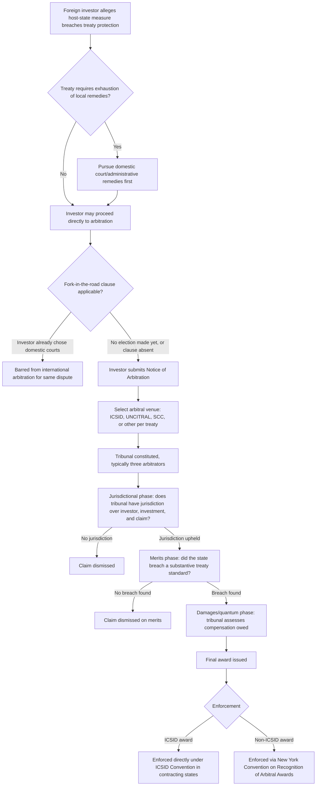

## Investment Treaties and Investor-State Dispute Settlement

### Overview

International investment treaties are agreements between two or more states establishing legal protections and obligations governing foreign direct investment (FDI) made by investors of one treaty party within the territory of another. **Investor-State Dispute Settlement (ISDS)** is the procedural mechanism embedded within most such treaties allowing a foreign investor to bring a legal claim directly against a host state — bypassing that state's domestic courts — before an international arbitration tribunal, when the investor believes the state has violated the treaty's substantive protections.

This topic sits within the broader institutional-and-policy branch of MNE/FDI theory: investment treaties are a primary mechanism by which host countries attempt to reduce **political risk** for foreign investors (addressed briefly under "institutional factors" in FDI location determinants), thereby making the location more attractive for FDI. ISDS is the enforcement mechanism that gives those legal commitments credibility.

### Types of Investment Treaties

- **Bilateral Investment Treaties (BITs)**: agreements between two states, historically the dominant instrument; the first modern BIT was concluded between (West) Germany and Pakistan in 1959, and the global BIT network expanded rapidly from the 1990s onward
- **Regional/Multilateral Investment Agreements**: investment chapters embedded within broader regional trade agreements (RTAs) or free trade agreements (FTAs) — e.g., the investment chapter of the USMCA (successor to NAFTA's Chapter 11), the intra-EU framework prior to relevant CJEU rulings, and various regional economic community agreements
- **Multilateral treaties with investment provisions**: e.g., the Energy Charter Treaty (ECT), covering investment specifically in the energy sector across many signatory states
- **Model BITs**: many capital-exporting and capital-importing states maintain a "model BIT" text (a template) used as the starting point for negotiating individual treaties (e.g., the US Model BIT), reflecting that state's general negotiating position on investor protections

**[Inference]** The total number of concluded BITs and investment-chapter agreements worldwide is generally cited in the low thousands, though the exact figure fluctuates as older treaties are terminated, renegotiated, or replaced, so any specific count should be treated as approximate and time-sensitive rather than a fixed constant.

### Core Substantive Protections Typically Found in Investment Treaties

While exact wording varies by treaty, most BITs and investment chapters include some combination of the following standards of treatment:

#### 1. Fair and Equitable Treatment (FET)

A broad, often loosely defined standard requiring the host state to treat covered investments fairly and equitably. In arbitral practice, FET has been interpreted to encompass sub-principles such as:

- Protection of the investor's **legitimate expectations** (based on representations made by the state at the time of investment)
- Due process and non-denial of justice in domestic proceedings
- Transparency and consistency in the state's regulatory conduct
- Protection against arbitrary or discriminatory state conduct

**[Inference]** FET is widely regarded in the academic and practitioner literature as the most frequently invoked — and most expansively (and inconsistently) interpreted — standard in ISDS jurisprudence, which has been a central driver of criticism regarding the unpredictability of investment arbitration outcomes.

#### 2. Protection Against Expropriation (Direct and Indirect)

- **Direct expropriation**: outright nationalization or seizure of the investment by the state
- **Indirect expropriation** (also called "regulatory taking" or "creeping expropriation"): state regulatory measures that do not formally transfer title but substantially deprive the investor of the economic value or use of the investment (e.g., an environmental or public health regulation that renders an investment commercially worthless)

Most treaties permit expropriation (of either type) only if it is: (a) for a public purpose, (b) non-discriminatory, (c) carried out with due process, and (d) accompanied by prompt, adequate, and effective compensation (often standardized around the "Hull formula" from customary international law).

The indirect expropriation category is the most legally and economically contested, since it raises the core tension between **investor protection** and **host-state regulatory sovereignty** (the "right to regulate").

#### 3. National Treatment (NT)

Requires the host state to treat foreign investors no less favorably than it treats its own domestic investors in like circumstances — a non-discrimination standard applied *domestically*.

#### 4. Most-Favored-Nation (MFN) Treatment

Requires the host state to treat investors from the treaty partner no less favorably than investors from *any third country* — a non-discrimination standard applied *across* the state's treaty network. MFN clauses have been controversially used by claimants to "import" more favorable procedural or substantive provisions from the host state's *other* treaties (so-called "MFN shopping").

#### 5. Full Protection and Security (FPS)

Obligates the host state to exercise due diligence to protect the investment from physical harm, including harm caused by third parties (e.g., civil unrest, violence), not merely to refrain from harming it directly itself.

#### 6. Free Transfer of Funds

Guarantees the investor's ability to repatriate profits, dividends, capital, and other investment-related payments out of the host country, typically subject to limited exceptions (e.g., balance-of-payments safeguards).

#### 7. Umbrella Clauses

A clause elevating the host state's *contractual* commitments to the investor (made under a separate investment contract or concession agreement) to the status of *treaty* obligations, meaning a simple breach of contract can potentially be pursued as a treaty violation via ISDS.

### The ISDS Mechanism: Procedural Framework

**Standing and Consent**

ISDS operates on the principle that the host state's **consent to arbitration is given in advance**, embedded directly in the treaty text itself (rather than negotiated case-by-case), so that when a qualifying investor from the treaty partner state suffers an alleged treaty breach, it can unilaterally initiate arbitration against the host state without needing a separate arbitration agreement.

**Key Procedural Requirements**

- **Qualifying investor**: the claimant must meet the treaty's definition of a covered "investor" (typically nationality/incorporation requirements) making a covered "investment" (definitions vary — some treaties use broad, asset-based definitions; others require an "enterprise-based" definition tied to the establishment of a business with certain characteristics)
- **Exhaustion of local remedies (where required)**: some treaties require the investor to first pursue domestic legal remedies before accessing ISDS; many modern treaties, however, waive this requirement (a significant departure from customary international law's traditional local-remedies-exhaustion rule)
- **"Fork-in-the-road" and "no U-turn" clauses**: provisions governing whether the investor must choose between pursuing domestic courts or international arbitration (and cannot pursue both simultaneously for the same dispute)

**Institutional Venues for Arbitration**

- **ICSID (International Centre for Settlement of Investment Disputes)**: a World Bank Group institution established by the 1965 ICSID Convention, the most widely used and specialized venue for ISDS; ICSID awards benefit from a streamlined recognition-and-enforcement mechanism under the Convention among contracting states
- **UNCITRAL Arbitration Rules**: ad hoc arbitration conducted under rules of the United Nations Commission on International Trade Law, not administered by a permanent institution
- **Other venues**: including the Permanent Court of Arbitration (PCA, administering support services), the Stockholm Chamber of Commerce (SCC), and the International Chamber of Commerce (ICC), among others, depending on treaty specification

### Diagram: ISDS Claim Process Flow

### Diagram: Balancing Investor Protection and State Regulatory Sovereignty (svg_diagram)

<svg xmlns="http://www.w3.org/2000/svg" viewBox="0 0 900 420">
\<style\>
.title { font: bold 18px sans-serif; fill: #1a1a1a; }
.side { font: bold 15px sans-serif; fill: #ffffff; }
.item { font: 12px sans-serif; fill: #1a1a1a; }
.box { stroke: #333333; stroke-width: 1.5; }
\</style\>
<text x="450" y="30" text-anchor="middle" class="title">Investment Treaty Tension: Investor Protection vs. Regulatory Sovereignty (svg_diagram)</text>
<rect x="40" y="70" width="360" height="220" rx="10" fill="#2c5f8a" class="box" />
<text x="220" y="100" text-anchor="middle" class="side">Investor Protection Rationale</text>
<text x="55" y="130" class="item" style="fill:#ffffff;">- Reduces political risk premium</text>
<text x="55" y="150" class="item" style="fill:#ffffff;">- Credible commitment device</text>
<text x="55" y="170" class="item" style="fill:#ffffff;">- Substitutes for weak domestic courts</text>
<text x="55" y="190" class="item" style="fill:#ffffff;">- Attracts FDI inflows (theorized)</text>
<text x="55" y="220" class="item" style="fill:#ffffff;">Mechanisms:</text>
<text x="55" y="240" class="item" style="fill:#ffffff;">FET, expropriation protection,</text>
<text x="55" y="260" class="item" style="fill:#ffffff;">national treatment, MFN</text>
<rect x="500" y="70" width="360" height="220" rx="10" fill="#8a2c2c" class="box" />
<text x="680" y="100" text-anchor="middle" class="side">Regulatory Sovereignty Concern</text>
<text x="515" y="130" class="item" style="fill:#ffffff;">- "Regulatory chill" on public</text>
<text x="515" y="150" class="item" style="fill:#ffffff;">interest legislation</text>
<text x="515" y="170" class="item" style="fill:#ffffff;">- Broad FET/indirect expropriation</text>
<text x="515" y="190" class="item" style="fill:#ffffff;">standards seen as overreaching</text>
<text x="515" y="220" class="item" style="fill:#ffffff;">- Asymmetry: only investors sue</text>
<text x="515" y="240" class="item" style="fill:#ffffff;">- Arbitrator consistency/</text>
<text x="515" y="260" class="item" style="fill:#ffffff;">legitimacy concerns</text>
<rect x="300" y="330" width="300" height="60" rx="8" fill="#d4a017" class="box" />
<text x="450" y="365" text-anchor="middle" class="item" style="font-weight:bold;">Reform Debate: NT/MFN scope,</text>
<text x="450" y="0" text-anchor="middle" />
<text x="450" y="380" text-anchor="middle" class="item" style="font-weight:bold; font-size:11px;">right-to-regulate carve-outs, appellate mechanisms</text>
</svg>

### Economic Rationale: Why Investment Treaties Should (Theoretically) Increase FDI

The core economic logic linking investment treaties to FDI location decisions:

- FDI, once made, is typically **sunk and irreversible** — the investor cannot costlessly relocate a factory or withdraw capital once committed
- This creates a classic **time-inconsistency / hold-up problem**: a host government may find it optimal, *ex ante*, to promise favorable treatment to attract investment, but once the investment is sunk, has an incentive to renege (e.g., raise taxes, impose new regulations, or expropriate), since the investor's outside option has deteriorated
- Rational investors, anticipating this hold-up risk, will discount expected returns accordingly *ex ante*, reducing FDI inflows below the socially efficient level (or demanding a risk premium)
- Investment treaties with binding ISDS enforcement function as a **credible commitment device**: by subjecting itself to a costly, external, binding enforcement mechanism, the host government makes its promise of fair treatment more credible, theoretically reducing the required risk premium and increasing FDI inflows

**[Inference]** This "credible commitment" rationale is the primary theoretical justification for investment treaties found in the international economics/political economy literature; however, empirical tests of whether BITs actually cause measurable increases in FDI inflows have produced notably mixed results across studies, with effects depending on the host country's baseline institutional quality, the specific treaty's provisions, and the empirical methodology used, so this remains an actively debated question rather than a settled empirical finding.

### The Legitimacy Crisis and Reform Movement

Since roughly the early-to-mid 2000s, ISDS has faced sustained criticism from a range of governments, civil society groups, and academics, centered on several concerns:

- **Regulatory chill**: the concern that governments may hesitate to enact legitimate public-interest regulation (environmental, public health, labor) out of fear of triggering costly ISDS claims — most prominently illustrated by high-profile cases involving tobacco plain-packaging regulation and environmental/public health measures
- **Inconsistency and unpredictability of awards**: because each ISDS tribunal is constituted ad hoc for a single case (rather than being part of a permanent judiciary bound by precedent), similar facts have sometimes produced divergent legal interpretations across different tribunals
- **Lack of an appellate mechanism**: unlike domestic court systems, most ISDS frameworks historically lacked any appeal process for correcting erroneous awards (grounds for challenging an award are narrow, typically limited to procedural irregularities under frameworks like the ICSID Convention's annulment mechanism)
- **Perceived asymmetry**: only investors, not host states or affected third parties (such as local communities), can typically initiate claims, raising fairness concerns
- **Arbitrator conflicts of interest**: the same small pool of practitioners often serves as both arbitrators in some cases and counsel in others, raising independence and impartiality concerns

**Reform Responses**

- **UNCITRAL Working Group III**: an ongoing multilateral process (beginning around 2017) exploring systemic ISDS reform options, ranging from incremental procedural fixes to establishing a **standing multilateral investment court** with an appellate function
- **EU's Investment Court System (ICS)**: the European Union has moved away from traditional ad hoc ISDS toward a permanent, court-like structure with tenured judges in its more recent trade/investment agreements (e.g., in agreements with Canada and Vietnam), intended to address consistency and legitimacy concerns
- **Narrowing of substantive protections in newer treaties**: many recently negotiated or renegotiated treaties (including the investment chapter succeeding NAFTA in USMCA) have narrowed the scope of FET and indirect expropriation protections, added explicit "right to regulate" carve-outs (particularly for environmental, health, and public welfare measures), and in some cases eliminated ISDS between certain treaty partners entirely
- **BIT termination and renegotiation**: some countries (**[Unverified]** — specific country actions and treaty terminations should be checked against current status, since this is an area of active and ongoing policy change) have terminated or announced intent to terminate existing BITs, or have replaced older-generation treaties with new-generation texts containing more constrained investor protections

### Worked Example (Illustrative, Not a Real Case)

**Example**: A foreign mining company invests in Host Country X under a concession contract, having received explicit written assurances from the government regarding stable regulatory treatment. Two years later, following a change in government, X enacts a new environmental law that significantly raises compliance costs and effectively renders the mine commercially unviable, without formally revoking the company's license.

- The investor may argue this constitutes **indirect expropriation** (substantial deprivation of the investment's economic value without formal seizure) and/or a breach of **FET** (violation of legitimate expectations based on the government's earlier assurances).
- Host Country X may argue the measure was a legitimate, non-discriminatory exercise of its **regulatory sovereignty** to protect public health/environment, and that treaties should not be interpreted to freeze a state's right to regulate in the public interest.
- The tribunal's task is to weigh these competing considerations under the specific treaty's text — modern treaties increasingly include explicit language clarifying that non-discriminatory public-welfare regulation does *not* constitute indirect expropriation, specifically to reduce this kind of interpretive ambiguity relative to older-generation treaties.

### Common Misconceptions

- **Misconception**: "ISDS allows companies to directly overturn a country's laws." In reality, ISDS tribunals can only award monetary damages (compensation) to the investor; they have no authority to strike down, repeal, or directly invalidate a host state's domestic legislation or regulation.
- **Misconception**: "All investment treaties contain identical protections and procedures." Treaty text varies substantially — including in the scope of covered investors/investments, the strength and wording of FET and expropriation clauses, whether local-remedies exhaustion is required, and whether ISDS is included at all (some newer agreements omit ISDS in favor of state-to-state dispute settlement only).
- **Misconception**: "Investment treaties always increase FDI in practice." **[Inference]** As noted above, the empirical relationship between BIT adoption and FDI inflows is genuinely mixed in the literature and is conditional on factors such as pre-existing host-country institutional quality; it is not a straightforward, universally confirmed causal relationship.

### Related Topics

- Dunning's OLI Paradigm: political risk as a location (L) determinant
- Political risk assessment and country risk premiums in international capital budgeting
- Institutional quality, property rights, and FDI: empirical linkages
- ICSID Convention and the enforcement of international arbitral awards
- The New York Convention on Recognition and Enforcement of Foreign Arbitral Awards
- UNCITRAL Working Group III and multilateral ISDS reform proposals
- The EU Investment Court System (ICS) and proposals for a Multilateral Investment Court
- Expropriation, indirect expropriation, and regulatory takings doctrine
- Sovereign risk, hold-up problems, and time-inconsistency in international economics
- Trade and investment chapter design in modern FTAs (e.g., USMCA, CPTPP)