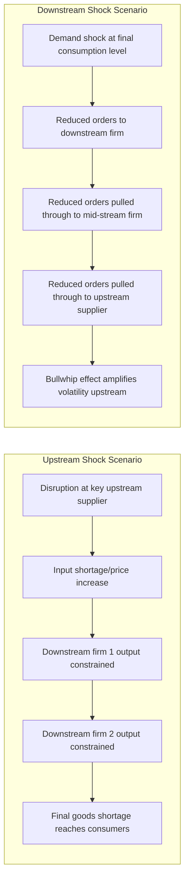

## Upstream and Downstream Linkages in Production Networks

### Overview

Upstream and downstream linkages describe the directional flows of intermediate inputs and value-added connecting firms and industries positioned at different stages within a production network or global value chain (GVC). The terminology orients the analysis around a reference firm or industry: **upstream** refers to earlier stages of the value chain (suppliers of raw materials, components, and intermediate inputs feeding *into* the reference point), while **downstream** refers to later stages (buyers, processors, and distributors that the reference point feeds *into*, ultimately toward final consumption). This directional framework is central to understanding how fragmented production networks transmit shocks, technology, and value across firms, industries, and countries.

### Defining Upstream and Downstream Relative to a Reference Point

The terms "upstream" and "downstream" are inherently **relational**, not absolute — any given firm or industry can simultaneously be downstream relative to its suppliers and upstream relative to its customers. Conventional usage follows the direction of a river metaphor: inputs flow "downstream" from earlier extraction/production stages toward final consumption, analogous to water flowing from source to mouth.

- **Upstream linkage (backward linkage)**: a connection to suppliers of inputs used in the reference firm/industry's own production process
- **Downstream linkage (forward linkage)**: a connection to buyers who use the reference firm/industry's output as an input into their own further production, or as a final good

**Example of relational positioning**: A steel producer is downstream relative to iron ore mining (its upstream input supplier) but upstream relative to an automobile manufacturer (which uses steel as an input, making the automaker downstream of the steel producer).

### Origins in Input-Output and Development Economics: The Hirschman Linkage Framework

The conceptual foundation for backward and forward linkage analysis originates in development economics, most closely associated with economist **Albert Hirschman**'s work on unbalanced growth and linkage effects, later formalized extensively within input-output analysis.

#### Backward Linkages

A backward linkage exists when the expansion of output in a given industry stimulates increased demand for inputs from **upstream supplying industries**. The strength of backward linkages is often measured using an industry's position in an input-output table, specifically via the **backward linkage index**, computed from the Leontief inverse matrix:

$$BL_j = \frac{\sum_{i=1}^{n} b_{ij}}{\frac{1}{n}\sum_{j=1}^{n}\sum_{i=1}^{n} b_{ij}}$$

where $b_{ij}$ are elements of the Leontief inverse $(I-A)^{-1}$, representing the total (direct plus indirect) output required from industry $i$ to satisfy one unit of final demand for industry $j$'s output. $BL_j$ thus measures industry $j$'s **column sum** in the Leontief inverse relative to the economy-wide average — a high value indicates that expanding industry $j$'s output strongly pulls up demand across many upstream supplying industries.

#### Forward Linkages

A forward linkage exists when an industry's output serves as a critical input enabling the expansion of **downstream user industries**. The corresponding **forward linkage index** uses the **row sum** of the Leontief inverse:

$$FL_i = \frac{\sum_{j=1}^{n} b_{ij}}{\frac{1}{n}\sum_{i=1}^{n}\sum_{j=1}^{n} b_{ij}}$$

A high $FL_i$ indicates that industry $i$'s output is intensively used as an input across many downstream industries, meaning growth or disruption in industry $i$ has wide knock-on effects further down the chain.

Industries with both high backward and high forward linkage indices are often described as **"key sectors"** in input-output-based structural analysis, since they are both intensive users of upstream inputs and intensive suppliers to downstream users — disturbances originating in such sectors propagate broadly through the economy in both directions.

### Extension to International Production Networks

In the context of international GVCs, the Hirschman linkage concept extends across national borders: backward and forward linkages now connect industries located in **different countries**, mediated by international trade in intermediate inputs. This connects directly to the GVC participation metrics used in value-added trade measurement (see prior chapter item):

- **Backward GVC participation** (a country's use of imported/foreign inputs in its own exports) is the international-trade analog of the backward linkage concept — how much a country's export industries pull on **upstream foreign supplying industries**
- **Forward GVC participation** (a country's domestic value-added subsequently used as an input in *other* countries' exports) is the international-trade analog of the forward linkage concept — how much a country's output feeds into **downstream foreign user industries**

### Diagram: Backward and Forward Linkages Relative to a Reference Industry (svg_diagram)

<svg xmlns="http://www.w3.org/2000/svg" viewBox="0 0 900 400">
\<style\>
.title { font: bold 18px sans-serif; fill: #1a1a1a; }
.cat { font: bold 13px sans-serif; fill: #ffffff; }
.item { font: 11px sans-serif; fill: #1a1a1a; }
.box { stroke: #333333; stroke-width: 1.5; }
.arrow { stroke: #333333; stroke-width: 2; marker-end: url(#ah4); fill: none; }
\</style\>
<text x="450" y="30" text-anchor="middle" class="title">Backward and Forward Linkages Relative to a Reference Industry (svg_diagram)</text>
<rect x="30" y="150" width="200" height="100" rx="8" fill="#8a4a2c" class="box" />
<text x="130" y="180" text-anchor="middle" class="cat">Upstream Suppliers</text>
<text x="45" y="205" class="item">Raw materials,</text>
<text x="45" y="225" class="item">intermediate inputs</text>
<rect x="350" y="150" width="200" height="100" rx="8" fill="#2c5f8a" class="box" />
<text x="450" y="180" text-anchor="middle" class="cat">Reference Industry</text>
<text x="365" y="205" class="item">Uses upstream inputs,</text>
<text x="365" y="225" class="item">produces output</text>
<rect x="670" y="150" width="200" height="100" rx="8" fill="#3a7a3a" class="box" />
<text x="770" y="180" text-anchor="middle" class="cat">Downstream Users</text>
<text x="685" y="205" class="item">Buyers, processors,</text>
<text x="685" y="225" class="item">final consumption</text>
<path d="M 230 200 L 350 200" class="arrow" />
<text x="290" y="185" text-anchor="middle" class="item">Backward Linkage</text>
<path d="M 550 200 L 670 200" class="arrow" />
<text x="610" y="185" text-anchor="middle" class="item">Forward Linkage</text>

<text x="130" y="290" text-anchor="middle" class="item" style="font-weight:bold;">"Upstream" direction</text>

<text x="770" y="290" text-anchor="middle" class="item" style="font-weight:bold;">"Downstream" direction</text>

<path d="M 450 280 L 450 320" stroke="#333" stroke-width="1" stroke-dasharray="4,3" />
<text x="450" y="345" text-anchor="middle" class="item">Same industry is simultaneously</text>
<text x="450" y="360" text-anchor="middle" class="item">downstream of its suppliers and upstream of its buyers</text>
</svg>

### Linkages and FDI: Connecting to MNE Location Behavior

Upstream and downstream linkage concepts connect directly to the FDI technology-transfer literature (see prior chapter): when a foreign affiliate develops relationships with **local upstream suppliers**, this generates **backward-linkage spillovers**, as the MNE frequently transfers technical assistance, quality standards, and sometimes financing to ensure supplier quality meets its production requirements. When a foreign affiliate supplies inputs to **local downstream users**, this generates **forward-linkage spillovers**, as domestic downstream firms gain access to higher-quality or more technologically advanced intermediate inputs than might otherwise be available domestically.

**[Inference]** The strength and depth of these linkage relationships is widely regarded in the FDI/GVC literature as a key determinant of how much a host economy benefits from inward FDI beyond the direct employment and output effects of the foreign affiliate itself — an MNE affiliate operating as an isolated "enclave" (e.g., in some export-processing zone configurations) with minimal local sourcing or local sales generates comparatively weak linkage effects, while one deeply embedded in local supplier and customer networks generates substantially stronger diffusion of technology and demand throughout the host economy, though the empirical magnitude of this difference varies by sector and specific policy context.

### Shock Propagation Through Upstream and Downstream Linkages

A major contemporary application of linkage analysis concerns how economic shocks propagate through production networks:

#### Upstream (Supply-Side) Shock Propagation

A disruption at an upstream supplier (e.g., a natural disaster affecting a key component manufacturer, or a trade policy shock raising input costs) propagates **downstream**, as downstream firms face input shortages or higher input costs, potentially disrupting their own output.

#### Downstream (Demand-Side) Shock Propagation

A demand shock at a downstream/final-demand level (e.g., a recession reducing final consumer demand) propagates **upstream**, as reduced downstream orders reduce demand pulled through to upstream suppliers — sometimes amplified through the **bullwhip effect**, where demand volatility is magnified as it propagates upstream through successive stages of a supply chain due to order-batching, lead-time, and inventory-management dynamics at each stage.

**Illustrative case pattern**: **[Inference]** The 2011 Thailand floods (disrupting hard-disk-drive component manufacturing) and various semiconductor supply disruptions in subsequent years are commonly cited in the GVC/production-network literature as illustrations of how a shock concentrated in a narrow upstream input can propagate widely downstream across many countries and final-goods industries reliant on that input, though the specific magnitude and duration of disruption in any particular episode is an empirical matter best verified against contemporaneous reporting and post-event analyses rather than assumed from the general pattern alone.

### Diagram: Shock Propagation Through a Production Network

### Network Centrality and Systemic Importance

Beyond simple bilateral linkage measures, production-network analysis increasingly draws on **network theory** concepts to characterize the systemic importance of specific firms, industries, or countries within a global production network:

- **Degree centrality**: the number of direct upstream/downstream linkages a node (firm/industry/country) has
- **Betweenness centrality**: the extent to which a node lies on the shortest paths connecting other pairs of nodes in the network, indicating its role as a critical intermediary/bottleneck
- **Hub industries/countries**: nodes with unusually high connectivity in both backward and forward directions, whose disruption has disproportionately large network-wide effects — conceptually similar to the "key sector" identification from the Hirschman linkage framework, but analyzed using richer network-topology tools

**[Speculation]** Some researchers have proposed that network-centrality-based systemic risk analysis of production networks, analogous to systemic risk analysis in financial networks (e.g., "too central to fail" concepts), could offer a useful complementary lens for identifying which supply-chain nodes warrant particular policy attention for resilience purposes, though this remains a developing area of the literature rather than an established standard methodology.

### Policy Applications

- **Industrial policy targeting of "key sectors"**: some governments have historically used backward/forward linkage analysis to identify and prioritize investment in sectors believed to generate the largest multiplier effects across the rest of the economy (an application closely associated with Hirschman's original "unbalanced growth" strategy, which argued that deliberately concentrating investment in high-linkage sectors could induce further private investment in linked sectors)
- **Supply chain risk mapping**: firms and governments increasingly map upstream dependency structures (which specific suppliers, and in which countries, provide critical inputs) to identify single points of failure and inform diversification or stockpiling strategies
- **Critical input identification for trade/industrial policy**: identifying inputs with high forward-linkage intensity (used broadly across many downstream industries) helps explain why trade or export restrictions on certain "chokepoint" intermediate goods (e.g., specific specialized semiconductors, rare earth processing) can have outsized economy-wide effects disproportionate to their own direct output value

### Common Misconceptions

- **Misconception**: "Upstream and downstream are fixed, absolute categories for a given firm or industry." As emphasized above, these terms are purely relational — the same firm is simultaneously downstream of its own suppliers and upstream of its own customers; there is no single fixed "upstream" or "downstream" industry in isolation.
- **Misconception**: "A high backward-linkage index and a high forward-linkage index measure the same thing." They measure distinct relationships: backward linkage reflects an industry's demand-pulling effect on its *own* input suppliers (column sum of the Leontief inverse), while forward linkage reflects how intensively an industry's output is used as an input by *other* downstream industries (row sum of the Leontief inverse) — an industry can score highly on one without scoring highly on the other.
- **Misconception**: "Linkage strength is purely a function of trade volume." **[Inference]** While measured backward/forward linkage indices are derived from input-output value flows, the broader economic significance of a linkage (for spillovers, technology transfer, or shock propagation) also depends on qualitative factors such as the criticality/substitutability of the specific input and the depth of the underlying relationship (e.g., whether it involves technical cooperation or is a purely transactional purchase), which pure value-flow-based indices do not fully capture.

### Related Topics

- Hirschman's theory of unbalanced growth and linkage-based industrial policy
- Leontief input-output analysis and the Leontief inverse matrix
- Global Value Chain participation indices (backward/forward) and TiVA measurement
- Fragmentation of production and the "trade in tasks" framework
- Bullwhip effect and supply chain inventory dynamics
- Network centrality measures applied to global production networks
- FDI-driven technology spillovers via backward and forward linkage channels
- Supply chain resilience, chokepoint identification, and critical input dependency mapping
- Key sector identification and industrial policy design
- Systemic risk analysis: financial network analogies applied to production networks