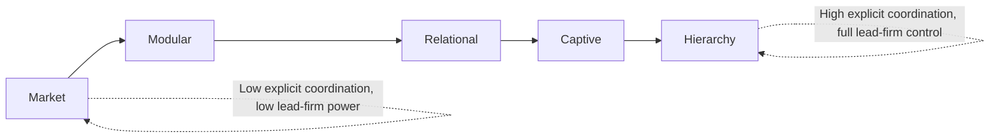

## Governance Structures within Global Value Chains

### Overview

Governance in the context of Global Value Chains (GVCs) refers to the mechanisms of authority, coordination, and control that determine how activities are organized among the geographically dispersed firms participating in a value chain — specifically, who sets the parameters (product specifications, quality standards, delivery schedules, pricing) under which other firms in the chain must operate, and how tightly those parameters are enforced. GVC governance theory addresses a question distinct from, but closely related to, the fragmentation and offshoring/outsourcing decisions discussed previously: given that production is fragmented across multiple firms and countries, **what type of relationship coordinates the resulting network**, ranging from arm's-length market transactions to full vertical integration within a single firm.

### Theoretical Foundations

**Global Commodity Chains to Global Value Chains**

GVC governance theory traces its intellectual lineage to the **Global Commodity Chains (GCC)** framework developed initially by sociologists (notably Gary Gereffi) in the 1990s, which distinguished between:

- **Producer-driven chains**: chains where large, typically capital- and technology-intensive manufacturers (e.g., in automobiles, aircraft, semiconductors) control the value chain, coordinating backward linkages with suppliers and forward linkages with distributors
- **Buyer-driven chains**: chains where large retailers, brand-name merchandisers, and trading companies (e.g., in apparel, footwear, consumer goods) set up decentralized production networks across many exporting countries, controlling the chain through their command over design, branding, and access to end markets, rather than through ownership of manufacturing capacity

This producer-driven/buyer-driven distinction was subsequently refined into the more granular and analytically precise **five-type governance typology** developed by Gereffi, Humphrey, and Sturgeon (2005), which remains the standard reference framework in GVC governance analysis.

### The Gereffi-Humphrey-Sturgeon (GHS) Five-Type Governance Typology

The GHS framework identifies five distinct governance structures, positioned along a spectrum from pure market transactions to full vertical integration (hierarchy), determined jointly by three key variables:

1. **Complexity of information and knowledge transfer** required to sustain the transaction (particularly regarding product and process specifications)
2. **Extent to which this complexity can be codified** (reduced to explicit, transmittable specifications) and transmitted efficiently
3. **Capabilities of actual and potential suppliers** relative to the requirements of the transaction

#### 1. Market

- **Characteristics**: transactions governed by price alone; low complexity of information exchanged; product specifications are simple or standardized (require little customization); suppliers have high capability to meet requirements without significant assistance
- **Coordination mechanism**: classic arm's-length spot-market transactions; low switching costs for both buyer and seller
- **Example context**: commodity-like intermediate inputs traded on established markets

#### 2. Modular Value Chains

- **Characteristics**: suppliers produce to a customer's specifications, but those specifications, while complex, are **highly codifiable** (e.g., through detailed technical standards and CAD-based product architectures); suppliers possess strong capabilities and often take full responsibility for process technology, using generic machinery that spreads investment across many customers
- **Coordination mechanism**: complex information is transmitted, but low-cost codification (standardized interfaces, technical protocols) means coordination costs remain relatively low despite the underlying product complexity
- **Example context**: electronics contract manufacturing, where suppliers (e.g., large electronics manufacturing service providers) produce to customer specifications across modular, standardized component interfaces

#### 3. Relational Value Chains

- **Characteristics**: complex, non-codifiable (tacit) information must be exchanged between buyers and suppliers; suppliers possess high capabilities but the transaction requires close mutual dependence, trust, and reputation built over time (rather than one-off transactions)
- **Coordination mechanism**: coordination through frequent interaction, mutual adjustment, reputational mechanisms, and often geographic or ethnic/social proximity, since the tacit, uncodified nature of the required knowledge exchange makes formal contracting alone insufficient; high switching costs for both parties due to relationship-specific investment
- **Example context**: high-value, design-intensive manufacturing where close buyer-supplier collaboration on design and process is required (e.g., some segments of specialty component manufacturing, high-fashion apparel with close design collaboration)

#### 4. Captive Value Chains

- **Characteristics**: small suppliers are highly dependent on, and transactionally "captured" by, much larger lead firms; transactions involve complex product specifications that are reasonably codifiable, but suppliers have **low capabilities** relative to what is required, necessitating substantial intervention, monitoring, and control by the lead firm
- **Coordination mechanism**: high degree of monitoring and control exercised by the lead firm over the (nominally independent) supplier, including detailed process specifications, quality control interventions, and sometimes provision of equipment, training, or working capital by the lead firm — the supplier has limited bargaining power and high switching costs, effectively "locked in" to the relationship despite formal independence
- **Example context**: many labor-intensive, low-technology assembly and contract manufacturing arrangements in sectors such as apparel, footwear, and horticulture, where the lead firm dictates detailed specifications to relatively low-capability local producers

#### 5. Hierarchy

- **Characteristics**: full vertical integration; the lead firm develops and manufactures products in-house through its own subsidiaries rather than through independent (even if captive) suppliers, typically because product complexity is high and difficult to codify, and no external supplier possesses adequate capability
- **Coordination mechanism**: managerial control within firm boundaries (this connects directly back to the OLI paradigm's Internalization advantage discussed under MNE/FDI theory — hierarchy governance corresponds to captive offshoring via FDI rather than any form of arm's-length outsourcing)
- **Example context**: highly proprietary, technologically cutting-edge production stages the lead firm chooses to retain entirely in-house due to IP protection concerns or the absence of any capable external supplier

### Diagram: The Five GVC Governance Types Along the Coordination Spectrum

### Determinants Summary Table

| Governance Type | Complexity of Transaction | Ability to Codify | Supplier Capability | Degree of Explicit Coordination | Power Asymmetry |
| --- | --- | --- | --- | --- | --- |
| Market | Low | High | High | Low | Low |
| Modular | High | High | High | Low-Medium | Low-Medium |
| Relational | High | Low | High | Medium-High | Medium |
| Captive | High | High | Low | High | High |
| Hierarchy | High | Low | N/A (internalized) | Highest (managerial) | N/A (single firm) |

### Diagram: GHS Governance Determinants (svg_diagram)

<svg xmlns="http://www.w3.org/2000/svg" viewBox="0 0 900 460">
\<style\>
.title { font: bold 18px sans-serif; fill: #1a1a1a; }
.cat { font: bold 13px sans-serif; fill: #ffffff; }
.item { font: 11px sans-serif; fill: #1a1a1a; }
.box { stroke: #333333; stroke-width: 1.5; }
\</style\>
<text x="450" y="30" text-anchor="middle" class="title">GHS Governance Types: Determining Factors (svg_diagram)</text>
<rect x="20" y="70" width="160" height="150" rx="8" fill="#2c5f8a" class="box" />
<text x="100" y="95" text-anchor="middle" class="cat">Market</text>
<text x="30" y="120" class="item">Low complexity</text>
<text x="30" y="140" class="item">High codifiability</text>
<text x="30" y="160" class="item">High supplier</text>
<text x="30" y="175" class="item">capability</text>
<text x="30" y="200" class="item">Price-based coord.</text>
<rect x="200" y="70" width="160" height="150" rx="8" fill="#3a7a3a" class="box" />
<text x="280" y="95" text-anchor="middle" class="cat">Modular</text>
<text x="210" y="120" class="item">High complexity</text>
<text x="210" y="140" class="item">High codifiability</text>
<text x="210" y="160" class="item">High supplier</text>
<text x="210" y="175" class="item">capability</text>
<text x="210" y="200" class="item">Standard interfaces</text>
<rect x="380" y="70" width="160" height="150" rx="8" fill="#8a4a2c" class="box" />
<text x="460" y="95" text-anchor="middle" class="cat">Relational</text>
<text x="390" y="120" class="item">High complexity</text>
<text x="390" y="140" class="item">Low codifiability</text>
<text x="390" y="160" class="item">High supplier</text>
<text x="390" y="175" class="item">capability</text>
<text x="390" y="200" class="item">Trust/reputation</text>
<rect x="560" y="70" width="160" height="150" rx="8" fill="#6a3a8a" class="box" />
<text x="640" y="95" text-anchor="middle" class="cat">Captive</text>
<text x="570" y="120" class="item">High complexity</text>
<text x="570" y="140" class="item">High codifiability</text>
<text x="570" y="160" class="item">Low supplier</text>
<text x="570" y="175" class="item">capability</text>
<text x="570" y="200" class="item">Lead-firm control</text>
<rect x="740" y="70" width="140" height="150" rx="8" fill="#8a2c2c" class="box" />
<text x="810" y="95" text-anchor="middle" class="cat">Hierarchy</text>
<text x="750" y="120" class="item">Full integration</text>
<text x="750" y="140" class="item">Non-codifiable</text>
<text x="750" y="160" class="item">No capable</text>
<text x="750" y="175" class="item">external supplier</text>
<text x="750" y="200" class="item">Managerial control</text>
<rect x="150" y="280" width="600" height="130" rx="8" fill="#d4a017" class="box" />
<text x="450" y="305" text-anchor="middle" class="item" style="font-weight:bold;">Spectrum interpretation</text>
<text x="165" y="330" class="item">Left to right: increasing explicit coordination and lead-firm power</text>
<text x="165" y="350" class="item">Position determined jointly by transaction complexity, codifiability,</text>
<text x="165" y="370" class="item">and supplier capability — not a simple linear market-to-hierarchy scale</text>
<text x="165" y="390" class="item">as in classic transaction cost economics (Williamson)</text>
<line x1="450" y1="220" x2="450" y2="280" stroke="#333" stroke-width="1" />
</svg>

### Relationship to Transaction Cost Economics

The GHS framework builds on, but importantly extends, classic **transaction cost economics (TCE)**, associated with Oliver Williamson, which frames the make-or-buy decision along a single continuum from market to hierarchy, driven primarily by **asset specificity**, transaction frequency, and uncertainty. The GHS innovation is to decompose the intermediate space between pure market and pure hierarchy into three distinct, empirically observable sub-types (modular, relational, captive), recognizing that governance in real-world GVCs is **not simply a linear function of a single variable** (such as asset specificity) but jointly determined by the *interaction* of codifiability and supplier capability, which can produce distinctly different coordination patterns even at similar levels of underlying transaction complexity.

### Lead Firms and Chain Governance Power

Across modular, relational, and especially captive governance types, GVC analysis emphasizes the role of **lead firms** — typically large multinational buyers or brand owners — who, even without owning the production facilities themselves (i.e., without pursuing hierarchy/FDI-based governance), exercise substantial control over the value chain through their command over:

- **Product design and specification**: dictating what is produced and to what standard
- **Branding and market access**: controlling the ultimate route to end consumers, which suppliers cannot easily bypass
- **Quality/compliance standards**: imposing certification, labor, and environmental standards on suppliers as conditions of continued participation in the chain
- **Working capital and demand signals**: in some captive arrangements, providing financing, equipment, or guaranteed order volumes that further deepen supplier dependence

This lead-firm-centric view connects governance analysis to distributional questions: **[Inference]** because lead firms in buyer-driven and captive chains typically capture a disproportionate share of a chain's total value-added (consistent with the "smile curve" pattern discussed in the fragmentation chapter item) while bearing comparatively little of the direct production risk (which is borne by dependent suppliers), GVC governance structure is widely viewed in the literature as a key determinant of how the gains from globalized production are distributed among participating firms and countries, though the precise distributional outcomes are contested and vary by specific chain and bargaining context.

### Governance Dynamics and Industrial Upgrading

GVC governance type has significant implications for the potential of participating suppliers — particularly those in developing countries — to achieve **industrial upgrading**, conventionally classified into four types:

- **Process upgrading**: improving production process efficiency
- **Product upgrading**: moving into more sophisticated/higher-value product lines
- **Functional upgrading**: acquiring new, higher-value-added functions within the chain (e.g., moving from pure assembly into design or branding)
- **Chain (inter-sectoral) upgrading**: applying competencies acquired in one chain to enter a different, often higher-value, chain

**[Inference]** The GVC governance literature broadly suggests that captive governance arrangements, despite often facilitating rapid *process* and *product* upgrading (because lead firms actively transfer technical assistance to raise supplier capability, similar to backward-linkage spillovers), can simultaneously **constrain functional upgrading**, since lead firms in buyer-driven/captive chains often have an active interest in preventing suppliers from acquiring the design, branding, or direct market-access capabilities that would allow suppliers to compete directly with the lead firm itself — though the strength of this constraint varies by sector, and some suppliers have historically achieved functional upgrading (moving from original equipment manufacturing toward own-brand manufacturing) despite starting from captive relationships.

### Governance Structures Can Coexist and Evolve

**[Inference]** A given global value chain frequently exhibits **multiple governance types simultaneously** across different segments or tiers of its supplier network (e.g., a lead firm may maintain hierarchy/in-house control over its most proprietary component while relying on captive governance for labor-intensive assembly and market-based governance for standardized raw material inputs), and governance type is not static — chains can shift governance mode over time as codifiability improves (e.g., through the development of new technical standards), as supplier capabilities develop, or as lead-firm strategy changes, meaning the GHS typology is best understood as a snapshot analytical tool rather than a permanent classification of any given chain or relationship.

### Common Misconceptions

- **Misconception**: "GVC governance is simply about whether a firm owns its supplier or not." Ownership (hierarchy vs. non-hierarchy) is only one dimension; the GHS framework's central contribution is showing that substantial variation in coordination, control, and power exists *among* non-hierarchical (independent-firm) relationships — modular, relational, and captive governance are all forms of arm's-length (non-ownership) coordination but differ dramatically in the degree of lead-firm control involved.
- **Misconception**: "Captive suppliers are simply weak or unsophisticated firms." Captive governance arises from the *combination* of high transaction complexity with *relatively low* supplier capability *relative to what the transaction requires* — a supplier can be reasonably sophisticated in absolute terms yet still occupy a captive position if the lead firm's requirements are especially demanding or if switching costs are high due to relationship-specific investment.
- **Misconception**: "Modular governance implies suppliers have little power in the relationship." Modular value chains typically involve highly capable suppliers (often large, specialized firms in their own right) that can serve multiple lead-firm customers using generic, non-dedicated production platforms — this generally affords modular suppliers considerably more bargaining power and lower dependence than suppliers in captive arrangements.

### Related Topics

- Gereffi's Global Commodity Chains framework and producer-driven/buyer-driven chains
- Transaction cost economics (Williamson) and the theory of the firm
- Fragmentation of production and offshoring/outsourcing decisions (OLI paradigm linkage)
- Industrial upgrading: process, product, functional, and chain upgrading typologies
- Lead firm power and value-added distribution ("smile curve") in GVCs
- Backward and forward linkages and FDI-driven technology spillovers
- Private governance standards and certification schemes in global supply chains
- Labor standards, corporate social responsibility, and buyer-driven chain compliance regimes
- Supplier capability development and technology absorption in developing-country firms
- GVC governance evolution and dynamic capability-codifiability interactions over time