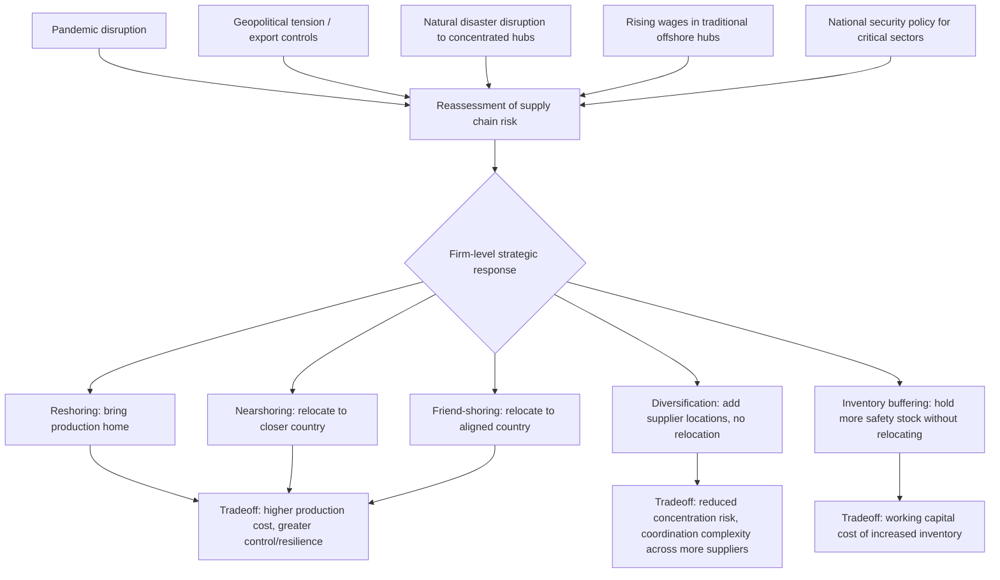

## Reshoring, Nearshoring, and Supply Chain Resilience

### Overview

Reshoring, nearshoring, and the broader supply chain resilience agenda represent a set of related but analytically distinct responses by firms and governments to perceived vulnerabilities in geographically dispersed, fragmented global value chains (GVCs). While the preceding chapter items addressed the *forces driving* fragmentation (falling service-link costs, factor price differences) and the *governance structures* coordinating it, this item addresses the **countervailing pressures** that, since roughly the mid-2010s and accelerating after the COVID-19 pandemic, have prompted some firms and policymakers to reconsider the geographic configuration of fragmented production networks — trading off cost efficiency against resilience, control, and geopolitical alignment.

### Definitional Framework

#### Reshoring (Backshoring)

The relocation of production activities **back to the firm's home country**, reversing a previous offshoring decision. Reshoring can involve either bringing production back in-house (reversing captive offshoring) or bringing it back onshore while remaining outsourced to a domestic supplier (reversing offshore outsourcing).

#### Nearshoring

The relocation of production activities to a country that is **geographically closer** to the home market or final consumption market, without necessarily returning all the way to the home country itself. Nearshoring typically aims to retain some of the factor-cost advantages of offshoring (lower wages than the home country) while reducing transport distance, transit time, time-zone coordination costs, and certain categories of geopolitical or logistics risk relative to more distant offshore locations.

#### Friend-shoring (Ally-shoring)

The reconfiguration of supply chains to concentrate production and sourcing among countries considered **geopolitically aligned** or "trusted" trading partners, explicitly incorporating geopolitical risk and alliance considerations into location decisions, potentially even at greater geographic distance than pure nearshoring would imply.

#### Diversification (China+1, Multi-Sourcing)

A distinct but related strategy in which firms **do not necessarily relocate** existing production but instead deliberately add additional supplier locations or countries to reduce concentration risk — reducing dependence on any single sourcing location without fully reversing existing fragmentation.

**[Inference]** These categories are not mutually exclusive and are frequently pursued in combination by the same firm across different product lines or supply chain tiers — for example, a firm might reshore its most strategically sensitive component production while simultaneously nearshoring labor-intensive assembly and diversifying its supplier base for standardized commodity inputs, meaning real-world corporate strategies often blend elements of all these categories rather than adopting a single uniform approach.

### Diagram: Spectrum of Supply Chain Reconfiguration Strategies (svg_diagram)

<svg xmlns="http://www.w3.org/2000/svg" viewBox="0 0 900 340">
\<style\>
.title { font: bold 18px sans-serif; fill: #1a1a1a; }
.cat { font: bold 13px sans-serif; fill: #ffffff; }
.item { font: 11px sans-serif; fill: #1a1a1a; }
.box { stroke: #333333; stroke-width: 1.5; }
\</style\>
<text x="450" y="30" text-anchor="middle" class="title">Spectrum of Supply Chain Reconfiguration Strategies (svg_diagram)</text>
<rect x="20" y="70" width="200" height="120" rx="8" fill="#8a2c2c" class="box" />
<text x="120" y="100" text-anchor="middle" class="cat">Reshoring</text>
<text x="30" y="130" class="item">Return to home country</text>
<text x="30" y="150" class="item">Highest cost, highest</text>
<text x="30" y="165" class="item">control/resilience</text>
<rect x="240" y="70" width="200" height="120" rx="8" fill="#8a4a2c" class="box" />
<text x="340" y="100" text-anchor="middle" class="cat">Nearshoring</text>
<text x="250" y="130" class="item">Geographically closer</text>
<text x="250" y="150" class="item">country; retains some</text>
<text x="250" y="165" class="item">cost advantage</text>
<rect x="460" y="70" width="200" height="120" rx="8" fill="#6a3a8a" class="box" />
<text x="560" y="100" text-anchor="middle" class="cat">Friend-shoring</text>
<text x="470" y="130" class="item">Geopolitically aligned</text>
<text x="470" y="150" class="item">countries, distance</text>
<text x="470" y="165" class="item">secondary factor</text>
<rect x="680" y="70" width="200" height="120" rx="8" fill="#2c5f8a" class="box" />
<text x="780" y="100" text-anchor="middle" class="cat">Diversification</text>
<text x="690" y="130" class="item">Multi-sourcing, no</text>
<text x="690" y="150" class="item">relocation; reduces</text>
<text x="690" y="165" class="item">concentration risk</text>
<rect x="150" y="230" width="600" height="70" rx="8" fill="#d4a017" class="box" />
<text x="450" y="255" text-anchor="middle" class="item" style="font-weight:bold;">Common driver: rebalancing efficiency against resilience,</text>
<text x="450" y="275" text-anchor="middle" class="item" style="font-weight:bold;">control, and geopolitical risk in fragmented value chains</text>
</svg>

### Theoretical Framing: The Efficiency-Resilience Tradeoff

The core analytical tension underlying this topic can be framed as an extension of the fragmentation cost-minimization logic covered previously. Recall that fragmentation was modeled as profitable when:

$$w_F \cdot a_F^{stage} + SL < w_H \cdot (a_H - a_H^{remaining})$$

The reshoring/nearshoring/resilience literature effectively argues that the conventional service-link cost term $SL$ used in standard fragmentation models has historically **understated** the true expected cost of geographically distant, concentrated sourcing, by omitting or underweighting:

- **Disruption risk premiums**: the expected cost of low-probability, high-impact disruptions (natural disasters, pandemics, geopolitical conflict, trade restrictions) that can halt an entire production line dependent on a single distant supplier or region
- **Inventory and buffer costs required for resilience**: firms relying on long, distant, "just-in-time" supply chains may need to hold more safety stock, or accept greater risk of stockouts, than conventional cost-minimizing models (which often implicitly assumed low-probability disruptions) accounted for
- **Geopolitical/policy risk**: the risk of export controls, sanctions, or abrupt trade policy changes affecting sourcing from specific countries, distinct from ordinary tariff/trade-cost considerations

An augmented decision framework can be represented as minimizing **expected total cost**, incorporating a disruption-risk term:

$$E[C_{fragmented}] = w_F \cdot a_F^{stage} + SL + p_{disrupt} \cdot L_{disrupt}$$

where $p_{disrupt}$ is the probability of a supply disruption originating at the offshore location and $L_{disrupt}$ is the expected loss (lost sales, expedited freight costs, reputational damage) conditional on that disruption occurring. **[Inference]** The renewed emphasis on resilience essentially reflects an upward revision, following recent disruptive events, of firms' estimates of $p_{disrupt}$ and/or $L_{disrupt}$ for certain categories of geographically concentrated, distant sourcing arrangements — though this reframing is a stylized analytical device rather than a literal representation of how individual firms formally compute their sourcing decisions.

### Key Drivers of the Resilience Reassessment

#### 1. The COVID-19 Pandemic

Widespread and simultaneous disruptions to manufacturing, logistics (e.g., port congestion, container shortages), and demand patterns exposed the vulnerability of long, geographically concentrated, and often single-sourced supply chains to correlated global shocks — a scenario that standard pre-pandemic risk models had often not adequately weighted.

#### 2. Geopolitical Tensions and Trade Policy Volatility

Rising trade tensions among major economies, the imposition of tariffs, export controls (particularly around strategically sensitive technologies such as semiconductors), and sanctions regimes have raised the perceived risk of relying on production networks concentrated in geopolitically contested relationships, motivating friend-shoring-oriented diversification independent of pure natural-disaster risk.

#### 3. Natural Disasters and Climate-Related Disruption

Discrete disruptive events affecting concentrated manufacturing hubs (e.g., historical disruptions to semiconductor and electronics component supply following natural disasters in East Asia) have repeatedly demonstrated how geographic concentration of a critical input can propagate disruption broadly downstream (connecting directly to the upstream-shock-propagation concept from the prior chapter item).

#### 4. Rising Wages in Traditional Offshore Manufacturing Hubs

**[Inference]** As wages have risen over time in some traditionally low-cost manufacturing locations, the pure factor-cost-differential rationale for offshoring to those specific locations has narrowed for some product categories, independent of resilience considerations, making nearshoring or diversification to alternative locations comparatively more attractive on cost grounds alone in certain cases — though this effect varies substantially by country, sector, and the specific labor-cost trajectory involved.

#### 5. Strategic/National Security Considerations for Critical Industries

Governments in several major economies have identified specific sectors (semiconductors, pharmaceuticals, critical minerals, defense-related components) as strategically critical, motivating industrial policy explicitly aimed at reshoring or friend-shoring production of these inputs, independent of private firms' own cost-benefit calculations — creating a policy-driven layer of reshoring pressure distinct from purely firm-level resilience reassessment.

### Diagram: Drivers and Responses in the Resilience Reassessment

### Policy Instruments Supporting Reshoring and Friend-Shoring

Beyond firm-level strategic decisions, several governments have deployed active industrial policy to encourage geographic reconfiguration of specific supply chains, including:

- **Direct subsidies and grants** for domestic or allied-country production of strategically designated goods (e.g., semiconductor fabrication subsidies enacted by multiple major economies in recent years)
- **Tax incentives** (investment tax credits, accelerated depreciation) conditioned on domestic or friend-shored production location
- **Export controls and investment screening** restricting outbound investment or technology transfer to specific countries in strategically sensitive sectors
- **"Buy domestic" / "Buy American"-type procurement preferences** favoring domestically or allied-sourced content in government purchasing
- **Trade agreement provisions** incorporating rules-of-origin requirements designed to favor regional or allied-country content over inputs from non-aligned countries

**[Unverified]** The specific magnitude, scope, and evolving status of individual national reshoring/friend-shoring policy programs change frequently as legislation and implementing regulations evolve, so any specific program details should be verified against current government sources rather than treated as fixed.

### Empirical Assessment: How Large Is the Reshoring Trend, Really?

**[Inference]** There is meaningful debate in the empirical trade and GVC literature regarding the actual scale of reshoring/nearshoring activity relative to the rhetorical and policy attention it has received. Key considerations in this debate include:

- **Distinguishing announced intentions from realized relocation**: corporate announcements of reshoring or supply chain diversification plans do not always translate into large-scale realized shifts in trade and production data, given the substantial sunk costs, capability gaps, and time required to relocate established production networks
- **Sector concentration of observed shifts**: **[Inference]** to the extent reshoring/friend-shoring activity is empirically observable in trade and investment data, it appears to be concentrated disproportionately in a relatively narrow set of strategically sensitive sectors (e.g., semiconductors, certain pharmaceutical inputs, some critical minerals processing) rather than representing a broad-based reversal of fragmentation across the wider economy, though comprehensive, up-to-date empirical assessment of this pattern should be checked against current trade and FDI data given how rapidly this area is evolving
- **"Connector country" effects**: some research has identified evidence of supply chains being **rerouted through intermediate "connector" countries** (which have themselves seen increased trade with both the original offshore location and the ultimate destination market) rather than being genuinely reshored or fully re-concentrated among a narrower set of aligned countries — a pattern that would appear as diversification/friend-shoring in trade statistics without necessarily reflecting a full re-onshoring of value-added

### Costs and Limitations of Reshoring/Nearshoring Strategies

- **Loss of factor-cost advantages**: reshoring typically sacrifices some or all of the labor-cost or other factor-cost advantages that originally motivated offshoring, potentially raising consumer prices or compressing margins
- **Capability and infrastructure gaps**: home or nearshore locations may lack the specific manufacturing ecosystem (specialized suppliers, skilled labor pools, supporting infrastructure) that developed over years in the original offshore location, requiring substantial investment and time to replicate
- **Reduced flexibility from over-concentration domestically**: paradoxically, aggressive reshoring that concentrates production too heavily in the home country can reintroduce single-point-of-failure risk (e.g., vulnerability to domestic natural disasters, labor disputes, or localized disruptions) that diversified sourcing had been designed to mitigate
- **Coordination costs of diversification**: multi-sourcing/diversification strategies, while reducing concentration risk, increase the number of supplier relationships a firm must manage, audit, and maintain quality standards across, raising administrative and coordination costs

### Common Misconceptions

- **Misconception**: "Reshoring, nearshoring, and friend-shoring are interchangeable terms for the same strategy." As defined above, they differ along the specific dimension being prioritized — home-country return, geographic proximity, and geopolitical alignment respectively — and a firm's optimal location choice can differ substantially depending on which of these three considerations is weighted most heavily.
- **Misconception**: "The resilience agenda implies fragmentation and GVCs are reversing at a broad, economy-wide scale." **[Inference]** As discussed above, the empirical evidence to date more consistently supports a picture of *targeted* reconfiguration concentrated in specific strategically sensitive sectors and *diversification* of sourcing rather than a broad, economy-wide reversal of the decades-long fragmentation trend, though this remains an actively studied and evolving empirical question.
- **Misconception**: "Resilience-motivated supply chain changes are cost-free improvements with no tradeoffs." Reshoring, nearshoring, and diversification all typically involve real economic costs (higher production costs, capability-building investment, increased coordination complexity) traded off against reduced disruption risk — the resilience literature generally frames this as a genuine tradeoff to be optimized, not a free efficiency gain.

### Related Topics

- Fragmentation of production and the service-link cost framework (Jones-Kierzkowski)
- Global Value Chain governance structures and lead-firm sourcing strategy
- Upstream shock propagation and the bullwhip effect in production networks
- Industrial policy for strategically critical sectors (semiconductors, critical minerals, pharmaceuticals)
- Trade policy volatility, export controls, and investment screening regimes
- Rules of origin and their role in regional/allied-country sourcing incentives
- Inventory economics and just-in-time versus just-in-case supply chain strategies
- Geoeconomics and the securitization of trade and investment policy
- FDI location determinants: political risk and institutional quality reconsidered
- Measuring realized supply chain reconfiguration using trade and value-added data