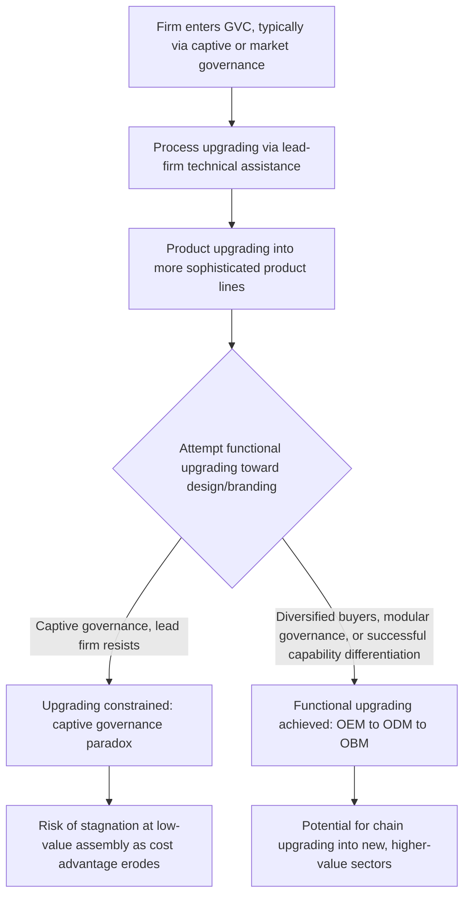

## Upgrading and Development within Global Value Chains

### Overview

Industrial upgrading within Global Value Chains (GVCs) refers to the process by which firms, industries, or countries move toward higher-value-added activities within a value chain, thereby capturing a larger share of the chain's total returns and improving development outcomes. This topic sits at the intersection of GVC governance theory (addressed in a prior chapter item) and development economics, asking a normative and policy-relevant question that the governance framework leaves largely descriptive: given that firms are positioned within GVCs governed by market, modular, relational, captive, or hierarchy structures, **under what conditions can firms and countries move to more advantageous positions within those chains**, and what constrains or enables that movement.

### Definitional Framework: The Four Types of Upgrading

The standard typology, most closely associated with the work of Gary Gereffi, John Humphrey, and Hubert Schmitz (extending the GHS governance framework covered previously), identifies four distinct forms of upgrading:

#### 1. Process Upgrading

Transforming inputs into outputs more efficiently by reorganizing the production process or introducing superior technology, without necessarily changing what is produced. This is the most incremental form of upgrading and is often the first type achieved by new GVC entrants, frequently facilitated directly by lead-firm technical assistance (connecting to the backward-linkage spillover mechanisms discussed under FDI technology transfer).

#### 2. Product Upgrading

Moving into more sophisticated, higher-value-added product lines within the same broad production category (e.g., a garment manufacturer moving from producing basic t-shirts to more complex tailored clothing, or an electronics assembler moving from simple components to more technically demanding sub-assemblies).

#### 3. Functional Upgrading

Acquiring new, higher-value-added functions within the chain, or abandoning existing lower-value functions to focus on higher-value ones — for example, a firm moving from **pure contract manufacturing (OEM — Original Equipment Manufacturing)** toward performing its own design work **(ODM — Original Design Manufacturing)**, and potentially further toward marketing and selling its own branded products **(OBM — Own Brand Manufacturing)**. Functional upgrading is generally regarded as the most consequential and most difficult form of upgrading, since it directly challenges the value-added distribution that lead firms have an interest in maintaining.

#### 4. Chain (Inter-Sectoral) Upgrading

Applying competencies, knowledge, or capabilities acquired within one value chain to enter a different — often higher-value or more technologically sophisticated — value chain entirely (e.g., a firm using manufacturing capabilities developed producing sewing machines to pivot into bicycle manufacturing, then into automobile parts).

**[Inference]** These four categories are frequently presented as forming a rough developmental sequence (process → product → functional → chain), though the literature is careful to note this is a stylized heuristic rather than a rigid or universal progression — some firms achieve product upgrading without full process upgrading first, and chain upgrading in particular does not necessarily require having exhausted upgrading opportunities within the original chain.

### The OEM-ODM-OBM Progression

This specific progression, prominently documented in studies of East Asian manufacturing development (particularly in electronics and apparel), illustrates functional upgrading concretely:

- **OEM (Original Equipment Manufacturing)**: the supplier manufactures products entirely to the buyer's specifications and design, with the buyer's brand affixed; the supplier's own visible market presence and design capability are minimal
- **ODM (Original Design Manufacturing)**: the supplier develops its own product designs and offers them to buyers, who then market the resulting products under their own brand; the supplier has acquired design capability but still lacks direct market/brand access
- **OBM (Own Brand Manufacturing)**: the supplier develops, manufactures, and markets products under its **own** brand, potentially competing directly with its former lead-firm customers in end markets

### Diagram: Upgrading Typology and the OEM-ODM-OBM Progression (svg_diagram)

<svg xmlns="http://www.w3.org/2000/svg" viewBox="0 0 900 460">
\<style\>
.title { font: bold 18px sans-serif; fill: #1a1a1a; }
.cat { font: bold 13px sans-serif; fill: #ffffff; }
.item { font: 11px sans-serif; fill: #1a1a1a; }
.box { stroke: #333333; stroke-width: 1.5; }
.arrow { stroke: #333333; stroke-width: 2; marker-end: url(#ah5); fill: none; }
\</style\>
<text x="450" y="30" text-anchor="middle" class="title">Four Types of Upgrading and the OEM-ODM-OBM Path (svg_diagram)</text>
<rect x="20" y="60" width="200" height="90" rx="8" fill="#2c5f8a" class="box" />
<text x="120" y="90" text-anchor="middle" class="cat">Process Upgrading</text>
<text x="30" y="115" class="item">More efficient production</text>
<text x="30" y="135" class="item">of the same output</text>
<rect x="240" y="60" width="200" height="90" rx="8" fill="#3a7a3a" class="box" />
<text x="340" y="90" text-anchor="middle" class="cat">Product Upgrading</text>
<text x="250" y="115" class="item">More sophisticated</text>
<text x="250" y="135" class="item">product lines</text>
<rect x="460" y="60" width="200" height="90" rx="8" fill="#8a4a2c" class="box" />
<text x="560" y="90" text-anchor="middle" class="cat">Functional Upgrading</text>
<text x="470" y="115" class="item">New higher-value</text>
<text x="470" y="135" class="item">functions in chain</text>
<rect x="680" y="60" width="200" height="90" rx="8" fill="#6a3a8a" class="box" />
<text x="780" y="90" text-anchor="middle" class="cat">Chain Upgrading</text>
<text x="690" y="115" class="item">Move competencies</text>
<text x="690" y="135" class="item">to new value chain</text>
<path d="M 220 105 L 240 105" class="arrow" />
<path d="M 440 105 L 460 105" class="arrow" />
<path d="M 660 105 L 680 105" class="arrow" />
<rect x="130" y="220" width="180" height="90" rx="8" fill="#4a4a4a" class="box" />
<text x="220" y="250" text-anchor="middle" class="cat">OEM</text>
<text x="145" y="275" class="item">Manufacture to</text>
<text x="145" y="290" class="item">buyer's design/brand</text>
<rect x="360" y="220" width="180" height="90" rx="8" fill="#4a4a4a" class="box" />
<text x="450" y="250" text-anchor="middle" class="cat">ODM</text>
<text x="375" y="275" class="item">Own design, sold</text>
<text x="375" y="290" class="item">under buyer's brand</text>
<rect x="590" y="220" width="180" height="90" rx="8" fill="#4a4a4a" class="box" />
<text x="680" y="250" text-anchor="middle" class="cat">OBM</text>
<text x="605" y="275" class="item">Own design AND</text>
<text x="605" y="290" class="item">own brand to market</text>
<path d="M 310 265 L 360 265" class="arrow" />
<path d="M 540 265 L 590 265" class="arrow" />
<rect x="200" y="360" width="500" height="70" rx="8" fill="#d4a017" class="box" />
<text x="450" y="385" text-anchor="middle" class="item" style="font-weight:bold;">OEM-ODM-OBM progression is a specific,</text>
<text x="450" y="405" text-anchor="middle" class="item" style="font-weight:bold;">well-documented instance of functional upgrading</text>
<line x1="560" y1="150" x2="450" y2="220" stroke="#333" stroke-width="1" />
<line x1="450" y1="310" x2="450" y2="360" stroke="#333" stroke-width="1" />
</svg>

### Upgrading Prospects Under Different GVC Governance Types

Upgrading potential is not uniform across the value chain — it is significantly shaped by the governance structure the firm operates within (connecting directly to the GHS typology discussed in the prior chapter item):

- **Under market governance**: upgrading is largely a matter of the firm's own investment decisions, unconstrained by dependence on any particular buyer, though the firm also lacks access to buyer-provided technical assistance
- **Under modular governance**: suppliers, being highly capable and serving multiple buyers on standardized platforms, generally have relatively favorable conditions for process and product upgrading, and comparatively more scope for functional upgrading than captive suppliers, since their capabilities and market position are less exclusively tied to any single lead firm
- **Under relational governance**: close buyer-supplier collaboration can facilitate significant process and product upgrading through the deep, trust-based information exchange characteristic of this governance type, though functional upgrading (which might threaten the buyer's own position) remains more contested
- **Under captive governance**: lead firms often actively facilitate process and product upgrading (through technical assistance, equipment provision, and quality-standard enforcement, since this directly benefits the lead firm's own product quality and reliability), but have a structural incentive to **constrain functional upgrading**, since a captive supplier acquiring design or branding capability could become a direct competitor
- **Under hierarchy**: upgrading occurs through managerial decisions within firm boundaries, and the concept of "upgrading" in the inter-firm sense (a supplier improving its position relative to a buyer) does not directly apply, since production is internalized within a single firm

**[Inference]** This pattern — captive governance facilitating process/product upgrading while constraining functional upgrading — is one of the most frequently cited findings in the GVC upgrading literature, sometimes summarized as the **"upgrading trap"** or **"captive governance paradox"**: the very lead-firm assistance that enables initial capability development can simultaneously become the mechanism preventing further upgrading into higher-value functions, though the strength and universality of this pattern varies by sector and specific chain, and some documented cases show suppliers achieving functional upgrading despite starting in captive positions (see East Asian case discussion below).

### Case Illustrations (Stylized, Widely Referenced in the Literature)

**[Inference]** The East Asian electronics and apparel industries (particularly firms originating in Taiwan and South Korea from roughly the 1960s through the 1990s) are among the most frequently cited empirical illustrations of successful functional upgrading in the GVC literature, with firms progressing from pure OEM assembly work for Western and Japanese brands toward ODM design capability and, in a smaller number of prominent cases, toward OBM own-brand global market presence. **[Unverified]** Specific firm names, timelines, and the precise mechanisms of individual companies' upgrading trajectories are best verified against the underlying case-study literature rather than treated as settled or universally generalizable, since the pace and extent of successful functional upgrading has varied considerably even within this frequently cited regional example, and outcomes for firms and countries attempting similar strategies in other regions and time periods have been notably more mixed.

### GVCs and the "Middle-Income Trap" / Development Ceiling Debate

The GVC upgrading literature connects directly to broader development economics debates about whether participation in GVCs, after facilitating an initial period of rapid growth through export-oriented, labor-intensive assembly activity, can subsequently become a **constraint** on further development once a country's comparative cost advantage in low-end assembly erodes (e.g., due to rising domestic wages) without the country having achieved sufficient functional upgrading to move into higher-value activities — a pattern with clear conceptual overlap with the broader "middle-income trap" concept in development economics.

**[Speculation]** Some scholars have argued that heavy reliance on captive-governance GVC participation may make this transition risk more acute than reliance on modular or more autonomous production strategies, since captive positions may particularly constrain the functional upgrading needed to escape a narrow assembly-based specialization as cost advantages erode, though this remains a debated hypothesis rather than a definitively established causal finding, and country experiences have varied substantially.

### Firm-Level and Country-Level Enabling Conditions for Upgrading

Empirical and theoretical work on GVC upgrading identifies several recurring enabling conditions:

- **Absorptive capacity** (directly connecting to the FDI technology-transfer chapter item): human capital, existing technological capability, and R&D effort determine whether externally sourced knowledge (from lead firms or FDI spillovers) can be effectively assimilated and built upon
- **Domestic institutional support**: education and training systems, intellectual property protection (particularly relevant for firms attempting to build proprietary design capability), and industrial policy support for capability-building
- **Diversified buyer relationships**: suppliers with multiple buyer relationships (more characteristic of modular governance) generally face fewer structural constraints on functional upgrading than those dependent on a single dominant buyer
- **Domestic market development**: access to a sizeable domestic market can provide a platform for firms to test and refine own-brand products before attempting to compete internationally, reducing the risk associated with functional upgrading attempts
- **Government industrial policy**: targeted support (export processing zone policies, technology transfer requirements attached to FDI incentives, national innovation system investment) has historically been used by several economies to actively support the transition from lower to higher forms of upgrading, though the effectiveness and appropriate design of such policies remains a debated area of industrial policy scholarship

### Diagram: Governance Type and Upgrading Constraint Pattern

### Distributional and Welfare Considerations

**[Inference]** The upgrading literature generally frames successful upgrading as welfare-improving for the firms, workers, and countries involved (higher value-added typically correlates with higher wages, more stable employment, and greater resilience to cost-based competition from lower-wage entrants), but this is not an unconditional claim — functional upgrading efforts that fail (e.g., due to insufficient capability, inadequate market access, or successful lead-firm resistance) can involve real costs (failed investment in design/branding capability, disrupted buyer relationships) without delivering the anticipated benefits, meaning upgrading strategies, like other investment decisions, carry genuine risk of failure rather than guaranteed positive returns.

### Common Misconceptions

- **Misconception**: "Upgrading always proceeds neatly through all four types in strict sequence." As noted, this is a stylized heuristic; real firms and countries can and do skip stages, pursue multiple types simultaneously, or achieve chain upgrading without first exhausting upgrading opportunities in the original chain.
- **Misconception**: "Functional upgrading is simply a matter of firm effort or skill." **[Inference]** As emphasized by the captive-governance-paradox pattern, functional upgrading is significantly shaped by the *governance structure* the firm operates within and the strategic incentives of lead firms, not solely by the supplier firm's own internal capability-building effort — a highly capable firm in a strongly captive relationship may face structural barriers to functional upgrading regardless of its technical competence.
- **Misconception**: "GVC participation and upgrading automatically lead to sustained development success." The middle-income-trap-adjacent concern discussed above illustrates that GVC participation without eventual functional/chain upgrading can leave a country vulnerable to being undercut by lower-wage competitors once its initial cost advantage erodes, meaning GVC entry is better understood as providing an *opportunity* for upgrading-led development rather than a guarantee of it.

### Related Topics

- Governance structures within global value chains (GHS typology) and the captive governance paradox
- FDI technology transfer and absorptive capacity as an upgrading precondition
- Backward and forward linkages and their role in facilitating process upgrading
- The middle-income trap in development economics
- Industrial policy design for capability-building and functional upgrading support
- East Asian export-oriented industrialization case studies (Taiwan, South Korea electronics/apparel)
- Intellectual property protection and its role in own-brand (OBM) development
- Lead firm strategy and value-added capture in buyer-driven chains
- Structural transformation and the role of manufacturing in economic development
- Export processing zones and their relationship to GVC entry and upgrading trajectories