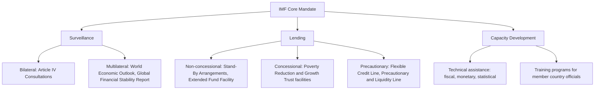

## The International Monetary Fund's Mandate and Surveillance Role

### Overview

The International Monetary Fund (IMF) is a multilateral international financial institution established at the 1944 Bretton Woods Conference, with the founding **Articles of Agreement** entering into force in December 1945. Its core mandate centers on promoting international monetary cooperation, exchange rate stability, and orderly international payments arrangements — functions that have evolved considerably since the institution's founding under the original Bretton Woods fixed exchange rate system, but which remain organized around three principal, interlinked activities: **surveillance**, **lending**, and **capacity development (technical assistance)**.

### Founding Mandate and the Articles of Agreement

The IMF's purposes, as codified in **Article I of its Articles of Agreement**, include:

- Promoting international monetary cooperation through a permanent institution providing a mechanism for consultation and collaboration on international monetary problems
- Facilitating the expansion and balanced growth of international trade, contributing to high employment and real income
- Promoting exchange rate stability and maintaining orderly exchange arrangements among members, while avoiding competitive currency devaluation
- Assisting in the establishment of a multilateral system of payments and the elimination of foreign exchange restrictions that hamper international trade
- Providing members with temporary financial resources (under adequate safeguards) to correct balance-of-payments maladjustments without resorting to measures destructive of national or international prosperity
- Shortening the duration and lessening the degree of disequilibrium in members' balance of payments

**[Inference]** The original design of these purposes was closely tied to the fixed (adjustable-peg) exchange rate system established at Bretton Woods, under which the IMF's core function was to provide temporary financing to help member countries maintain their fixed exchange rate parities during transitory balance-of-payments difficulties; following the collapse of the Bretton Woods fixed-rate system in the early 1970s, the IMF's practical role evolved substantially even though the formal Article I purposes have remained largely stable, with the institution's actual operational focus shifting considerably toward the surveillance and crisis-lending functions described below.

### Governance Structure

- **Board of Governors**: the highest decision-making body, comprising one governor (typically the finance minister or central bank governor) from each member country, meeting formally at the annual IMF-World Bank Annual Meetings
- **Executive Board**: the body responsible for the IMF's day-to-day operations, composed of Executive Directors representing individual member countries or constituencies of countries
- **Managing Director**: the IMF's chief executive officer and Chair of the Executive Board
- **Quota system**: each member country is assigned a **quota**, denominated in Special Drawing Rights (SDRs), which determines that country's: (a) maximum financial commitment to the IMF, (b) voting power (weighted toward quota size, though supplemented by base votes), and (c) access limits to IMF financing

**[Unverified]** The precise distribution of quotas across member countries is periodically revised through **General Quota Reviews**, and the current quota shares, voting weights, and any pending or recently implemented quota reform should be checked against current IMF documentation, since quota reform has been a recurring and actively negotiated governance issue.

### The Three Pillars of IMF Activity

### Surveillance: Definition and Legal Basis

Surveillance is the IMF's mechanism for monitoring member countries' economic and financial policies and the global economy as a whole, with the aim of identifying risks to domestic and international economic and financial stability and providing policy advice. The legal basis for surveillance is found in **Article IV of the Articles of Agreement**, which obligates each member to collaborate with the IMF and other members to ensure orderly exchange arrangements and to promote a stable system of exchange rates, and correspondingly obligates the IMF to exercise **firm surveillance** over members' exchange rate policies.

#### Bilateral Surveillance: Article IV Consultations

The primary vehicle for bilateral surveillance is the **Article IV Consultation**, a comprehensive periodic review typically conducted annually (though frequency can vary) for each member country, involving:

- **Staff visits**: IMF staff teams visit the member country to gather data and hold discussions with government officials, central bank representatives, and often private-sector and civil-society stakeholders
- **Assessment**: staff assess the country's overall economic health, including fiscal policy, monetary policy, exchange rate policy, financial sector stability, and structural policy issues
- **Staff Report**: the mission produces a staff report presenting its assessment and policy recommendations
- **Executive Board discussion**: the Executive Board discusses the staff report, and the country's Article IV consultation typically concludes with the Board's assessment
- **Publication**: **[Unverified]** in most (though not necessarily all) cases, subject to the member country's consent, the resulting staff report and Board assessment are published, though the extent and speed of publication practices can vary and should be checked against current IMF transparency policy for specifics

#### Multilateral Surveillance

The IMF also conducts surveillance at the global and regional level, monitoring risks to the international monetary and financial system as a whole, published through regular flagship reports including:

- **World Economic Outlook (WEO)**: comprehensive analysis and projections of global economic developments and prospects, published biannually with interim updates
- **Global Financial Stability Report (GFSR)**: assessment of risks to global financial market stability
- **Fiscal Monitor**: analysis of fiscal policy developments and public finance risks across countries
- **External Sector Report**: assessment of global external imbalances (current account positions, exchange rates, and international reserve adequacy) across major economies

#### Financial Sector Surveillance: The Financial Sector Assessment Program (FSAP)

A specialized surveillance instrument, the **FSAP**, conducted jointly by IMF and World Bank staff for some countries (or by the IMF alone for others, depending on the country's classification), provides an in-depth assessment of a country's financial sector stability, including stress-testing of the banking system, assessment of financial regulatory and supervisory frameworks, and identification of systemic vulnerabilities. **[Unverified]** FSAP participation requirements (e.g., mandatory participation for countries with systemically important financial sectors) and the specific periodicity of assessments have been subject to periodic policy revision and should be checked against current IMF policy documentation.

### Diagram: Article IV Bilateral Surveillance Cycle (svg_diagram)

<svg xmlns="http://www.w3.org/2000/svg" viewBox="0 0 900 300">
\<style\>
.title { font: bold 18px sans-serif; fill: #1a1a1a; }
.cat { font: bold 13px sans-serif; fill: #ffffff; }
.item { font: 11px sans-serif; fill: #1a1a1a; }
.box { stroke: #333333; stroke-width: 1.5; }
.arrow { stroke: #333333; stroke-width: 2; marker-end: url(#ah6); fill: none; }
\</style\>
<text x="450" y="30" text-anchor="middle" class="title">Article IV Bilateral Surveillance Cycle (svg_diagram)</text>
<rect x="20" y="80" width="150" height="90" rx="8" fill="#2c5f8a" class="box" />
<text x="95" y="110" text-anchor="middle" class="cat">Staff Mission</text>
<text x="30" y="135" class="item">Visits country,</text>
<text x="30" y="150" class="item">gathers data</text>
<rect x="210" y="80" width="150" height="90" rx="8" fill="#3a7a3a" class="box" />
<text x="285" y="110" text-anchor="middle" class="cat">Assessment</text>
<text x="220" y="135" class="item">Fiscal, monetary,</text>
<text x="220" y="150" class="item">FX, financial policy</text>
<rect x="400" y="80" width="150" height="90" rx="8" fill="#8a4a2c" class="box" />
<text x="475" y="110" text-anchor="middle" class="cat">Staff Report</text>
<text x="410" y="135" class="item">Findings and</text>
<text x="410" y="150" class="item">recommendations</text>
<rect x="590" y="80" width="150" height="90" rx="8" fill="#6a3a8a" class="box" />
<text x="665" y="110" text-anchor="middle" class="cat">Executive Board</text>
<text x="600" y="135" class="item">Reviews and</text>
<text x="600" y="150" class="item">discusses report</text>
<rect x="780" y="80" width="100" height="90" rx="8" fill="#4a4a4a" class="box" />
<text x="830" y="110" text-anchor="middle" class="cat">Publish</text>
<text x="790" y="135" class="item">(subject to</text>
<text x="790" y="150" class="item">consent)</text>
<path d="M 170 125 L 210 125" class="arrow" />
<path d="M 360 125 L 400 125" class="arrow" />
<path d="M 550 125 L 590 125" class="arrow" />
<path d="M 740 125 L 780 125" class="arrow" />
<path d="M 830 170 Q 830 250 95 250 Q 95 200 95 170" stroke="#333" stroke-width="1.5" fill="none" stroke-dasharray="5,4" />
<text x="450" y="270" text-anchor="middle" class="item">Cycle repeats (typically annually)</text>
</svg>

### Surveillance and Program Lending: The Conditionality Linkage

While surveillance is formally distinct from IMF lending, the two functions are closely linked in practice: the analytical assessments generated through surveillance directly inform IMF program design when a country requests financial assistance. When a member draws on IMF resources (particularly under non-concessional facilities such as **Stand-By Arrangements** or the **Extended Fund Facility**), the IMF typically attaches **conditionality** — policy commitments the borrowing country agrees to implement, often including fiscal consolidation targets, monetary policy adjustments, structural reforms, and (historically, particularly relevant to exchange rate regime chapters) exchange rate policy adjustments — with program performance subsequently monitored through structured reviews, drawing directly on the same analytical surveillance framework.

**[Inference]** IMF conditionality has historically been, and remains, one of the most contested aspects of the institution's overall role, generating a substantial academic and policy literature debating the appropriate scope, design, and social/political effects of conditionality-linked lending — this remains a live and actively debated area rather than one with settled consensus, and specific programmatic details for individual countries should be verified against current IMF program documentation.

### Evolution of the Mandate Since Bretton Woods

**[Inference]** The IMF's practical mandate and areas of surveillance emphasis have evolved substantially since 1945, generally tracking major shifts in the global monetary and financial system, including (among other developments): the shift from the fixed exchange rate Bretton Woods system to the current mixed system of floating, managed, and pegged exchange rate regimes following the early-1970s collapse of Bretton Woods; the 1980s Latin American debt crisis, which substantially expanded the IMF's role in sovereign debt-related crisis lending; the 1990s emerging-market and transition-economy crises (including the Mexican peso crisis and the Asian financial crisis), which prompted expanded attention to capital account and financial sector surveillance beyond the institution's original current-account/exchange-rate focus; and the 2008 global financial crisis, which further reinforced financial sector surveillance (including expanded FSAP coverage) and prompted governance reforms including quota and voting-share adjustments. **[Unverified]** The precise sequencing, dates, and institutional details of these evolutionary developments are numerous and specific enough that readers seeking precise historical detail should consult the IMF's own historical documentation rather than relying solely on this summary.

### Special Drawing Rights (SDRs) and Their Role

The **SDR** is an international reserve asset created by the IMF (first allocated in 1969) to supplement member countries' official reserves; its value is determined based on a basket of major international currencies. SDRs are allocated to member countries in proportion to their IMF quotas and can be exchanged among members for freely usable currencies. **[Unverified]** The specific composition and weighting of the SDR currency basket is reviewed periodically (historically referred to as the SDR valuation review), and current basket composition should be verified against current IMF documentation given that basket composition has been revised over time.

### Criticisms and Debates Regarding the IMF's Surveillance and Broader Role

- **Symmetry of surveillance**: a long-standing criticism holds that IMF surveillance and associated policy pressure have historically been applied asymmetrically — more intensively toward borrowing/deficit countries seeking IMF financial assistance than toward large surplus or systemically important economies whose policies may also generate significant spillover effects on the international monetary system
- **Effectiveness of early-warning function**: surveillance is explicitly intended to help identify emerging risks and vulnerabilities before they escalate into full-blown crises; **[Inference]** the IMF's track record in this early-warning function has been a subject of considerable academic and policy scrutiny, particularly following instances where major financial crises were not clearly anticipated or flagged with sufficient urgency in preceding surveillance assessments, though assessments of any specific historical episode should be based on the detailed post-crisis evaluation literature rather than general characterization
- **Conditionality design and social impact**: as noted, the design and social/distributional effects of conditionality attached to IMF-supported programs remain a debated area, with ongoing evolution in IMF program design (including increased attention to social spending floors and program ownership in more recent years) reflecting at least partial institutional response to this criticism
- **Governance and voice**: debates over the adequacy of voting power and representation for emerging market and developing economies relative to their growing weight in the global economy have been a recurring theme in IMF governance reform discussions

### Common Misconceptions

- **Misconception**: "IMF surveillance only applies to countries that borrow from the IMF." Article IV surveillance is a universal obligation applying to **all** IMF member countries, regardless of whether they have ever borrowed from the institution — surveillance and lending are analytically distinct functions, even though they are closely linked when a country does enter an IMF-supported program.
- **Misconception**: "The IMF can force a country to adopt its policy recommendations through surveillance alone." Surveillance findings and Article IV recommendations are advisory; the IMF has no independent enforcement mechanism to compel a country to adopt surveillance-based policy advice outside the context of a country voluntarily entering into a financing arrangement with attached conditionality.
- **Misconception**: "The IMF's mandate has remained essentially unchanged since Bretton Woods." While the formal Article I purposes have remained largely stable in text, the institution's *practical* operational focus and areas of surveillance emphasis have evolved substantially in response to major shifts in the international monetary system, as outlined above.

### Related Topics

- Bretton Woods system and its collapse in the early 1970s
- Exchange rate regimes and the impossible trinity
- IMF lending facilities and program conditionality design
- Special Drawing Rights (SDRs) and international reserve asset composition
- Financial Sector Assessment Program (FSAP) methodology
- IMF quota reform and governance representation debates
- Sovereign debt crises and the IMF's role in crisis resolution
- The World Bank's complementary development mandate and IMF-World Bank collaboration
- Capital account liberalization sequencing and IMF policy views
- Global financial safety net architecture (regional financing arrangements alongside the IMF)