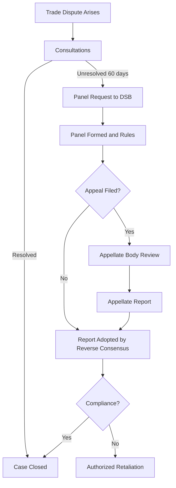

## The WTO's Role in Global Economic Governance

### Overview

The World Trade Organization (WTO) is the principal international body governing the rules of trade between nations. Established on January 1, 1995, as the successor to the General Agreement on Tariffs and Trade (GATT, 1947), the WTO institutionalized a rules-based multilateral trading system with a permanent organizational structure, a binding dispute settlement mechanism, and an expanded mandate covering goods, services, and intellectual property.

**Key Points**

- The WTO is the only global international organization dealing with the rules of trade between nations
- It administers a single institutional framework covering multiple agreements (the "single undertaking")
- Its core function is to make trade flow smoothly, predictably, and freely
- It occupies a central node in global economic governance alongside the IMF and World Bank, though with a distinct mandate focused on trade rather than monetary stability or development finance

---

### Historical Foundations

#### From GATT to WTO

The GATT (1947) was originally conceived as an interim arrangement pending the creation of the International Trade Organization (ITO), which failed to secure ratification (notably in the U.S. Congress). GATT operated for nearly five decades as a provisional treaty rather than a full organization, lacking legal personality and formal dispute enforcement power.

The Uruguay Round (1986–1994), the eighth and most ambitious round of GATT negotiations, culminated in the Marrakesh Agreement (1994), which established the WTO. This transition addressed GATT's institutional weaknesses:

| Feature | GATT (1947) | WTO (1995–present) |
| --- | --- | --- |
| Legal status | Provisional treaty | Permanent international organization |
| Scope | Goods only | Goods, services (GATS), intellectual property (TRIPS) |
| Dispute settlement | Consensus-based, blockable | Binding, with automatic adoption of rulings |
| Institutional structure | Ad hoc secretariat | Formal organization with Ministerial Conference, General Council, Secretariat |
| Enforcement | Weak, diplomatic | Enforceable through sanctioned retaliation |

---

### Institutional Structure

#### Governance Bodies

The WTO operates on a member-driven, consensus-based decision-making model, in contrast to the weighted-voting systems of the IMF and World Bank.

- **Ministerial Conference**: The top decision-making body, composed of all member states, meeting at least once every two years
- **General Council**: Conducts day-to-day business between Ministerial Conferences; also convenes as the Dispute Settlement Body (DSB) and the Trade Policy Review Body (TPRB)
- **Councils for Trade in Goods, Services, and TRIPS**: Oversee implementation of the respective agreements
- **Secretariat**: Administrative body led by the Director-General; provides technical support but has no independent rule-making power (unlike the IMF's more technocratic staff role)

**Key Points**

- Decision-making is nominally by consensus, giving each member (regardless of economic size) an effective veto
- In practice, consensus rules can slow negotiations significantly, especially post-Doha
- As of the mid-2020s, WTO membership stands at 164+ economies, covering the vast majority of world trade

---

### Core Functions in Global Economic Governance

#### 1. Rule-Setting and Negotiation Forum

The WTO administers a body of agreements that constitute the legal ground rules for international commerce:

- **GATT 1994**: Trade in goods
- **GATS** (General Agreement on Trade in Services): Trade in services
- **TRIPS** (Trade-Related Aspects of Intellectual Property Rights): Minimum IP protection standards
- **Agreement on Agriculture**: Disciplines on agricultural subsidies and market access
- **SPS and TBT Agreements**: Sanitary/phytosanitary measures and technical barriers to trade
- **Plurilateral agreements** (e.g., Government Procurement Agreement): Binding only on signatories

These are negotiated as a **single undertaking** — members accept the entire package rather than picking individual agreements, a structural feature that increases negotiating leverage but also raises the cost of reaching new consensus.

#### 2. Dispute Settlement

The WTO's Dispute Settlement Understanding (DSU) is widely regarded as its most significant institutional innovation relative to GATT.

**Process**:

1. **Consultations**: Parties attempt bilateral resolution (60-day window)
2. **Panel establishment**: If consultations fail, a panel of experts is convened by the DSB
3. **Panel ruling**: Panel issues findings and recommendations
4. **Appellate review**: Either party may appeal to the Appellate Body on legal questions
5. **Adoption**: Rulings are adopted automatically unless there is a consensus *against* adoption (the "reverse consensus" rule — a key structural shift from GATT, where a single objection could block a ruling)
6. **Implementation and retaliation**: If a losing party fails to comply, the DSB can authorize proportionate trade retaliation (suspension of concessions)

$$\text{Retaliation Authorization} \approx f(\text{Level of Nullification or Impairment})$$

**[Unverified]** The precise economic value of authorized retaliation in specific disputes is calculated case-by-case through arbitration and varies significantly; no fixed formula applies across disputes.

**Current Status**: The Appellate Body has been non-functional since December 2019 due to the United States blocking the appointment of new members, citing concerns over judicial overreach. This has produced a partial paralysis: parties can still file appeals "into the void," where rulings remain legally unenforceable pending resolution. A subset of members has adopted the **Multi-Party Interim Appeal Arbitration Arrangement (MPIA)** as a workaround, but it is not universal.

#### 3. Trade Policy Surveillance

The **Trade Policy Review Mechanism (TPRM)** conducts periodic reviews of members' trade policies and practices, promoting transparency. Review frequency scales with the member's share of world trade (the largest trading entities — currently the US, EU, China, Japan — are reviewed most frequently, roughly every 2–3 years; smaller economies less often).

#### 4. Technical Assistance and Capacity Building

The WTO provides training and technical cooperation to developing and least-developed countries (LDCs) to help them implement agreements, negotiate effectively, and integrate into the multilateral trading system. This includes the **Aid for Trade** initiative, coordinated with other institutions.

#### 5. Cooperation with Other Institutions

The WTO coordinates with the IMF and World Bank to ensure coherence in global economic policymaking, as mandated by the 1994 Marrakesh Declaration. This reflects a functional division of labor:

| Institution | Primary Mandate |
| --- | --- |
| WTO | Trade rules, market access, dispute settlement |
| IMF | Monetary stability, balance-of-payments support, exchange rate surveillance |
| World Bank | Long-term development finance, poverty reduction, project lending |

---

### Key Principles Underlying WTO Rules

- **Most-Favoured-Nation (MFN) Treatment**: A trade advantage granted to one member must be extended to all members (Article I, GATT), with exceptions for regional trade agreements (Article XXIV) and preferential schemes for developing countries (Enabling Clause)
- **National Treatment**: Imported goods, once inside a market, must be treated no less favorably than domestically produced goods (Article III, GATT)
- **Reciprocity**: Negotiated tariff concessions are expected to be mutually balanced
- **Transparency**: Members must publish trade regulations and notify policy changes
- **Special and Differential Treatment (S&DT)**: Provisions granting developing countries longer implementation periods, technical assistance, and, in some cases, more lenient obligations

**Example**

If Country A grants Country B a 5% tariff rate on steel imports, MFN requires Country A to extend that same 5% rate to all other WTO members — it cannot offer Country B a special deal while charging Country C 10%, unless a recognized exception (e.g., a free trade agreement notified under Article XXIV) applies.

---

### Structural Diagram: WTO's Position in Global Economic Governance (svg_diagram)

<svg xmlns="http://www.w3.org/2000/svg" viewBox="0 0 800 460">
\<style\>
.title { font: bold 16px sans-serif; fill: #1a1a1a; }
.box-label { font: bold 13px sans-serif; fill: #1a1a1a; }
.sub-label { font: 11px sans-serif; fill: #333333; }
.box { fill: #eaf2fb; stroke: #2b5f8a; stroke-width: 1.5; }
.wto-box { fill: #dbeeff; stroke: #1a4f7a; stroke-width: 2.5; }
.arrow { stroke: #555555; stroke-width: 1.5; fill: none; marker-end: url(#arrowhead); }
\</style\>
<text x="400" y="28" text-anchor="middle" class="title">The WTO in Global Economic Governance (svg_diagram)</text>
<rect x="300" y="60" width="200" height="70" rx="8" class="wto-box" />
<text x="400" y="88" text-anchor="middle" class="box-label">World Trade Organization</text>
<text x="400" y="106" text-anchor="middle" class="sub-label">Trade rules · Disputes</text>
<text x="400" y="120" text-anchor="middle" class="sub-label">Market access · Transparency</text>
<rect x="40" y="220" width="180" height="70" rx="8" class="box" />
<text x="130" y="248" text-anchor="middle" class="box-label">IMF</text>
<text x="130" y="266" text-anchor="middle" class="sub-label">Monetary stability</text>
<text x="130" y="280" text-anchor="middle" class="sub-label">BoP support</text>
<rect x="310" y="220" width="180" height="70" rx="8" class="box" />
<text x="400" y="248" text-anchor="middle" class="box-label">World Bank</text>
<text x="400" y="266" text-anchor="middle" class="sub-label">Development finance</text>
<text x="400" y="280" text-anchor="middle" class="sub-label">Project lending</text>
<rect x="580" y="220" width="180" height="70" rx="8" class="box" />
<text x="670" y="248" text-anchor="middle" class="box-label">Regional Trade Agreements</text>
<text x="670" y="266" text-anchor="middle" class="sub-label">EU, USMCA, RCEP, etc.</text>
<text x="670" y="280" text-anchor="middle" class="sub-label">(notified under Art. XXIV)</text>
<rect x="40" y="360" width="700" height="70" rx="8" class="box" />
<text x="390" y="388" text-anchor="middle" class="box-label">Member States (164+)</text>
<text x="390" y="406" text-anchor="middle" class="sub-label">Negotiate rules · Bring disputes · Implement obligations · Undergo policy review</text>
<path d="M 350 130 L 160 220" class="arrow" />
<path d="M 400 130 L 400 220" class="arrow" />
<path d="M 450 130 L 640 220" class="arrow" />
<path d="M 400 290 L 400 360" class="arrow" />
<path d="M 130 290 L 300 360" class="arrow" />
<path d="M 670 290 L 500 360" class="arrow" />
</svg>

---

### Achievements and Critiques

**Key Points — Achievements**

- Substantial reduction in average global tariffs since GATT's founding (from roughly 22% in 1947 to single digits for industrial goods among major economies today)
- Establishment of an enforceable, rules-based dispute settlement system that (prior to the Appellate Body crisis) resolved hundreds of disputes without recourse to unilateral trade wars
- Extension of trade rules into services and intellectual property, areas GATT never covered
- Integration of China (2001) and other large emerging economies into the multilateral system

**Key Points — Critiques and Challenges**

- **Doha Round stalemate**: Launched in 2001 with a development focus, the Doha Development Agenda has not been concluded as a single undertaking; agricultural subsidy disputes (particularly US/EU vs. developing-country positions) remain a core sticking point
- **Appellate Body paralysis**: Since 2019, undermines the enforceability of dispute rulings
- **Rise of plurilateral and regional deals**: Frustration with multilateral gridlock has pushed major economies toward RTAs (e.g., CPTPP, RCEP, USMCA) and plurilateral initiatives (e.g., e-commerce, investment facilitation) negotiated among subsets of WTO members
- **Special and Differential Treatment disputes**: Ongoing disagreement over which countries should self-designate as "developing" and retain associated flexibilities
- **Industrial policy tensions**: Growing use of subsidies, export controls, and national-security exceptions (Article XXI) by major economies (e.g., US CHIPS Act, EU industrial policy, China's state-led model) tests the boundaries of WTO disciplines
- **[Inference]** Some scholars argue the consensus-based decision rule, effective when membership was smaller, has become a structural bottleneck as membership has grown past 160 economies, though this is a contested interpretation rather than an official WTO position

---

### Illustrative Example: A Trade Dispute in Practice

**Example**

In *United States – Tax Treatment for "Foreign Sales Corporations"* and analogous large-scale disputes (e.g., *US – Boeing* and *EU – Airbus* subsidy cases), the process illustrates the DSU mechanism: complainants alleged prohibited or actionable subsidies under the Agreement on Subsidies and Countervailing Measures (SCM Agreement); panels and the Appellate Body issued rulings over multiple years; and the DSB eventually authorized retaliatory tariffs calibrated to the assessed harm. These cases demonstrate both the WTO's capacity to adjudicate disputes between the world's largest economies and the multi-year timelines such adjudication can require.

**[Unverified]** Specific dollar figures and timelines for individual historical disputes should be verified against current WTO dispute settlement records, as arbitration outcomes and implementation statuses are periodically updated.

---

### Conclusion

The WTO functions as the central legal and institutional architecture for multilateral trade governance, distinguished from its GATT predecessor by permanent institutional status, an expanded substantive scope (goods, services, IP), and a binding dispute settlement system. Its role in global economic governance is best understood as complementary to, but distinct from, the IMF and World Bank: where those institutions address monetary and development finance, the WTO addresses the rules governing cross-border exchange of goods, services, and ideas. Its effectiveness today is constrained by decision-making gridlock, the unresolved Appellate Body crisis, and a shifting geopolitical landscape in which industrial policy and regional agreements increasingly compete with multilateral rule-making as the preferred venue for trade governance.

---

**Related Topics**

- The Doha Development Round and its stalemate
- The WTO Appellate Body crisis and reform proposals
- Regional Trade Agreements (RTAs) vs. multilateralism
- TRIPS Agreement and intellectual property governance
- Special and Differential Treatment for developing countries
- Comparison of the WTO with the IMF and World Bank mandates
- China's WTO accession (2001) and its systemic impact
- Subsidies, countervailing measures, and industrial policy under WTO law
- Trade Facilitation Agreement (2013/2017)
- Plurilateral agreements (e-commerce, investment facilitation, government procurement)