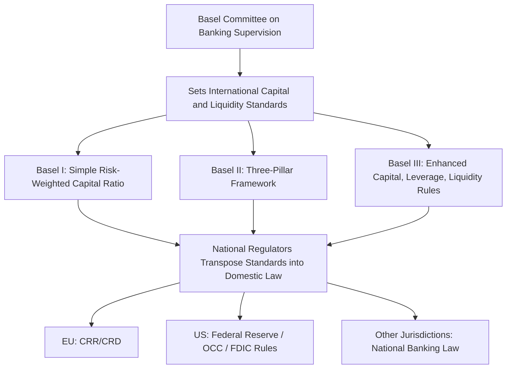

## The Bank for International Settlements

### Overview

The Bank for International Settlements (BIS) is the world's oldest international financial institution, established in 1930. Headquartered in Basel, Switzerland, it functions as a "bank for central banks" — a forum for monetary and financial cooperation, a bank offering financial services exclusively to central banks and international organizations, and a hub for research and standard-setting on global financial stability.

**Key Points**

- The BIS is not a development bank, a commercial bank, or a lender to governments or private entities
- Its membership consists of central banks and monetary authorities, not nation-states directly
- It is best understood as the institutional nucleus for central bank cooperation, distinct from the IMF (macroeconomic surveillance and lending) and the World Bank (development finance)

---

### Historical Origins

The BIS was created under the Hague Agreements of 1930, initially to handle the administration and payment of German war reparations mandated by the Treaty of Versailles (the "Young Plan"). This reparations function became obsolete relatively quickly amid the 1930s financial crises and the suspension of reparations payments, but the institution persisted and was repurposed as a venue for central bank cooperation.

**Key Points**

- Founding members included central banks of Belgium, France, Germany, Italy, Japan, the United Kingdom, and a group of American banks (the US Federal Reserve did not join as a shareholder until much later, reflecting historical US ambivalence toward the institution)
- The BIS survived attempts at dissolution during the Bretton Woods negotiations (1944), where it was originally proposed to be liquidated; it continued operating and was later confirmed as a lasting institution
- Its role expanded substantially after World War II, particularly in supporting European monetary cooperation (e.g., administering the European Payments Union in the 1950s) and later becoming central to global banking supervision after the collapse of Bankhaus Herstatt in 1974

---

### Institutional Structure

#### Ownership and Governance

- **Shareholders**: The BIS is owned by its member central banks (60+ as of the mid-2020s), representing jurisdictions accounting for roughly 95% of global GDP
- **Board of Directors**: Composed of central bank governors and appointed directors from major economies; sets strategic and policy direction
- **General Meeting**: Annual meeting of all member central banks
- **Management**: Led by a General Manager, supported by heads of department (Monetary and Economic Department, Banking Department, etc.)

Unlike the IMF or World Bank, the BIS has a small, technocratic membership base historically dominated by advanced-economy central banks, though membership has broadened over time to include major emerging-market central banks (e.g., People's Bank of China, Reserve Bank of India, Banco Central do Brasil).

#### Legal Status

The BIS possesses a unique legal status: it is technically a company limited by shares under Swiss law but enjoys international organization immunities and privileges under a headquarters agreement with Switzerland, similar in spirit to the immunities granted to the UN or IMF.

---

### Core Functions

#### 1. Forum for Central Bank Cooperation

The BIS hosts regular meetings of central bank governors and senior officials, most notably the **Global Economy Meeting (GEM)** and the **Economic Consultative Committee (ECC)**. These convenings facilitate informal, high-level dialogue on monetary policy, financial stability, and macroprudential concerns outside the more formal, treaty-bound structures of the IMF.

**Key Points**

- Historically, the BIS's greatest institutional value has been described as its role as a discreet, trust-based venue where central bank governors can exchange views candidly, away from public and political scrutiny
- **[Inference]** This informal cooperative function is difficult to quantify empirically but is frequently cited in central banking literature as a distinguishing feature relative to more formal, publicly negotiated bodies like the IMF Executive Board

#### 2. Banking Services for Central Banks

The BIS accepts deposits from and provides financial services to central banks and international financial institutions, but not to private individuals, corporations, or governments directly. Services include:

- Foreign exchange and gold transactions
- Asset management services
- Short-term credit facilities to central banks facing liquidity needs (historically used during various emerging-market and European crises)
- Acting as a trustee or agent in certain international financial arrangements

**[Unverified]** The precise scale of BIS balance-sheet assets fluctuates year to year and should be checked against the BIS's current Annual Report for up-to-date figures.

#### 3. Standard-Setting Through Hosted Committees

The BIS provides the secretariat and meeting venue for several key international standard-setting bodies, though these committees are technically independent of the BIS's own governance (a distinction often blurred in casual usage):

| Committee | Focus |
| --- | --- |
| **Basel Committee on Banking Supervision (BCBS)** | Global bank capital and liquidity standards (Basel I, II, III, and the Basel III endgame/finalization reforms) |
| **Committee on Payments and Market Infrastructures (CPMI)** | Standards for payment, clearing, and settlement systems |
| **Financial Stability Board (FSB)** | Coordinates national financial regulators and international standard-setters; hosted at the BIS but formally distinct, established in 2009 as successor to the Financial Stability Forum |
| **Markets Committee** | Monitors developments in financial markets relevant to central banks |
| **Committee on the Global Financial System (CGFS)** | Monitors and analyzes systemic risk issues |
| **Irving Fisher Committee on Central Bank Statistics (IFC)** | Statistical and data cooperation among central banks |

**Key Points**

- The Basel Committee's work is arguably the BIS ecosystem's most consequential output for the global economy, given that Basel Accords shape bank capital requirements worldwide
- Basel standards are not self-executing treaties — they must be transposed into domestic law by national regulators (e.g., via the EU's Capital Requirements Regulation/Directive, or US federal banking regulations), meaning implementation timing and stringency vary by jurisdiction

#### 4. Economic and Monetary Research

The BIS's Monetary and Economic Department produces widely cited research on:

- Global liquidity conditions
- Cross-border banking flows
- The international monetary and financial system
- Macroprudential policy
- Central bank digital currencies (CBDCs) and financial innovation

The **BIS Annual Economic Report** and the **BIS Quarterly Review** are standard reference publications in central banking and academic circles.

---

### Basel Capital Accords: A Closer Look

Since the Basel III capital framework is the BIS ecosystem's most technically significant output, it merits detailed treatment.

#### Basel I (1988)

Introduced the first internationally standardized capital adequacy framework, centered on a simple risk-weighted capital ratio.

$$\text{Capital Adequacy Ratio} = \frac{\text{Tier 1 Capital} + \text{Tier 2 Capital}}{\text{Risk-Weighted Assets}} \geq 8\%$$

#### Basel II (2004)

Introduced three "pillars":

1. **Minimum capital requirements** (refined risk-weighting, including internal ratings-based approaches)
2. **Supervisory review process**
3. **Market discipline** (enhanced disclosure requirements)

**[Unverified]** Basel II's internal-ratings-based approach was criticized after the 2008 Global Financial Crisis for allowing banks excessive discretion in modeling their own risk weights; the extent to which this contributed causally to the crisis remains a subject of academic debate rather than settled consensus.

#### Basel III (2010, with ongoing "endgame" revisions)

Developed in direct response to the 2008 Global Financial Crisis, Basel III strengthened capital and liquidity requirements substantially:

- **Common Equity Tier 1 (CET1) ratio**: Minimum raised to 4.5% of risk-weighted assets, with additional capital conservation and countercyclical buffers
- **Leverage Ratio**: A non-risk-based backstop measure
- **Liquidity Coverage Ratio (LCR)**: Requires banks to hold sufficient high-quality liquid assets to survive a 30-day stress scenario
- **Net Stable Funding Ratio (NSFR)**: Requires stable funding relative to the liquidity profile of assets over a one-year horizon

$$\text{LCR} = \frac{\text{High-Quality Liquid Assets}}{\text{Total Net Cash Outflows over 30 days}} \geq 100\%$$

**Example**

A bank holding $120 million in high-quality liquid assets (e.g., government bonds, central bank reserves) against projected net cash outflows of $100 million over a 30-day stress period would have an LCR of 120%, exceeding the regulatory minimum and indicating adequate short-term liquidity buffers under the modeled stress scenario.

---

### The BIS in the Broader Global Governance Architecture (svg_diagram)

<svg xmlns="http://www.w3.org/2000/svg" viewBox="0 0 800 420">
\<style\>
.title { font: bold 16px sans-serif; fill: #1a1a1a; }
.box-label { font: bold 13px sans-serif; fill: #1a1a1a; }
.sub-label { font: 11px sans-serif; fill: #333333; }
.box { fill: #f2ecfb; stroke: #5b3a8a; stroke-width: 1.5; }
.bis-box { fill: #e3d7f7; stroke: #3f2566; stroke-width: 2.5; }
.arrow { stroke: #555555; stroke-width: 1.5; fill: none; marker-end: url(#arrowhead2); }
\</style\>
<text x="400" y="28" text-anchor="middle" class="title">The BIS Ecosystem (svg_diagram)</text>
<rect x="300" y="55" width="200" height="65" rx="8" class="bis-box" />
<text x="400" y="82" text-anchor="middle" class="box-label">Bank for International Settlements</text>
<text x="400" y="100" text-anchor="middle" class="sub-label">Basel, Switzerland — est. 1930</text>
<rect x="40" y="180" width="170" height="65" rx="8" class="box" />
<text x="125" y="207" text-anchor="middle" class="box-label">Basel Committee</text>
<text x="125" y="224" text-anchor="middle" class="sub-label">(BCBS) — Bank Capital Rules</text>
<rect x="230" y="180" width="170" height="65" rx="8" class="box" />
<text x="315" y="207" text-anchor="middle" class="box-label">CPMI</text>
<text x="315" y="224" text-anchor="middle" class="sub-label">Payments &amp; Settlement</text>
<rect x="420" y="180" width="170" height="65" rx="8" class="box" />
<text x="505" y="207" text-anchor="middle" class="box-label">Financial Stability Board</text>
<text x="505" y="224" text-anchor="middle" class="sub-label">Global Regulatory Coordination</text>
<rect x="610" y="180" width="150" height="65" rx="8" class="box" />
<text x="685" y="207" text-anchor="middle" class="box-label">Markets Committee</text>
<text x="685" y="224" text-anchor="middle" class="sub-label">Market Monitoring</text>
<rect x="60" y="320" width="680" height="65" rx="8" class="box" />
<text x="400" y="347" text-anchor="middle" class="box-label">National Central Banks &amp; Regulators (60+ BIS Member Institutions)</text>
<text x="400" y="365" text-anchor="middle" class="sub-label">Transpose standards into domestic law · Coordinate monetary policy · Share data</text>
<path d="M 350 120 L 150 180" class="arrow" />
<path d="M 380 120 L 330 180" class="arrow" />
<path d="M 420 120 L 480 180" class="arrow" />
<path d="M 460 120 L 660 180" class="arrow" />
<path d="M 125 245 L 300 320" class="arrow" />
<path d="M 505 245 L 450 320" class="arrow" />
<path d="M 685 245 L 600 320" class="arrow" />
</svg>

---

### BIS vs. IMF vs. World Bank: A Comparative View

| Dimension | BIS | IMF | World Bank |
| --- | --- | --- | --- |
| Founded | 1930 | 1944 | 1944 |
| Members | Central banks (institutions) | 190+ nation-states | 190+ nation-states |
| Primary function | Central bank cooperation, banking standards, research | Macroeconomic surveillance, balance-of-payments lending | Development finance, project lending |
| Governance | Small board, central bank governors | Quota-weighted voting | Shareholding-weighted voting |
| Public profile | Low; technocratic | High; conditionality politically contentious | High; development politically contentious |
| Legal instrument type | Non-binding standards (soft law) requiring national transposition | Binding loan conditionality | Binding loan/grant agreements |

**Key Points**

- The BIS's standards (e.g., Basel III) are a form of **"soft law"** — influential but not directly enforceable absent domestic legislative or regulatory adoption, distinguishing the BIS's mode of influence from the IMF's conditionality-based lending leverage
- **[Inference]** This soft-law character is sometimes viewed as a governance weakness (inconsistent implementation across jurisdictions) and sometimes as a strength (flexibility allowing adaptation to local banking systems); which framing dominates depends on the analytical perspective taken, and this is not a matter with a single settled answer

---

### Contemporary Relevance and Emerging Areas

- **Central Bank Digital Currencies (CBDCs)**: The BIS Innovation Hub coordinates cross-border research and pilot projects on CBDCs (e.g., Project mBridge, Project Dunbar), positioning the BIS as a key technical convener in this space
- **Climate-related financial risk**: Through the Network for Greening the Financial System (NGFS, though technically separate from the BIS) and BIS-hosted research, central banks increasingly examine climate risk as a financial stability issue
- **Basel III finalization ("Basel III Endgame")**: Ongoing jurisdictional debates (particularly in the US and EU) over the final calibration and implementation timeline of remaining Basel III elements
- **Cross-border payment system reform**: BIS-coordinated work on faster, cheaper, more transparent cross-border payments, partly in response to G20 mandates

**[Unverified]** Adoption timelines and calibration details for Basel III Endgame provisions differ by jurisdiction and are subject to ongoing regulatory revision; current status should be verified against the relevant national regulator's latest rulemaking.

---

### Conclusion

The Bank for International Settlements occupies a distinctive niche in global economic governance: it is not a lender of last resort to governments, not a development financier, and not a treaty-based intergovernmental organization in the mold of the IMF or World Bank. Instead, it functions as the central meeting ground and technical secretariat for the world's central banks, producing the soft-law standards — most consequentially the Basel Accords — that underpin national banking regulation worldwide. Its influence operates less through binding legal authority and more through the convening power of central bank cooperation, technical standard-setting, and its long-standing role as a trusted, discreet forum for monetary policy dialogue.

---

**Related Topics**

- Basel III capital and liquidity requirements in detail
- The Financial Stability Board's role in post-2008 regulatory reform
- Central Bank Digital Currencies (CBDCs) and the BIS Innovation Hub
- Comparative governance models: quota-based (IMF) vs. shareholding-based (World Bank) vs. central-bank-based (BIS)
- Soft law vs. hard law in international financial regulation
- The 2008 Global Financial Crisis and the origins of Basel III
- Cross-border banking supervision and macroprudential policy
- The Financial Stability Forum and its evolution into the FSB