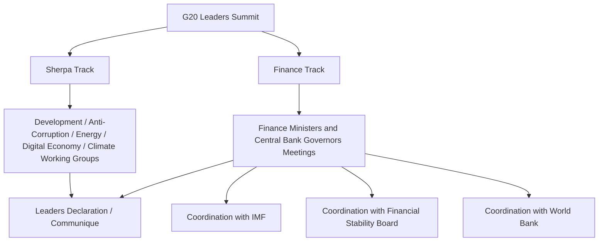

## The G7, the G20, and International Policy Coordination

### Overview

The G7 and G20 are informal, non-treaty-based forums through which the world's major economies coordinate macroeconomic, financial, and increasingly broader policy positions. Unlike the WTO, IMF, or World Bank, neither group possesses a founding charter, a permanent secretariat, legal personality, or binding decision-making authority. Their influence operates through political signaling, agenda-setting, and the mobilization of member states' own domestic and multilateral levers (including their weight within the IMF, World Bank, and WTO).

**Key Points**

- Both are "clubs," not organizations: membership is by invitation/convention, not treaty accession
- Outputs take the form of communiqués, declarations, and action plans — politically significant but not legally binding
- Their primary governance value lies in coordination and signaling, reducing the transaction costs of aligning policy across major economies during crises or long-term structural shifts

---

### The G7: Origins and Composition

#### Historical Development

The G7's roots trace to the **Library Group** (1973), an informal gathering of finance officials from the US, UK, France, West Germany, and Japan formed amid the collapse of the Bretton Woods fixed exchange rate system and the 1973 oil crisis. This evolved into the **G6** at the 1975 Rambouillet Summit (France, Germany, Italy, Japan, UK, US), joined by Canada in 1976 to form the **G7**.

Russia joined in 1997–1998, forming the **G8**, but was suspended in 2014 following its annexation of Crimea, reverting the group to the **G7**. The European Union participates as a non-enumerated member, represented by the European Council and European Commission presidents.

**Key Points**

- Current G7 members: Canada, France, Germany, Italy, Japan, United Kingdom, United States, plus EU representation
- The G7 represents a group of large, advanced, market-democracy economies, historically comprising a very large share of global GDP, though this share has declined over recent decades as emerging economies (particularly China and India) have grown
- **[Unverified]** Precise current G7 share-of-global-GDP figures vary by methodology (nominal vs. PPP) and should be checked against current IMF World Economic Outlook data for up-to-date figures

#### Structure and Process

- **Annual Summit**: Rotating host presidency; leaders meet to issue a joint communiqué
- **Finance Ministers and Central Bank Governors Track**: Meets multiple times per year, historically the more technically substantive track for monetary and fiscal coordination
- **Sherpa process**: Senior officials ("sherpas") conduct pre-summit negotiations to draft communiqué language
- **No permanent secretariat**: Administrative support rotates with the host country presidency each year

---

### The G20: Origins and Composition

#### Historical Development

The G20 was established in **1999** at the finance-minister and central-bank-governor level, created in direct response to the **1997–98 Asian Financial Crisis**, which exposed the inadequacy of G7-only coordination for a global financial system in which emerging markets had become systemically significant.

The G20 was elevated to a **leaders' summit level in 2008**, in direct response to the Global Financial Crisis, reflecting a recognition that crisis-era coordination required the participation of major emerging economies beyond the G7's membership.

**Key Points**

- G20 membership: Argentina, Australia, Brazil, Canada, China, France, Germany, India, Indonesia, Italy, Japan, Mexico, Russia, Saudi Arabia, South Africa, South Korea, Turkey, United Kingdom, United States, the European Union, and (since 2023) the **African Union**
- The G20 collectively represents roughly 85% of global GDP, around 75% of global trade, and about two-thirds of the world's population (figures vary modestly by source and year — **[Unverified]** precise current figures should be checked against G20 official documentation)
- Russia's continued participation has been diplomatically contentious since 2022, with some G7 members boycotting joint sessions involving Russian representatives, though Russia has not been formally expelled from the G20 (unlike its 2014 suspension from the G8)

#### Structure and Process

The G20 operates across two parallel tracks:

1. **Finance Track**: Finance ministers and central bank governors; focuses on macroeconomic coordination, financial regulation, sovereign debt, and international financial architecture. This track works closely with the IMF and the Financial Stability Board (FSB)
2. **Sherpa Track**: Broader policy agenda — development, anti-corruption, energy, digital economy, health, trade, climate — culminating in the leaders' summit

Like the G7, the G20 has **no permanent secretariat**; administrative continuity is provided through a **"troika"** system (the current, immediately preceding, and immediately following host presidencies coordinating to maintain agenda continuity).

---

### Functions in International Policy Coordination

#### 1. Crisis Response Coordination

The G20's most consequential historical role was coordinating the global policy response to the 2008 Global Financial Crisis:

- Coordinated fiscal stimulus commitments across major economies
- Agreement to refrain from competitive currency devaluation and protectionist measures ("standstill" commitments on trade barriers)
- Mandate that catalyzed the creation of the **Financial Stability Board (FSB)** from the earlier Financial Stability Forum
- Substantial increase in IMF lending resources, agreed at the 2009 London Summit

**Key Points**

- **[Inference]** Historical assessments of the G20's 2008–09 crisis coordination generally credit it with averting a deeper global downturn through coordinated stimulus and a shared commitment to avoid a 1930s-style protectionist spiral, though the precise counterfactual magnitude of this effect cannot be definitively established and remains a matter of economic interpretation

#### 2. Financial Regulatory Coordination

The G20 provides the political mandate under which technical bodies (BIS committees, FSB, IOSCO) develop and refine regulatory standards, particularly:

- Post-2008 bank capital reforms (Basel III), for which the G20 provided top-level political endorsement
- Over-the-counter (OTC) derivatives market reforms (central clearing mandates)
- "Too big to fail" reforms for globally systemically important banks (G-SIBs)

#### 3. International Tax Coordination

The G20, working with the OECD, has been central to global tax cooperation initiatives:

- **Base Erosion and Profit Shifting (BEPS) project**: Addressing corporate tax avoidance strategies
- **Global minimum corporate tax (Pillar Two)**: A 15% minimum effective tax rate framework agreed by over 140 jurisdictions under the OECD/G20 Inclusive Framework, with G20 political endorsement providing critical momentum

**[Unverified]** Implementation status and adoption timelines for the global minimum tax vary substantially by jurisdiction and are subject to ongoing legislative processes; current status should be verified against OECD Inclusive Framework updates.

#### 4. Sovereign Debt and Development Coordination

- **G20 Debt Service Suspension Initiative (DSSI, 2020–2021)**: Temporary suspension of bilateral debt service payments for low-income countries during the COVID-19 pandemic
- **Common Framework for Debt Treatment (2020–present)**: A G20-endorsed mechanism (extending Paris Club practices to include non-Paris Club creditors, notably China) for coordinating sovereign debt restructuring for low-income countries

**Key Points**

- The Common Framework's practical effectiveness has been a subject of ongoing debate, given the slow pace of restructuring processes in early cases (e.g., Chad, Zambia, Ethiopia)
- **[Inference]** A significant coordination challenge stems from the fact that China, now among the largest bilateral creditors to developing countries, is not a traditional Paris Club member and applies different lending practices and disclosure norms, complicating multilateral coordination — this is a widely noted structural issue in the sovereign debt literature rather than a settled resolution

#### 5. Trade Policy Signaling

Neither the G7 nor G20 negotiates binding trade agreements (that remains the WTO's domain), but both issue trade-related communiqué language that can signal collective intent — for example, joint statements on WTO reform, opposition to protectionism, or (more recently) coordinated approaches to export controls and economic security measures.

---

### G7 vs. G20: A Comparative View

| Dimension | G7 | G20 |
| --- | --- | --- |
| Founded (leaders' level) | 1975 | 2008 (1999 at finance-minister level) |
| Membership basis | Advanced market democracies | Advanced + major emerging economies |
| Number of members | 7 + EU | 19 + EU + AU |
| Share of global GDP | Declining share (advanced economies only) | ~85% (broader emerging-market inclusion) |
| Primary strength | Tighter policy alignment among like-minded economies | Broader legitimacy; includes systemically important emerging markets |
| Primary weakness | Excludes major emerging economies (China, India) from core table | More heterogeneous preferences; harder to reach consensus |
| Legal status | Informal forum | Informal forum |
| Secretariat | None (rotating presidency) | None (rotating presidency + troika) |

---

### The G7/G20 in the Broader Global Governance Architecture (svg_diagram)

<svg xmlns="http://www.w3.org/2000/svg" viewBox="0 0 820 460">
\<style\>
.title { font: bold 16px sans-serif; fill: #1a1a1a; }
.box-label { font: bold 13px sans-serif; fill: #1a1a1a; }
.sub-label { font: 11px sans-serif; fill: #333333; }
.box { fill: #eafbf0; stroke: #2a7a4f; stroke-width: 1.5; }
.g20-box { fill: #d3f5e0; stroke: #1c5c39; stroke-width: 2.5; }
.g7-box { fill: #d3f5e0; stroke: #1c5c39; stroke-width: 2; }
.arrow { stroke: #555555; stroke-width: 1.5; fill: none; marker-end: url(#arrowhead3); }
\</style\>
<text x="410" y="28" text-anchor="middle" class="title">Informal Coordination Forums and Formal Institutions (svg_diagram)</text>
<rect x="120" y="55" width="200" height="60" rx="8" class="g7-box" />
<text x="220" y="80" text-anchor="middle" class="box-label">G7</text>
<text x="220" y="98" text-anchor="middle" class="sub-label">Advanced economies, since 1975</text>
<rect x="500" y="55" width="200" height="60" rx="8" class="g20-box" />
<text x="600" y="80" text-anchor="middle" class="box-label">G20</text>
<text x="600" y="98" text-anchor="middle" class="sub-label">Systemic economies, since 1999/2008</text>
<rect x="330" y="160" width="160" height="55" rx="8" class="box" />
<text x="410" y="192" text-anchor="middle" class="sub-label">Political mandates and communiques</text>
<rect x="40" y="270" width="170" height="65" rx="8" class="box" />
<text x="125" y="298" text-anchor="middle" class="box-label">IMF</text>
<text x="125" y="315" text-anchor="middle" class="sub-label">Surveillance, lending</text>
<rect x="230" y="270" width="170" height="65" rx="8" class="box" />
<text x="315" y="298" text-anchor="middle" class="box-label">World Bank</text>
<text x="315" y="315" text-anchor="middle" class="sub-label">Development finance</text>
<rect x="420" y="270" width="170" height="65" rx="8" class="box" />
<text x="505" y="298" text-anchor="middle" class="box-label">Financial Stability Board</text>
<text x="505" y="315" text-anchor="middle" class="sub-label">Regulatory coordination</text>
<rect x="610" y="270" width="170" height="65" rx="8" class="box" />
<text x="695" y="298" text-anchor="middle" class="box-label">WTO / OECD</text>
<text x="695" y="315" text-anchor="middle" class="sub-label">Trade rules, tax standards</text>
<rect x="120" y="390" width="580" height="55" rx="8" class="box" />
<text x="410" y="422" text-anchor="middle" class="box-label">Implementation by National Governments and Central Banks</text>
<path d="M 250 115 L 380 160" class="arrow" />
<path d="M 580 115 L 440 160" class="arrow" />
<path d="M 380 215 L 200 270" class="arrow" />
<path d="M 400 215 L 350 270" class="arrow" />
<path d="M 430 215 L 490 270" class="arrow" />
<path d="M 450 215 L 660 270" class="arrow" />
<path d="M 125 335 L 300 390" class="arrow" />
<path d="M 505 335 L 450 390" class="arrow" />
<path d="M 695 335 L 550 390" class="arrow" />
</svg>

---

### Limitations and Critiques of Informal Coordination

**Key Points**

- **No enforcement mechanism**: Commitments made in communiqués are politically, not legally, binding; implementation depends entirely on domestic follow-through
- **Legitimacy questions**: The G7 excludes major emerging economies; the G20 excludes the vast majority of the world's ~190+ states, raising representativeness concerns relative to universal-membership bodies like the UN or WTO
- **Consensus dilution**: As G20 membership diversity has grown, joint communiqué language has at times become vaguer or subject to disclaimers/footnotes reflecting member disagreement (notably visible in G20 statements since 2022 regarding the war in Ukraine)
- **Duplication and coordination costs**: Overlapping mandates among the G7, G20, IMF, FSB, and OECD can create coordination redundancy, requiring careful sequencing of technical work (typically done by the IMF/FSB/OECD) and political endorsement (done by the G7/G20)
- **[Inference]** Some scholars characterize the G20 as an effective "crisis committee" whose relevance is highest during acute global shocks (2008 GFC, 2020 pandemic) and comparatively lower during calmer periods, though this characterization is a matter of scholarly interpretation rather than a universally agreed assessment

---

### Conclusion

The G7 and G20 occupy a distinctive governance niche as informal, summit-based forums that generate political mandates and coordination rather than binding legal obligations. The G7 provides tighter alignment among a smaller set of advanced market democracies, while the G20 — created explicitly in response to the limitations of G7-only coordination during the Asian and Global Financial Crises — brings systemically important emerging economies into the room, at some cost to consensus efficiency. Both forums function less as independent governance institutions and more as political engines that mobilize and direct the technical machinery of the IMF, World Bank, WTO, BIS, FSB, and OECD, translating leader-level political will into more formal, if imperfectly enforced, multilateral action.

---

**Related Topics**

- The 2008 Global Financial Crisis and the G20's crisis response
- The Financial Stability Board's creation and mandate
- OECD/G20 Base Erosion and Profit Shifting (BEPS) and global minimum tax
- The Common Framework for Debt Treatment and sovereign debt restructuring
- G7/G20 relationship with IMF quota and governance reform
- Legitimacy and representativeness debates in global economic governance
- Comparing treaty-based institutions (WTO, IMF) with informal governance forums (G7, G20)
- The evolution of the G20 Finance Track and Sherpa Track