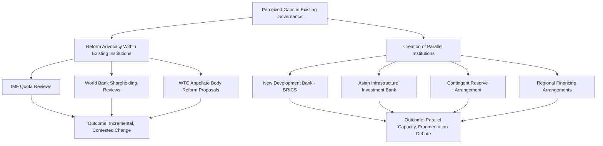

## Debates over Reforming Global Economic Governance

### Overview

The architecture of global economic governance — the IMF, World Bank, WTO, BIS, G7/G20, and related bodies — was largely designed in the mid-20th century (Bretton Woods, 1944) or shaped by late-20th-century power distributions (WTO, 1995; G7, 1975). Persistent debates over reforming this architecture center on whether these institutions' governance structures, mandates, and decision rules remain fit for a 21st-century global economy characterized by a much larger relative weight of emerging markets, new transnational challenges (climate, digital trade, pandemics), and shifting geopolitical alignments.

**Key Points**

- Reform debates span at least four distinct dimensions: (1) representation/voting power, (2) mandate scope, (3) enforcement and legitimacy, and (4) institutional proliferation and fragmentation
- These debates are not merely technical; they reflect deeper contestation over the distribution of power in the international system
- No single "resolved" reform consensus exists across institutions — outcomes vary by institution and by era

---

### Dimension 1: Representation and Voting Power Reform

#### IMF and World Bank Quota/Shareholding Reform

The IMF's quota system and the World Bank's shareholding structure determine both financial contributions and voting power. Both have faced sustained criticism that they underrepresent the current economic weight of emerging markets, particularly China, India, and other large developing economies, relative to their share of global GDP.

**Key Points**

- The **2010 IMF Quota and Governance Reform** (effective 2016 after prolonged US congressional delay) shifted more than 6 percentage points of quota share toward dynamic emerging market and developing economies, and moved two European chairs to emerging-market economies on the Executive Board
- Despite this, critics (including many G20 emerging-market members) argue quota shares still lag behind these economies' actual share of global output, particularly for China
- The **16th General Review of Quotas**, concluded in 2023, resulted in a proportional quota increase (doubling total quotas) without realigning individual country shares — a outcome widely characterized as preserving the status quo distribution rather than substantively rebalancing it
- **[Inference]** The persistent gap between calls for quota realignment and actual outcomes reflects the reality that any quota reshuffling requires the support of a supermajority (85% of voting power for major decisions), giving the United States (holding roughly 16–17% of voting power) an effective veto over changes it opposes — this structural point is well documented, though characterizations of *why* particular reforms stalled in any given round involve some interpretation of political motives

#### The US Veto Point

$$\text{Major IMF Decision Threshold} = 85\% \text{ of total voting power}$$

Because the US holds voting power above the 15% blocking threshold, no major structural change to IMF governance (including quota formula changes) can proceed without US assent — a frequently cited structural bottleneck in reform debates.

#### World Bank Shareholding Reform

Parallel debates exist regarding World Bank shareholding, with similar dynamics: incremental "shareholding reviews" have modestly increased developing- and emerging-economy voting shares, but the US has historically retained the largest single share and effective veto power over certain capital-related decisions requiring supermajorities.

---

### Dimension 2: Mandate Scope — Should Institutions Do More, or Stay Narrow?

#### The IMF: Mission Creep or Necessary Adaptation?

Historically focused narrowly on exchange rate stability and balance-of-payments support, the IMF's mandate has progressively expanded to include:

- Structural conditionality (1980s–1990s)
- Financial sector surveillance (post-1997 Asian crisis)
- Social spending "floors" in program design (2000s onward)
- Climate-related macro-financial risk assessment (2020s)
- Gender and inequality considerations in surveillance (more recent, contested addition)

**Key Points**

- Proponents argue these expansions reflect genuine macro-critical linkages (e.g., climate transition risks affecting fiscal sustainability)
- Critics argue mandate expansion risks diluting institutional focus, duplicating the World Bank's development mandate, and politicizing what should be technical surveillance
- **[Inference]** This "mandate creep" debate recurs across institutions and reflects a genuine, unresolved disagreement in the field about the appropriate boundaries of technocratic macroeconomic institutions versus broader development or political mandates — reasonable economists and policymakers disagree on where this line should sit

#### The World Bank: Climate Finance vs. Traditional Development Lending

The World Bank has faced parallel pressure to expand its climate finance role substantially (via the "Evolution Roadmap" reforms initiated around 2022–2023), including:

- Expanded balance-sheet optimization to increase lending capacity without new paid-in capital
- New "global public goods" mandate alongside traditional poverty-reduction mission
- Hybrid capital instruments and expanded guarantee programs to mobilize private capital

**[Unverified]** The precise scale of additional lending capacity generated by these balance-sheet reforms is subject to ongoing implementation and should be verified against current World Bank Group reporting, as figures have been revised across successive reform announcements.

#### The WTO: Should Trade Rules Cover More?

Debates continue over whether WTO disciplines should expand to cover:

- E-commerce and digital trade (subject to an ongoing plurilateral negotiation among a subset of members)
- Investment facilitation
- Environmental subsidies and industrial policy (tension between trade liberalization principles and green industrial policy, e.g., subsidies under the US Inflation Reduction Act or EU Green Deal Industrial Plan)
- Labor standards (historically resisted by many developing-country members as a potential vehicle for disguised protectionism)

---

### Dimension 3: Enforcement, Legitimacy, and Accountability

#### The WTO Appellate Body Crisis

As previously noted in WTO-specific coverage, the Appellate Body has been non-functional since December 2019 due to blocked appointments, primarily attributed to longstanding US objections regarding judicial overreach. This is one of the most concrete, unresolved institutional crises in global economic governance.

**Key Points**

- Reform proposals include: reducing the Appellate Body's scope of review, imposing stricter deadlines, addressing precedent-setting concerns, and various procedural adjustments
- The **Multi-Party Interim Appeal Arbitration Arrangement (MPIA)**, established in 2020, provides a voluntary workaround among a subset of WTO members but does not resolve the underlying institutional deadlock
- **[Unverified]** The prospects and timeline for a comprehensive Appellate Body reform remain unresolved and should be checked against the latest WTO Ministerial Conference outcomes for current status

#### Conditionality and Sovereignty Concerns

IMF and World Bank lending conditionality has long been criticized, particularly by developing-country borrowers and civil society organizations, on grounds that:

- Conditionality can constrain domestic policy sovereignty
- Historical structural adjustment programs (1980s–1990s) are widely regarded (including by the IMF's own retrospective evaluations) as having imposed significant social costs in some cases, particularly regarding health and education spending cuts
- **[Inference]** Contemporary IMF program design has shifted toward incorporating social spending floors partly in response to this historical criticism, though whether this adequately addresses the underlying sovereignty and social-cost concerns remains debated among scholars and practitioners

#### Transparency and Civil Society Access

Ongoing debates concern the degree to which IMF, World Bank, and WTO decision-making should be more transparent and accessible to civil society, labor organizations, and affected communities, versus concerns that excessive politicization could undermine technical decision-making efficiency.

---

### Dimension 4: Institutional Proliferation and Fragmentation

#### The Rise of Parallel and Regional Institutions

A significant strand of reform debate concerns whether frustration with existing institutions' reform pace has driven the creation of parallel structures, potentially fragmenting global economic governance:

| New/Parallel Institution | Established | Relationship to Existing Architecture |
| --- | --- | --- |
| **New Development Bank (NDB)** | 2014, by BRICS | Positioned as an alternative to World Bank-style development lending |
| **Asian Infrastructure Investment Bank (AIIB)** | 2016, led by China | Complements (and in some framings, competes with) World Bank/ADB infrastructure lending |
| **Contingent Reserve Arrangement (CRA)** | 2015, by BRICS | A BRICS-only alternative liquidity backstop, paralleling (on a smaller scale) IMF emergency lending |
| **Regional Financing Arrangements (RFAs)** | Various (e.g., Chiang Mai Initiative, European Stability Mechanism) | Regional liquidity backstops, sometimes coordinating with, sometimes viewed as substitutes for, IMF programs |

**Key Points**

- Proponents of these parallel institutions frame them as adding needed lending capacity and offering alternatives less encumbered by traditional Western-dominated governance structures
- Critics frame them as evidence of fragmenting global economic governance, potentially undermining coordinated crisis response and diluting the leverage of universal-membership institutions
- **[Inference]** Whether this proliferation represents healthy institutional diversification or harmful fragmentation is a genuinely contested question in the international political economy literature, without a clear empirical resolution; reasonable analysts characterize the same trend in different ways depending on their priors about multipolarity and institutional competition

---

### Governance Reform Landscape (svg_diagram)

<svg xmlns="http://www.w3.org/2000/svg" viewBox="0 0 820 480">
\<style\>
.title { font: bold 16px sans-serif; fill: #1a1a1a; }
.box-label { font: bold 13px sans-serif; fill: #1a1a1a; }
.sub-label { font: 11px sans-serif; fill: #333333; }
.box { fill: #fdf1e3; stroke: #a35d1f; stroke-width: 1.5; }
.center-box { fill: #f9dfb8; stroke: #7a3d0e; stroke-width: 2.5; }
.arrow { stroke: #555555; stroke-width: 1.5; fill: none; marker-end: url(#arrowhead4); }
\</style\>
<text x="410" y="26" text-anchor="middle" class="title">Four Dimensions of Global Governance Reform (svg_diagram)</text>
<rect x="310" y="50" width="200" height="60" rx="8" class="center-box" />
<text x="410" y="75" text-anchor="middle" class="box-label">Reform Debates</text>
<text x="410" y="93" text-anchor="middle" class="sub-label">Global Economic Governance</text>
<rect x="40" y="170" width="170" height="80" rx="8" class="box" />
<text x="125" y="198" text-anchor="middle" class="box-label">Representation</text>
<text x="125" y="216" text-anchor="middle" class="sub-label">Quotas, voting shares</text>
<text x="125" y="232" text-anchor="middle" class="sub-label">IMF, World Bank</text>
<rect x="240" y="170" width="170" height="80" rx="8" class="box" />
<text x="325" y="198" text-anchor="middle" class="box-label">Mandate Scope</text>
<text x="325" y="216" text-anchor="middle" class="sub-label">Climate, digital trade,</text>
<text x="325" y="232" text-anchor="middle" class="sub-label">social conditionality</text>
<rect x="440" y="170" width="170" height="80" rx="8" class="box" />
<text x="525" y="198" text-anchor="middle" class="box-label">Enforcement &amp; Legitimacy</text>
<text x="525" y="216" text-anchor="middle" class="sub-label">WTO Appellate Body</text>
<text x="525" y="232" text-anchor="middle" class="sub-label">Conditionality debates</text>
<rect x="640" y="170" width="150" height="80" rx="8" class="box" />
<text x="715" y="198" text-anchor="middle" class="box-label">Fragmentation</text>
<text x="715" y="216" text-anchor="middle" class="sub-label">NDB, AIIB, CRA,</text>
<text x="715" y="232" text-anchor="middle" class="sub-label">Regional Arrangements</text>
<rect x="150" y="330" width="520" height="90" rx="8" class="box" />
<text x="410" y="360" text-anchor="middle" class="box-label">Underlying Tension</text>
<text x="410" y="380" text-anchor="middle" class="sub-label">Shift in relative economic weight toward emerging economies</text>
<text x="410" y="396" text-anchor="middle" class="sub-label">vs. incumbent powers' reluctance to cede formal governance control</text>
<path d="M 370 110 L 150 170" class="arrow" />
<path d="M 390 110 L 340 170" class="arrow" />
<path d="M 440 110 L 500 170" class="arrow" />
<path d="M 470 110 L 690 170" class="arrow" />
<path d="M 150 250 L 300 330" class="arrow" />
<path d="M 400 250 L 400 330" class="arrow" />
<path d="M 550 250 L 480 330" class="arrow" />
<path d="M 700 250 L 550 330" class="arrow" />
</svg>

---

### Competing Schools of Thought on Reform

**Key Points — Reform-from-Within Perspective**

- Argues existing institutions (IMF, World Bank, WTO) retain irreplaceable advantages: universal or near-universal membership, decades of accumulated technical expertise, and established legal/operational infrastructure
- Advocates incremental reforms: quota realignment, expanded mandates where genuinely macro-critical, procedural fixes to dispute settlement
- Views parallel institutions as a symptom of frustration rather than a solution, given their typically narrower membership and, in some cases, less transparent governance

**Key Points — Institutional Pluralism Perspective**

- Argues that competition and diversification among institutions can be healthy, offering borrowing/negotiating alternatives and pressuring incumbent institutions to reform
- Points to historical precedent of overlapping regional and global institutions coexisting (e.g., regional development banks alongside the World Bank) without necessarily undermining either
- **[Inference]** Both schools of thought are represented in mainstream international political economy scholarship; this is a genuine, unresolved academic and policy debate rather than one with a clearly "correct" side

**Key Points — Structural/Critical Perspective**

- Argues that formal governance reforms (quota adjustments, board seats) are insufficient without deeper change to underlying power asymmetries, including informal influence channels (staff composition, headquarters location, agenda-setting norms)
- Emphasizes that historical origins of institutions (Bretton Woods, GATT) embedded advanced-economy preferences into technical rules and norms that persist even after formal voting-share adjustments

---

### Illustrative Example

**Example**

The 2010 IMF quota reform took roughly six years to fully implement (agreed 2010, effective 2016) due to the need for ratification by members holding 85% of voting power — principally, delayed approval by the US Congress. This example is frequently cited in the reform literature as demonstrating both (a) that consensus-based reform of Bretton Woods institutions is achievable, and (b) that the required supermajority threshold gives a single large shareholder substantial power to delay implementation even after multilateral political agreement has been reached.

---

### Conclusion

Debates over reforming global economic governance are not a single, resolvable question but an ongoing, multidimensional negotiation over representation, mandate, enforcement legitimacy, and institutional architecture. The tension driving most of these debates is structural: the relative economic weight of emerging and developing economies has grown substantially since the mid-20th-century founding of most major institutions, while formal governance structures — often requiring supermajority consent from incumbent powers — have adjusted only incrementally. This has produced parallel dynamics: continued, often slow, reform efforts within existing institutions (IMF quota reviews, World Bank shareholding reviews, WTO Appellate Body reform proposals) alongside the emergence of new, parallel institutions (NDB, AIIB, CRA, regional financing arrangements) that some view as complementary diversification and others view as concerning fragmentation. No consensus exists on which trajectory best serves long-term global economic stability and legitimacy, and this remains one of the most actively contested areas in international economics and international political economy.

---

**Related Topics**

- IMF quota formula mechanics and historical reform rounds
- The World Bank's Evolution Roadmap and balance-sheet optimization reforms
- The WTO Appellate Body crisis and MPIA workaround
- BRICS institutions: New Development Bank and Contingent Reserve Arrangement
- Regional Financing Arrangements (Chiang Mai Initiative, European Stability Mechanism)
- Structural adjustment programs: historical critique and IMF program design evolution
- The politics of supermajority voting thresholds in international institutions
- Institutional pluralism vs. fragmentation in international political economy theory