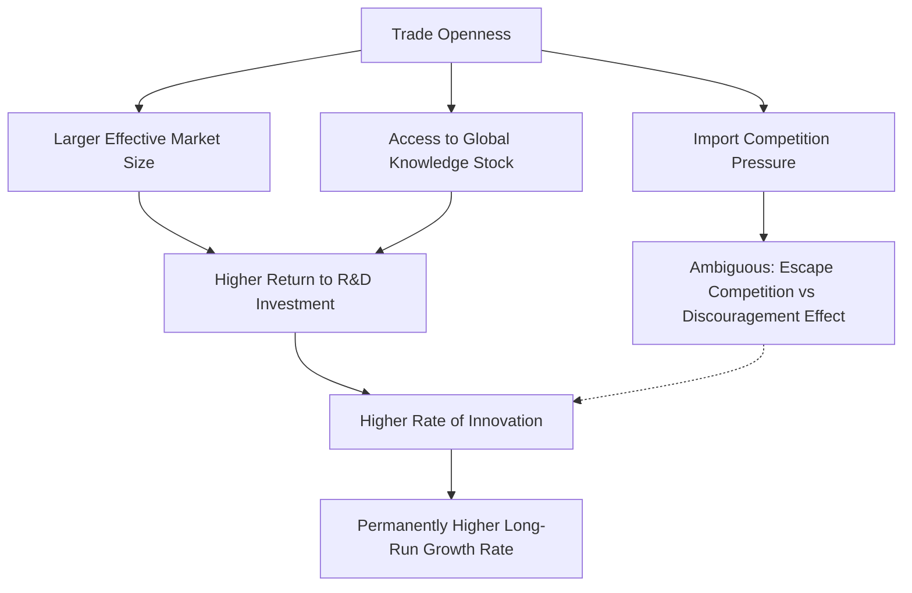

## Theoretical Channels Linking Trade Openness and Growth

### Overview

The relationship between trade openness and economic growth has been theorized through several distinct, though interconnected, causal mechanisms spanning classical, neoclassical, and endogenous growth traditions. These channels explain not merely *whether* trade affects growth, but the specific transmission mechanisms — efficiency gains, capital accumulation, technology diffusion, market size effects, and institutional feedback — through which openness is theorized to translate into higher output or higher growth rates.

**Key Points**

- A key analytical distinction runs through this literature: trade openness may raise the **level** of output (a static, one-time efficiency gain) versus raising the **long-run growth rate** (a dynamic, permanent effect)
- Static trade theory (Ricardian, Heckscher-Ohlin) primarily predicts level effects; endogenous growth theory is where genuine growth-rate effects are theorized
- Empirical identification of these channels remains contested, and this reference distinguishes theoretical mechanisms (well established as internally consistent models) from empirical validation (considerably more disputed)

---

### Channel 1: Static Efficiency Gains from Comparative Advantage

#### Ricardian Foundations

The classical starting point is David Ricardo's theory of comparative advantage: countries gain from specializing in goods where their relative (not absolute) productivity is highest, and trading for other goods, raising aggregate consumption possibilities.

$$\text{Autarky Frontier} \subset \text{Trade-Augmented Consumption Frontier}$$

This produces a **one-time level effect**: resources are reallocated toward higher-productivity uses, raising output for a given resource endowment. It does not, by itself, imply a permanently higher growth *rate* — the gain is realized as the economy moves to the new equilibrium, after which growth resumes at its prior underlying rate absent additional mechanisms.

#### Heckscher-Ohlin Extension

The Heckscher-Ohlin model extends this logic to factor endowments: countries export goods intensive in their relatively abundant factor (labor or capital) and import goods intensive in their relatively scarce factor. Trade opening reallocates resources toward the abundant-factor-intensive sector, raising returns to that factor (per the **Stolper-Samuelson theorem**) and aggregate efficiency.

**Key Points**

- Both Ricardian and Heckscher-Ohlin channels are fundamentally **static** — they explain gains from trade via reallocation, not sustained growth-rate increases
- **[Inference]** This distinction is why many growth economists regard classical/neoclassical trade theory as necessary but insufficient for explaining observed long-run growth divergence between open and closed economies; the growth-rate story requires additional, dynamic channels, a point that is broadly accepted in the growth literature though the relative importance of each additional channel remains debated

---

### Channel 2: Capital Accumulation and Investment

#### The Neoclassical Growth Channel

In a **Solow-Swan** framework, trade openness can raise growth (transitionally) by:

- Lowering the relative price of imported capital goods, effectively raising the real investment rate for a given savings rate
- Attracting foreign direct investment (FDI), which directly augments the domestic capital stock
- Improving the efficiency of capital allocation by allowing specialization in capital-intensive vs. labor-intensive sectors according to comparative advantage

$$\dot{k} = s f(k) - (n + \delta)k$$

Where openness effects can operate through $s$ (effective savings/investment rate, boosted by cheaper capital goods or FDI inflows) or through the effective productivity embedded in $f(k)$.

**Key Points**

- In the standard Solow model, this channel produces a **transitional growth acceleration** as the economy moves to a new, higher steady-state capital stock — not a permanently higher growth rate, since Solow-type models exhibit diminishing returns to capital
- This is a crucial theoretical nuance: within a pure neoclassical framework, trade-induced capital accumulation gains eventually exhaust themselves absent continued technological progress

#### FDI and the Capital-Augmentation Channel

**Example**

A developing economy that liberalizes trade and investment rules may see multinational firms establish production facilities to access lower labor costs while exporting output globally. This inflow of FDI directly raises the domestic capital stock, and — theoretically — accompanies technology and managerial-practice transfer (see Channel 3), producing effects beyond simple capital deepening.

---

### Channel 3: Technology Diffusion and Innovation

This channel is where **endogenous growth theory** provides the theoretical apparatus for genuine, permanent growth-rate effects — distinguishing it sharply from the static/transitional channels above.

#### Learning-by-Exporting and Technology Transfer

Trade openness is theorized to accelerate technology diffusion through several sub-mechanisms:

- **Embodied technology transfer**: Imported capital goods and intermediate inputs embody frontier technology not otherwise accessible domestically
- **Learning-by-exporting**: Exposure to foreign markets, buyers, and competitive pressure induces domestic firms to upgrade quality, processes, and management practices
- **Reverse engineering and knowledge spillovers**: Access to foreign varieties allows domestic firms to study and adapt foreign product designs and production techniques
- **FDI-associated spillovers**: Local firms may absorb knowledge from multinational subsidiaries through labor mobility, supplier linkages, or demonstration effects

#### Endogenous Growth Formalization: The Romer/Grossman-Helpman Approach

In Romer-style (1990) and Grossman-Helpman (1991) endogenous growth models, growth is driven by the expanding variety of intermediate inputs or by rising quality (via a "quality ladders" formulation), each fueled by R&D investment. Trade openness affects growth in these models through:

1. **Larger effective market size**: Trade integration expands the market over which innovators can amortize fixed R&D costs, raising the incentive to innovate
2. **Access to a larger stock of existing knowledge/varieties**: Openness allows a country to draw on the global stock of ideas rather than only domestically generated ones, directly raising the productivity of domestic R&D
3. **Competitive pressure effects**: Import competition can spur incumbent firms to increase innovation effort to defend market share (though this channel is theoretically ambiguous — see Channel 6 below)

$$g = \frac{1}{\lambda} \left[ \rho_{\text{trade-augmented}} \cdot L_R \right] - \text{(households' discount-related terms)}$$

**[Inference]** This is a simplified stylization; the exact functional form of growth-rate determination varies considerably across specific endogenous growth model variants (Romer 1990 expanding-variety models, Grossman-Helpman 1991 quality-ladder models, Aghion-Howitt 1992 Schumpeterian creative-destruction models), and readers should consult the primary literature for the precise formal derivations rather than treating this as a universal formula.

---

### Channel 4: Market Size and Scale Effects

#### Increasing Returns to Scale

In models incorporating increasing returns to scale (e.g., Krugman's new trade theory, 1979/1980), trade integration allows firms to achieve larger production scale by serving a combined, larger market rather than a fragmented domestic one, lowering average costs where fixed costs are significant.

**Key Points**

- This channel is closely related to, but conceptually distinct from, the R&D-incentive market-size channel above: scale economies can operate even absent explicit innovation, through simple production-side fixed-cost amortization (e.g., in monopolistic competition models with product differentiation)
- **Melitz (2003)**-style heterogeneous-firm trade models add a further refinement: trade opening reallocates market share toward more productive firms (which self-select into exporting) and can drive the least productive firms from the market, raising aggregate industry productivity — a within-industry reallocation channel distinct from both classical comparative advantage and pure scale economies

---

### Channel 5: Institutional and Policy Discipline Effects

#### Openness as a Commitment Device

Trade openness is sometimes theorized to generate growth-supportive effects indirectly, by constraining domestic policy choices:

- Binding tariff commitments (e.g., under WTO accession) can reduce the scope for time-inconsistent protectionist policy reversals, improving the credibility of a liberal trade regime for investors
- Openness can be associated with (though not straightforwardly causally proven to produce) complementary institutional reforms — rule-of-law strengthening, property rights protection, reduced rent-seeking — insofar as integration into global markets raises the returns to such reforms

**Key Points**

- **[Inference]** This channel is more contested and harder to formalize than the others; the direction of causality between "good institutions" and "trade openness" is a long-standing identification challenge in the empirical literature (do open economies develop better institutions, or do economies with already-better institutions choose to open?), and this reference does not take a position on which direction dominates, as it remains actively debated among economists
- Some scholars (e.g., in the institutions-vs-trade empirical debate associated with Rodrik, Subramanian, and Trebbi's work) argue institutional quality is the more fundamental determinant of growth, with trade openness playing a secondary or even statistically insignificant independent role once institutional quality is controlled for — this remains a genuinely disputed empirical finding, not a settled consensus

---

### Channel 6: Competitive Pressure and Resource Reallocation — A Theoretically Ambiguous Channel

Unlike the largely unambiguous predictions of Channels 1–4, the effect of import competition on innovation incentives is genuinely theoretically ambiguous, illustrating that "openness raises growth" is not a monolithic prediction across all mechanisms:

- **Escape-competition effect** (Aghion et al., building on Schumpeterian models): Competitive pressure from imports can spur incumbent firms to innovate more intensively to escape head-to-head competition and maintain profit margins
- **Discouragement/Schumpeterian rent-erosion effect**: Conversely, intensified competition can reduce the expected rents from successful innovation, discouraging R&D investment, particularly for firms far from the technological frontier

**[Inference]** The literature on this channel (notably associated with Aghion, Bloom, Blundell, Griffith, and Howitt's work on competition and innovation) has generally found an **inverted-U relationship** between competition intensity and innovation in some empirical contexts, suggesting the *net* effect of trade-induced competition on growth depends on initial competition levels and firms' distance to the technological frontier — this is a nuanced, context-dependent finding rather than a simple monotonic relationship, and should not be overstated as a universal law.

---

### Synthesis Diagram: Static vs. Dynamic Channels (svg_diagram)

<svg xmlns="http://www.w3.org/2000/svg" viewBox="0 0 820 480">
\<style\>
.title { font: bold 16px sans-serif; fill: #1a1a1a; }
.box-label { font: bold 13px sans-serif; fill: #1a1a1a; }
.sub-label { font: 11px sans-serif; fill: #333333; }
.static-box { fill: #eaf2fb; stroke: #2b5f8a; stroke-width: 1.5; }
.dynamic-box { fill: #fdf1e3; stroke: #a35d1f; stroke-width: 1.5; }
.ambig-box { fill: #f2ecfb; stroke: #5b3a8a; stroke-width: 1.5; }
.center-box { fill: #dbeeff; stroke: #1a4f7a; stroke-width: 2.5; }
.arrow { stroke: #555555; stroke-width: 1.5; fill: none; marker-end: url(#arrowhead5); }
\</style\>
<text x="410" y="26" text-anchor="middle" class="title">Trade Openness Growth Channels (svg_diagram)</text>
<rect x="310" y="45" width="200" height="55" rx="8" class="center-box" />
<text x="410" y="68" text-anchor="middle" class="box-label">Trade Openness</text>
<text x="410" y="85" text-anchor="middle" class="sub-label">Reduced trade barriers/integration</text>
<rect x="40" y="150" width="220" height="90" rx="8" class="static-box" />
<text x="150" y="176" text-anchor="middle" class="box-label">Static / Transitional Effects</text>
<text x="150" y="194" text-anchor="middle" class="sub-label">Comparative advantage reallocation</text>
<text x="150" y="210" text-anchor="middle" class="sub-label">Capital deepening (Solow)</text>
<text x="150" y="226" text-anchor="middle" class="sub-label">-&gt; Higher LEVEL of output</text>
<rect x="300" y="150" width="220" height="90" rx="8" class="dynamic-box" />
<text x="410" y="176" text-anchor="middle" class="box-label">Dynamic / Permanent Effects</text>
<text x="410" y="194" text-anchor="middle" class="sub-label">Technology diffusion, R&amp;D incentives</text>
<text x="410" y="210" text-anchor="middle" class="sub-label">Scale economies, firm reallocation</text>
<text x="410" y="226" text-anchor="middle" class="sub-label">-&gt; Higher long-run growth RATE</text>
<rect x="560" y="150" width="220" height="90" rx="8" class="ambig-box" />
<text x="670" y="176" text-anchor="middle" class="box-label">Theoretically Ambiguous</text>
<text x="670" y="194" text-anchor="middle" class="sub-label">Competitive pressure on innovation</text>
<text x="670" y="210" text-anchor="middle" class="sub-label">Institutional feedback direction</text>
<text x="670" y="226" text-anchor="middle" class="sub-label">-&gt; Net effect context-dependent</text>
<rect x="200" y="340" width="420" height="80" rx="8" class="static-box" />
<text x="410" y="368" text-anchor="middle" class="box-label">Empirical Reality</text>
<text x="410" y="388" text-anchor="middle" class="sub-label">All channels theoretically coherent in isolation;</text>
<text x="410" y="404" text-anchor="middle" class="sub-label">relative magnitudes and net effect remain empirically disputed</text>
<path d="M 380 100 L 200 150" class="arrow" />
<path d="M 410 100 L 410 150" class="arrow" />
<path d="M 440 100 L 620 150" class="arrow" />
<path d="M 200 240 L 350 340" class="arrow" />
<path d="M 410 240 L 410 340" class="arrow" />
<path d="M 620 240 L 480 340" class="arrow" />
</svg>

---

### Summary Table of Channels

| Channel | Theoretical Tradition | Nature of Effect | Ambiguity? |
| --- | --- | --- | --- |
| Comparative advantage reallocation | Ricardian, Heckscher-Ohlin | Static, one-time level gain | No |
| Capital accumulation/FDI | Solow-Swan neoclassical growth | Transitional growth acceleration | No (within model) |
| Technology diffusion/R&D incentives | Romer, Grossman-Helpman, Aghion-Howitt endogenous growth | Permanent growth-rate effect | Low (in-model), high (empirically) |
| Market size/scale economies | Krugman new trade theory, Melitz heterogeneous firms | Level and productivity-composition effect | Low |
| Institutional discipline | Institutions-and-trade literature (Rodrik et al.) | Indirect, contested | High |
| Competitive pressure on innovation | Aghion et al. Schumpeterian models | Ambiguous (inverted-U) | High |

---

### Conclusion

Trade openness is theorized to affect growth through multiple, analytically distinct channels rather than a single unified mechanism. Classical and neoclassical channels (comparative advantage, capital accumulation) robustly predict static or transitional gains in the level of output but do not, within their own theoretical structure, generate permanently higher growth rates. Genuine long-run growth-rate effects require endogenous growth mechanisms — expanded effective market size raising returns to R&D, access to the global knowledge stock, and productivity-enhancing firm reallocation — several of which remain theoretically well-established as internally consistent model predictions but empirically contested in magnitude. At least one channel (competitive pressure on innovation) is theoretically ambiguous even within its own model class, underscoring that "trade openness causes growth" is a claim requiring careful disaggregation by mechanism rather than treatment as a single, uniformly signed effect.

---

**Related Topics**

- Ricardian and Heckscher-Ohlin models of comparative advantage
- Solow-Swan growth model mechanics and convergence predictions
- Endogenous growth theory: Romer, Grossman-Helpman, and Aghion-Howitt models
- Melitz heterogeneous-firm trade model and within-industry reallocation
- The institutions-versus-trade empirical debate (Rodrik, Subramanian, Trebbi)
- Empirical strategies for identifying trade's causal effect on growth
- New trade theory and increasing returns to scale (Krugman)
- Learning-by-exporting: theory and empirical evidence