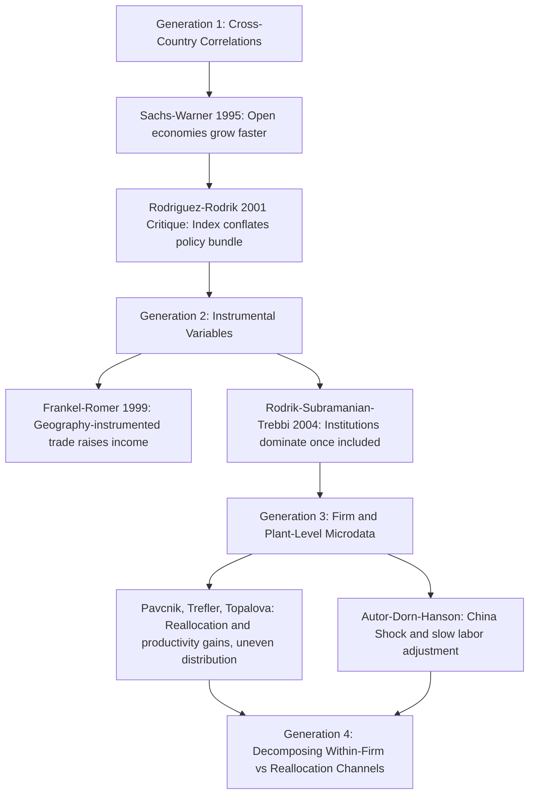

## Empirical Evidence on Trade and Economic Growth

### Overview

The empirical literature on trade openness and economic growth is one of the most extensively studied and methodologically contested areas in international economics. While theoretical channels (comparative advantage, capital accumulation, technology diffusion, market size effects) predict positive effects under various conditions, translating these predictions into credible empirical estimates has proven persistently difficult due to endogeneity, measurement, and identification challenges. This body of work is best understood as a sequence of methodological waves, each responding to critiques of the prior generation.

**Key Points**

- The core empirical challenge is **endogeneity**: trade openness, growth, and institutional quality are jointly determined, making simple correlations uninformative about causal direction
- The literature has evolved through at least three broad methodological generations: (1) early cross-country correlational studies, (2) instrumental variable approaches, (3) natural experiments, firm-level microdata, and quasi-experimental designs
- No single study or estimate is treated as fully settling the debate; this reference presents the major findings alongside their principal critiques

---

### Generation 1: Early Cross-Country Correlational Studies

#### The Basic Approach

Early empirical work (1970s–1990s) typically regressed growth rates on trade-related variables (trade-to-GDP ratios, tariff levels, or openness indices) across a cross-section of countries:

$$g_i = \alpha + \beta \cdot \text{Openness}_i + \gamma X_i + \varepsilon_i$$

Where $g_i$ is the growth rate of country $i$, $\text{Openness}_i$ is some trade measure, and $X_i$ is a vector of controls (initial income, education, investment rate, etc.).

#### Key Studies and Findings

- **Sachs and Warner (1995)**: Constructed a composite "openness" index based on tariff levels, non-tariff barriers, black-market exchange rate premiums, state monopoly on exports, and socialist economic system status. Found that "open" economies grew substantially faster than "closed" economies over 1970–1989.
- **Dollar (1992)** and related work: Found correlations between measures of outward orientation (real exchange rate distortion, variability) and growth.

**Key Points — Critiques of Sachs-Warner**

- **Rodriguez and Rodrik (2001)**, in an influential critique, argued the Sachs-Warner index was driven almost entirely by two of its five components — the black-market exchange rate premium and state export monopoly — which arguably proxy for broader macroeconomic mismanagement or institutional dysfunction rather than trade policy specifically
- They argued the index conflated trade policy with a broader "good policy" bundle, making it impossible to isolate trade liberalization's independent causal effect
- **[Inference]** This critique substantially shaped the field's subsequent methodological caution; many economists now treat the Sachs-Warner-style composite index findings as suggestive of a broad "good macroeconomic and trade policy" bundle correlating with growth, rather than as clean evidence that trade liberalization specifically causes growth — though this interpretation, while widely shared, is not universally endorsed by all researchers in the field

#### General Critique of Cross-Country Growth Regressions

- **Reverse causality**: Faster-growing economies may open to trade *because* they are growing (rising incomes increase demand for imported variety and export capacity), reversing the presumed causal direction
- **Omitted variable bias**: Institutional quality, geography, and historical factors may jointly determine both openness and growth
- **Measurement issues**: Trade-to-GDP ratios are mechanically affected by country size and geography (small, coastal economies trade more for structural reasons unrelated to policy)

---

### Generation 2: Instrumental Variable Approaches

#### Frankel and Romer (1999): Geography as an Instrument

Frankel and Romer addressed endogeneity by instrumenting for trade volume using **geographic characteristics** (bilateral distances, land area, population, whether landlocked) predicted to affect trade but plausibly unrelated to growth except through trade itself.

**Findings**: Frankel and Romer found a statistically significant positive effect of (geographically instrumented) trade on income levels — a country with a higher predicted trade share, based on geography alone, tended to have substantially higher income per capita.

**Key Points — Critiques**

- **Rodrik, Subramanian, and Trebbi (2004)**, in a highly influential paper, extended this IV framework by adding **institutional quality** (instrumented using settler mortality rates, following Acemoglu, Johnson, and Robinson's approach) alongside geographically instrumented trade
- Their central finding: once institutional quality is included, the independent effect of trade on income becomes statistically insignificant or substantially weakened, while institutional quality retains a robust, strong positive effect
- Their oft-cited conclusion was that **"institutions rule"** — that institutional quality is the more fundamental determinant of long-run income levels, with trade playing at most a secondary or indirect role
- **[Inference]** This finding has been influential but is not universally accepted; subsequent researchers have raised concerns about the validity of settler mortality as an instrument (given its correlation with other historical factors like disease environment and colonial extraction patterns) and about the sensitivity of results to sample composition and specification choices — the "institutions vs. trade" debate remains genuinely open rather than definitively resolved in either direction

#### Alternative IV Instruments

Other researchers have used alternative instruments to isolate trade's effect, including:

- Tariff changes tied to WTO/GATT accession timing
- Regional trade agreement formation as a quasi-exogenous shock
- Shipping cost/distance-based gravity model residuals

**[Unverified]** The relative validity and robustness of these various instruments continues to be debated in the applied econometrics literature; readers should consult recent methodological surveys for current assessments of instrument validity, as this is an active area of ongoing scholarly reassessment.

---

### Generation 3: Natural Experiments and Firm/Plant-Level Microdata

#### Why Move to Microdata?

Cross-country regressions, even with instruments, face persistent concerns about unobserved heterogeneity across dozens of countries with vastly different histories. A parallel research tradition instead studies **within-country trade liberalization episodes**, using plant- or firm-level data to trace out the productivity effects of trade opening with far more granular identification.

#### Key Firm-Level Findings

- **Pavcnik (2002), Chile trade liberalization (1979–1986)**: Found significant within-plant productivity gains attributable to trade liberalization, alongside reallocation of resources from less to more efficient plants — providing direct microeconomic evidence for the "reallocation channel" (Melitz-type mechanism) alongside a within-firm efficiency channel
- **Trefler (2004), Canada-US Free Trade Agreement**: Found that Canadian industries facing the largest US tariff cuts experienced substantial labor productivity gains, though accompanied by short-run employment losses in the most exposed sectors — illustrating that aggregate productivity gains can coexist with meaningful short-run adjustment costs
- **Topalova (2010), India trade liberalization (early 1990s)**: Found that regions more exposed to tariff reductions experienced *slower* poverty reduction in the short-to-medium run, highlighting that aggregate/national-level growth effects can mask significant distributional and regional heterogeneity in outcomes

**Key Points**

- This microdata literature broadly supports the **theoretical prediction of within-industry reallocation toward more productive firms** (consistent with Melitz-style heterogeneous-firm models) as a robust empirical regularity across multiple country contexts
- However, it also robustly documents that trade liberalization can generate substantial, geographically and sectorally concentrated **short-to-medium-run adjustment costs** — a finding less emphasized in earlier aggregate cross-country studies
- **[Inference]** This body of microdata evidence is generally regarded by trade economists as providing more credible causal identification than early cross-country regressions, given clearer natural-experiment-style variation (unanticipated, policy-driven tariff changes) — though external validity (generalizing findings from one country's liberalization episode to others) remains an inherent limitation of this approach

#### The "China Shock" Literature

- **Autor, Dorn, and Hanson (2013 and subsequent work)**: Studied the effect of rapidly rising Chinese import competition on US local labor markets (1990s–2000s), finding significant, geographically concentrated negative effects on manufacturing employment and wages in the most trade-exposed local labor markets, with slower-than-expected labor market adjustment (workers did not readily relocate or retrain)

**Key Points**

- This literature substantially revised economists' priors about the speed and completeness of labor market adjustment to trade shocks, which earlier trade models (and much of the 1990s policy discourse) had generally assumed would be relatively swift
- **[Inference]** The "China shock" findings are widely regarded as robust for the specific US local-labor-market context studied; the degree to which they generalize to other countries' trade exposure episodes, or to future trade shocks under different labor market institutions, is a matter of ongoing research rather than settled consensus

---

### Generation 4: Firm Heterogeneity, Trade, and Aggregate Productivity

Building on the theoretical Melitz (2003) framework, empirical work has tested whether trade liberalization raises aggregate industry productivity primarily through:

(a) within-firm productivity improvements, or

(b) reallocation of market share from less to more productive firms

**Key Points**

- Evidence across multiple country studies (Chile, India, and others) generally finds **both channels operate**, with their relative importance varying by country, sector, and time period
- **[Unverified]** Precise decomposition estimates of within-firm vs. reallocation contributions vary substantially across studies and specifications; general statements about the universal relative magnitude of these two channels should be treated cautiously and checked against the specific study in question

---

### Synthesis: What Does the Evidence Support?

#### Findings with Relatively Broad Consensus

**Key Points**

- Trade liberalization tends to generate **within-industry reallocation toward more productive firms**, a finding replicated across multiple country contexts using credible identification strategies
- Aggregate/national-level productivity and income gains from trade liberalization frequently coexist with **significant distributional costs concentrated in specific regions, sectors, or worker groups**
- Labor market adjustment to trade shocks is often **slower and more incomplete** than earlier trade models assumed
- The naive claim that "trade openness straightforwardly and robustly causes higher growth rates across all cross-country contexts" is **not well supported** once endogeneity is seriously addressed; the relationship is more nuanced, context-dependent, and channel-specific than early cross-country studies suggested

#### Findings That Remain Genuinely Contested

**Key Points**

- Whether trade's effect on income/growth is fully subsumed by institutional quality (per Rodrik-Subramanian-Trebbi) or retains meaningful independent explanatory power once better instruments and data are used — **actively disputed**
- The precise magnitude of aggregate growth-rate (as opposed to level) effects of trade liberalization — **considerable disagreement persists** across studies using different methodologies, time periods, and country samples
- The generalizability of specific natural-experiment findings (Chile, India, Canada, China shock) to other countries, time periods, and future trade-policy shifts — **inherently uncertain** given external validity limitations of single-episode studies

**[Inference]** The overall state of the empirical literature is probably best summarized as follows: trade liberalization robustly and credibly raises aggregate productivity through firm-level reallocation and efficiency channels in most studied contexts, but produces genuinely uneven distributional outcomes, and its effect on long-run growth *rates* (versus one-time level effects) remains harder to establish with full confidence than early cross-country studies suggested. This synthesis reflects a reasonable reading of a large and heterogeneous literature, but individual scholars weight these findings differently, and this should not be read as a single, universally agreed-upon textbook conclusion.

---

### Comparative Summary Table

| Study/Strand | Method | Main Finding | Key Limitation |
| --- | --- | --- | --- |
| Sachs & Warner (1995) | Cross-country correlation, composite index | Open economies grow faster | Index conflates trade policy with broader macro policy (Rodriguez-Rodrik critique) |
| Frankel & Romer (1999) | Geography-based IV | Instrumented trade raises income | Institutional quality omitted |
| Rodrik, Subramanian & Trebbi (2004) | IV with institutions + trade | Institutions dominate; trade effect weakens | Settler-mortality instrument validity debated |
| Pavcnik (2002), Chile | Plant-level panel data | Productivity gains via reallocation and within-plant improvement | Single-country external validity |
| Trefler (2004), Canada-US FTA | Industry-level natural experiment | Productivity gains with short-run employment costs | Specific to one bilateral agreement |
| Topalova (2010), India | Regional exposure design | Slower poverty reduction in exposed regions | Short-to-medium-run horizon; long-run effects less clear |
| Autor, Dorn & Hanson (2013+) | Local labor market exposure to Chinese imports | Concentrated, persistent negative local labor market effects | US-specific; generalizability debated |

---

### Empirical Findings Landscape (svg_diagram)

<svg xmlns="http://www.w3.org/2000/svg" viewBox="0 0 820 440">
\<style\>
.title { font: bold 16px sans-serif; fill: #1a1a1a; }
.box-label { font: bold 13px sans-serif; fill: #1a1a1a; }
.sub-label { font: 11px sans-serif; fill: #333333; }
.consensus-box { fill: #eafbf0; stroke: #2a7a4f; stroke-width: 1.5; }
.contested-box { fill: #fdece9; stroke: #a3341f; stroke-width: 1.5; }
.center-box { fill: #eaf2fb; stroke: #2b5f8a; stroke-width: 2.5; }
.arrow { stroke: #555555; stroke-width: 1.5; fill: none; marker-end: url(#arrowhead6); }
\</style\>
<text x="410" y="26" text-anchor="middle" class="title">Trade-Growth Evidence: Consensus vs Contested (svg_diagram)</text>
<rect x="290" y="45" width="240" height="55" rx="8" class="center-box" />
<text x="410" y="68" text-anchor="middle" class="box-label">Empirical Trade-Growth Literature</text>
<text x="410" y="85" text-anchor="middle" class="sub-label">Four methodological generations</text>
<rect x="60" y="150" width="320" height="140" rx="8" class="consensus-box" />
<text x="220" y="176" text-anchor="middle" class="box-label">Relatively Broad Consensus</text>
<text x="220" y="198" text-anchor="middle" class="sub-label">Within-industry reallocation to</text>
<text x="220" y="212" text-anchor="middle" class="sub-label">productive firms occurs</text>
<text x="220" y="232" text-anchor="middle" class="sub-label">Distributional costs are real</text>
<text x="220" y="246" text-anchor="middle" class="sub-label">and often concentrated</text>
<text x="220" y="266" text-anchor="middle" class="sub-label">Labor adjustment is slower</text>
<text x="220" y="280" text-anchor="middle" class="sub-label">than early models assumed</text>
<rect x="440" y="150" width="320" height="140" rx="8" class="contested-box" />
<text x="600" y="176" text-anchor="middle" class="box-label">Genuinely Contested</text>
<text x="600" y="198" text-anchor="middle" class="sub-label">Institutions vs trade as</text>
<text x="600" y="212" text-anchor="middle" class="sub-label">primary income determinant</text>
<text x="600" y="232" text-anchor="middle" class="sub-label">Magnitude of growth-RATE</text>
<text x="600" y="246" text-anchor="middle" class="sub-label">(not just level) effects</text>
<text x="600" y="266" text-anchor="middle" class="sub-label">Generalizability of single-country</text>
<text x="600" y="280" text-anchor="middle" class="sub-label">natural experiments</text>
<rect x="200" y="340" width="420" height="70" rx="8" class="center-box" />
<text x="410" y="368" text-anchor="middle" class="box-label">Methodological Lesson</text>
<text x="410" y="388" text-anchor="middle" class="sub-label">Microdata and natural experiments &gt; aggregate cross-country correlation</text>
<path d="M 360 100 L 250 150" class="arrow" />
<path d="M 440 100 L 570 150" class="arrow" />
<path d="M 220 290 L 350 340" class="arrow" />
<path d="M 600 290 L 470 340" class="arrow" />
</svg>

---

### Conclusion

The empirical literature on trade and growth has progressed from broad, methodologically fragile cross-country correlations toward increasingly credible identification strategies exploiting geography-based instruments, institutional controls, and — most persuasively — natural experiments using firm- and plant-level microdata. This progression has not produced a single, uncontested verdict that "trade causes growth," but it has clarified several more nuanced findings: trade liberalization robustly generates productivity gains through firm-level reallocation, these gains are frequently accompanied by substantial and geographically concentrated adjustment costs, and the relative roles of trade openness versus institutional quality in driving long-run income differences remain genuinely disputed among leading researchers. Students of this literature should resist both the early, overly optimistic "openness straightforwardly causes growth" reading and an overcorrected dismissal of trade's productivity-enhancing effects; the credible evidence supports a more conditional, channel-specific, and distributionally nuanced picture than either extreme.

---

**Related Topics**

- The Rodriguez-Rodrik critique of openness indices in detail
- Instrumental variable methodology in cross-country growth empirics
- The Melitz model and firm heterogeneity in trade
- The "China shock" literature and local labor market adjustment
- Trade liberalization and income distribution/inequality
- The institutions-versus-trade debate (Acemoglu, Johnson, Robinson; Rodrik, Subramanian, Trebbi)
- Adjustment costs and trade adjustment assistance policy design
- Gravity models of trade as an empirical and instrumental tool