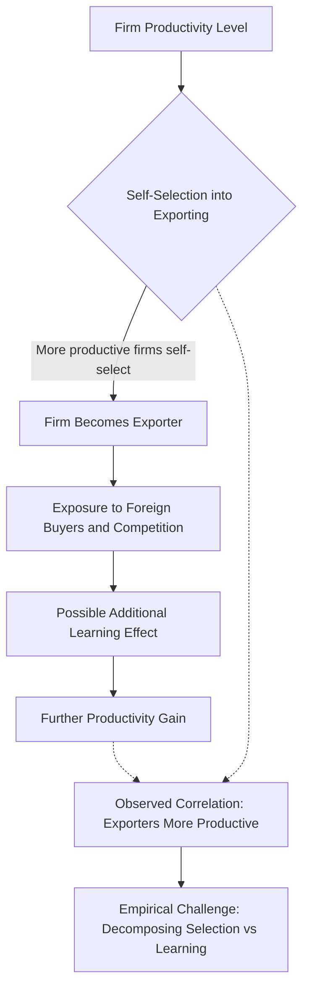

## Trade and the Diffusion of Technology

### Overview

International trade serves as a principal channel through which technology and productivity-enhancing knowledge spread across borders. Because most of the world's R&D activity is concentrated in a relatively small number of advanced economies, the mechanisms by which non-innovating (or less-innovating) countries access frontier technology are central to understanding global productivity convergence and divergence. Trade-mediated technology diffusion operates through several distinct, empirically separable channels: embodied transfer through imported goods, disembodied knowledge spillovers, foreign direct investment linkages, and learning effects from export market participation.

**Key Points**

- A foundational distinction in this literature is between **embodied** technology (transferred physically via traded capital goods and intermediate inputs) and **disembodied** technology (transferred as knowledge, ideas, or know-how, independent of any specific physical good)
- Trade is one of several channels of international technology diffusion, alongside FDI, licensing, migration of skilled workers, and direct knowledge spillovers (e.g., academic collaboration); this reference focuses specifically on trade-linked channels
- The empirical literature on trade-technology diffusion faces similar identification challenges to the broader trade-growth literature (see related content), and findings should be read with corresponding caution regarding causal magnitude

---

### Channel 1: Embodied Technology Transfer via Capital Goods Imports

#### Mechanism

When a country imports machinery, equipment, or intermediate inputs, it is theorized to import not merely a physical good but the technological knowledge embodied in that good's design and production process. A developing economy that cannot itself design advanced semiconductor manufacturing equipment can nonetheless access frontier chip-fabrication capability by importing that equipment.

**Key Points**

- This channel does not require domestic R&D capacity to access frontier technology, making it theoretically important for developing economies with limited innovation infrastructure
- The technological benefit is bounded by the country's absorptive capacity — the ability of domestic firms and workers to effectively operate, maintain, and adapt imported capital equipment

#### The Coe-Helpman (1995) Framework

A foundational formalization models a country's total factor productivity as a function of both its own domestic R&D stock and a **trade-weighted foreign R&D stock**, where the weights reflect the country's import shares from R&D-intensive trading partners:

$$\ln TFP_i = \alpha \ln S_i^d + \beta \ln S_i^f$$

Where $S_i^d$ is domestic R&D capital stock and $S_i^f$ is the foreign R&D capital stock, weighted by bilateral import shares — formalizing the idea that a country's productivity depends not only on its own innovation but on the accumulated innovation of its trading partners, transmitted through the volume and composition of imports.

**Key Points**

- Coe and Helpman (1995) found that foreign R&D spillovers, transmitted via trade, had economically significant effects on domestic total factor productivity, particularly for smaller and more trade-open economies
- **[Inference]** This finding has been influential in shaping the view that small open economies can substantially "free-ride" on the R&D investment of larger trading partners via trade linkages, though the precise magnitude of these spillover elasticities has been revisited and, in some subsequent studies, found to be smaller or less robust than the original estimates — this reflects normal econometric refinement of an influential but not unchallenged early finding

#### Extensions: Coe, Helpman, and Hoffmaister (1997) and Later Work

Subsequent extensions incorporated developing-country samples and refined the weighting methodology (e.g., incorporating FDI-based weights alongside import-based weights), generally reaffirming that trade-linked access to foreign R&D capital correlates with productivity, though with variation in estimated magnitudes across specifications and country samples.

---

### Channel 2: Intermediate Input Trade and Quality Upgrading

#### Mechanism

Beyond capital goods, imported **intermediate inputs** (components, materials, specialized parts) can raise the productivity and quality of downstream domestic production. Access to a wider variety and higher quality of intermediate inputs allows domestic firms to produce more efficiently or to produce higher-quality final goods than would be possible relying solely on domestic input suppliers.

**Example**

A domestic electronics assembler gains access, through trade liberalization, to imported precision components previously unavailable domestically or available only at lower quality from domestic suppliers. This can raise the assembler's output quality and, per Melitz-type reallocation logic, its competitiveness in export markets — illustrating how intermediate input trade and export-market participation can be mutually reinforcing.

**Key Points**

- This channel is closely studied using firm-level customs and production data linking imported input use to measured firm productivity or output quality
- **[Inference]** Studies in this vein (e.g., work following Amiti and Konings' methodology on Indonesian manufacturing, and analogous studies in other developing-country contexts) generally find statistically significant productivity gains associated with new imported input varieties, though the exact estimated elasticity varies by country, industry, and time period studied, and should not be treated as a single universal parameter

---

### Channel 3: Learning-by-Exporting

#### Mechanism

Participation in export markets is theorized to generate technology and productivity spillovers to exporting firms through:

- Exposure to more demanding foreign buyers, who may transmit technical specifications, quality standards, and process requirements
- Competitive pressure in foreign markets, inducing upgrading to remain competitive
- Direct technical assistance from foreign buyers or supply-chain partners, particularly in **buyer-driven global value chains** (e.g., apparel, electronics assembly)

**Key Points**

- The learning-by-exporting hypothesis has faced a persistent identification challenge: **firm self-selection**. More productive firms are more likely to become exporters in the first place (a well-established empirical regularity, consistent with Melitz-type models), which can generate a spurious correlation between exporting and productivity even absent any causal learning effect
- **[Inference]** The empirical literature attempting to separate self-selection from genuine learning-by-exporting effects has produced mixed findings: some studies using matching estimators or natural experiments (e.g., unexpected exchange rate shocks inducing new exporting) find modest genuine learning effects after controlling for self-selection, while others find the self-selection effect dominates and residual learning effects are small or statistically insignificant — this remains an active and only partially resolved empirical question, and blanket claims in either direction should be treated with caution

---

### Channel 4: FDI-Linked Technology Transfer and Spillovers

While FDI is a distinct capital flow from trade, the two are frequently intertwined (multinational firms establishing subsidiaries partly to serve export markets, or to source inputs for global value chains), making trade-FDI technology linkages an important joint channel.

#### Sub-Mechanisms

- **Vertical spillovers**: Multinational subsidiaries transfer technology and quality standards to local input suppliers (backward linkages) or to local distributors/customers (forward linkages)
- **Horizontal spillovers**: Local firms in the same industry as multinational subsidiaries absorb knowledge through labor mobility (workers trained at multinationals moving to local firms) or demonstration/imitation effects
- **Global value chain (GVC) participation**: Integration into multinational-coordinated production networks can provide access to standardized processes, quality certification requirements, and technical assistance from lead firms

**Key Points**

- **[Inference]** Empirical evidence for horizontal spillovers (local competitors in the same industry benefiting from nearby multinational presence) is notably weaker and more mixed than evidence for vertical spillovers (local suppliers benefiting from multinational customers), a pattern that has recurred across multiple country studies — plausibly because multinationals have stronger incentives to prevent direct competitors from accessing proprietary knowledge, while sharing technical standards with suppliers serves their own interest in reliable input quality; this explanation is a reasonable interpretation offered in the literature but is not the only one proposed

---

### Absorptive Capacity: A Key Moderating Factor

Across all channels above, a recurring finding is that the productivity benefit of trade-linked technology exposure depends heavily on the recipient country or firm's **absorptive capacity** — its existing human capital, complementary infrastructure, and institutional environment.

**Key Points**

- Countries or firms with higher levels of education, existing technical capability, and complementary infrastructure tend to extract larger productivity gains from a given volume of technology-embodying trade or FDI exposure
- This helps explain observed heterogeneity in outcomes: similar trade liberalization episodes have produced different technology-diffusion outcomes across countries, plausibly (though not exclusively) reflecting differences in pre-existing absorptive capacity
- **[Inference]** The absorptive capacity concept is well established conceptually in this literature, but it is difficult to measure directly and is often proxied imperfectly (e.g., using average years of schooling or pre-existing R&D intensity), meaning empirical tests of absorptive-capacity-conditioned spillover effects carry meaningful measurement-related caveats

---

### Diffusion Channels Overview (svg_diagram)

<svg xmlns="http://www.w3.org/2000/svg" viewBox="0 0 820 460">
\<style\>
.title { font: bold 16px sans-serif; fill: #1a1a1a; }
.box-label { font: bold 13px sans-serif; fill: #1a1a1a; }
.sub-label { font: 11px sans-serif; fill: #333333; }
.box { fill: #eafbf0; stroke: #2a7a4f; stroke-width: 1.5; }
.center-box { fill: #d3f5e0; stroke: #1c5c39; stroke-width: 2.5; }
.arrow { stroke: #555555; stroke-width: 1.5; fill: none; marker-end: url(#arrowhead7); }
\</style\>
<text x="410" y="26" text-anchor="middle" class="title">Trade-Linked Technology Diffusion Channels (svg_diagram)</text>
<rect x="310" y="45" width="200" height="55" rx="8" class="center-box" />
<text x="410" y="68" text-anchor="middle" class="box-label">Frontier Technology</text>
<text x="410" y="85" text-anchor="middle" class="sub-label">Concentrated in advanced economies</text>
<rect x="40" y="160" width="180" height="80" rx="8" class="box" />
<text x="130" y="188" text-anchor="middle" class="box-label">Embodied Transfer</text>
<text x="130" y="206" text-anchor="middle" class="sub-label">Capital goods imports</text>
<text x="130" y="222" text-anchor="middle" class="sub-label">Coe-Helpman R&amp;D spillovers</text>
<rect x="240" y="160" width="180" height="80" rx="8" class="box" />
<text x="330" y="188" text-anchor="middle" class="box-label">Intermediate Inputs</text>
<text x="330" y="206" text-anchor="middle" class="sub-label">Component quality upgrading</text>
<text x="330" y="222" text-anchor="middle" class="sub-label">New imported varieties</text>
<rect x="440" y="160" width="180" height="80" rx="8" class="box" />
<text x="530" y="188" text-anchor="middle" class="box-label">Learning-by-Exporting</text>
<text x="530" y="206" text-anchor="middle" class="sub-label">Buyer standards, competition</text>
<text x="530" y="222" text-anchor="middle" class="sub-label">Confounded by self-selection</text>
<rect x="640" y="160" width="150" height="80" rx="8" class="box" />
<text x="715" y="188" text-anchor="middle" class="box-label">FDI/GVC Linkages</text>
<text x="715" y="206" text-anchor="middle" class="sub-label">Vertical &gt; horizontal</text>
<text x="715" y="222" text-anchor="middle" class="sub-label">spillover evidence</text>
<rect x="200" y="330" width="420" height="80" rx="8" class="center-box" />
<text x="410" y="358" text-anchor="middle" class="box-label">Absorptive Capacity (Moderator)</text>
<text x="410" y="378" text-anchor="middle" class="sub-label">Human capital, infrastructure, institutions</text>
<text x="410" y="394" text-anchor="middle" class="sub-label">determine realized productivity gain per unit of exposure</text>
<path d="M 380 100 L 150 160" class="arrow" />
<path d="M 400 100 L 350 160" class="arrow" />
<path d="M 420 100 L 540 160" class="arrow" />
<path d="M 450 100 L 710 160" class="arrow" />
<path d="M 150 240 L 320 330" class="arrow" />
<path d="M 500 240 L 460 330" class="arrow" />
</svg>

---

### Policy Implications

**Key Points**

- Because embodied technology transfer requires no domestic R&D capacity, trade and capital-goods import liberalization can serve as an accessible technology-access strategy even for low-innovation-capacity economies
- Because absorptive capacity conditions realized gains, complementary investments in education, technical training, and institutional quality are frequently identified in the literature as necessary complements to trade openness, rather than substitutes for it
- Policy debates around industrial policy (e.g., local-content requirements, technology transfer mandates attached to FDI approval) partly reflect disagreement about whether trade/FDI-linked spillovers occur automatically or require deliberate policy engineering to capture — a debate connected to, but distinct from, the pure empirical spillover-magnitude question addressed above
- **[Inference]** The appropriate balance between market-based technology diffusion (via unrestricted trade and FDI) versus more interventionist industrial policy approaches (e.g., mandated joint ventures, local content rules) to accelerate technology transfer is a genuinely contested policy question, with reasonable disagreement among economists regarding both the empirical magnitude of spillovers under each approach and the potential costs (efficiency losses, rent-seeking) of interventionist alternatives

---

### Conclusion

Trade functions as a multi-channel conduit for international technology diffusion: embodied transfer through capital goods and intermediate inputs allows countries to access frontier technology without requiring domestic R&D capacity, while learning-by-exporting and FDI/global-value-chain linkages provide additional, though more empirically contested, pathways for productivity-enhancing knowledge transfer. The realized magnitude of these gains is consistently found to depend on a country's absorptive capacity — its human capital and institutional environment — meaning trade openness alone is generally regarded in this literature as a necessary but not sufficient condition for maximizing technology-driven productivity gains. Key open empirical questions include the relative magnitude of foreign R&D spillovers (Coe-Helpman-style estimates have been revised over time), the extent to which learning-by-exporting effects are genuine versus an artifact of firm self-selection, and the relative strength of vertical versus horizontal FDI spillovers.

---

**Related Topics**

- The Coe-Helpman framework and international R&D spillovers
- Melitz-model firm self-selection into export markets
- Global value chains and buyer-driven technology transfer
- Absorptive capacity and human capital as complements to trade policy
- FDI spillovers: vertical versus horizontal linkages
- Industrial policy debates: local content requirements and technology transfer mandates
- Total factor productivity measurement and cross-country comparison
- Intermediate input trade and firm-level productivity (Amiti-Konings-style studies)