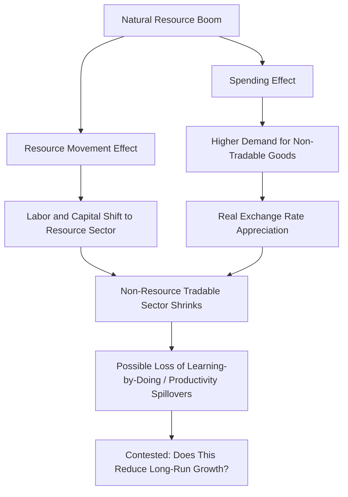

## The Natural Resource Curse and Commodity Dependence

### Overview

The "resource curse" (also called the "paradox of plenty") refers to the empirical and theoretical puzzle whereby countries richly endowed with natural resources — oil, minerals, gas — often exhibit slower long-run economic growth, weaker institutional development, and greater macroeconomic volatility than resource-poor counterparts, contrary to the naive expectation that resource wealth should straightforwardly benefit an economy. This is a distinct but related phenomenon from "commodity dependence" more broadly, which refers to structural over-reliance on a narrow set of primary commodity exports, whether or not those commodities are strictly categorized as "natural resources" in the point-source extractive sense.

**Key Points**

- The resource curse is best understood as a family of related but analytically distinct mechanisms (Dutch disease, volatility effects, institutional/political-economy effects, rent-seeking) rather than a single unified phenomenon
- The empirical existence, magnitude, and universality of the "curse" is genuinely contested in the literature; it is not a settled, undisputed empirical regularity, and important exceptions exist (Norway, Botswana, Chile)
- This reference distinguishes the theoretical mechanisms (reasonably well understood) from the empirical debate over whether, and under what conditions, they dominate

---

### Channel 1: Dutch Disease

#### Origin of the Term

The term originates from the Netherlands' experience following the discovery of large natural gas reserves in the 1960s, after which the Dutch manufacturing sector reportedly experienced a notable decline, attributed to the macroeconomic effects of the resource boom.

#### Mechanism

A resource boom (whether from new discovery or a price surge) triggers a large inflow of foreign currency, causing the real exchange rate to appreciate. This has two related effects, formalized in the classic **Corden and Neary (1982)** model, which divides the economy into three sectors: the booming (resource) sector, the lagging tradable (typically manufacturing) sector, and the non-tradable (services) sector.

1. **Resource movement effect**: The booming resource sector draws labor and capital away from the lagging tradable sector
2. **Spending effect**: Higher national income from resource revenues raises demand for non-tradable goods (services, construction), bidding up their relative price and causing real exchange rate appreciation, which further erodes the competitiveness of the non-resource tradable (manufacturing/agriculture) sector

$$\text{Real Exchange Rate} = \frac{P_{\text{non-tradable}}}{P_{\text{tradable}}}$$

A resource boom raises $P_{\text{non-tradable}}$ relative to $P_{\text{tradable}}$, appreciating the real exchange rate and making non-resource exports less competitive internationally.

**Key Points**

- Dutch disease is a well-established theoretical mechanism with a clear, internally consistent model (Corden-Neary), and is broadly accepted as *a* real phenomenon
- The contested question is not whether Dutch disease can occur, but how large and how *persistently damaging* its effects are for long-run growth — since if the non-resource tradable sector is not a uniquely important source of long-run productivity growth (e.g., via learning-by-doing or technology spillovers concentrated in manufacturing), some economists argue temporary de-industrialization during a resource boom need not be growth-damaging in itself
- **[Inference]** Whether the lagging tradable sector (often assumed to be manufacturing) is genuinely special as a source of dynamic productivity growth — an assumption underlying much of the concern about Dutch disease — is itself a debated proposition in development economics, connected to broader debates about industrial policy and structural transformation

---

### Channel 2: Price Volatility

#### Mechanism

Commodity prices, particularly for oil and metals, exhibit substantially higher volatility than prices of manufactured goods, driven by inelastic short-run supply and demand combined with periodic large demand or geopolitical supply shocks. Commodity-dependent economies are therefore exposed to:

- **Terms-of-trade volatility**: Sharp swings in export revenue unrelated to domestic policy or productivity
- **Fiscal revenue volatility**: For economies where resource revenues constitute a large share of government income, this translates directly into public spending volatility
- **Procyclical fiscal policy risk**: Governments often increase spending during price booms (sometimes on politically popular but economically unproductive projects) and are forced into painful contractions during price busts, amplifying rather than smoothing the business cycle

**Key Points**

- This volatility channel is empirically well documented: commodity-dependent economies do exhibit measurably higher output and fiscal volatility than diversified economies, a comparatively less contested empirical finding than the growth-level resource curse claim itself
- **[Inference]** The economic costs of volatility itself (as distinct from the average growth-rate effect) are theoretically expected to be significant under standard macroeconomic assumptions (risk aversion, investment irreversibility, credit constraints amplifying boom-bust cycles), though precisely quantifying the growth cost of volatility, separate from other resource-curse channels, involves additional identification challenges

---

### Channel 3: Institutional and Political Economy Effects

This channel is where much of the more recent and more contested resource curse literature is concentrated, extending beyond narrow macroeconomic mechanisms to political economy.

#### Rent-Seeking and Corruption

Point-source natural resources (oil, minerals — geographically concentrated and controllable by a small group) are theorized to be particularly susceptible to rent-seeking, in contrast to diffuse resources (agricultural land, worked by dispersed smallholders) that are harder for elites to capture.

**Key Points**

- **Auty (1993)**, who coined the term "resource curse," and subsequent work by **Sachs and Warner** and others found statistical associations between resource abundance/dependence and both slower growth and, in the political economy strand, weaker institutional quality (measured via corruption indices, rule-of-law measures)
- **[Inference]** A commonly cited distinction (associated with work by Isham, Woolcock, Pritchett, and Busby, among others) separates "point-source" resources (oil, minerals, plantation crops) — theorized to be more prone to elite capture and weaker accountability — from "diffuse" resources (smallholder agriculture) — theorized to be less prone to this dynamic; this distinction is influential but not universally accepted as the definitive explanatory variable, and other researchers emphasize alternative moderating factors

#### The "Voracity Effect" and Weak Institutional Constraints

Some theoretical models (e.g., **Tornell and Lane, 1999**) formalize a "voracity effect," whereby resource windfalls, in the presence of weak institutional constraints and multiple competing interest groups each seeking a share of rents, can lead to *more than proportional* increases in wasteful redistributive spending relative to the windfall itself — a counterintuitive theoretical result illustrating how weak institutions can turn a positive income shock into a net welfare loss.

#### Rentier State Effects and Political Accountability

A related political-science and political-economy literature (associated with work such as Ross's studies on oil and democracy) explores whether resource rents undermine political accountability, since governments funded primarily by resource revenue (rather than broad-based taxation) may face weaker pressure for representative, accountable governance — a version of the "no taxation without representation" logic in reverse.

**[Inference]** This "rentier state" hypothesis is influential in political economy but remains actively debated, both regarding its empirical robustness across different country samples and time periods, and regarding causal direction (whether weak pre-existing institutions attract resource-curse dynamics, or resource wealth itself degrades institutions).

---

### Channel 4: Crowding Out of Human Capital and Diversification Investment

Some models and empirical studies suggest resource-rich economies may underinvest in education and economic diversification relative to what would be optimal, since resource rents can substitute for the perceived need to develop alternative productive sectors, and short-term political incentives may favor resource-revenue distribution over long-term investment.

**[Unverified]** The empirical robustness of this specific "underinvestment in human capital" channel, separate from the broader institutional and Dutch disease channels already discussed, is less extensively documented in the literature than the other channels described above and should be treated as a secondary, more tentative hypothesis pending further evidence.

---

### Counter-Examples and the "Curse" as Conditional, Not Deterministic

A crucial element of contemporary treatment of this topic is that several resource-rich economies have **avoided** the negative outcomes associated with the "curse," suggesting the phenomenon is conditional on institutional and policy factors rather than a deterministic outcome of resource abundance itself.

| Country | Resource | Outcome | Commonly Cited Explanatory Factors |
| --- | --- | --- | --- |
| **Norway** | Oil and gas | Sustained high growth, strong institutions, large sovereign wealth fund | Strong pre-existing institutions before oil discovery; disciplined fiscal rules; the Government Pension Fund Global sovereign wealth fund insulating the domestic economy from revenue volatility |
| **Botswana** | Diamonds | Sustained rapid growth since independence, among Africa's strongest institutional-quality records | Strong property rights and relatively inclusive political institutions predating major diamond exploitation; prudent fiscal management |
| **Chile** | Copper | Sustained growth, structural fiscal rule limiting procyclical spending | Structural fiscal balance rule explicitly designed to smooth copper-price volatility; independent central bank |
| **Nigeria** (contrast case) | Oil | Persistent institutional weakness, limited diversification, high inequality despite substantial oil revenue | Frequently cited (in the literature) as illustrating rent-seeking, weak pre-existing institutions, and volatility-driven fiscal mismanagement |

**Key Points**

- **[Inference]** The comparison between Norway/Botswana/Chile and less successful resource-dependent economies is widely interpreted in the literature as evidence that institutional quality *prior to* major resource exploitation is a critical moderating variable determining whether resource wealth becomes a blessing or a curse — though this is an interpretation of comparative case evidence rather than a definitively proven causal claim, since these cases differ along many dimensions beyond institutions alone
- Norway's sovereign wealth fund model (the Government Pension Fund Global) is frequently cited as a specific policy mechanism for managing resource revenue: it invests oil revenues abroad rather than spending them domestically, both smoothing volatility and mitigating Dutch disease pressure on the real exchange rate

---

### Sovereign Wealth Funds and Fiscal Rules as Policy Responses

**Key Points**

- **Sovereign wealth funds (SWFs)**: Save a portion of resource revenue, often investing abroad, to (a) smooth government spending against price volatility, (b) mitigate real exchange rate appreciation pressure by keeping revenue out of the domestic economy, and (c) provide a savings buffer for post-resource-depletion periods
- **Fiscal rules** (e.g., structural balance rules, as used in Chile): Constrain government spending to a sustainable level calculated using a long-run estimate of the "permanent" resource price, rather than the current (potentially temporarily elevated or depressed) spot price, explicitly designed to counter procyclical fiscal tendencies
- **Revenue transparency initiatives**: Frameworks such as the Extractive Industries Transparency Initiative (EITI) aim to reduce rent-seeking and corruption risk by mandating disclosure of resource revenue flows

**[Unverified]** The empirical effectiveness of these policy tools varies substantially by country implementation quality and political commitment; general claims about their universal effectiveness should be checked against country-specific evaluations, as successful adoption on paper does not guarantee effective enforcement in practice.

---

### Resource Curse Mechanisms Overview (svg_diagram)

<svg xmlns="http://www.w3.org/2000/svg" viewBox="0 0 820 480">
\<style\>
.title { font: bold 16px sans-serif; fill: #1a1a1a; }
.box-label { font: bold 13px sans-serif; fill: #1a1a1a; }
.sub-label { font: 11px sans-serif; fill: #333333; }
.box { fill: #fdece9; stroke: #a3341f; stroke-width: 1.5; }
.center-box { fill: #f9dfb8; stroke: #7a3d0e; stroke-width: 2.5; }
.mitigant-box { fill: #eafbf0; stroke: #2a7a4f; stroke-width: 1.5; }
.arrow { stroke: #555555; stroke-width: 1.5; fill: none; marker-end: url(#arrowhead8); }
\</style\>
<text x="410" y="26" text-anchor="middle" class="title">Resource Curse Channels and Mitigants (svg_diagram)</text>
<rect x="310" y="45" width="200" height="55" rx="8" class="center-box" />
<text x="410" y="68" text-anchor="middle" class="box-label">Natural Resource Windfall</text>
<text x="410" y="85" text-anchor="middle" class="sub-label">Discovery or price boom</text>
<rect x="30" y="150" width="180" height="75" rx="8" class="box" />
<text x="120" y="176" text-anchor="middle" class="box-label">Dutch Disease</text>
<text x="120" y="194" text-anchor="middle" class="sub-label">Real exchange rate</text>
<text x="120" y="208" text-anchor="middle" class="sub-label">appreciation</text>
<rect x="230" y="150" width="180" height="75" rx="8" class="box" />
<text x="320" y="176" text-anchor="middle" class="box-label">Price Volatility</text>
<text x="320" y="194" text-anchor="middle" class="sub-label">Fiscal and output</text>
<text x="320" y="208" text-anchor="middle" class="sub-label">instability</text>
<rect x="430" y="150" width="180" height="75" rx="8" class="box" />
<text x="520" y="176" text-anchor="middle" class="box-label">Institutional Effects</text>
<text x="520" y="194" text-anchor="middle" class="sub-label">Rent-seeking, weakened</text>
<text x="520" y="208" text-anchor="middle" class="sub-label">accountability</text>
<rect x="630" y="150" width="160" height="75" rx="8" class="box" />
<text x="710" y="176" text-anchor="middle" class="box-label">Crowding Out</text>
<text x="710" y="194" text-anchor="middle" class="sub-label">Underinvestment in</text>
<text x="710" y="208" text-anchor="middle" class="sub-label">education/diversification</text>
<rect x="150" y="300" width="520" height="60" rx="8" class="box" />
<text x="410" y="335" text-anchor="middle" class="box-label">Potential Outcome: Slower Growth, Weak Institutions, Volatility</text>
<rect x="150" y="400" width="520" height="60" rx="8" class="mitigant-box" />
<text x="410" y="425" text-anchor="middle" class="box-label">Mitigants: Sovereign Wealth Funds, Fiscal Rules,</text>
<text x="410" y="443" text-anchor="middle" class="sub-label">Revenue Transparency, Strong Pre-Existing Institutions</text>
<path d="M 370 100 L 130 150" class="arrow" />
<path d="M 390 100 L 330 150" class="arrow" />
<path d="M 430 100 L 530 150" class="arrow" />
<path d="M 450 100 L 700 150" class="arrow" />
<path d="M 120 225 L 300 300" class="arrow" />
<path d="M 320 225 L 380 300" class="arrow" />
<path d="M 520 225 L 440 300" class="arrow" />
<path d="M 710 225 L 500 300" class="arrow" />
<path d="M 410 360 L 410 400" class="arrow" />
</svg>

---

### Conclusion

The natural resource curse describes a family of theoretically distinct mechanisms — Dutch disease exchange-rate effects, commodity price volatility, rent-seeking and institutional degradation, and human-capital crowding-out — through which resource abundance can, under certain conditions, translate into weaker rather than stronger long-run economic performance. Each mechanism has a reasonably well-established theoretical basis, with Dutch disease and volatility effects commanding relatively broader empirical consensus than the more contested institutional and political-economy channels. Crucially, the curse is not deterministic: Norway, Botswana, and Chile demonstrate that strong pre-existing institutions, disciplined fiscal management (sovereign wealth funds, structural fiscal rules), and revenue transparency can allow resource-rich economies to avoid the negative outcomes associated with commodity dependence. This conditionality is central to how the phenomenon is currently understood in the literature: resource wealth is now generally treated as a factor whose ultimate effect on growth and development depends substantially on the quality of the institutional and policy environment in which it is managed, rather than as an inherently and unavoidably negative endowment.

---

**Related Topics**

- The Corden-Neary Dutch disease model in detail
- Sovereign wealth fund design: Norway's Government Pension Fund Global as a case study
- Structural fiscal rules and commodity price smoothing (Chile's copper rule)
- Point-source versus diffuse resources and institutional capture
- The rentier state hypothesis and political accountability
- The Extractive Industries Transparency Initiative (EITI)
- Terms-of-trade volatility and macroeconomic stabilization policy
- Structural transformation and economic diversification strategies for commodity exporters