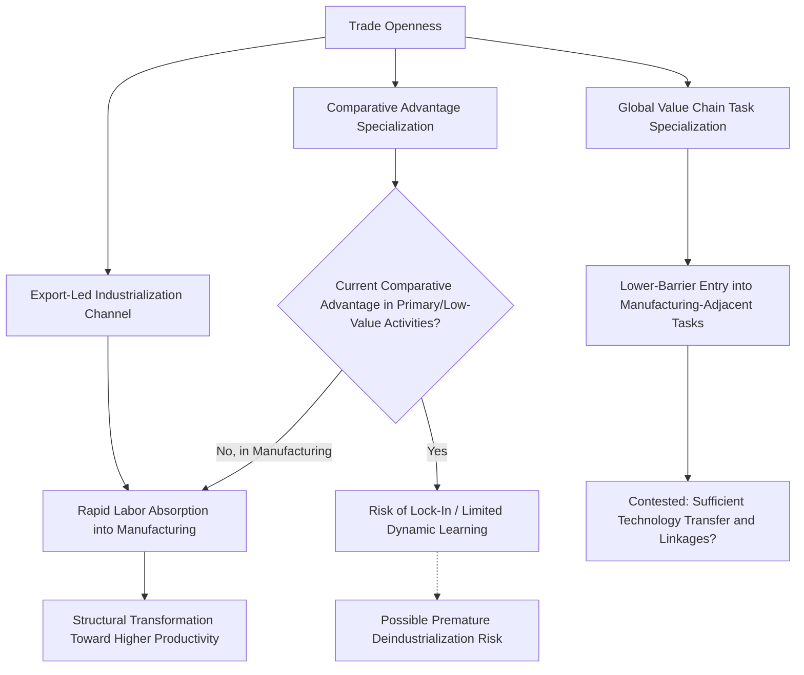

## Trade and Structural Transformation

### Overview

Structural transformation refers to the process by which an economy's composition of output and employment shifts over the course of development — typically characterized by a declining share of agriculture, a rising and eventually declining share of industry (manufacturing), and a rising share of services. International trade interacts with this process in complex ways: it can accelerate structural transformation by opening access to larger markets and specialized production, but it can also redirect the *direction* of transformation depending on a country's comparative advantage, sometimes reinforcing rather than resolving structural constraints on long-run development.

**Key Points**

- Structural transformation is a well-documented empirical regularity across development experiences (often associated with the work of Kuznets, Chenery, and later Lewis-style dual-economy frameworks), though the precise pattern varies across countries and time periods
- Trade's role in this process is theoretically double-edged: it can be a powerful accelerant of transformation toward higher-productivity sectors, or it can lock a country into specialization patterns based on current comparative advantage that may not align with the sectors most associated with dynamic productivity growth
- This is an area of genuine and active debate in development economics, particularly regarding the phenomenon of "premature deindustrialization"

---

### The Classical Pattern of Structural Transformation

#### Sectoral Shares Over Development

The stylized historical pattern, observed across many (though not all) successfully developing economies, involves:

1. **Early stage**: Large agricultural employment share, low productivity, subsistence-oriented
2. **Middle stage**: Labor and capital shift toward manufacturing, urbanization accelerates, productivity rises sharply as workers move from low-productivity agriculture to higher-productivity industrial employment
3. **Later stage**: Manufacturing's employment (and often output) share peaks and then declines as the services sector's share rises, reflecting both rising demand for services as income grows (income-elasticity effects) and relatively faster productivity growth in manufacturing than in labor-intensive services (a "cost disease" effect associated with Baumol)

$$\text{Aggregate Productivity Growth} = \sum_i \left( \Delta \omega_i \cdot \bar{p}_i \right) + \sum_i \left( \omega_i \cdot \Delta p_i \right)$$

This decomposition (a standard shift-share formulation) separates the **structural change component** (the first term — productivity gains from labor reallocation, $\omega_i$ being sector employment shares, $\bar{p}_i$ sector productivity levels) from the **within-sector productivity growth component** (the second term).

**Key Points**

- Historically, the structural change (reallocation) component has been a major source of aggregate productivity growth during early-to-middle development stages, particularly the shift of labor from low-productivity agriculture to higher-productivity manufacturing
- **[Inference]** The relative importance of structural-change versus within-sector productivity growth varies substantially across countries and periods; East Asian "growth miracle" economies are frequently cited as cases where structural change contributed unusually large shares of aggregate productivity growth during their rapid industrialization phases, though precise decomposition estimates vary by study and methodology

---

### How Trade Interacts with Structural Transformation

#### Channel 1: Trade as an Accelerant via Export-Led Industrialization

The **East Asian development model** (Japan, South Korea, Taiwan, and later China) is the most frequently cited historical example of trade-driven structural transformation: export orientation toward labor-intensive manufacturing allowed these economies to absorb surplus agricultural labor into higher-productivity manufacturing employment far faster than domestic-market size alone would have permitted.

**Key Points**

- Access to global markets relaxed the domestic demand constraint that would otherwise limit how much labor could be profitably absorbed into manufacturing (a classic Lewis-model dual-economy consideration: without export markets, rapid manufacturing employment growth risks outstripping domestic demand)
- This channel is closely connected to the market-size and scale-economy growth channels discussed in trade-growth theory more broadly (see related content on theoretical trade-growth channels)
- **[Inference]** The precise replicability of the East Asian export-led manufacturing model for other developing regions today is a genuinely debated question, particularly given changes in global manufacturing technology (increasing automation reducing the labor-intensity advantage that originally drove this model) and the already-established competitive position of incumbent manufacturing exporters — this is an active policy and academic debate rather than a settled question

#### Channel 2: Comparative Advantage Lock-In

A structuralist critique (with intellectual roots in Prebisch-Singer-style thinking, discussed more fully in related content on international economic development debates) holds that if a country's static comparative advantage lies in primary commodities or low-value-added activities, unrestricted trade specialization according to *current* comparative advantage may not generate the same dynamic learning and productivity-growth benefits associated with manufacturing-based transformation.

**Key Points**

- This is the theoretical basis for historical infant-industry protection arguments: temporary protection to allow domestic manufacturing to develop before being exposed to full international competition, on the premise that manufacturing has special dynamic (learning-by-doing, spillover) properties not captured by static comparative advantage calculations
- **[Inference]** The empirical track record of infant-industry protection is genuinely mixed: some historical cases (again, East Asian economies, which combined selective protection with export discipline) are cited as successes, while many historical import-substitution industrialization (ISI) episodes in Latin America and elsewhere are more commonly cited as having produced inefficient, uncompetitive domestic industries that failed to "graduate" from protection — the difference between these outcomes is a subject of extensive debate regarding what policy design features (export discipline, time limits, competition policy) distinguish successful from unsuccessful industrial policy interventions

#### Channel 3: Global Value Chains and Task-Based Specialization

Contemporary structural transformation increasingly occurs through participation in **global value chains (GVCs)** rather than through building complete, vertically integrated domestic industries. Countries can specialize in specific tasks or stages of production (assembly, component manufacturing, design) rather than entire product value chains.

**Key Points**

- This "unbundling" of production (a term associated with Richard Baldwin's work on the "second unbundling" of globalization) has allowed some countries to enter manufacturing-adjacent activities (assembly, light manufacturing) with lower technological and capital barriers than historically required to build complete manufacturing industries
- **[Inference]** Whether GVC-based "task trading" provides the same dynamic learning and structural-transformation benefits as earlier, more vertically integrated manufacturing development strategies is a matter of ongoing research; some scholars argue GVC participation offers a viable, lower-barrier entry point into industrialization for late-developing economies, while others express concern that GVC specialization in low-value-added tasks (e.g., final assembly) may generate less technology transfer and fewer backward linkages than earlier development models — this remains a genuinely unresolved empirical and policy question

---

### Premature Deindustrialization: A Central Contemporary Debate

#### The Rodrik (2016) Thesis

Dani Rodrik's influential work on "premature deindustrialization" observes that many developing economies today are experiencing peak manufacturing employment shares at substantially lower income levels, and at lower peak manufacturing shares, than today's advanced economies did during their own historical industrialization.

**Key Points**

- Rodrik's proposed explanations include: (a) trade-driven competition from established, more efficient manufacturing exporters (particularly China) making it harder for new entrants to gain manufacturing market share, and (b) capital-biased technological change in manufacturing reducing the sector's capacity to absorb labor even where output grows
- If manufacturing carries special dynamic productivity-growth properties (per the structuralist view above), premature deindustrialization raises concerns that some developing economies may be transitioning directly from agriculture toward low-productivity informal services, skipping the historically productivity-enhancing manufacturing stage — a pattern sometimes informally termed "growth without structural transformation" or, in some regional discussions, applied to concerns about Sub-Saharan Africa's development trajectory
- **[Inference]** This thesis has attracted substantial scholarly attention and is influential, but it is not universally accepted as the definitive characterization of current developing-economy trajectories; some researchers emphasize that services-led growth can also generate productivity gains under certain conditions (e.g., tradable business services, digital services exports), suggesting the manufacturing-centric framing of "successful" structural transformation may itself require updating — this is an active and unresolved debate rather than settled consensus

#### Services-Led Structural Transformation as an Alternative Pathway

An emerging counter-perspective examines whether tradable, skill-intensive services (business process outsourcing, IT services, and more recently digitally-delivered services) can serve as an alternative structural-transformation pathway, with India's IT/BPO sector frequently cited as an illustrative example.

**[Unverified]** Whether services-led transformation can generate the same scale of aggregate employment absorption and productivity convergence historically associated with manufacturing-led transformation remains an open empirical question, given that skill-intensive tradable services typically employ a smaller share of the workforce than labor-intensive manufacturing did in earlier development episodes; current evidence on this question should be treated as provisional given the relative novelty of large-scale services-led development experiences.

---

### Structural Transformation Pathways Diagram (svg_diagram)

<svg xmlns="http://www.w3.org/2000/svg" viewBox="0 0 820 460">
\<style\>
.title { font: bold 16px sans-serif; fill: #1a1a1a; }
.box-label { font: bold 13px sans-serif; fill: #1a1a1a; }
.sub-label { font: 11px sans-serif; fill: #333333; }
.box { fill: #eaf2fb; stroke: #2b5f8a; stroke-width: 1.5; }
.center-box { fill: #dbeeff; stroke: #1a4f7a; stroke-width: 2.5; }
.risk-box { fill: #fdece9; stroke: #a3341f; stroke-width: 1.5; }
.arrow { stroke: #555555; stroke-width: 1.5; fill: none; marker-end: url(#arrowhead9); }
\</style\>
<text x="410" y="26" text-anchor="middle" class="title">Trade and Structural Transformation Pathways (svg_diagram)</text>
<rect x="60" y="55" width="220" height="60" rx="8" class="box" />
<text x="170" y="80" text-anchor="middle" class="box-label">Agriculture</text>
<text x="170" y="98" text-anchor="middle" class="sub-label">Low productivity, subsistence</text>
<rect x="310" y="55" width="220" height="60" rx="8" class="center-box" />
<text x="420" y="80" text-anchor="middle" class="box-label">Classical Path: Manufacturing</text>
<text x="420" y="98" text-anchor="middle" class="sub-label">East Asian export-led model</text>
<rect x="560" y="55" width="220" height="60" rx="8" class="box" />
<text x="670" y="80" text-anchor="middle" class="box-label">Services</text>
<text x="670" y="98" text-anchor="middle" class="sub-label">Higher-income stage, or alternative path</text>
<rect x="150" y="180" width="500" height="70" rx="8" class="risk-box" />
<text x="400" y="208" text-anchor="middle" class="box-label">Premature Deindustrialization Risk</text>
<text x="400" y="228" text-anchor="middle" class="sub-label">Peak manufacturing share reached earlier and lower than historical pattern</text>
<rect x="80" y="310" width="300" height="80" rx="8" class="box" />
<text x="230" y="336" text-anchor="middle" class="box-label">Global Value Chain Entry</text>
<text x="230" y="354" text-anchor="middle" class="sub-label">Task-based specialization</text>
<text x="230" y="370" text-anchor="middle" class="sub-label">Lower barrier, contested depth</text>
<rect x="430" y="310" width="320" height="80" rx="8" class="box" />
<text x="590" y="336" text-anchor="middle" class="box-label">Services-Led Alternative</text>
<text x="590" y="354" text-anchor="middle" class="sub-label">Tradable business/IT services</text>
<text x="590" y="370" text-anchor="middle" class="sub-label">Employment absorption scale debated</text>
<path d="M 280 85 L 310 85" class="arrow" />
<path d="M 530 85 L 560 85" class="arrow" />
<path d="M 420 115 L 400 180" class="arrow" />
<path d="M 300 250 L 250 310" class="arrow" />
<path d="M 500 250 L 560 310" class="arrow" />
</svg>

---

### Synthesis Table: Trade's Role Across Structural Transformation Views

| Perspective | Trade's Predicted Role | Key Proponents/Framework | Contested Element |
| --- | --- | --- | --- |
| Export-led industrialization | Accelerant — relaxes domestic demand constraint | East Asian development model literature | Replicability given automation, incumbent competition |
| Structuralist/infant-industry | Risk of lock-in to low-value static comparative advantage | Prebisch-Singer tradition, selective industrial policy advocates | Track record of protection: success (E. Asia) vs. failure (some ISI episodes) |
| Global value chains | Lower-barrier entry point into manufacturing-adjacent activity | Baldwin's "unbundling" framework | Sufficiency of technology transfer and backward linkages |
| Premature deindustrialization | Trade competition constrains new entrants' manufacturing absorption | Rodrik (2016) | Whether services can substitute as an equally effective pathway |

---

### Conclusion

Trade's relationship with structural transformation is genuinely bidirectional and context-dependent rather than uniformly positive or negative. Historically, trade-driven export-led manufacturing has been the most consequential accelerant of structural transformation, most vividly illustrated by East Asian development experiences that used global market access to overcome domestic demand constraints on manufacturing employment absorption. At the same time, unrestricted specialization according to static comparative advantage carries a theoretical risk of locking economies into lower-value-added activities if manufacturing possesses special dynamic learning properties not available in primary-sector or low-skill-service specialization — a concern at the heart of both historical infant-industry policy debates and the contemporary "premature deindustrialization" thesis. Global value chains and services-led development represent newer, only partially validated alternative pathways whose capacity to replicate the employment-absorption and productivity-convergence achievements of classical manufacturing-led transformation remains an open and actively researched question.

---

**Related Topics**

- The Lewis dual-economy model and labor reallocation
- Premature deindustrialization (Rodrik 2016) in depth
- Infant-industry protection: theory, historical successes, and failures
- Global value chains and Baldwin's "second unbundling" framework
- Prebisch-Singer terms-of-trade hypothesis and import-substitution industrialization
- Baumol's cost disease and services-sector productivity growth
- India's IT/BPO sector as a services-led transformation case study
- Shift-share decomposition of aggregate productivity growth