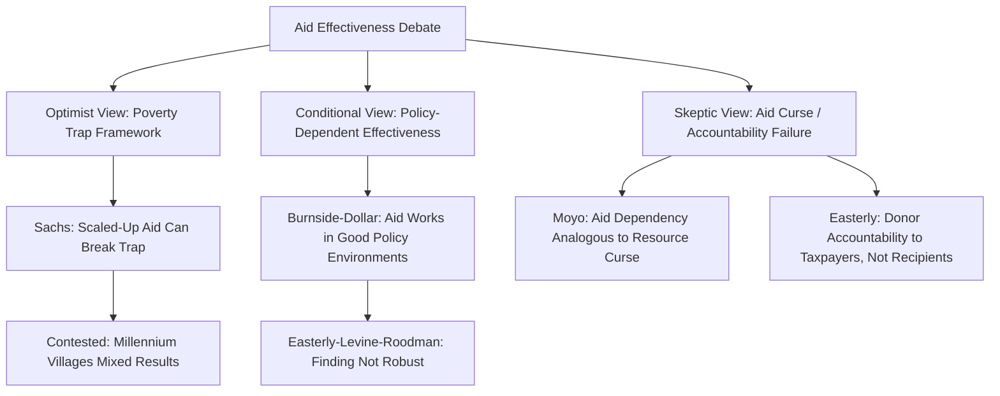

## Foreign Aid, Trade, and Development Strategy

### Overview

Foreign aid and international trade represent two distinct, and sometimes competing, external levers available to developing-country policymakers pursuing economic development. Where trade operates through market-based exchange and comparative advantage, aid operates through concessional resource transfers, often tied to policy conditionality or specific project objectives. The relationship between these two instruments — whether they are complements, substitutes, or in tension — is a central and contested question in development economics, encompassing debates over aid effectiveness, the "trade not aid" position, and the appropriate sequencing of development strategy.

**Key Points**

- Aid and trade are not mutually exclusive policy instruments; most development strategies combine both, but the *relative emphasis* and *policy design choices* around each remain genuinely debated
- The aid-effectiveness literature itself is one of the most contested empirical areas in development economics, with prominent researchers reaching markedly different conclusions using overlapping datasets
- This reference distinguishes the conceptual channels through which aid and trade are theorized to interact from the empirical debate over their relative and combined effectiveness, which remains open

---

### Foreign Aid: Types, Rationale, and Channels

#### Types of Foreign Aid

- **Bilateral Official Development Assistance (ODA)**: Government-to-government aid from a single donor country
- **Multilateral aid**: Channeled through institutions such as the World Bank (IDA concessional lending), regional development banks, and UN agencies
- **Humanitarian/emergency aid**: Disaster relief and crisis response, typically short-term and non-developmental in primary intent
- **Project aid**: Tied to specific investments (infrastructure, health facilities, schools)
- **Budget support**: General or sector-specific direct transfers to recipient government budgets, often with policy conditionality attached
- **Technical assistance**: Capacity-building, advisory services, and institutional strengthening support

#### Theoretical Rationale for Aid

**Key Points**

- The classical rationale (associated with **Harrod-Domar** and later **two-gap models**, e.g., Chenery and Strout, 1966) holds that developing countries face a **savings-investment gap** and/or a **foreign exchange gap** that domestic resources alone cannot close, and that aid fills these gaps to permit higher investment and growth than would otherwise be possible
- A complementary rationale emphasizes aid's role in financing global public goods (disease eradication, pandemic preparedness) and addressing market failures that private capital flows would not otherwise address (e.g., basic health and education investments with large positive externalities but limited private return)

$$\text{Two-Gap Model: Required Aid} \approx \max(\text{Savings Gap}, \text{Foreign Exchange Gap})$$

**[Inference]** The two-gap framework's assumption that aid straightforwardly translates into additional investment (rather than substituting for domestic savings, government consumption, or being partially diverted) has been extensively challenged in subsequent literature; this simplified model is best understood as an early conceptual framework rather than an empirically validated description of how aid actually functions in recipient economies.

---

### The Aid Effectiveness Debate

#### Early Optimism and Cross-Country Regressions

Early aid-effectiveness research (1990s) attempted to estimate aid's effect on growth using cross-country panel regressions, analogous in methodology (and subject to similar critiques) to the early trade-growth literature discussed elsewhere in this course.

- **Burnside and Dollar (2000)**: An influential and widely cited study found that aid's effect on growth was conditional on recipient countries' policy environment — aid was found to have a positive growth effect in countries with "good" fiscal, monetary, and trade policies, but little or no effect in countries with poor policy environments. This finding was influential in shaping donor emphasis on policy conditionality and selectivity in the late 1990s and 2000s (e.g., influencing the design of the US Millennium Challenge Corporation's country-selection criteria)

**Key Points — Critiques of Burnside-Dollar**

- Subsequent researchers, notably **Easterly, Levine, and Roodman (2004)**, found that the Burnside-Dollar aid-policy interaction result was **not robust** to extending the sample period or making modest changes to specification, raising serious questions about the finding's reliability
- **[Inference]** This episode is frequently cited in methodology discussions as illustrating the broader fragility problem in cross-country growth regressions (aid-growth findings proving sensitive to sample period, specification, and outlier countries), a critique structurally similar to the Rodriguez-Rodrik critique of Sachs-Warner in the trade-growth literature — this parallel is a commonly drawn methodological observation rather than a claim that the two literatures' substantive findings are identical

#### Aid Skeptics: Easterly, Moyo, and the "Aid Curse"

- **William Easterly** (*The Elusive Quest for Growth*, *The White Man's Burden*): Argued that decades of aid-financed development interventions have often failed to generate sustained growth, attributing this partly to a lack of accountability mechanisms in aid delivery (donors are accountable to their own domestic taxpayers/legislatures rather than to aid recipients) and partly to the inherent difficulty of engineering development through externally designed interventions
- **Dambisa Moyo** (*Dead Aid*, 2009): Argued more strongly that sustained aid dependency can be actively harmful, drawing an analogy to resource-curse dynamics (see related content) — aid, like resource rents, can undermine domestic accountability, fuel corruption, and reduce incentives for governments to develop effective domestic tax systems and broader economic institutions
- **[Inference]** The "aid curse" framing (aid as functionally analogous to a resource-rent windfall) is a provocative and influential argument in public discourse, but it is more contested among academic aid-effectiveness researchers than the framing sometimes suggests in popular discussion; the empirical evidence for a systematic negative aid-growth relationship is itself disputed, with some studies finding null effects rather than clearly negative ones

#### Aid Optimists and the Case for Scaled-Up Aid

- **Jeffrey Sachs** (*The End of Poverty*, and work associated with the Millennium Villages Project): Argued that many developing countries, particularly in Sub-Saharan Africa, face a genuine "poverty trap" in which insufficient capital prevents the investment needed to escape low-productivity equilibria, and that a substantial, well-targeted scaling-up of aid (particularly for health, agriculture, and infrastructure) can break this trap
- **Key counter-critique**: Easterly and others have argued the poverty-trap framing overstates the case for aid scale-up and underweights implementation and governance challenges; the Millennium Villages Project itself, evaluated in several independent studies, produced **mixed results** relative to its original ambitious targets

**[Unverified]** Specific quantitative evaluation results for the Millennium Villages Project and comparable large-scale aid interventions vary by evaluation methodology and outcome measure; readers should consult the specific published evaluations for precise findings rather than relying on generalized characterizations, as assessments have evolved across different phases of program implementation and evaluation.

---

### Micro-Level Evidence: The Randomized Controlled Trial (RCT) Turn

#### A Methodological Shift

Partly in response to the identification challenges plaguing cross-country aid-growth regressions, a substantial strand of development economics (associated with researchers such as **Esther Duflo, Abhijit Banerjee, and Michael Kremer**, whose work on this methodology was recognized with the 2019 Nobel Memorial Prize in Economic Sciences) shifted toward **randomized controlled trials** evaluating specific, narrowly defined aid-financed interventions (deworming programs, conditional cash transfers, microfinance, educational inputs) rather than aggregate cross-country aid-growth relationships.

**Key Points**

- This RCT-based literature has generated considerably more robust and specific evidence about **which types of interventions work under which conditions** than the aggregate aid-growth literature, representing a genuine methodological advance in credibility
- **[Inference]** A commonly drawn distinction in the field is that while the aggregate "does aid cause growth" question remains empirically contested and perhaps not well-posed given the heterogeneity of what "aid" encompasses, the micro-level "does this specific intervention improve this specific outcome" question has yielded more credible, actionable, and replicated findings — this represents a genuine shift in how much of the development economics field approaches aid evaluation, though aggregate macro-level questions about aid's relationship to growth have not been fully superseded or resolved by this micro-level turn

---

### The "Trade Not Aid" Position and Its Critiques

#### The Core Argument

A long-standing position, associated with various free-trade advocates and some developing-country policymakers, holds that improved market access for developing-country exports (particularly agricultural products and labor-intensive manufactures, where developed-country tariff and subsidy structures have historically been most restrictive) would generate far larger development benefits than current aid flows, framing "trade not aid" as a preferable development strategy emphasis.

**Key Points**

- Empirical estimates of the potential gains from developed-country trade liberalization (particularly agricultural subsidy reduction) for developing countries have varied substantially across studies and time periods, and such estimates are inherently sensitive to modeling assumptions (general equilibrium modeling choices, elasticity assumptions) — general claims about "the" size of these potential gains should be treated cautiously and checked against current computable general equilibrium (CGE) modeling literature for up-to-date figures
- Agricultural subsidies and tariff escalation (higher tariffs on processed goods than raw commodities) in advanced economies have long been cited by developing-country trade negotiators (notably in WTO Doha Round agricultural negotiations) as significant barriers to development-oriented export growth, a position broadly reflected in the design of WTO special and differential treatment provisions

#### The False Dichotomy Critique

**Key Points**

- A frequently made counter-argument holds that "trade versus aid" is a false dichotomy: many forms of aid (**Aid for Trade** initiatives, trade facilitation assistance, capacity-building for meeting export product standards) are specifically designed to help developing countries better exploit trade opportunities, making aid and trade complementary rather than competing instruments in this context
- **Aid for Trade**, a G20/WTO-endorsed initiative launched around 2005, specifically channels aid toward trade-related infrastructure, capacity-building, and productive capacity development, explicitly operationalizing the view that aid can be structured to enhance rather than substitute for trade-based development
- **[Inference]** The relative merit of the "trade not aid" framing versus the "aid for trade" complementarity framing depends substantially on which specific policy comparison is being made (e.g., general budget support aid versus agricultural subsidy reform, versus targeted trade-capacity aid versus the same subsidy reform) — collapsing this into a single "trade vs. aid" debate can obscure that different types of aid interact very differently with trade-based development strategies

---

### Aid, Trade, and Development Strategy Interactions (svg_diagram)

<svg xmlns="http://www.w3.org/2000/svg" viewBox="0 0 820 460">
\<style\>
.title { font: bold 16px sans-serif; fill: #1a1a1a; }
.box-label { font: bold 13px sans-serif; fill: #1a1a1a; }
.sub-label { font: 11px sans-serif; fill: #333333; }
.aid-box { fill: #f2ecfb; stroke: #5b3a8a; stroke-width: 1.5; }
.trade-box { fill: #eaf2fb; stroke: #2b5f8a; stroke-width: 1.5; }
.center-box { fill: #f9dfb8; stroke: #7a3d0e; stroke-width: 2.5; }
.arrow { stroke: #555555; stroke-width: 1.5; fill: none; marker-end: url(#arrowhead10); }
\</style\>
<text x="410" y="26" text-anchor="middle" class="title">Aid and Trade as Development Levers (svg_diagram)</text>
<rect x="60" y="55" width="280" height="70" rx="8" class="aid-box" />
<text x="200" y="82" text-anchor="middle" class="box-label">Foreign Aid</text>
<text x="200" y="100" text-anchor="middle" class="sub-label">Concessional transfers, project</text>
<text x="200" y="114" text-anchor="middle" class="sub-label">and budget support, technical assistance</text>
<rect x="480" y="55" width="280" height="70" rx="8" class="trade-box" />
<text x="620" y="82" text-anchor="middle" class="box-label">International Trade</text>
<text x="620" y="100" text-anchor="middle" class="sub-label">Market access, export growth,</text>
<text x="620" y="114" text-anchor="middle" class="sub-label">comparative advantage exploitation</text>
<rect x="290" y="180" width="240" height="60" rx="8" class="center-box" />
<text x="410" y="205" text-anchor="middle" class="box-label">Aid for Trade</text>
<text x="410" y="223" text-anchor="middle" class="sub-label">Explicit complementarity channel</text>
<rect x="60" y="300" width="330" height="90" rx="8" class="aid-box" />
<text x="225" y="326" text-anchor="middle" class="box-label">Contested Substitutability View</text>
<text x="225" y="346" text-anchor="middle" class="sub-label">Aid dependency vs. accountability</text>
<text x="225" y="362" text-anchor="middle" class="sub-label">(Moyo, Easterly critique)</text>
<text x="225" y="378" text-anchor="middle" class="sub-label">Poverty trap justification (Sachs)</text>
<rect x="430" y="300" width="330" height="90" rx="8" class="trade-box" />
<text x="595" y="326" text-anchor="middle" class="box-label">Trade-Not-Aid View</text>
<text x="595" y="346" text-anchor="middle" class="sub-label">Market access gains argued to exceed</text>
<text x="595" y="362" text-anchor="middle" class="sub-label">aid flows (contested magnitude);</text>
<text x="595" y="378" text-anchor="middle" class="sub-label">agricultural subsidy critique</text>
<path d="M 250 125 L 350 180" class="arrow" />
<path d="M 570 125 L 470 180" class="arrow" />
<path d="M 350 240 L 250 300" class="arrow" />
<path d="M 470 240 L 570 300" class="arrow" />
</svg>

---

### Synthesis: Where Does This Leave Development Strategy?

**Key Points**

- The macro-level, cross-country "does aid cause growth" debate has not been resolved into clean consensus and is likely to remain a genuinely contested empirical question, given the persistent identification challenges (aid allocation is itself endogenous to recipient country characteristics, similar in structure to trade-endogeneity problems) and the heterogeneity of what "aid" actually encompasses across very different program types
- The micro-level, intervention-specific RCT literature has produced more robust, actionable, but necessarily narrower findings about specific program effectiveness, representing a genuine methodological advance but not a full substitute for macro-level development strategy questions
- Trade liberalization (both by developing countries themselves and, per developing-country advocacy, by advanced economies reducing agricultural protection) is broadly regarded as offering substantial potential development benefits, though precise magnitude estimates are model-dependent and should be treated with appropriate caution
- **Aid for Trade** and similar complementarity-focused approaches represent an attempt to operationalize the view that aid and trade need not be competing strategies, though the effectiveness of this specific complementarity approach is itself subject to the same evaluation challenges facing aid effectiveness research more broadly
- **[Inference]** A reasonable overall characterization of the current state of this field is that development strategy debates have moved away from binary "aid versus trade" or "aid is good/bad" framings toward more granular questions about which specific instruments, in which specific institutional and policy contexts, produce measurable development benefits — though this synthesis reflects one reasonable reading of a large and genuinely contested literature rather than a single settled conclusion all researchers in the field would endorse

---

### Conclusion

Foreign aid and international trade represent complementary but analytically distinct instruments in development strategy, each with contested effectiveness literatures shaped by significant methodological challenges around causal identification. The aggregate cross-country aid-growth relationship remains empirically unsettled, with influential findings (Burnside-Dollar's policy-conditional aid effectiveness) subsequently challenged on robustness grounds, while a parallel and more methodologically robust micro-level RCT literature has generated credible evidence on specific intervention effectiveness without resolving broader macro-level strategy questions. The "trade not aid" position highlights the potentially large development benefits of improved market access, particularly regarding advanced-economy agricultural protection, but the "Aid for Trade" framework demonstrates that aid and trade can be designed as complements rather than substitutes. Ultimately, the field has moved toward more granular, context-specific evaluation of particular instruments and program designs, rather than toward a single resolved verdict on the relative merits of aid versus trade as development strategy.

---

**Related Topics**

- The Harrod-Domar model and two-gap financing frameworks
- Burnside-Dollar aid-policy interaction and the Easterly-Levine-Roodman robustness critique
- The RCT revolution in development economics (Banerjee, Duflo, Kremer)
- The poverty trap hypothesis and the Millennium Villages Project evaluation
- Aid for Trade initiative and trade capacity-building programs
- WTO Doha Round agricultural negotiations and developed-country subsidy critique
- Dutch disease parallels between aid dependency and resource curse dynamics
- Conditionality design in bilateral and multilateral aid programs