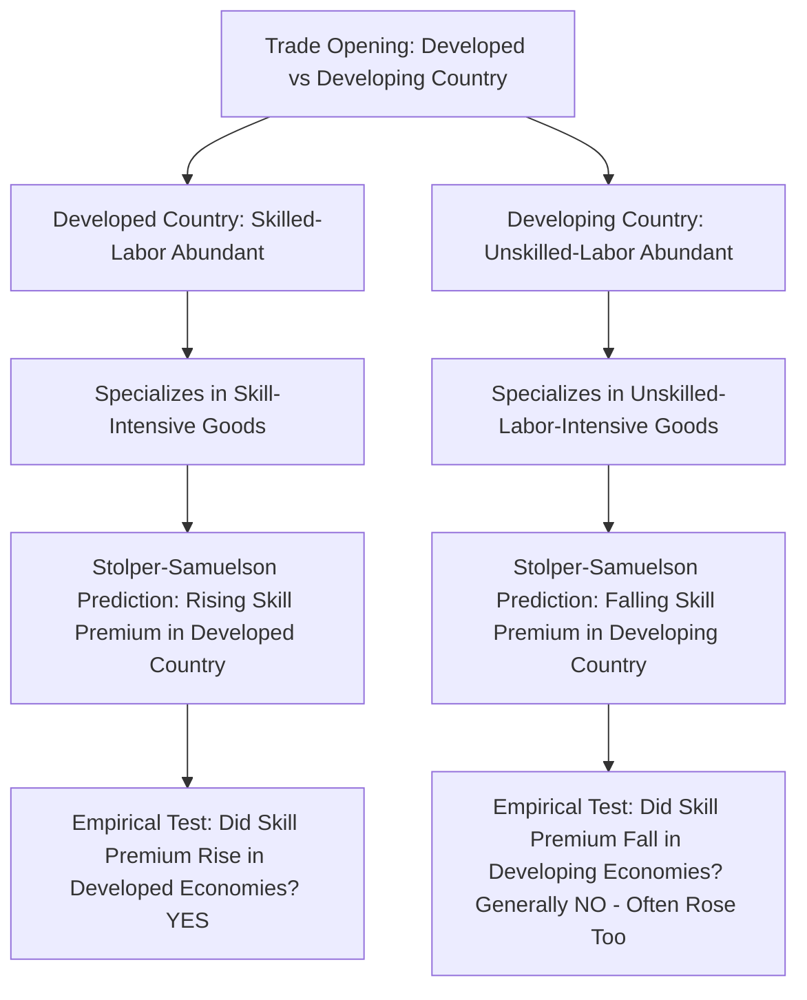
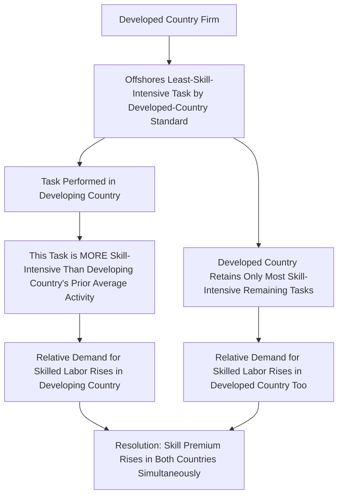

## Trade and Wage Inequality: The Stolper-Samuelson Channel Revisited

### Overview

The Stolper-Samuelson theorem, derived within the Heckscher-Ohlin framework, provides the foundational theoretical prediction for how trade affects the distribution of income between factors of production within a country. Its stark, unambiguous prediction — that trade opening raises returns to a country's abundant factor and lowers returns to its scarce factor — made it the natural starting point for understanding trade-driven wage inequality. However, decades of empirical testing, particularly regarding rising skill premiums in both developed and developing economies, have revealed substantial tensions between the theorem's clean predictions and observed patterns, motivating a body of revisionist and extending work that this reference surveys.

**Key Points**

- The Stolper-Samuelson theorem is a rigorous, mathematically well-established result *within* the two-good, two-factor Heckscher-Ohlin model — its logical validity within that model is not in dispute
- The empirical controversy concerns whether the model's core assumptions and predictions map onto observed real-world wage inequality patterns, which has produced substantial disagreement
- Modern treatments increasingly view Stolper-Samuelson as one channel among several (alongside skill-biased technological change, offshoring/task-trade effects, and labor market institutions) rather than a complete standalone explanation for trade-inequality patterns

---

### The Original Stolper-Samuelson Theorem

#### Setup and Core Result

In the standard two-good, two-factor Heckscher-Ohlin framework (typically labor and capital, or unskilled and skilled labor), the Stolper-Samuelson theorem (1941) establishes:

> An increase in the relative price of a good raises the real return of the factor used intensively in producing that good, and lowers the real return of the other factor — in both cases by a *magnified* proportion relative to the price change (the "magnification effect").

$$\hat{w}_L > \hat{p}_X > \hat{w}_K \quad \text{(if good } X \text{ is labor-intensive and its relative price rises)}$$

Where $\hat{w}_L$, $\hat{p}_X$, and $\hat{w}_K$ denote proportional changes in the labor wage, the price of labor-intensive good $X$, and the capital rental rate, respectively.

#### Application to Trade Opening

When a labor-abundant country opens to trade, Heckscher-Ohlin predicts it will specialize in and see rising relative prices for its labor-intensive good (export good), which, via Stolper-Samuelson, raises real wages for labor and lowers real returns to capital in that country — and, symmetrically, the opposite pattern in the capital-abundant trading partner.

**Key Points**

- Applied to developed-vs-developing country trade, with "skilled labor" as the developed-country-abundant factor and "unskilled labor" as the developing-country-abundant factor, the theorem predicts: trade opening should **raise** the skill premium (wage of skilled relative to unskilled labor) in **skill-abundant, developed** economies, and **lower** the skill premium in **unskilled-labor-abundant, developing** economies
- This is a precise, falsifiable, and symmetric prediction — a crucial feature that made it empirically testable and, as discussed below, ultimately a source of significant tension with observed data

---

### The Empirical Puzzle: The "Wrong-Sign" Problem in Developing Countries

#### The Original Motivating Observation

Empirical work through the 1980s and 1990s in the United States and other advanced economies found rising skill premiums (widening wage gaps between college-educated and less-educated workers) coinciding with increased trade with lower-wage developing countries — an observation broadly *consistent* with the developed-country side of the Stolper-Samuelson prediction.

**Key Points**

- However, if Stolper-Samuelson's logic were the dominant mechanism, the theorem's *symmetric* prediction requires that developing countries, being relatively unskilled-labor-abundant, should have seen **falling** skill premiums as they liberalized trade and specialized toward unskilled-labor-intensive exports
- Contrary to this prediction, numerous empirical studies of developing-country trade liberalization episodes (Mexico, Colombia, Chile, and others) found that skill premiums **rose**, not fell, following trade liberalization — a pattern now widely referred to in the literature as the developing-country skill-premium puzzle or the "wrong-sign" problem for Stolper-Samuelson

**Key Studies**

- **Robertson (2004), Mexico**: Found rising skill premiums following NAFTA-related trade liberalization, contrary to the simple Stolper-Samuelson prediction for a relatively unskilled-labor-abundant economy
- **Attanasio, Goldberg, and Pavcnik (2004), Colombia**: Similarly found rising within-industry skill premiums following Colombian trade liberalization in the late 1980s/early 1990s
- **[Inference]** This pattern — rising skill premiums in *both* skilled-abundant developed economies and unskilled-abundant developing economies simultaneously liberalizing trade with each other — is difficult to reconcile with the standard two-factor, two-good Stolper-Samuelson framework in its simplest form, and this difficulty is broadly acknowledged across the empirical trade literature, even though researchers differ in which alternative explanation they emphasize as most important

---

### Proposed Explanations for the Puzzle

#### Explanation 1: Skill-Biased Technological Change (SBTC)

A dominant alternative (or complementary) explanation holds that technological change — particularly the adoption of computers and information technology — has been inherently **skill-biased**, raising the relative productivity and demand for skilled labor across essentially all countries simultaneously, regardless of trade exposure.

**Key Points**

- If developing countries imported skill-biased technology embodied in capital equipment (connecting to the technology-diffusion channels discussed in related content), this could raise skilled-labor demand in developing countries even as trade opening simultaneously shifted production toward unskilled-labor-intensive exports — with the SBTC effect empirically dominating the Stolper-Samuelson effect in the observed net outcome
- **[Inference]** The relative contribution of SBTC versus trade-specific mechanisms to observed developing-country skill-premium increases remains genuinely disputed in the literature; some researchers (e.g., in parts of the Attanasio-Goldberg-Pavcnik analysis and related work) find evidence that trade liberalization itself was associated with skill-upgrading within firms and industries (suggesting a more direct trade-technology interaction rather than purely exogenous technological change), while other researchers emphasize technology diffusion as largely independent of trade policy — this is an area of active and unresolved empirical disagreement

#### Explanation 2: Task-Trade and Offshoring (Feenstra-Hanson Framework)

**Feenstra and Hanson (1996, 1999)** proposed an influential extension: rather than treating trade as involving only *finished goods*, their framework models trade in **intermediate production stages or tasks**. When developed-country firms offshore production stages to developing countries, the specific tasks offshored are typically the *least* skill-intensive tasks *by developed-country standards* but can be the *most* skill-intensive tasks *by developing-country standards* (since even "low-skill" offshored manufacturing tasks may require more skill than the developing country's pre-existing average activity, e.g., traditional agriculture).

**Key Points**

- This reconciles the puzzle: offshoring simultaneously raises the demand for (and relative wage of) skilled labor in **both** the developed country (retaining only its most skill-intensive tasks) **and** the developing country (which now performs tasks more skill-intensive than its prior average activity), producing rising skill premiums in both types of economies without contradicting the underlying comparative-advantage logic
- **[Inference]** The Feenstra-Hanson task-trade framework is widely regarded in the trade literature as a compelling and influential theoretical resolution to the developing-country skill-premium puzzle, and has received considerable subsequent empirical support in specific contexts (e.g., Mexican maquiladora-related studies); it is less commonly characterized as having fully superseded all competing explanations, and most researchers treat it as one important contributing mechanism among several rather than the sole resolution

#### Explanation 3: Multiple Cones of Diversification and Factor-Price Non-Equalization

Standard Stolper-Samuelson analysis, particularly in its simplest two-country form, implicitly assumes factor price equalization conditions and a single "cone of diversification." In reality, the global economy likely contains **multiple cones of diversification** — groups of countries with sufficiently similar relative factor endowments that they produce similar goods, with substantial factor-endowment differences *between* cones.

**Key Points**

- **[Inference]** Under a multiple-cone framework, a "middle-income" developing country may find its relevant comparison set is not the full range of global factor endowments (from the poorest to the richest country) but rather a narrower band of similarly-endowed competitor countries, potentially altering which factor is "relatively abundant" for Stolper-Samuelson purposes in ways not captured by simple two-country developed/developing comparisons — this theoretical refinement is well-established in trade theory but its precise empirical relevance to specific skill-premium puzzles is harder to establish and less extensively tested than the offshoring/task-trade explanation

#### Explanation 4: Trade-Induced Within-Industry Reallocation (Connecting to Melitz-Type Mechanisms)

As discussed in related content on empirical trade-growth evidence, trade liberalization has been robustly found to reallocate market share toward more productive firms within industries. If more productive firms are also more skill-intensive (a commonly observed empirical regularity), this reallocation channel can independently raise aggregate skill demand within an industry, even holding technology and factor-intensity choices fixed at the individual-firm level — a mechanism distinct from, but potentially complementary to, both SBTC and task-trade explanations.

---

### Modern Synthesis Table

| Explanation | Core Mechanism | Resolves Puzzle? | Key Limitation |
| --- | --- | --- | --- |
| Classical Stolper-Samuelson | Relative price changes shift factor returns via output-mix changes | No — predicts wrong sign for developing countries | Assumes single cone, two goods/factors, no offshoring |
| Skill-biased technological change | Technology directly raises skilled-labor demand, largely independent of trade | Partially — competes with, doesn't require, trade-specific explanation | Degree of trade-technology interconnection debated |
| Feenstra-Hanson task-trade/offshoring | Offshored tasks are skill-intensive relative to developing country's own average | Yes, most directly | Requires the specific offshoring/task-fragmentation structure to be empirically present |
| Multiple cones of diversification | Relevant factor-abundance comparison is narrower than simple developed-vs-developing dichotomy | Partially, theoretically | Harder to test empirically; less direct evidence base |
| Within-industry reallocation (Melitz-type) | More productive, more skill-intensive firms gain market share | Contributes to, doesn't fully resolve | Not itself a distinct theory of wage-setting; complements other explanations |

---

### Synthesis Diagram: From Classical Prediction to Modern Understanding (svg_diagram)

<svg xmlns="http://www.w3.org/2000/svg" viewBox="0 0 820 480">
\<style\>
.title { font: bold 16px sans-serif; fill: #1a1a1a; }
.box-label { font: bold 13px sans-serif; fill: #1a1a1a; }
.sub-label { font: 11px sans-serif; fill: #333333; }
.classic-box { fill: #eaf2fb; stroke: #2b5f8a; stroke-width: 1.5; }
.puzzle-box { fill: #fdece9; stroke: #a3341f; stroke-width: 2; }
.resolution-box { fill: #eafbf0; stroke: #2a7a4f; stroke-width: 1.5; }
.arrow { stroke: #555555; stroke-width: 1.5; fill: none; marker-end: url(#arrowhead11); }
\</style\>
<text x="410" y="26" text-anchor="middle" class="title">Stolper-Samuelson Channel Revisited (svg_diagram)</text>
<rect x="290" y="45" width="240" height="60" rx="8" class="classic-box" />
<text x="410" y="70" text-anchor="middle" class="box-label">Classical Stolper-Samuelson</text>
<text x="410" y="88" text-anchor="middle" class="sub-label">Symmetric skill-premium prediction</text>
<rect x="290" y="140" width="240" height="70" rx="8" class="puzzle-box" />
<text x="410" y="166" text-anchor="middle" class="box-label">Empirical Puzzle</text>
<text x="410" y="184" text-anchor="middle" class="sub-label">Skill premium rose in BOTH developed</text>
<text x="410" y="198" text-anchor="middle" class="sub-label">and developing liberalizing economies</text>
<rect x="30" y="270" width="220" height="90" rx="8" class="resolution-box" />
<text x="140" y="296" text-anchor="middle" class="box-label">Skill-Biased Tech Change</text>
<text x="140" y="316" text-anchor="middle" class="sub-label">Independent/parallel</text>
<text x="140" y="332" text-anchor="middle" class="sub-label">skill demand shift</text>
<text x="140" y="348" text-anchor="middle" class="sub-label">Partial resolution</text>
<rect x="270" y="270" width="280" height="90" rx="8" class="resolution-box" />
<text x="410" y="296" text-anchor="middle" class="box-label">Feenstra-Hanson Task-Trade</text>
<text x="410" y="316" text-anchor="middle" class="sub-label">Offshored tasks skill-intensive</text>
<text x="410" y="332" text-anchor="middle" class="sub-label">relative to recipient's own average</text>
<text x="410" y="348" text-anchor="middle" class="sub-label">Most direct resolution</text>
<rect x="570" y="270" width="220" height="90" rx="8" class="resolution-box" />
<text x="680" y="296" text-anchor="middle" class="box-label">Reallocation / Multiple Cones</text>
<text x="680" y="316" text-anchor="middle" class="sub-label">Productive, skill-intensive</text>
<text x="680" y="332" text-anchor="middle" class="sub-label">firms gain share</text>
<text x="680" y="348" text-anchor="middle" class="sub-label">Complementary contribution</text>
<rect x="200" y="400" width="420" height="60" rx="8" class="classic-box" />
<text x="410" y="435" text-anchor="middle" class="box-label">Modern View: Multiple Complementary Channels, Not a Single Theory</text>
<path d="M 410 105 L 410 140" class="arrow" />
<path d="M 350 210 L 150 270" class="arrow" />
<path d="M 410 210 L 410 270" class="arrow" />
<path d="M 470 210 L 670 270" class="arrow" />
<path d="M 150 360 L 320 400" class="arrow" />
<path d="M 410 360 L 410 400" class="arrow" />
<path d="M 680 360 L 500 400" class="arrow" />
</svg>

---

### Broader Implications for Trade-Inequality Policy Debates

**Key Points**

- The evolution of this literature has significant policy implications: if rising inequality in advanced economies were purely trade-driven via classical Stolper-Samuelson channels, this would suggest trade protection as a relatively direct (if efficiency-costly) remedy for wage inequality; if instead skill-biased technological change and offshoring/task-trade dynamics are substantial independent or interacting contributors, purely trade-focused policy responses (tariffs, trade restrictions) are less likely to fully address the underlying inequality drivers
- **[Inference]** The relative weighting of trade versus technology as drivers of the rise in advanced-economy wage inequality since the 1980s remains one of the most extensively studied and still genuinely debated empirical questions in labor and trade economics; most researchers in the field now regard both channels as real and interacting contributors rather than treating the question as an either/or determination, though the precise quantitative decomposition of "how much is due to trade versus technology" varies substantially across studies and continues to be an active area of research
- This connects directly to policy debates over trade adjustment assistance, education and retraining policy, and the broader "trade and labor markets" policy discourse, which typically treat trade exposure as one of several contributing factors to be addressed through complementary domestic labor-market policies rather than through trade restriction alone

---

### Conclusion

The Stolper-Samuelson theorem provides a logically rigorous and historically foundational prediction about how trade affects factor returns, but its simplest form has proven empirically incomplete as a standalone explanation for observed global wage-inequality patterns — most notably through the "wrong-sign" puzzle of rising, rather than falling, skill premiums in developing countries following trade liberalization. The Feenstra-Hanson task-trade and offshoring framework provides the most direct theoretical resolution to this puzzle, reconceptualizing trade as occurring in production tasks rather than finished goods, while skill-biased technological change and within-industry firm reallocation mechanisms offer complementary contributing explanations. The contemporary understanding of trade and wage inequality is best characterized not as a rejection of Stolper-Samuelson's underlying logic, but as an extension and refinement of that logic to accommodate the more complex, fragmented structure of modern global production — with the relative empirical weight of trade-specific versus technology-driven inequality drivers remaining a genuinely open and actively researched question.

---

**Related Topics**

- The Heckscher-Ohlin model and factor price equalization
- Feenstra-Hanson task-trade and offshoring models in depth
- Skill-biased technological change: evidence and measurement
- The Melitz model and within-industry firm heterogeneity
- Trade adjustment assistance and labor-market policy responses
- Multiple cones of diversification and factor-price non-equalization
- Empirical decomposition of trade versus technology in rising inequality
- Global value chains and task-based trade patterns