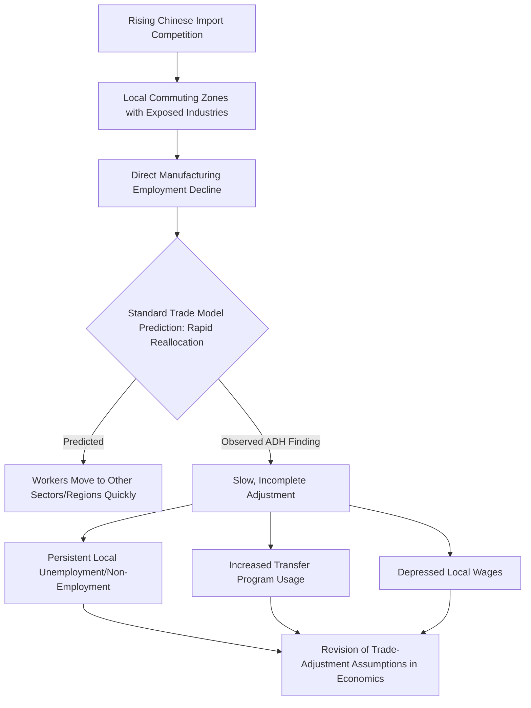

## The China Shock and Local Labor Market Adjustment

### Overview

The "China shock" refers to a specific and highly influential body of empirical research examining how the rapid surge in Chinese import competition — following China's economic reforms, its 2001 WTO accession, and its emergence as the world's dominant manufacturing exporter — affected local labor markets in the United States and other advanced economies. This research, most closely associated with **David Autor, David Dorn, and Gordon Hanson**, substantially revised economists' understanding of how quickly and completely labor markets adjust to large trade shocks, challenging assumptions embedded in earlier trade models and much of the 1990s–2000s policy discourse.

**Key Points**

- The China shock literature is distinguished by its **local labor market** (commuting zone or regional) empirical design, rather than aggregate national-level analysis, allowing much sharper identification of geographically concentrated effects
- The central finding — that trade-exposed local labor markets experienced larger, more persistent, and less readily offset negative effects than standard trade models predicted — has been highly influential in both academic and policy discussions of trade's distributional consequences
- This is an area with substantial ongoing academic engagement, including both extensions and methodological critiques; this reference presents the core findings alongside key debates

---

### Background: China's Rise as a Manufacturing Exporter

#### The Scale of the Shift

Following market-oriented reforms beginning in the late 1970s, China's manufacturing export capacity grew dramatically over subsequent decades, accelerating further after China's accession to the WTO in December 2001, which provided more predictable market access and locked in China's most-favored-nation trading status with other WTO members (ending the annual US congressional review of China's trade status, which had itself been a source of policy uncertainty).

**Key Points**

- China's share of global manufacturing exports rose dramatically from the 1990s through the 2000s, representing one of the most rapid and large-scale shifts in global manufacturing trade patterns in modern economic history
- **[Unverified]** Precise figures on China's manufacturing export share and growth rates over specific periods vary by data source and product classification; readers should consult current UN Comtrade or World Bank trade data for up-to-date figures rather than relying on approximate historical characterizations

---

### The Autor-Dorn-Hanson Research Design

#### Methodology: Local Labor Market Exposure

The core Autor-Dorn-Hanson (ADH) methodological innovation was to measure **import exposure at the level of local commuting zones** (roughly, local labor markets) in the United States, based on each region's pre-existing industry mix and the exposure of those specific industries to rising Chinese import competition, rather than analyzing effects at the national or industry level alone.

**Key Points**

- This local labor market design allows researchers to observe how regions differentially exposed to Chinese import competition (due to their historical industry specialization — e.g., furniture manufacturing in North Carolina, textiles in the Southeast) fared relative to less-exposed regions, holding constant broader national trends
- To address the endogeneity concern that US industry composition might itself be correlated with unobserved local economic conditions (reverse causality risk), ADH instrumented US import exposure using **Chinese imports to other high-income countries** (as a proxy for China's own supply-side export growth, presumed less directly related to US local demand conditions) — an instrumental variable strategy analogous in spirit to other trade-IV approaches discussed elsewhere in this course

$$\text{Import Exposure}_{\text{region}} = \sum_{\text{industry } j} \left( \text{Industry } j\text{'s share of regional employment} \right) \times \left( \text{Change in Chinese imports in industry } j \right)$$

#### Key Findings: Autor, Dorn, and Hanson (2013, "The China Syndrome")

- Commuting zones more exposed to rising Chinese import competition experienced significantly larger declines in manufacturing employment
- These effects extended beyond direct manufacturing job losses to broader adverse local labor market effects, including reduced overall employment-to-population ratios and lower wages, not fully offset by employment gains in other sectors
- Effects on government transfer program usage (unemployment insurance, disability insurance, other social assistance) were found to increase in more trade-exposed regions, representing a fiscal cost dimension of the shock

**Key Points**

- A central and influential finding was that labor market adjustment was considerably **slower and less complete** than standard trade models (which typically assume relatively frictionless reallocation of labor across sectors and regions) would predict
- **[Inference]** This slow-adjustment finding is widely regarded as the single most consequential contribution of this research program to trade economics more broadly, since it directly challenged an assumption — rapid factor mobility across sectors/regions — that had been fairly standard in much prior trade-theoretic and policy analysis; while the specific quantitative estimates have been subject to some subsequent debate (discussed below), the qualitative finding of meaningfully incomplete and slow adjustment is broadly accepted in the field

---

### Extensions: Beyond Employment to Broader Social Outcomes

#### Autor, Dorn, Hanson, and Song (2014) and Related Work

Subsequent research extended the original local-labor-market framework to examine individual-level worker outcomes over longer time horizons, finding that workers displaced from trade-exposed industries often experienced persistent earnings losses even after finding new employment, rather than smoothly transitioning to comparable-wage alternative jobs.

#### Political Economy Extensions

A separate but related and highly cited strand of this research program (Autor, Dorn, Hanson, and Majlesi, and related work) examined the relationship between local labor market exposure to Chinese import competition and political outcomes, finding associations between trade exposure and shifts in voting patterns in some US elections during the 2000s and 2010s.

**Key Points**

- **[Inference]** This political economy extension has been influential in policy and public discourse connecting trade exposure to broader political and social dynamics, but the specific causal channels linking economic exposure to political behavior (versus other correlated factors) involve additional identification challenges beyond the labor-market-outcome findings themselves, and this remains an area of ongoing scholarly discussion regarding the precise mechanisms and robustness of the political outcome associations

#### Health and Social Outcomes

Related research has examined associations between trade-exposed regional decline and adverse health and social outcomes (including studies connecting local economic distress to mortality-related measures in affected communities), though this connects to a broader and separately contested literature on regional economic decline and health outcomes that extends beyond trade-specific causes alone.

**[Unverified]** The specific causal contribution of trade exposure, as distinct from other correlated regional economic trends, to health and mortality outcomes in affected communities is a complex empirical question involving multiple contributing factors; general claims in this area should be evaluated against the specific studies and their stated identification strategies rather than treated as uniformly established.

---

### Why Was Adjustment Slower Than Expected? Proposed Mechanisms

**Key Points**

- **Reduced worker mobility**: Empirical evidence on US internal migration suggests workers, particularly older and less-educated workers, are considerably less geographically mobile than earlier models assumed, limiting the speed of labor reallocation to less-exposed regions
- **Local demand multiplier effects**: Manufacturing job losses can reduce local demand for non-tradable services (retail, local services), amplifying the initial shock's effect on the broader local economy beyond the directly affected industry
- **Skill specificity**: Workers with skills specific to declining industries may face substantial retraining costs or skill mismatches when transitioning to growing sectors, slowing individual-level adjustment
- **Housing market frictions**: Homeownership can reduce mobility (workers may be unwilling or unable to sell homes at depressed local prices following an economic shock), a friction not typically incorporated into standard frictionless trade-adjustment models

---

### Methodological Debates and Critiques

#### Sample Period and Magnitude Sensitivity

Some subsequent researchers have raised questions about the sensitivity of specific quantitative magnitude estimates to sample period choices and the precise instrumental variable specification, a form of critique with some structural similarity (methodologically, not substantively) to robustness critiques seen elsewhere in the trade-empirics literature (e.g., the Easterly-Levine-Roodman critique of Burnside-Dollar, or the Rodriguez-Rodrik critique of Sachs-Warner).

**Key Points**

- **[Inference]** These methodological debates concern the precise magnitude and some specification details of the China shock findings rather than a wholesale rejection of the core qualitative conclusion (that trade-exposed US local labor markets experienced meaningful, persistent adverse effects); the core finding of incomplete and slow local labor market adjustment has generally proven more robust across subsequent scrutiny than the very precise point estimates from any single study, though reasonable researchers continue to debate exact magnitudes

#### General Equilibrium and Aggregate Welfare Considerations

A separate line of critique notes that the local-labor-market design, while excellent for identifying geographically concentrated *distributional* effects, is not by itself designed to answer the separate question of aggregate national welfare effects of trade with China — since consumer gains from lower-priced imported goods, and employment gains in trade-benefiting sectors and regions (exporters, import-using industries, retail benefiting from lower consumer prices), are not captured within the same local-labor-market framework that identifies losses in import-competing regions.

**Key Points**

- **[Inference]** This is a genuine and important scope limitation acknowledged by researchers in this literature themselves: local labor market studies are well-suited to documenting *where and how severely* adjustment costs are concentrated, but are not, by design, comprehensive aggregate cost-benefit analyses of trade with China; drawing conclusions about aggregate net welfare effects requires combining this distributional evidence with separate estimates of aggregate consumer and producer surplus gains, and reasonable analysts can reach different overall assessments depending on how they weight concentrated losses against more diffuse aggregate gains

---

### China Shock Findings and Debates Overview (svg_diagram)

<svg xmlns="http://www.w3.org/2000/svg" viewBox="0 0 820 480">
\<style\>
.title { font: bold 16px sans-serif; fill: #1a1a1a; }
.box-label { font: bold 13px sans-serif; fill: #1a1a1a; }
.sub-label { font: 11px sans-serif; fill: #333333; }
.finding-box { fill: #fdece9; stroke: #a3341f; stroke-width: 1.5; }
.center-box { fill: #f9dfb8; stroke: #7a3d0e; stroke-width: 2.5; }
.critique-box { fill: #eaf2fb; stroke: #2b5f8a; stroke-width: 1.5; }
.arrow { stroke: #555555; stroke-width: 1.5; fill: none; marker-end: url(#arrowhead12); }
\</style\>
<text x="410" y="26" text-anchor="middle" class="title">China Shock: Findings and Scope (svg_diagram)</text>
<rect x="290" y="45" width="240" height="55" rx="8" class="center-box" />
<text x="410" y="68" text-anchor="middle" class="box-label">Local Labor Market Design</text>
<text x="410" y="85" text-anchor="middle" class="sub-label">Autor-Dorn-Hanson methodology</text>
<rect x="40" y="150" width="230" height="90" rx="8" class="finding-box" />
<text x="155" y="176" text-anchor="middle" class="box-label">Core Finding</text>
<text x="155" y="196" text-anchor="middle" class="sub-label">Slow, incomplete adjustment</text>
<text x="155" y="212" text-anchor="middle" class="sub-label">Persistent employment,</text>
<text x="155" y="228" text-anchor="middle" class="sub-label">wage, transfer effects</text>
<rect x="300" y="150" width="230" height="90" rx="8" class="finding-box" />
<text x="415" y="176" text-anchor="middle" class="box-label">Extensions</text>
<text x="415" y="196" text-anchor="middle" class="sub-label">Political outcomes,</text>
<text x="415" y="212" text-anchor="middle" class="sub-label">individual earnings losses,</text>
<text x="415" y="228" text-anchor="middle" class="sub-label">health/social outcomes</text>
<rect x="560" y="150" width="230" height="90" rx="8" class="critique-box" />
<text x="675" y="176" text-anchor="middle" class="box-label">Methodological Debates</text>
<text x="675" y="196" text-anchor="middle" class="sub-label">Magnitude sensitivity</text>
<text x="675" y="212" text-anchor="middle" class="sub-label">to specification and</text>
<text x="675" y="228" text-anchor="middle" class="sub-label">sample period</text>
<rect x="150" y="300" width="520" height="90" rx="8" class="critique-box" />
<text x="410" y="326" text-anchor="middle" class="box-label">Scope Limitation: Distributional vs Aggregate Welfare</text>
<text x="410" y="346" text-anchor="middle" class="sub-label">Local design captures concentrated losses well;</text>
<text x="410" y="362" text-anchor="middle" class="sub-label">does not by itself measure diffuse consumer/aggregate gains</text>
<text x="410" y="378" text-anchor="middle" class="sub-label">from lower-priced imports</text>
<path d="M 360 100 L 200 150" class="arrow" />
<path d="M 410 100 L 415 150" class="arrow" />
<path d="M 460 100 L 630 150" class="arrow" />
<path d="M 200 240 L 300 300" class="arrow" />
<path d="M 650 240 L 550 300" class="arrow" />
</svg>

---

### Policy Implications

**Key Points**

- The China shock findings substantially influenced subsequent policy discussions of **trade adjustment assistance (TAA)** program design in the United States, motivating calls for more robust, geographically targeted, and longer-duration adjustment support than earlier TAA programs provided
- The findings are frequently cited in broader discussions of "place-based policy" — the idea that policy responses to trade (and other economic) shocks may need to target specific geographic regions directly, rather than relying solely on national-level policies (such as general unemployment insurance) that implicitly assume workers can and will relocate to opportunity
- **[Inference]** The precise policy design implications drawn from this research — for example, whether the appropriate response is enhanced worker-level adjustment assistance, place-based regional investment, trade policy adjustments (tariffs, negotiated import limits), or some combination — remain a matter of active policy debate; the empirical findings establish that meaningful, persistent local adjustment costs exist, but do not by themselves determine which specific policy remedy is most effective or cost-efficient, a question requiring separate policy evaluation research

---

### Conclusion

The China shock research program represents one of the most influential bodies of empirical work in modern trade economics, substantially revising the profession's understanding of how — and how slowly — local labor markets adjust to large, geographically concentrated trade shocks. By documenting persistent, incompletely offset declines in employment, wages, and rising transfer-program dependence in trade-exposed US commuting zones, this research challenged standard trade-model assumptions of relatively frictionless factor mobility and has substantially shaped subsequent academic and policy discourse on trade adjustment assistance and place-based economic policy. While specific quantitative magnitude estimates have faced some methodological scrutiny, and the local-labor-market design is explicitly not a complete aggregate welfare analysis of US-China trade, the core qualitative finding — that trade adjustment costs can be severe, geographically concentrated, and slow to resolve — is broadly regarded as a robust and enduringly important contribution to trade and labor economics.

---

**Related Topics**

- Trade adjustment assistance program design and evaluation
- Place-based policy versus worker-based policy responses to regional economic decline
- Labor mobility frictions: housing, skill specificity, and internal migration patterns
- The Feenstra-Hanson task-trade framework and offshoring
- Aggregate welfare gains from trade versus concentrated distributional costs
- China's WTO accession (2001) and its systemic trade effects
- Political economy of trade exposure and voting behavior
- Regional economic decline and social/health outcome research