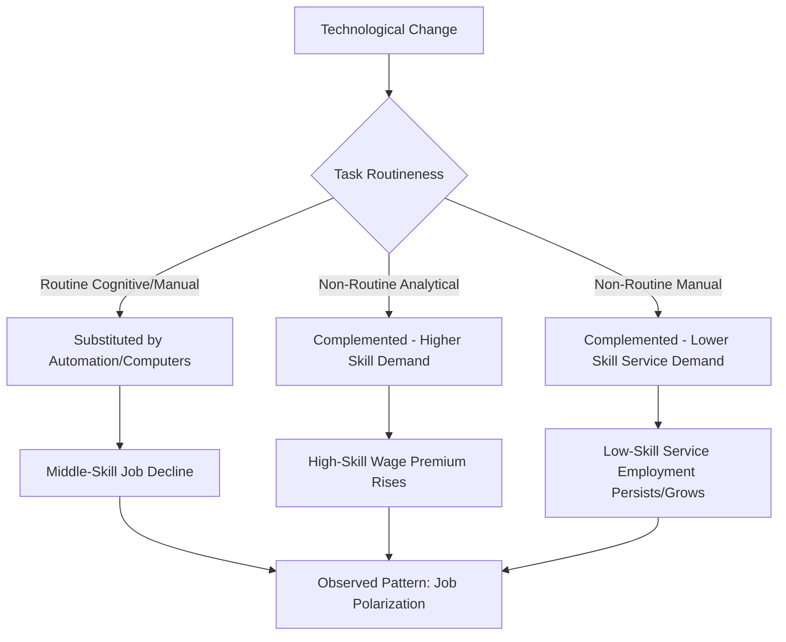
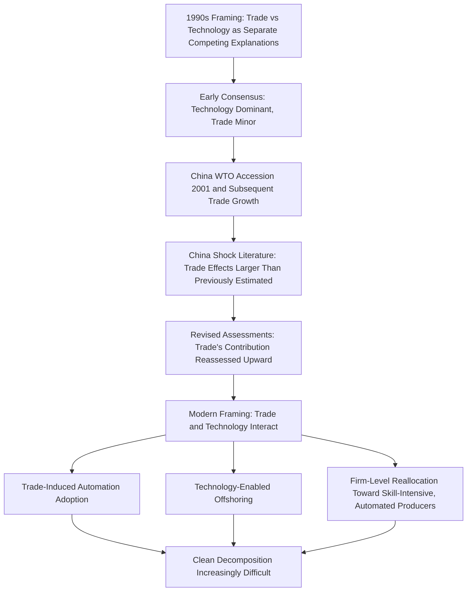

## Skill-Biased Technological Change versus Trade as Drivers of Inequality

### Overview

One of the longest-running and most consequential debates in labor and trade economics concerns the relative contribution of two candidate explanations for rising wage inequality — particularly the rising skill/education wage premium observed in the United States and other advanced economies since roughly the 1980s: **skill-biased technological change (SBTC)**, which attributes rising inequality primarily to technology's changing demand for skill, and **trade-based explanations** (Stolper-Samuelson effects, offshoring, import competition), which attribute rising inequality substantially to increased economic integration with lower-wage countries. This is not merely an academic dispute — the relative weighting of these explanations carries significant policy implications for whether trade policy, education policy, or some combination is the more appropriate response to rising inequality.

**Key Points**

- This debate has evolved considerably since its origins in the early 1990s, moving from an initial "trade versus technology" framing toward increasingly sophisticated attempts to model their **interaction** rather than treating them as fully separable, competing explanations
- Most contemporary researchers in this literature regard both channels as real and empirically supported contributors, with the genuinely contested question being their **relative quantitative magnitude** and the specific channels through which each operates
- This reference surveys the two explanations' theoretical bases, the classic empirical decomposition attempts, and the more recent literature emphasizing their interconnection

---

### The Empirical Pattern to Be Explained

#### Rising Skill Premium: The Basic Facts

Beginning roughly in the late 1970s/early 1980s, the United States and several other advanced economies experienced a substantial rise in the wage premium associated with education (particularly the college wage premium) and with occupational skill more broadly, reversing a period of relative wage compression in preceding decades.

**Key Points**

- This rising skill premium occurred **alongside** two major, temporally overlapping global economic developments: (1) a dramatic acceleration in computer and information technology adoption, and (2) substantially increased trade integration with lower-wage developing economies (Mexico, China, and other emerging manufacturing exporters)
- The simultaneous timing of these two developments is precisely what makes empirically **disentangling their separate contributions** to rising inequality so methodologically challenging — both candidate explanations predict the same directional outcome (rising skill premium) over roughly the same time period, making simple correlation-based approaches uninformative about relative causal contribution

---

### The Skill-Biased Technological Change (SBTC) Explanation

#### Theoretical Mechanism

SBTC theory holds that technological change — particularly computerization and automation — has disproportionately raised the productivity of, and therefore demand for, skilled relative to unskilled labor, because new technologies tend to be **complementary** to skilled labor (skilled workers use computers/technology to become more productive) while being **substitutable** for many routine, unskilled tasks (automation directly replaces certain repetitive manual and cognitive tasks).

$$\frac{\partial}{\partial t}\left(\frac{MPL_{\text{skilled}}}{MPL_{\text{unskilled}}}\right) > 0$$

Where the relative marginal productivity of skilled labor is theorized to rise systematically over time due to technology's skill-complementary bias, raising the equilibrium relative wage of skilled labor even absent any change in relative skilled/unskilled labor supply or trade exposure.

#### Key Evidence Cited for SBTC

- **Katz and Murphy (1992)** and related foundational work found that a simple supply-and-demand framework, augmented with a **relative demand shift favoring skilled labor**, could account for much of the observed rise in the US skill premium, particularly given that the relative *supply* of skilled (college-educated) labor was simultaneously rising (which, absent an offsetting demand shift, should have been *lowering*, not raising, the skill premium via standard supply-and-demand logic)
- **Autor, Katz, and Krueger (1998)** and subsequent work linked the timing and industry pattern of rising skill premiums to computer adoption rates across industries, finding correlations consistent with a technology-driven demand shift
- **[Inference]** The core logical argument for SBTC's importance — that skill premiums rose *despite* rising relative supply of skilled workers, which by itself should reduce the premium — is widely regarded as a compelling piece of evidence requiring *some* demand-side explanation, and this reasoning is not seriously disputed; what remains disputed is the precise attribution of that demand shift specifically to technology as opposed to trade or other factors

#### The Task-Based Refinement (Autor, Levy, and Murnane, 2003)

A significant refinement to the simple SBTC story reframes technology's effect not simply as "skilled versus unskilled" but as differentially affecting **tasks** by their routineness: technology (particularly computerization) is theorized to substitute strongly for **routine tasks** (whether cognitive, like bookkeeping, or manual, like assembly-line work) while complementing **non-routine tasks** (both high-skill analytical/creative work and, notably, certain non-routine manual tasks like food service or personal care).

**Key Points**

- This task-based framework helps explain the empirically observed **"job polarization"** pattern — simultaneous employment growth at both the high-skill and low-skill ends of the occupational distribution, with relative decline concentrated in middle-skill, routine-task-intensive occupations (e.g., many traditional manufacturing and clerical jobs) — a pattern less easily explained by the simpler "skilled versus unskilled" binary framing of earlier SBTC models
- **[Inference]** The task-based, routine-biased technological change (RBTC) framework is now widely regarded in the literature as a more empirically accurate refinement of the original SBTC hypothesis, better matching the observed job polarization pattern than the simpler original formulation, though this refinement extends rather than replaces the core SBTC insight that technology's effects are not skill-neutral

---

### The Trade-Based Explanation

The trade-based explanation encompasses the mechanisms surveyed in related content: the classical Stolper-Samuelson channel (predicting rising skill premiums in skill-abundant, developed economies specializing away from unskilled-labor-intensive production), and its more sophisticated extension via the Feenstra-Hanson task-trade/offshoring framework, along with the China shock literature's findings on concentrated local labor market effects.

**Key Points**

- As covered in related content, the simplest Stolper-Samuelson prediction faces the "wrong-sign" empirical puzzle for developing countries, motivating the shift toward task-trade/offshoring-based explanations that can account for rising skill premiums in both developed and developing economies simultaneously
- Trade-based explanations, particularly the China shock literature, have provided some of the most methodologically credible evidence in this broader debate, given their use of geographically disaggregated, instrumented research designs — a methodological strength relative to some earlier aggregate SBTC studies, though this methodological point concerns identification strategy quality rather than establishing that trade's aggregate quantitative contribution necessarily exceeds technology's

---

### Early Attempts at Quantitative Decomposition

#### The 1990s "Trade versus Technology" Debate

Early attempts (particularly associated with economists including Krugman, Lawrence and Slaughter, and others writing in the early-to-mid 1990s) to decompose the relative contribution of trade versus technology to rising US wage inequality generally concluded that trade's quantitative contribution was **relatively modest** compared to technology's, based primarily on the observation that trade volumes with low-wage countries, while growing, remained a relatively small share of the US economy during that specific period, limiting the plausible magnitude of any Stolper-Samuelson-type effect.

**Key Points**

- **[Inference]** This "trade's contribution was small" conclusion was widely accepted for much of the 1990s and early 2000s but has been substantially revisited in light of subsequent research, particularly following China's WTO accession (2001) and the associated dramatic rise in Chinese import competition — a scale and speed of trade integration considerably larger than what the original 1990s decomposition studies were analyzing, since those studies necessarily could not account for a trade shock that had not yet occurred at the time of their analysis
- This illustrates an important general point: conclusions from this literature are time-period-specific, and the appropriate weighting of trade versus technology explanations may reasonably differ when comparing the 1980s wage-inequality episode (analyzed by early SBTC-favoring studies) to the 2000s China-shock episode (analyzed by later, trade-emphasizing studies)

#### Krugman's Later Revision (2008)

Notably, Paul Krugman, an economist whose earlier 1990s work had been among those concluding trade's contribution to US inequality was relatively modest, subsequently revisited this assessment in later writing, suggesting that the scale of trade with China had grown sufficiently large by the 2000s that trade's contribution to US wage inequality likely deserved greater weight than his earlier analysis had assigned.

**[Unverified]** The specific quantitative magnitude Krugman and others have subsequently assigned to trade's contribution in this revised assessment varies across specific publications and should be checked against the primary sources for precise figures, as this remains a topic of stated, evolving professional judgment rather than a single fixed estimate.

---

### The Modern Synthesis: Interaction Rather Than Pure Competition

#### Trade and Technology as Interacting, Not Separable, Forces

Contemporary treatments increasingly emphasize that trade and technology are not fully independent, separable causal forces but interact in ways that complicate simple decomposition:

- **Trade-induced technology adoption**: Import competition can spur increased automation adoption among domestic firms seeking to remain competitive against lower-wage foreign producers — meaning some observed "technology-driven" skill demand shifts may themselves be partly *caused by* trade pressure, rather than representing a fully independent, exogenous technological trend
- **Technology-enabled trade (offshoring)**: Advances in communication and coordination technology (enabling the fragmentation of production into globally dispersed tasks, per the Feenstra-Hanson framework) are themselves a *precondition* for much modern offshoring-based trade, meaning some of what appears as "trade's effect" is technologically enabled and would not be observable in the same form without complementary technological advances
- **Reallocation-driven skill demand**: As discussed in related content, trade-induced reallocation of market share toward more productive (often more skill-intensive and more automated) firms provides an additional channel through which trade and technology-adoption patterns become intertwined at the firm level

**Key Points**

- **[Inference]** This "interaction" framing has become increasingly dominant in recent scholarship and is generally regarded as a more accurate description of underlying economic reality than the earlier, more starkly separated "trade versus technology" framing of the 1990s debate; however, this interaction framing also makes the goal of a clean, additive quantitative decomposition ("X% due to trade, Y% due to technology") considerably more difficult to achieve with full confidence, since the two forces are not orthogonal in their empirical operation

---

### Comparative Summary Table

| Dimension | SBTC/RBTC Explanation | Trade-Based Explanation |
| --- | --- | --- |
| Core mechanism | Technology complements skilled/non-routine labor, substitutes for routine tasks | Stolper-Samuelson price effects, offshoring of tasks, import competition |
| Key evidence | Rising skill premium despite rising skilled-labor supply; job polarization pattern | China shock local labor market studies; developing-country skill-premium puzzle resolved via task-trade |
| Historically favored period | 1980s–1990s literature | Increasingly emphasized post-2000s, especially post-China-WTO-accession |
| Methodological strength | Strong within-country time-series and cross-industry technology-adoption evidence | Strong geographically disaggregated, instrumented local labor market designs (China shock) |
| Key limitation | Difficult to cleanly separate from trade-induced automation adoption | Simple Stolper-Samuelson faces "wrong-sign" puzzle; requires task-trade refinement |
| Modern view | One of multiple interacting contributing forces | One of multiple interacting contributing forces |

---

### Trade-Technology Interaction Landscape (svg_diagram)

<svg xmlns="http://www.w3.org/2000/svg" viewBox="0 0 820 460">
\<style\>
.title { font: bold 16px sans-serif; fill: #1a1a1a; }
.box-label { font: bold 13px sans-serif; fill: #1a1a1a; }
.sub-label { font: 11px sans-serif; fill: #333333; }
.tech-box { fill: #eaf2fb; stroke: #2b5f8a; stroke-width: 1.5; }
.trade-box { fill: #fdece9; stroke: #a3341f; stroke-width: 1.5; }
.center-box { fill: #f2ecfb; stroke: #5b3a8a; stroke-width: 2.5; }
.arrow { stroke: #555555; stroke-width: 1.5; fill: none; marker-end: url(#arrowhead13); }
\</style\>
<text x="410" y="26" text-anchor="middle" class="title">Trade and Technology as Interacting Inequality Drivers (svg_diagram)</text>
<rect x="60" y="55" width="280" height="70" rx="8" class="tech-box" />
<text x="200" y="82" text-anchor="middle" class="box-label">Skill-Biased/Routine-Biased</text>
<text x="200" y="100" text-anchor="middle" class="sub-label">Technological Change</text>
<text x="200" y="114" text-anchor="middle" class="sub-label">Computerization, automation</text>
<rect x="480" y="55" width="280" height="70" rx="8" class="trade-box" />
<text x="620" y="82" text-anchor="middle" class="box-label">Trade Integration</text>
<text x="620" y="100" text-anchor="middle" class="sub-label">Import competition, offshoring,</text>
<text x="620" y="114" text-anchor="middle" class="sub-label">task-trade fragmentation</text>
<rect x="270" y="180" width="280" height="90" rx="8" class="center-box" />
<text x="410" y="206" text-anchor="middle" class="box-label">Interaction Channels</text>
<text x="410" y="226" text-anchor="middle" class="sub-label">Trade-induced automation adoption</text>
<text x="410" y="242" text-anchor="middle" class="sub-label">Technology-enabled offshoring</text>
<text x="410" y="258" text-anchor="middle" class="sub-label">Reallocation toward skill-intensive firms</text>
<rect x="150" y="330" width="520" height="80" rx="8" class="center-box" />
<text x="410" y="358" text-anchor="middle" class="box-label">Observed Outcome: Rising Skill Premium, Job Polarization</text>
<text x="410" y="378" text-anchor="middle" class="sub-label">Clean additive decomposition into "trade share" vs "technology share"</text>
<text x="410" y="394" text-anchor="middle" class="sub-label">is genuinely difficult given interaction effects</text>
<path d="M 250 125 L 350 180" class="arrow" />
<path d="M 570 125 L 470 180" class="arrow" />
<path d="M 410 270 L 410 330" class="arrow" />
</svg>

---

### Conclusion

The debate over whether skill-biased technological change or trade integration has been the more important driver of rising wage inequality has evolved substantially since its origins in the early 1990s. Early research, working with data predating China's WTO accession and the associated surge in low-wage manufacturing competition, generally concluded technology's contribution dominated trade's relatively modest role. Subsequent developments — most importantly the scale and speed of the China shock — prompted significant reassessment, including revised views from economists (such as Krugman) who had earlier downplayed trade's role. The contemporary understanding, reflected in the most recent scholarship, has moved decisively away from treating trade and technology as cleanly separable, competing explanations, instead emphasizing their **interaction**: trade pressure can spur automation adoption, technological advances enable the task-fragmentation that makes modern offshoring possible, and firm-level reallocation dynamics intertwine both forces. This interaction-based framing is now generally regarded as the more empirically accurate characterization, even though it makes the original goal of a clean, additive quantitative decomposition between "trade's share" and "technology's share" of rising inequality considerably more elusive than either camp's original 1990s framing assumed.

---

**Related Topics**

- The task-based model of technological change (Autor, Levy, Murnane)
- Job polarization: measurement and international evidence
- The China shock and local labor market adjustment (see related content)
- The Stolper-Samuelson channel and the Feenstra-Hanson task-trade resolution
- Automation, robotics, and labor demand: recent empirical evidence
- Education policy and skill formation as inequality-response tools
- Krugman's evolving assessment of trade's distributional effects
- Firm-level evidence on trade-induced technology adoption