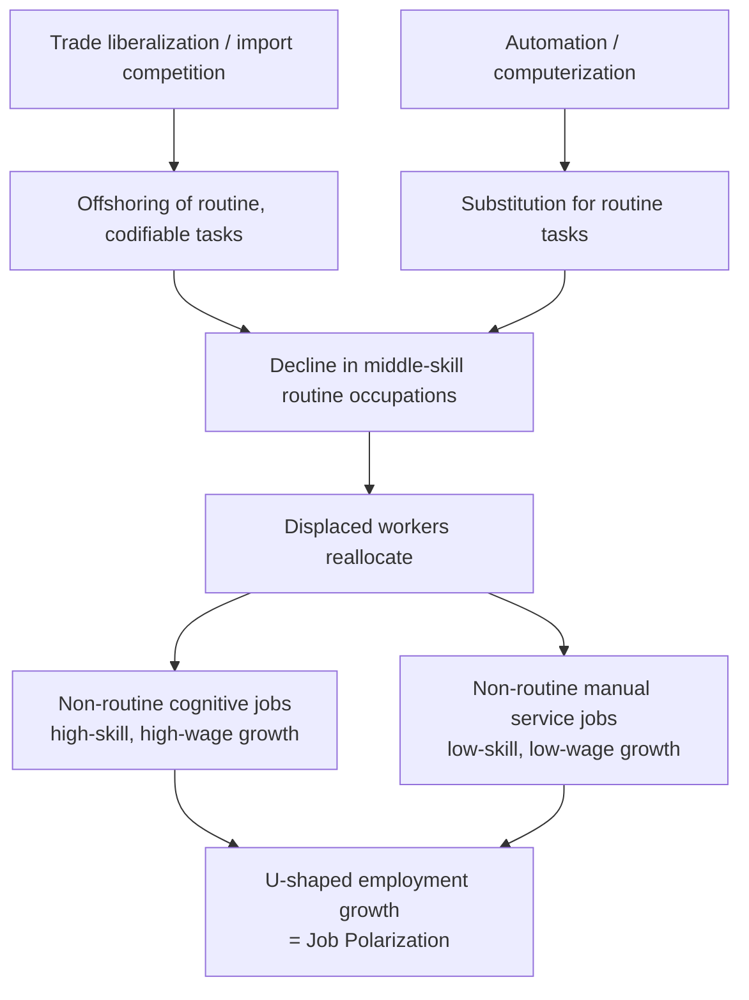

## Trade and Job Polarization

### Definition of Job Polarization

Job polarization refers to the empirically observed pattern in which employment growth is concentrated at the two ends of the occupational skill/wage distribution — high-skill, high-wage occupations and low-skill, low-wage occupations — while middle-skill, middle-wage occupations experience relative or absolute employment decline. When plotted, employment or wage growth by occupational skill percentile typically forms a **U-shaped ("smile") curve** rather than a monotonic or uniform pattern.

This phenomenon is distinct from simple wage inequality growth (a widening gap between top and bottom of the distribution): polarization specifically describes a hollowing-out of the *middle*, with both tails growing relative to the center.

### The Routine-Biased Technical Change (RBTC) Framework

**Key Points**

- The dominant explanatory framework, developed primarily by Autor, Levy, and Murnane (2003) and extended by Autor, Katz, and Kearney (2006), organizes occupations along two dimensions: **routine vs. non-routine** tasks, and **cognitive vs. manual** tasks
- **Routine tasks** (both cognitive — e.g., bookkeeping, data entry — and manual — e.g., assembly-line work, machine operation) follow explicit, codifiable procedural rules and are therefore highly substitutable by computers and automation technology
- **Non-routine cognitive tasks** (e.g., professional, managerial, technical, creative work requiring flexibility, problem-solving, and abstract reasoning) are complementary to computerization — technology raises the productivity of workers performing these tasks
- **Non-routine manual tasks** (e.g., food service, personal care, cleaning, security) require situational adaptability, physical dexterity, and interpersonal interaction that remain difficult to automate or offshore, and are concentrated at the low end of the wage distribution
- Because routine tasks are disproportionately concentrated in *middle-skill* occupations (clerical work, production/assembly work), technology-driven substitution for routine tasks directly predicts the hollowing-out of the middle — this is the RBTC mechanism for polarization, originally proposed independent of trade

### Where Trade Enters: Task-Based Trade Models

The task-based framework was extended to incorporate international trade and offshoring explicitly, most notably by Grossman and Rossi-Hansberg (2008) in their "trading tasks" model.

- **Key conceptual shift**: rather than modeling trade as an exchange of finished goods between countries (as in classical Heckscher-Ohlin trade theory), this framework models trade as the offshoring of individual production *tasks* — components of the production process that can be geographically separated from other tasks
- **Offshorability and routineness are correlated but distinct dimensions**: a task can be routine (rule-based, automatable) and/or offshorable (can be performed remotely and coordinated at distance without significant productivity loss). Call-center work and data processing are both routine and highly offshorable; food preparation is routine-manual but not offshorable (must be performed on-site); radiology diagnosis is non-routine cognitive but has become increasingly offshorable with digital imaging transmission
- **"Productivity effect" of offshoring**: in the Grossman-Rossi-Hansberg model, offshoring a task previously performed domestically is analytically similar to a productivity improvement — it lowers production costs for the offshoring firm, and this can, under certain parameter conditions, *increase* demand for the remaining domestic tasks and raise wages for workers performing them, rather than uniformly depressing domestic wages. This is a departure from simpler "trade lowers wages of import-competing factors" intuition and is a frequently tested/debated proposition in the literature
- Middle-skill occupations historically performing routine tasks (e.g., call center operation, basic accounting, certain manufacturing production roles) are disproportionately exposed to offshoring because routine tasks are easier to codify into instructions transmittable across borders — creating an overlapping mechanism with RBTC: both technology and trade independently predict hollowing-out of similar middle-skill occupational categories

### Disentangling Trade from Technology as Causes

**Key Points**

- A central empirical and pedagogical challenge is that trade-induced offshoring and automation frequently target the *same* occupations (routine, codifiable work), making it econometrically difficult to cleanly separate "trade caused this job loss" from "technology caused this job loss" using observational data
- Researchers use several identification strategies to distinguish the two:
  - **Import penetration measures** (e.g., import exposure by industry, constructed using instruments such as the "China shock" methodology of Autor, Dorn, and Hanson, which uses import growth in other high-income countries as an instrument for U.S. import exposure to isolate supply-driven Chinese export growth from U.S. domestic demand shocks)
  - **Task-content measures** derived from occupational databases (such as the U.S. Department of Labor's O*NET) to construct routine-task-intensity (RTI) indices independent of trade exposure, then testing whether RTI or trade exposure (or both) predict employment/wage changes
  - **Regional/local labor market variation**: exploiting the fact that different U.S. commuting zones had different initial industry mixes, and therefore different exposure to Chinese import competition, to estimate localized effects net of national technology trends
- [Inference] The empirical consensus in the labor economics literature by the mid-2010s and beyond generally attributed a meaningful share of middle-skill manufacturing employment decline in advanced economies to both channels operating simultaneously, though the relative magnitude attributed to each channel varies substantially across studies, time periods, and countries, and remains an active area of empirical dispute

### Distributional and Geographic Effects

- **Autor, Dorn, and Hanson "China shock" findings**: [Unverified — cite specific magnitudes cautiously] regions of the United States more exposed to import competition from China following its 2001 WTO accession experienced larger declines in manufacturing employment, lower overall employment-to-population ratios, and slower wage growth than less-exposed regions, with adjustment occurring more slowly than standard trade models (which assume frictionless factor reallocation) would predict
- **Skill-based sorting**: workers displaced from routine middle-skill occupations do not uniformly move up into high-skill jobs; a substantial share transition into low-skill, non-routine manual service occupations (contributing directly to the polarization pattern), while others exit the labor force entirely or experience extended unemployment, particularly older workers with less capacity for retraining
- **Wage polarization vs. employment polarization**: some studies distinguish between polarization in *employment shares* (which occupations gain/lose workers) and polarization in *wages* (which occupations gain/lose relative pay) — the two patterns can diverge, especially when strong labor supply increases in low-wage service occupations suppress wage growth even as employment share rises there
- **Gender and demographic dimensions**: [Inference] literature has noted that routine-task-intensive middle-skill jobs affected by both trade and automation have historically been disproportionately held by men in manufacturing and by women in clerical/administrative roles, meaning the distributional incidence of polarization operates differently by gender depending on which specific occupational categories are most exposed

### Diagrammatic Representation

(svg_diagram)

<svg xmlns="http://www.w3.org/2000/svg" viewBox="0 0 900 420" font-family="Helvetica, Arial, sans-serif">
<text x="450" y="28" text-anchor="middle" font-size="18" font-weight="bold" fill="#1a1a2e">Employment Growth by Occupational Skill Percentile (svg_diagram)</text>
<line x1="80" y1="350" x2="850" y2="350" stroke="#333" stroke-width="1.5" />
<line x1="80" y1="60" x2="80" y2="350" stroke="#333" stroke-width="1.5" />

<text x="465" y="390" text-anchor="middle" font-size="13" fill="`#1a1a2e`">Occupational Skill Percentile (low to high)</text>

<text x="30" y="205" text-anchor="middle" font-size="13" fill="`#1a1a2e`" transform="rotate(-90 30 205)">Employment Growth (%)</text>

<line x1="80" y1="230" x2="850" y2="230" stroke="#ccc" stroke-width="1" stroke-dasharray="4,4" />
<text x="70" y="234" text-anchor="end" font-size="11" fill="#666">0</text>

<path d="M 100 130 Q 250 320, 400 330 Q 480 335, 550 300 Q 700 200, 830 90" fill="none" stroke="`#a54a4a`" stroke-width="3" />

<circle cx="100" cy="130" r="5" fill="#a54a4a" />
<circle cx="400" cy="330" r="5" fill="#a54a4a" />
<circle cx="830" cy="90" r="5" fill="#a54a4a" />

<text x="100" y="115" text-anchor="middle" font-size="12" fill="`#1a1a2e`" font-weight="bold">Low-skill</text>

<text x="100" y="150" text-anchor="middle" font-size="11" fill="#333">(non-routine manual:</text>

<text x="100" y="165" text-anchor="middle" font-size="11" fill="#333">food service, care work)</text>

<text x="400" y="355" text-anchor="middle" font-size="12" fill="`#1a1a2e`" font-weight="bold">Middle-skill</text>

<text x="400" y="372" text-anchor="middle" font-size="11" fill="#333">(routine: clerical, production —</text>

<text x="400" y="386" text-anchor="middle" font-size="11" fill="#333">hollowed out by trade + automation)</text>

<text x="830" y="75" text-anchor="middle" font-size="12" fill="`#1a1a2e`" font-weight="bold">High-skill</text>

<text x="830" y="108" text-anchor="middle" font-size="11" fill="#333">(non-routine cognitive:</text>

<text x="830" y="122" text-anchor="middle" font-size="11" fill="#333">professional, managerial)</text>

</svg>

### Mermaid: Causal Pathways to Polarization

### Policy Implications and Responses

**Key Points**

- **Education and skill-upgrading policy**: since polarization disproportionately displaces routine-task workers, policy responses commonly emphasize expanding access to post-secondary education and vocational training oriented toward non-routine cognitive skills, though the effectiveness and speed of such transitions for displaced mid-career workers is empirically contested (see also *Trade adjustment assistance programs*)
- **Wage subsidies for low-wage service work**: because a share of displaced middle-skill workers move into low-wage non-routine manual occupations rather than upgrading to high-skill work, some policy proposals (e.g., expanded earned income tax credits) target income support for workers in the expanding low-wage tail rather than assuming re-training will move all displaced workers into high-skill jobs
- **Place-based policy**: given evidence that polarization and trade-displacement effects are geographically concentrated (certain manufacturing-dependent regions bear disproportionate adjustment costs), some economists have argued for regional economic development policy as a complement to individual worker-based adjustment assistance
- **Debate over minimum wage and low-wage labor market policy**: as employment growth concentrates in low-wage non-routine service work, labor market institutions governing that segment (minimum wage levels, labor standards, scheduling regulations) take on greater importance for overall wage distribution outcomes

### Distinguishing Related but Different Concepts

| Concept | Core Pattern | Primary Driver Emphasized |
| --- | --- | --- |
| Job polarization | U-shaped employment/wage growth by skill percentile | Routine-task automation and offshoring |
| Wage inequality (top-bottom) | Widening gap between top and bottom percentiles, not necessarily U-shaped | Skill-biased technical change, returns to education, superstar effects |
| Skill-biased technical change (SBTC, general) | Monotonic increase in relative demand for skilled labor | Technology complementary to high-skill labor broadly |
| Deindustrialization | Declining manufacturing employment share | Combination of trade, automation, and sectoral productivity growth differentials (Baumol effect) |

### Related Topics

- Routine-biased technical change and the task-based approach to labor demand
- Grossman-Rossi-Hansberg trading-tasks model of offshoring
- The "China shock" empirical literature (Autor, Dorn, Hanson)
- Skill-biased technical change and the college wage premium
- Trade adjustment assistance programs
- Regional labor market adjustment and geographic mobility frictions
- Automation, artificial intelligence, and the future of routine and non-routine work
- Baumol's cost disease and structural transformation