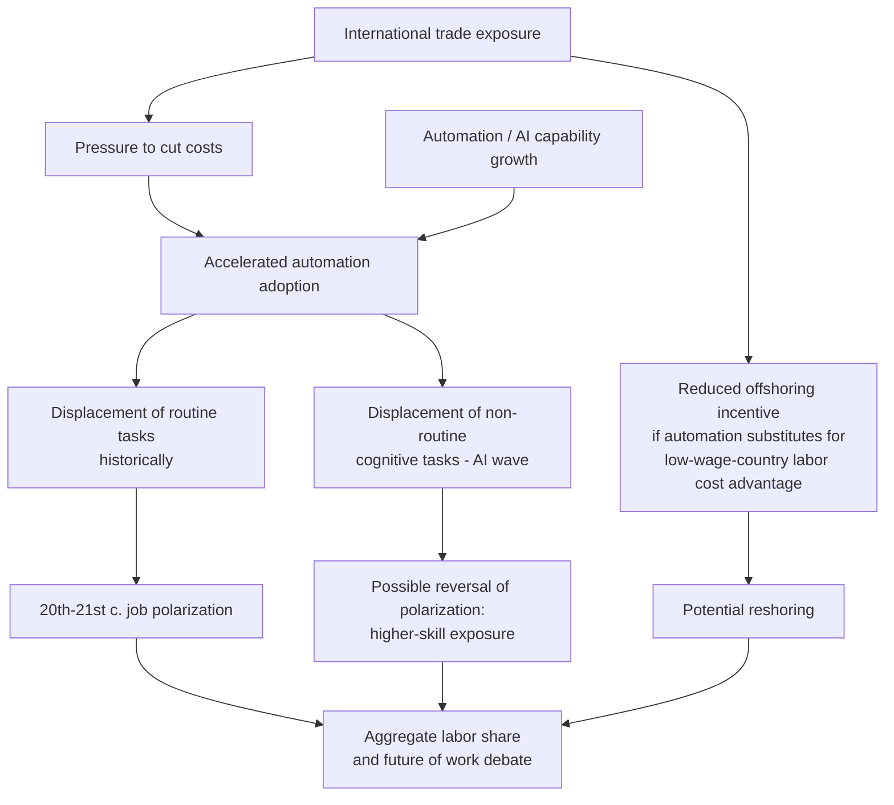

## Trade, Automation, and the Future of Work

### Framing the Topic

This topic synthesizes two labor-displacing forces — international trade and automation (including advances in robotics, software, and artificial intelligence) — and asks how their combined and interacting effects are likely to reshape labor markets going forward. It builds directly on the task-based framework introduced in job polarization analysis but extends it forward-looking: rather than only explaining historical employment shifts, this topic addresses projections, emerging technologies (notably AI), and unresolved policy debates about the *future* trajectory of labor demand.

### Conceptual Distinction: Substitutes vs. Complements

**Key Points**

- Both trade and automation can act on labor in two opposing ways: as a **substitute** (replacing human labor directly, lowering demand for a given task) or as a **complement** (raising the productivity of remaining human labor, increasing demand for it)
- Whether a specific technology or trade shock is substituting or complementing a given occupation depends on the **task composition** of that occupation — this is the same task-based logic from the routine-biased technical change (RBTC) framework, extended forward to cover a wider set of technologies
- **Acemoglu and Restrepo's task-based model of automation** (developed in several papers in the 2010s–2020s) formalizes this: automation directly displaces labor performing automated tasks (a **displacement effect**, which lowers labor demand and the labor share of income), but simultaneously creates a **productivity effect** (cheaper production raises output and can increase demand for labor in non-automated complementary tasks) and can create entirely **new tasks** in which labor has a comparative advantage (a **reinstatement effect**) — for example, new occupations created directly by the automation technology itself (e.g., robot maintenance technicians, AI systems trainers, data annotation specialists)
- The net effect on aggregate labor demand and wages depends on the relative magnitude of displacement versus productivity/reinstatement effects, which is an empirical question rather than one resolved by theory alone

### Artificial Intelligence as a Distinct Automation Wave

**Key Points**

- Historically, automation (industrial robotics, computerization) was most concentrated in **routine tasks** (per RBTC), leaving **non-routine cognitive tasks** relatively insulated — this asymmetry underpinned the polarization pattern (see *Trade and job polarization*)
- [Inference] The emergence of large language models and generative AI systems in the 2020s is frequently characterized in the economics literature as a departure from this historical pattern, because these systems demonstrate capability in *non-routine cognitive* tasks (writing, analysis, coding, customer interaction, certain forms of professional judgment) that were previously considered largely automation-resistant
- This has prompted a reassessment of which occupations are "exposed" to automation going forward: exposure indices are being reconstructed (e.g., research from Eloundou, Manning, Mishkin, and Rock at OpenAI; and separate work by researchers including Acemoglu and coauthors) to measure LLM exposure by occupation, generally finding that **higher-wage, higher-education occupations** show *greater* exposure to this specific technology than they did to earlier waves of routine-task automation — a potential reversal of the historical polarization pattern, though this remains a live and contested empirical question as of the current literature
- [Speculation] Whether AI exposure translates into net labor demand *reduction* for exposed occupations depends on whether AI functions primarily as a substitute (performing the task instead of a human) or a complement (a tool that increases an individual worker's output, e.g., augmenting rather than replacing a given professional) — early evidence in specific domains (customer support, coding assistance, and certain writing tasks) has been used to argue for both interpretations, and the aggregate labor market effect over a longer horizon is not yet settled in the empirical literature

### Interaction Between Trade and Automation

**Key Points**

- Trade and automation do not operate independently; there are important feedback effects between them:
  - **Automation can reduce the incentive to offshore**: if a task becomes cheap to automate domestically, the wage-cost advantage of moving that task to a lower-wage country may become less relevant, since capital costs (robots, software) rather than labor costs dominate the production decision. This is sometimes discussed under "reshoring" driven by automation rather than by trade policy
  - **Trade can accelerate automation adoption**: import competition can pressure domestic firms to adopt labor-saving technology faster in order to remain cost-competitive, meaning some job losses attributed to "trade" in raw before/after employment data may operate partly through an automation-adoption channel triggered by trade exposure
  - **Global value chains and task offshorability**: as some tasks within a value chain become automatable, the offshorability of the *remaining* human-performed tasks changes — automation of routine sub-tasks can leave a residual set of non-routine tasks that are *harder* to offshore (because they require situational judgment or physical presence), which can affect the geography of where value-chain segments are located
- This interconnection reinforces the empirical identification challenge discussed under *Trade and job polarization*: distinguishing "trade caused this" from "automation caused this" is complicated further when trade exposure itself is a causal driver of a firm's automation investment decisions

### Labor Share of Income

- A recurring aggregate-level concern in this literature is the declining **labor share of income** (the share of GDP paid to labor rather than capital) observed in many advanced economies since roughly the 1980s–2000s
- [Unverified — cite specific figures cautiously] Multiple empirical studies (including work associated with Karabarbounis and Neiman, and separately Autor, Dorn, Katz, Patterson, and Van Reenen on "superstar firms") have investigated whether this decline is attributable to automation (capital increasingly substituting for labor in production), trade and globalization (shifting production toward capital-intensive or lower-labor-share industries/firms), rising market concentration, or some combination — the relative contribution of each channel remains actively debated and appears to vary by country, industry, and time period studied

### Diagrammatic Representation: Acemoglu-Restrepo Task Framework

(svg_diagram)

<svg xmlns="http://www.w3.org/2000/svg" viewBox="0 0 900 460" font-family="Helvetica, Arial, sans-serif">
<text x="450" y="28" text-anchor="middle" font-size="18" font-weight="bold" fill="#1a1a2e">Net Effect of Automation on Labor Demand (svg_diagram)</text>
<rect x="60" y="70" width="220" height="90" rx="8" fill="#fce8e6" stroke="#a54a4a" stroke-width="1.5" />
<text x="170" y="100" text-anchor="middle" font-size="13" font-weight="bold" fill="#1a1a2e">Displacement Effect</text>
<text x="170" y="120" text-anchor="middle" font-size="12" fill="#333">Automated tasks no longer</text>
<text x="170" y="136" text-anchor="middle" font-size="12" fill="#333">require human labor</text>
<text x="170" y="152" text-anchor="middle" font-size="12" fill="#a54a4a" font-weight="bold">↓ labor demand</text>
<rect x="340" y="70" width="220" height="90" rx="8" fill="#e6f4ea" stroke="#3a7a4e" stroke-width="1.5" />
<text x="450" y="100" text-anchor="middle" font-size="13" font-weight="bold" fill="#1a1a2e">Productivity Effect</text>
<text x="450" y="120" text-anchor="middle" font-size="12" fill="#333">Cheaper output raises</text>
<text x="450" y="136" text-anchor="middle" font-size="12" fill="#333">demand for complementary tasks</text>
<text x="450" y="152" text-anchor="middle" font-size="12" fill="#3a7a4e" font-weight="bold">↑ labor demand</text>
<rect x="620" y="70" width="220" height="90" rx="8" fill="#e6f4ea" stroke="#3a7a4e" stroke-width="1.5" />
<text x="730" y="100" text-anchor="middle" font-size="13" font-weight="bold" fill="#1a1a2e">Reinstatement Effect</text>
<text x="730" y="120" text-anchor="middle" font-size="12" fill="#333">New tasks created where</text>
<text x="730" y="136" text-anchor="middle" font-size="12" fill="#333">labor has comparative advantage</text>
<text x="730" y="152" text-anchor="middle" font-size="12" fill="#3a7a4e" font-weight="bold">↑ labor demand</text>
<line x1="170" y1="160" x2="450" y2="230" stroke="#333" stroke-width="1.2" marker-end="url(#arrow2)" />
<line x1="450" y1="160" x2="450" y2="230" stroke="#333" stroke-width="1.2" marker-end="url(#arrow2)" />
<line x1="730" y1="160" x2="450" y2="230" stroke="#333" stroke-width="1.2" marker-end="url(#arrow2)" />
<rect x="330" y="230" width="240" height="70" rx="8" fill="#fff3cd" stroke="#c9962b" stroke-width="1.5" />
<text x="450" y="260" text-anchor="middle" font-size="13" font-weight="bold" fill="#1a1a2e">Net Labor Demand Effect</text>
<text x="450" y="280" text-anchor="middle" font-size="12" fill="#333">= empirically ambiguous,</text>
<text x="450" y="295" text-anchor="middle" font-size="11" fill="#333">depends on relative magnitudes</text>
<line x1="450" y1="300" x2="450" y2="340" stroke="#333" stroke-width="1.2" marker-end="url(#arrow2)" />

<text x="450" y="365" text-anchor="middle" font-size="12" fill="`#1a1a2e`">Determines: wage levels, employment composition,</text>

<text x="450" y="382" text-anchor="middle" font-size="12" fill="`#1a1a2e`">occupational structure, and labor share of income</text>

</svg>

### Mermaid: Forward-Looking Interaction Map

### Policy and Research Frontiers

**Key Points**

- **Universal Basic Income (UBI) and broader safety-net redesign**: proposed partly in response to concerns that AI-driven automation could affect a broader swath of occupations (including previously insulated high-skill ones) than earlier automation waves, making narrowly targeted programs like trade adjustment assistance insufficient in scope
- **Portable benefits and lifelong learning accounts**: policy proposals aimed at decoupling benefits (health insurance, retirement, training funds) from a single employer or occupation, anticipating more frequent occupational transitions driven by both trade and automation
- **Taxation of automation/capital vs. labor**: debates over whether tax policy should be adjusted (e.g., proposals for a "robot tax" or revised capital taxation) to offset the declining labor share and fund adjustment programs, weighed against concerns that such taxes could themselves discourage productivity-enhancing investment
- **Measurement and monitoring challenges**: because AI-driven task automation is a very recent phenomenon relative to the multi-decade evidence base on trade and industrial-robot automation, [Speculation] much of the current policy discussion is necessarily more forward-looking and less empirically grounded than the historical RBTC and China-shock literatures, and researchers caution against over-extrapolating from early-stage adoption data
- **International dimension**: the interaction between AI-driven automation and trade may alter which countries retain comparative advantage in labor-intensive production, with potential implications for developing economies whose growth strategies have historically relied on labor-cost-based export competitiveness (a concern sometimes referred to as "premature deindustrialization" risk)

### Related Topics

- Acemoglu-Restrepo task-based model of automation (displacement, productivity, reinstatement effects)
- Trade and job polarization
- Trade adjustment assistance programs
- Labor share of income and superstar firms
- Global value chains and comparative advantage in production tasks
- Universal Basic Income and social safety net redesign
- Premature deindustrialization in developing economies
- Artificial intelligence exposure indices and occupational risk measurement