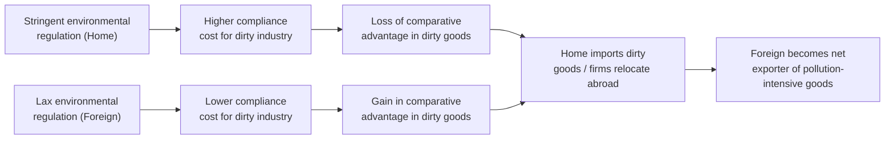

## The Pollution Haven Hypothesis

### Definition

The pollution haven hypothesis (PHH) proposes that when countries with strict environmental regulations trade freely with countries that have weak or poorly enforced environmental regulations, pollution-intensive industries will relocate (via trade or foreign direct investment) to the low-regulation countries. This occurs because weaker regulations lower compliance costs, giving firms in those jurisdictions a comparative cost advantage in pollution-intensive production.

### Theoretical Foundations

#### Origins in Trade Theory

The hypothesis extends standard Heckscher-Ohlin comparative advantage logic. Instead of countries specializing according to relative factor endowments (capital, labor), they specialize according to relative *environmental stringency*. A country with lax environmental standards effectively has an abundant, cheap "factor" — the capacity to absorb pollution — and exports pollution-intensive goods, while stringent-regulation countries import them.

#### Formal Mechanism

Environmental regulation acts as an implicit tax on production. Let $c_i$ be the private marginal cost of production and $\tau_i$ the regulatory compliance cost in country $i$. Total cost is:

$$C_i = c_i + \tau_i$$

If $\tau_{home} > \tau_{foreign}$ for a pollution-intensive good, and factor costs are otherwise similar, firms face an incentive to shift production (or investment) toward the foreign, low-$\tau$ location, holding other comparative-advantage determinants constant.

#### Distinction from Related Concepts

- **Pollution Haven Hypothesis (PHH):** the theoretical prediction that trade liberalization causes dirty industries to migrate to low-regulation countries.
- **Pollution Haven Effect (PHE):** the narrower, empirically testable claim that environmental regulation stringency measurably affects trade flows, FDI location, or plant-level relocation decisions.
- **Race to the Bottom (RTB):** a related but distinct hypothesis — that competition for mobile capital induces governments to *strategically weaken* their own environmental standards, rather than simply exploiting pre-existing differences.

**Key Points**

- PHH is about *given* regulatory differences driving trade/investment patterns.
- Race to the bottom is about regulatory differences *emerging endogenously* from competitive pressure between governments.
- The two are often conflated in casual discussion but tested with different empirical strategies.

### Diagrammatic Representation

### Channels of Relocation

1. **Trade channel:** Home country imports more pollution-intensive goods rather than producing them domestically.
2. **FDI/offshoring channel:** Multinational firms site new pollution-intensive plants in low-regulation jurisdictions.
3. **Capital flight channel:** Existing firms shift investment or shutter high-cost domestic facilities in favor of foreign expansion.

### Empirical Evidence

#### Mixed and Contested Findings

Empirical support for PHH is notably weaker and more contested than the theory's intuitive appeal suggests. [Inference] This gap is widely attributed by researchers to several confounding factors rather than to the mechanism being false.

#### Why Evidence Is Mixed

- **Regulation is not the dominant cost factor.** Pollution abatement costs are typically a small fraction of total production costs for most industries, so they are often dominated by labor costs, capital costs, proximity to markets, and infrastructure quality.
- **Endogeneity of regulation.** Countries that attract pollution-intensive industry may also be countries that *choose* laxer regulation partly *because* they already have a comparative advantage in heavy industry (reverse causality), confounding simple cross-sectional tests.
- **Measurement difficulty.** Environmental stringency is hard to quantify and compare across countries; proxies (e.g., pollution abatement costs, environmental policy indices) are imperfect.
- **Aggregation bias.** Highly aggregated trade/industry data can mask pollution-haven effects visible only at the plant or sector level.

#### Notable Empirical Strands

- Cross-country/cross-industry regressions (e.g., studies following Grossman and Krueger's NAFTA-era work) find only weak or inconsistent PHH effects at the aggregate level. [Unverified — specific coefficient magnitudes vary substantially by study and dataset]
- Plant-level and firm-level studies, which better control for confounders, tend to find *some* evidence of pollution haven behavior, particularly for the most pollution-intensive sub-sectors (e.g., some segments of chemicals, metals, and paper industries). [Inference]
- Studies examining U.S. outbound FDI and Chinese inbound FDI have found more supportive evidence in specific contexts. [Unverified]

**Key Points**

- The PHH is theoretically coherent but empirically fragile at high levels of aggregation.
- Effects are more visible in disaggregated, industry- or plant-level data.
- Reverse causality and confounding variables are the central methodological challenges.

### The Pollution Haven Effect vs. the Factor Endowment Effect

An important critique (associated with Antweiler, Copeland, and Taylor's work decomposing trade's effect on the environment) separates trade's environmental impact into three effects:

$$\Delta \text{Pollution} = \text{Scale Effect} + \text{Composition Effect} + \text{Technique Effect}$$

- **Scale effect:** more trade → more total output → more pollution (holding composition and technology fixed).
- **Composition effect:** trade shifts the *mix* of industries a country produces (this is where PHH operates — if composition shifts toward dirty industries due to lax regulation, this is a manifestation of PHH).
- **Technique effect:** trade-induced income growth raises demand for environmental quality, often *lowering* pollution intensity per unit of output (the empirical basis for the Environmental Kuznets Curve argument).

**Key Points**

- The composition effect is only part of trade's total environmental impact.
- Empirically, the technique effect (richer countries adopting cleaner technology) has sometimes dominated the composition effect, muting the net PHH signal in aggregate pollution data. [Inference]

### Factor Endowment Hypothesis (Competing Explanation)

An alternative explanation for why developing countries export pollution-intensive goods: capital-intensive, pollution-intensive industries (e.g., heavy manufacturing, chemicals) may simply follow standard Heckscher-Ohlin capital-abundance logic, independent of regulatory laxity. Under this view, apparent "pollution havens" are actually just capital-abundant or resource-abundant countries exporting according to conventional comparative advantage, with regulatory stringency incidental rather than causal.

### Policy Implications

#### Race-to-the-Bottom Concerns

If PHH operates strongly, it creates a policy dilemma: countries may hesitate to tighten environmental regulation for fear of losing industrial competitiveness and investment, producing downward pressure on global environmental standards.

#### Border Carbon Adjustments (BCAs)

A leading real-world policy response designed explicitly around PHH logic. Mechanism:

$$\text{Import Tariff}_{BCA} = \tau_{domestic} \times \text{embedded emissions in imported good}$$

The EU's Carbon Border Adjustment Mechanism (CBAM) is a current example, designed to equalize the carbon cost faced by domestic and foreign producers, neutralizing the pollution-haven incentive for high-emission imports. [Inference — CBAM's real-world effectiveness at preventing relocation is still being assessed since full implementation is recent]

#### Environmental Side Agreements

Trade agreements increasingly include environmental chapters or side agreements (e.g., NAFTA's environmental side agreement, USMCA's environment chapter) intended to prevent regulatory competition from eroding standards.

### Worked Example

**Example**

Consider two countries producing a pollution-intensive good, "chemical manufacturing":

|  | Country A (strict regulation) | Country B (lax regulation) |
| --- | --- | --- |
| Private production cost | $40/unit | $40/unit |
| Environmental compliance cost | $15/unit | $3/unit |
| Total cost | $55/unit | $43/unit |

Under free trade, Country B has a $12/unit cost advantage purely from regulatory differences. Absent offsetting factors (labor costs, transport costs, technology gaps), firms in the chemical sector have an incentive to:

1. Expand production in Country B and export to Country A, or
2. Relocate manufacturing FDI from A to B.

If Country A introduces a border carbon adjustment equal to the $12 regulatory cost differential, the price advantage is neutralized, and the incentive to relocate purely for regulatory arbitrage disappears — though other cost differences (wages, capital costs) would still influence location decisions.

### Illustrative Diagram: Cost-Driven Relocation Decision

<svg xmlns="http://www.w3.org/2000/svg" viewBox="0 0 700 380">
<text x="350" y="25" text-anchor="middle" font-size="16" font-weight="bold" fill="#1a1a1a">Pollution Haven Relocation Decision (svg_diagram)</text>
<line x1="80" y1="320" x2="620" y2="320" stroke="#333" stroke-width="2" />
<line x1="80" y1="320" x2="80" y2="60" stroke="#333" stroke-width="2" />
<text x="350" y="355" text-anchor="middle" font-size="13" fill="#333">Environmental Regulation Stringency</text>
<text x="30" y="190" text-anchor="middle" font-size="13" fill="#333" transform="rotate(-90 30 190)">Production Cost ($)</text>
<line x1="80" y1="290" x2="600" y2="90" stroke="#c0392b" stroke-width="3" />
<text x="605" y="90" font-size="12" fill="#c0392b">Compliance Cost</text>
<line x1="80" y1="150" x2="600" y2="150" stroke="#2980b9" stroke-width="3" stroke-dasharray="6,4" />
<text x="605" y="150" font-size="12" fill="#2980b9">Private Cost (constant)</text>
<circle cx="180" cy="182" r="6" fill="#27ae60" />
<text x="190" y="178" font-size="12" fill="#27ae60">Country B (Haven)</text>
<circle cx="480" cy="248" r="6" fill="#8e44ad" />
<text x="360" y="240" font-size="12" fill="#8e44ad">Country A (Strict)</text>
<line x1="180" y1="182" x2="480" y2="248" stroke="#333" stroke-width="1.5" stroke-dasharray="3,3" />
<text x="260" y="205" font-size="11" fill="#333">Relocation incentive →</text>
</svg>

### Common Misconceptions

- **Misconception:** PHH implies all dirty industry inevitably moves to poor countries. **Reality:** Empirical evidence shows the effect is often small relative to other location determinants like labor productivity, infrastructure, and market access.
- **Misconception:** PHH and race-to-the-bottom are the same theory. **Reality:** PHH assumes regulatory differences as given; race-to-the-bottom is about strategic downward adjustment of regulation itself.
- **Misconception:** Evidence against strong aggregate PHH effects means environmental regulation has no effect on trade. **Reality:** Disaggregated and plant-level studies do find measurable effects in specific pollution-intensive sectors.

### Related Topics

- Environmental Kuznets Curve
- Porter Hypothesis (regulation-driven innovation)
- Scale, composition, and technique effects decomposition
- Border carbon adjustment mechanisms (EU CBAM)
- Race-to-the-bottom in environmental and labor standards
- Heckscher-Ohlin model and factor endowment theory
- Trade and environmental side agreements (NAFTA/USMCA)
- Foreign direct investment location theory