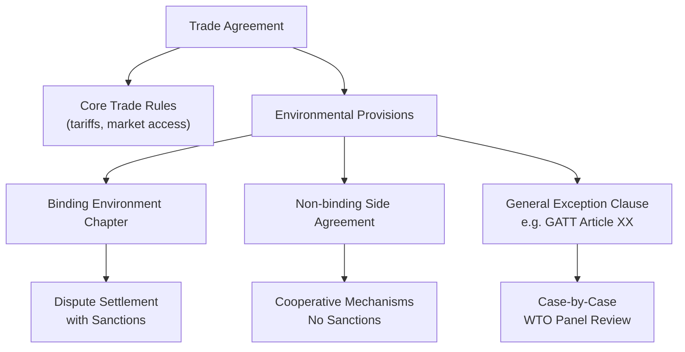

## Environmental standards in trade agreements

### Definition

Environmental standards in trade agreements refer to the provisions, chapters, side agreements, or clauses embedded within bilateral or multilateral trade agreements that establish binding or non-binding commitments related to environmental protection, regulatory enforcement, and sustainable resource management among trading partners. These provisions aim to reconcile trade liberalization objectives with environmental policy goals.

### Rationale for Inclusion

#### Addressing Race-to-the-Bottom Concerns

Environmental provisions are partly a policy response to fears that trade liberalization without environmental safeguards could trigger a race to the bottom, where countries compete for investment by weakening environmental enforcement, or enable pollution haven dynamics where production shifts to jurisdictions with laxer standards.

#### Correcting Market Failures

Trade agreements historically focused on removing tariff and non-tariff barriers to maximize gains from trade, implicitly assuming environmental externalities were addressed by domestic policy alone. Embedding environmental standards acknowledges that:

$$\text{Social Cost of Production} = \text{Private Cost} + \text{Environmental Externality}$$

Without harmonized minimum standards or enforcement mechanisms, trade can expand production in externality-generating sectors without correcting for the wedge between private and social cost.

### Typology of Environmental Provisions

#### Structural Categories

1. **Environmental side agreements:** standalone accords negotiated alongside but separate from the core trade agreement (e.g., the North American Agreement on Environmental Cooperation, NAAEC, attached to NAFTA).
2. **Environment chapters:** provisions integrated directly into the body of the trade agreement itself, generally considered more enforceable than side agreements (e.g., USMCA's Environment Chapter, EU trade agreements' Trade and Sustainable Development chapters).
3. **General exception clauses:** provisions such as GATT Article XX, which allow WTO members to adopt trade-restrictive measures "necessary to protect human, animal or plant life or health" or "relating to the conservation of exhaustible natural resources," subject to conditions preventing disguised protectionism.
4. **Preambular/aspirational language:** references to sustainable development or environmental cooperation in an agreement's preamble, typically non-binding and without dispute-resolution mechanisms.

**Key Points**

- The shift from side agreements (NAFTA-era) to integrated chapters (USMCA-era) reflects an evolution toward stronger enforceability.
- Not all environmental provisions carry the same legal weight; many are hortatory rather than binding.

### Diagrammatic Overview

### Enforcement Mechanisms

#### Dispute Settlement Design

The strength of environmental provisions depends heavily on whether violations are subject to the same dispute-resolution and sanction mechanisms as commercial trade violations:

- **State-to-state dispute settlement with trade sanctions:** the strongest enforcement form, where a finding of environmental non-compliance can trigger tariff retaliation or other trade penalties, structurally equivalent to commercial dispute enforcement. USMCA's environment chapter moved toward this model relative to NAFTA's side agreement.
- **Cooperative/consultative mechanisms only:** parties commit to dialogue, joint committees, or technical assistance, but non-compliance carries no direct trade consequence — characteristic of many EU Trade and Sustainable Development (TSD) chapters historically. [Inference — EU approach has been evolving toward stronger enforcement in newer agreements]
- **Civil society complaint mechanisms:** allow citizens or NGOs to file complaints regarding a government's failure to enforce its own environmental laws, as under NAAEC's citizen submission process.

#### The "Non-Derogation" Principle

A common textual commitment in modern agreements: parties agree not to weaken or fail to enforce existing domestic environmental laws in order to attract trade or investment (a direct legal response to race-to-the-bottom concerns). Example structure:

> "A Party shall not waive or otherwise derogate from, or offer to waive or otherwise derogate from, its environmental laws in a manner that weakens or reduces the protections afforded in those laws in order to encourage trade or investment."

[Inference — exact wording varies by agreement; this reflects the general legal pattern found in USMCA-style non-derogation clauses]

### WTO Framework and Environmental Standards

#### GATT Article XX Exceptions

Article XX(b) and Article XX(g) permit environment-related trade restrictions if they meet a two-part test:

1. The measure must fall within one of the listed exceptions (necessary to protect life/health, or relating to conservation of exhaustible natural resources).
2. The measure must satisfy the Article XX *chapeau*, requiring that it not be applied in a manner constituting "arbitrary or unjustifiable discrimination" or "a disguised restriction on international trade."

#### Landmark WTO Disputes

- **US–Shrimp/Turtle (1998):** the WTO Appellate Body found that a US import ban on shrimp caught without turtle-excluder devices could, in principle, be justified under Article XX(g), representing an important precedent for environmental measures, though the specific US measure initially failed the chapeau test due to its discriminatory application. [Unverified — precise procedural history involves multiple panel/Appellate Body stages]
- **US–Tuna/Dolphin (1991, GATT era):** an earlier panel ruling that was more skeptical of extraterritorial environmental trade measures, often cited as representing the pre-Shrimp/Turtle, more trade-restrictive-averse era of environmental jurisprudence.

**Key Points**

- WTO case law has evolved to be more accommodating of environmental trade measures over time, provided they are non-discriminatory and not disguised protectionism.
- Article XX does not create an obligation to adopt environmental standards; it is a defense mechanism allowing deviation from trade rules for environmental reasons.

### Comparative Design Across Major Agreements

| Agreement | Environmental Mechanism | Enforcement Strength |
| --- | --- | --- |
| NAFTA (1994) | NAAEC side agreement | Weak — citizen submissions, no trade sanctions |
| USMCA (2020) | Integrated Environment Chapter | Stronger — subject to state-to-state dispute settlement |
| EU trade agreements (typical) | Trade and Sustainable Development (TSD) chapter | Historically cooperative; some newer agreements adding sanctionable elements [Inference] |
| CPTPP | Environment Chapter | Moderate — dispute settlement applies but remedies are more limited than commercial provisions [Unverified] |

### Economic Analysis of Environmental Standards in Trade Agreements

#### Trade-Off Framework

Embedding environmental standards involves balancing two policy objectives that can be in tension:

$$\max_{\text{Policy}} \; W = f(\text{Trade Gains}, \text{Environmental Quality})$$

subject to political economy constraints from both export-oriented industries (favoring minimal environmental constraints) and import-competing/environmental constituencies (favoring stronger standards).

#### Potential Costs of Strict Provisions

- **Reduced market access for developing countries:** if environmental standards function as a de facto non-tariff barrier, they may disproportionately restrict market access for lower-income trading partners with less capacity for rapid regulatory upgrading. [Inference]
- **Green protectionism concerns:** environmental provisions can be used strategically to protect domestic industries from competition under an environmental justification (a variant of the "disguised restriction" concern addressed by the GATT Article XX chapeau).

#### Potential Benefits

- **Reduces pollution haven incentives** by narrowing the regulatory-cost gap that drives relocation of pollution-intensive industry.
- **Provides technical assistance and capacity-building mechanisms**, in some agreement designs, to help lower-income partners upgrade environmental governance rather than simply imposing standards.

### Worked Example

**Example**

Consider two countries negotiating a bilateral trade agreement. Country X has strict $SO_2$ emissions limits; Country Y has minimal enforcement. Three possible provision designs:

1. **No environmental provision:** tariffs fall, trade in $SO_2$-intensive goods expands from Y to X; pollution haven dynamics unconstrained.
2. **Side agreement only (NAFTA-style):** a joint environmental commission is created, citizens can file complaints about non-enforcement, but no trade sanctions apply even if Y's enforcement remains weak.
3. **Integrated chapter with non-derogation clause and dispute settlement (USMCA-style):** if Y is found to have weakened enforcement specifically to attract investment, X can pursue formal dispute settlement, potentially resulting in trade sanctions comparable to a commercial dispute.

The three designs produce materially different incentive structures for Country Y's environmental policy choices, illustrating why enforcement mechanism design — not just the existence of environmental text — determines real-world impact. [Inference — stylized example illustrating general mechanism design principles]

### Common Misconceptions

- **Misconception:** any mention of "environment" in a trade agreement is equally binding. **Reality:** enforceability varies enormously, from purely aspirational preamble language to fully sanctionable chapters.
- **Misconception:** WTO rules categorically prohibit environmental trade restrictions. **Reality:** GATT Article XX explicitly permits certain environmental exceptions, subject to non-discrimination requirements.
- **Misconception:** environmental provisions in trade agreements are primarily about protecting the environment abroad. **Reality:** many provisions (especially non-derogation clauses) are designed to prevent a country from weakening its *own* domestic standards for competitive reasons.

### Related Topics

- Pollution haven hypothesis
- Race to the bottom in environmental regulation
- GATT Article XX and WTO environmental jurisprudence
- Border carbon adjustment mechanisms
- Trade and Sustainable Development (TSD) chapters (EU model)
- USMCA Environment Chapter case studies
- Environmental Kuznets curve
- Multilateral Environmental Agreements (MEAs) and trade law interactions