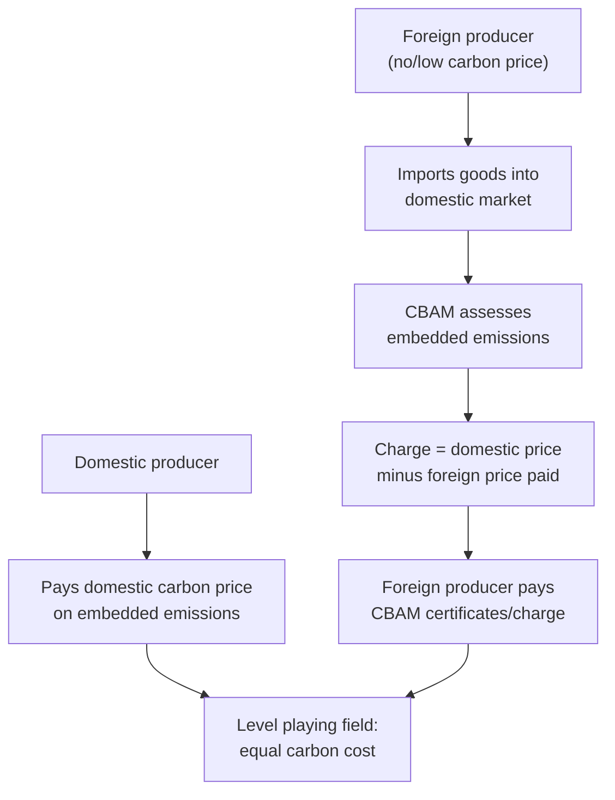

## Carbon Border Adjustment Mechanisms

### Definition

A carbon border adjustment mechanism (CBAM) is a trade policy instrument that imposes a carbon-price-equivalent charge on imported goods based on the greenhouse gas emissions embedded in their production, designed to equalize the carbon cost faced by domestic producers (who pay a domestic carbon price) and foreign producers (who may not). The mechanism is intended to prevent carbon leakage and neutralize pollution-haven incentives created by asymmetric climate policy stringency across countries.

### Theoretical Rationale

#### The Carbon Leakage Problem

When one jurisdiction imposes a domestic carbon price (via a carbon tax or emissions trading system) while trading partners do not, domestic energy-intensive, trade-exposed (EITE) industries face a cost disadvantage:

$$C_{domestic} = c + p_{CO_2} \times e$$

where $c$ is the private production cost, $p_{CO_2}$ is the domestic carbon price, and $e$ is emissions intensity per unit of output. If $p_{CO_2}^{foreign} = 0$ or is substantially lower, foreign producers face $C_{foreign} = c$, creating a cost gap of $p_{CO_2} \times e$ that can drive:

1. **Competitiveness leakage:** domestic firms lose market share to untaxed foreign competitors.
2. **Investment leakage:** new capital investment shifts to jurisdictions without carbon pricing.
3. **Output/emissions leakage:** global emissions do not fall proportionally to the domestic policy's stringency, because production (and its associated emissions) simply relocates rather than declines.

#### CBAM as a Corrective Mechanism

A CBAM levies a charge on imports equal to the domestic carbon price applied to the good's embedded emissions, closing the cost gap:

$$\text{CBAM Charge} = (p_{CO_2}^{domestic} - p_{CO_2}^{foreign,\, effective}) \times e_{embedded}$$

where $p_{CO_2}^{foreign,\, effective}$ is the carbon price (if any) already paid in the country of origin, deducted to avoid double taxation.

### Diagrammatic Representation

### Design Architecture

#### Core Structural Components

1. **Product scope:** typically limited to a defined list of carbon-intensive, trade-exposed sectors rather than the full economy, due to administrative complexity of measuring embedded emissions across all goods.
2. **Emissions accounting boundary:** decisions on whether to cover only direct emissions (from the production process itself) or also indirect emissions (from electricity consumed in production), and whether to include upstream supply-chain emissions.
3. **Benchmark/default values vs. actual emissions data:** systems typically allow importers to report actual, verified installation-level emissions, falling back to conservative default/benchmark values when actual data is unavailable or unverifiable.
4. **Certificate or tax mechanism:** the charge can be implemented as a requirement to purchase and surrender tradable certificates (pegged to the domestic carbon price) or as a direct border tax/levy.
5. **Foreign carbon price deduction:** a credit mechanism to subtract any carbon price already effectively paid in the country of origin, preventing double-charging and maintaining WTO-consistency arguments around non-discrimination.
6. **Free allocation phase-out linkage:** in cap-and-trade systems that previously gave EITE industries free emissions allowances to prevent leakage, CBAM implementation is typically phased in as free allocation is phased out, to avoid double protection for domestic industry.

**Key Points**

- CBAM does not replace domestic carbon pricing; it extends the domestic price to imports.
- The credit for foreign carbon prices paid is central to the mechanism's non-discrimination design and its case for WTO compatibility.

### The EU CBAM: Institutional Case Study

#### Regulatory Timeline

The EU's CBAM, established under Regulation (EU) 2023/956, is the most developed real-world implementation. CBAM applies in its definitive regime from 2026, with a transitional phase running from 2023 to 2025, and this gradual introduction is aligned with the phase-out of free allowances under the EU Emissions Trading System (ETS) to support the decarbonisation of EU industry.

During the transitional phase, importers of goods in scope only had to report embedded greenhouse gas emissions without needing to buy and surrender certificates, functioning as a pilot and learning period for stakeholders to collect information on embedded emissions and refine the methodology.

#### Definitive Regime (2026 Onward)

As of the current date, CBAM has been operating in the definitive regime since 01/01/2026, and unlike the transitional phase, CBAM declarations must now be submitted annually rather than quarterly, with the first declaration due by 30/09/2027 for the 2026 reporting year. CBAM certificates corresponding to reported embedded emissions must also be surrendered annually. [Dehst](https://www.dehst.de/EN/Topics/CBAM/CBAM-definitive-regime-2026/cbam-definitive-regime-2026_node.html)[Dehst](https://www.dehst.de/EN/Topics/CBAM/CBAM-definitive-regime-2026/cbam-definitive-regime-2026_node.html)

Key procedural requirements under the definitive regime:

- Importers must hold "authorised CBAM declarant" status to import CBAM goods into the EU after 1 January 2026.
- A mass-based threshold of 50 tonnes of CBAM goods per year determines whether the obligation applies, exempting smaller importers from full compliance obligations.
- Emissions must be calculated at the level of the individual production installation, with company-wide or regional emission factor averages generally insufficient, and calculations must align with EU-approved methodologies defining system boundaries and calculation formulas. [ASUENE](https://asuene.com/us/blog/cbam-enters-its-definitive-phase-on-january-1-2026-what-companies-must-be-ready-for)[ASUENE](https://asuene.com/us/blog/cbam-enters-its-definitive-phase-on-january-1-2026-what-companies-must-be-ready-for)
- From 2026 onward, documentation must support third-party verification, and data that cannot be traced or explained is likely to be rejected. [ASUENE](https://asuene.com/us/blog/cbam-enters-its-definitive-phase-on-january-1-2026-what-companies-must-be-ready-for)

#### Carbon Price Crediting Mechanism

The Amended CBAM Regulation establishes a two-track system for deducting carbon prices paid in a third country: actual carbon price paid, net of rebates or compensation and certified by an independent person with four-year record-keeping requirements, or default carbon prices to be set by the Commission from 2027, used when actual data is unavailable. [Herbert Smith Freehills Kramer](https://www.hsfkramer.com/notes/crt/2026-01/operationalisation-and-simplification-of-the-eu-cbam-starting-the-year-with-a-cbam)

#### Full Phase-In Timeline

CBAM was established by Regulation (EU) 2023/956 as an environmental policy tool designed to combat carbon leakage by pricing carbon emitted during production of carbon-intensive imported goods, and implementation is intended to be progressive, predictable, and proportionate for both EU and non-EU companies. Once fully implemented in 2034, importers will be required to purchase certificates equivalent to the carbon price that would have applied had the goods been produced under the EU's own carbon pricing rules, mirroring the complete phase-out of free ETS allocation. [Start of the definitive period of the CBAM in the EU | Access2Markets +2](https://trade.ec.europa.eu/access-to-markets/en/news/start-definitive-period-cbam-eu)

**Key Points**

- The EU CBAM is being phased in gradually through 2034, deliberately mirrored to the phase-out schedule of free EU ETS allowances for domestic industry.
- Installation-level, verified emissions data (not national averages) is the preferred reporting basis, reflecting an intent to closely track actual production processes.
- December 2025 saw a significant secondary-legislation package operationalizing the definitive regime, alongside proposals to expand product scope and strengthen anti-circumvention rules. [Unverified — full scope expansion details were still being finalized at time of writing]

### Sectoral Scope (Illustrative)

CBAM-covered sectors in the EU system have included cement, iron and steel, aluminum, fertilizers, electricity, and hydrogen, reflecting industries that are both emissions-intensive and trade-exposed. [Unverified — exact product/CN-code scope is subject to periodic revision and expansion]

### WTO Compatibility Considerations

#### Non-Discrimination Requirements

For a CBAM to be defensible under WTO rules (particularly GATT Article I most-favored-nation and Article III national treatment obligations), it generally must:

1. Apply equivalently to domestic and imported goods (i.e., mirror the domestic carbon price rather than exceeding it).
2. Credit any carbon price already paid abroad, to avoid double taxation and discriminatory treatment based on origin.
3. Avoid arbitrary or unjustifiable discrimination between countries in otherwise similar circumstances (relevant to the Article XX chapeau test, as established in cases like US–Shrimp/Turtle).

#### Contested Issues

- **Differentiated treatment for developing countries:** whether and how a CBAM should account for lower development levels or historical emissions responsibility remains contested; critics argue a uniform charge disregards common-but-differentiated-responsibilities principles embedded in UNFCCC frameworks. [Inference]
- **Revenue use:** how CBAM revenue is used (e.g., general budget vs. climate finance for exporting developing countries) affects both political acceptability and legal characterization (tax vs. regulatory charge). [Unverified — legal characterization remains debated among trade law scholars]
- **Retaliation risk:** trading partners subject to CBAM charges may view the mechanism as protectionist and pursue WTO dispute settlement or retaliatory measures. [Speculation — outcomes depend on future dispute settlement rulings, which had not conclusively addressed a full CBAM challenge at time of writing]

### Economic Effects

#### Expected Impacts

- **Reduces leakage incentive:** by equalizing carbon costs at the border, CBAM narrows the pollution-haven-style incentive for carbon-intensive production to relocate.
- **Preserves domestic carbon price integrity:** allows a jurisdiction to maintain ambitious domestic climate policy without proportionally eroding its own industrial competitiveness.
- **Incentivizes foreign decarbonization:** exporting countries and firms face a financial incentive to reduce embedded emissions or adopt their own carbon pricing (since a domestic carbon price reduces or eliminates the CBAM charge owed).

#### Potential Costs and Risks

- **Administrative complexity:** verifying installation-level emissions data across thousands of foreign producers imposes significant compliance costs, particularly burdensome for smaller exporters and developing-country producers. [Inference]
- **Trade friction and retaliation:** risk of trading partners viewing CBAM as a disguised trade barrier, potentially triggering disputes or reciprocal measures.
- **Incomplete leakage coverage:** a CBAM addresses import-competition leakage but does not address leakage occurring in third-country export markets where domestic producers compete without any CBAM-equivalent protection (sometimes termed the "export problem," addressed separately by mechanisms like remaining free allocation or export rebates in some designs).

### Worked Example

**Example**

An EU cement importer brings in 1,000 tonnes of cement from a country with no domestic carbon price. Assume:

- EU ETS carbon price: $80/tonne $CO_2$
- Embedded emissions intensity of the cement: 0.6 tonnes $CO_2$ per tonne of cement
- Foreign carbon price paid: $0 (no domestic carbon pricing in the exporting country)

Total embedded emissions:

$$1{,}000 \times 0.6 = 600 \text{ tonnes } CO_2$$

CBAM certificate obligation:

$$600 \times \$80 = \$48{,}000$$

If the exporting country had a domestic carbon price of $20/tonne, the credited amount would reduce the CBAM charge:

$$600 \times (\$80 - \$20) = \$36{,}000$$

This illustrates the core mechanism: the importer's total carbon-related cost converges toward what an equivalent EU domestic producer would pay under the EU ETS, net of any carbon price already incurred abroad. [Inference — illustrative figures for pedagogical purposes, not official EU price/intensity data]

### Illustrative Diagram: Cost Equalization Effect

<svg xmlns="http://www.w3.org/2000/svg" viewBox="0 0 700 380">
<text x="350" y="25" text-anchor="middle" font-size="16" font-weight="bold" fill="#1a1a1a">CBAM Cost Equalization (svg_diagram)</text>
<line x1="100" y1="320" x2="600" y2="320" stroke="#333" stroke-width="2" />
<line x1="100" y1="320" x2="100" y2="60" stroke="#333" stroke-width="2" />
<text x="30" y="200" text-anchor="middle" font-size="12" fill="#333" transform="rotate(-90 30 200)">Total Cost per Unit</text>
<rect x="160" y="150" width="80" height="170" fill="#2980b9" />
<text x="200" y="345" text-anchor="middle" font-size="12" fill="#333">EU Producer</text>
<text x="200" y="140" text-anchor="middle" font-size="11" fill="#333">Private + Carbon Cost</text>
<rect x="320" y="230" width="80" height="90" fill="#27ae60" />
<text x="360" y="345" text-anchor="middle" font-size="12" fill="#333">Foreign Producer</text>
<text x="360" y="220" text-anchor="middle" font-size="11" fill="#333">Private Cost Only</text>
<text x="360" y="345" dy="14" text-anchor="middle" font-size="10" fill="#888">(pre-CBAM)</text>
<rect x="480" y="150" width="80" height="90" fill="#27ae60" />
<rect x="480" y="150" width="80" height="0" fill="#e67e22" />
<rect x="480" y="70" width="80" height="80" fill="#e67e22" />
<text x="520" y="345" text-anchor="middle" font-size="12" fill="#333">Foreign Producer</text>
<text x="520" y="345" dy="14" text-anchor="middle" font-size="10" fill="#888">(post-CBAM)</text>
<text x="600" y="110" font-size="11" fill="#e67e22">CBAM charge</text>
</svg>

### Comparison with Alternative Leakage Solutions

| Approach | Mechanism | Trade-Law Risk | Administrative Burden |
| --- | --- | --- | --- |
| Free allocation of allowances | Domestic firms receive emissions permits at no cost | Low | Moderate |
| Output-based rebates | Domestic firms receive rebates tied to output, not emissions reductions | Low-Moderate | Moderate |
| Carbon border adjustment | Charge imposed on imports matching domestic carbon price | Moderate (contested) | High |
| Sectoral international agreements | Coordinated carbon pricing across trading partners for specific sectors | Low | High (negotiation-intensive) |

**Key Points**

- CBAM is generally viewed as a more economically efficient leakage solution than free allocation, since it preserves the emissions-reduction incentive for domestic producers rather than shielding them entirely. [Inference]
- It carries higher trade-law and diplomatic risk than domestic-only measures like free allocation, since it directly affects the cost of imported goods.

### Common Misconceptions

- **Misconception:** CBAM is simply a tariff on "dirty" imports. **Reality:** it is designed as a carbon-price equalization mechanism tied to actual embedded emissions and any carbon price already paid abroad, not a blanket trade barrier.
- **Misconception:** CBAM charges apply regardless of the exporter's own climate policy. **Reality:** properly designed CBAMs credit foreign carbon prices already paid, reducing or eliminating the charge for exporters facing comparable carbon costs.
- **Misconception:** CBAM eliminates all forms of carbon leakage. **Reality:** it primarily addresses import-competition leakage; leakage in third-country export markets requires separate policy tools.

### Related Topics

- Pollution haven hypothesis
- Environmental standards in trade agreements
- EU Emissions Trading System (ETS) and free allocation phase-out
- Carbon leakage and competitiveness effects of climate policy
- GATT Article XX and WTO environmental jurisprudence
- Common but differentiated responsibilities (UNFCCC principle)
- Carbon pricing instruments (carbon tax vs. cap-and-trade)
- Global carbon price harmonization proposals