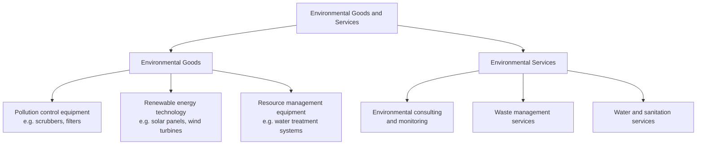

## Trade in environmental goods and services

### Definition

Trade in environmental goods and services (EGS) refers to the cross-border exchange of products, technologies, and services whose primary purpose is environmental protection, natural resource management, or pollution abatement. This includes renewable energy technology, pollution control equipment, waste management services, water treatment systems, and environmental consulting or monitoring services. Liberalizing trade in this category is often framed as a "win-win" policy — simultaneously advancing trade liberalization and environmental objectives.

### Classification Challenges

#### The Definitional Problem

Unlike most traded goods, environmental goods lack a universally agreed definition, creating substantial classification and negotiation difficulty:

1. **Dual-use goods:** many products classified as "environmental" have non-environmental uses as well (e.g., certain pipes, valves, or pumps used in both pollution control and general industrial processes), making it difficult to write tariff schedules that isolate the environmental use case.
2. **Process vs. product distinction:** a good may be environmentally friendly based on *how* it was produced (process and production method, PPM) rather than its physical characteristics — but WTO rules have historically been reluctant to allow trade discrimination based on non-product-related PPMs, since the final product is physically identical regardless of production method.
3. **List-based vs. project-based approaches:** negotiators have debated whether to define environmental goods via a fixed product list (easier to implement via tariff schedules, but rigid and quickly outdated by new technology) versus a project-based approach (assessing whether an entire investment project is "environmental," allowing more nuanced treatment but harder to administer at the border).

**Key Points**

- Classification difficulty has been a central obstacle to concluding multilateral environmental goods negotiations at the WTO.
- The PPM issue links this topic directly to broader debates about whether trade rules should account for how goods are produced, not just their final characteristics.

### Diagrammatic Overview

### Subcategories

#### Environmental Goods

- **Pollution abatement and control equipment:** air filtration systems, wastewater treatment units, catalytic converters, emissions monitoring instruments.
- **Renewable and clean energy technology:** photovoltaic cells, wind turbine components, energy-efficient lighting, and increasingly, battery storage and grid technology relevant to decarbonization. [Inference — categorization of newer technologies like storage remains contested in ongoing classification debates]
- **Resource management technology:** water purification membranes, recycling and waste-sorting machinery, soil remediation technology.

#### Environmental Services

- **Water and wastewater management services:** design, construction, and operation of treatment facilities.
- **Solid and hazardous waste management services:** collection, treatment, and disposal services.
- **Environmental consulting, engineering, and monitoring services:** environmental impact assessment, remediation planning, emissions monitoring and verification services (increasingly relevant given growth in carbon market and CBAM-related verification demand).
- **Renewable energy installation and maintenance services:** engineering, procurement, and construction (EPC) services for solar and wind projects.

### Multilateral Negotiation History

#### WTO Doha Round Mandate

Paragraph 31(iii) of the 2001 Doha Ministerial Declaration mandated negotiations on the "reduction or, as appropriate, elimination of tariff and non-tariff barriers to environmental goods and services," reflecting recognition that trade liberalization in this category could support both trade and environmental objectives. [Unverified — precise paragraph numbering and wording should be checked against the primary Doha Declaration text for citation purposes]

Progress on this mandate was limited by the broader stall of the Doha Development Round and by unresolved definitional and list-composition disputes among WTO members over which products should qualify.

#### Environmental Goods Agreement (EGA) Plurilateral Initiative

A subset of WTO members (not the full membership) launched plurilateral negotiations aiming to eliminate tariffs on a defined list of environmental goods. Key features:

- Negotiations proceeded outside the full multilateral consensus-based process, given the difficulty of achieving universal WTO membership agreement on product scope.
- The initiative encountered difficulty finalizing an agreed product list, with disagreements over inclusion of certain dual-use goods and the scope of covered technologies. [Unverified — the EGA negotiations have experienced extended stalling, and current status should be verified for any time-sensitive claim]

**Key Points**

- Plurilateral (subset-of-members) approaches have been used as a workaround to multilateral gridlock on environmental goods classification.
- Even plurilateral initiatives have struggled to reach final agreement, illustrating the depth of the classification and political economy challenges involved.

### Regional and Bilateral Approaches

Many regional trade agreements include specific tariff reduction commitments or cooperation provisions for environmental goods and services, often as part of broader environment chapters, allowing smaller groups of countries to make faster progress than multilateral negotiations permit. [Inference — specific regional agreement provisions vary considerably and should be checked individually for current, agreement-specific commitments]

### Services Trade Dimension

#### GATS Framework

Trade in environmental *services* falls under the General Agreement on Trade in Services (GATS) framework, which classifies environmental services (water treatment, sewage, refuse disposal, sanitation, and related services) as one of the twelve GATS sectoral classifications. Liberalization commitments for environmental services vary substantially by country and mode of supply:

- **Mode 1 (cross-border supply):** e.g., remote environmental monitoring or consulting.
- **Mode 2 (consumption abroad):** less relevant for most environmental services.
- **Mode 3 (commercial presence):** foreign direct investment in local water treatment or waste management operations — often the most commercially significant mode for environmental services, and also the mode most subject to domestic regulatory restrictions (e.g., foreign ownership limits in utility sectors).
- **Mode 4 (movement of natural persons):** temporary presence of foreign environmental engineers or consultants.

**Key Points**

- Environmental services liberalization is often more constrained by domestic regulatory barriers (ownership limits, licensing requirements) than by explicit tariffs, unlike environmental goods.
- Water and sanitation services frequently involve public utility considerations, making Mode 3 commitments politically sensitive even when a country is otherwise open to trade liberalization.

### Economic Rationale for Liberalization

#### Cost Reduction for Environmental Investment

Tariff and non-tariff barrier reduction on environmental goods lowers the effective cost of environmental compliance and green infrastructure investment:

$$\text{Effective Cost}_{EG} = P_{world} \times (1 + t_{EG})$$

where $t_{EG}$ is the tariff rate on environmental goods. Reducing $t_{EG}$ toward zero lowers the cost of imported renewable energy equipment, pollution control technology, and related capital goods — directly supporting both climate mitigation and environmental compliance objectives, particularly for countries lacking domestic manufacturing capacity in these sectors.

#### Complementarity with Environmental Policy Goals

Unlike much of trade-and-environment policy debate (which often frames trade liberalization and environmental protection as in tension, as with the pollution haven hypothesis), EGS liberalization is one of the few areas where trade liberalization and environmental objectives are broadly viewed as mutually reinforcing rather than competing. [Inference — this framing is common in trade-and-environment literature but does not eliminate distributional or domestic-industry competitiveness concerns within the EGS sector itself]

### Worked Example

**Example**

Consider a developing country seeking to expand solar energy capacity. Suppose imported solar panels face a 15% tariff:

$$\text{Landed Cost} = \$1{,}000{,}000 \times (1 + 0.15) = \$1{,}150{,}000$$

If an EGS tariff-elimination agreement reduces the tariff to 0%:

$$\text{Landed Cost} = \$1{,}000{,}000 \times (1 + 0) = \$1{,}000{,}000$$

The $150,000 saving on a $1 million import order directly lowers the cost of renewable energy deployment, potentially accelerating the country's energy transition and improving the economics of clean energy relative to fossil-fuel alternatives, holding all other factors (financing costs, installation labor, grid integration costs) constant. [Inference — illustrative example; actual project economics depend on many additional factors beyond the equipment tariff alone]

### Barriers Beyond Tariffs

#### Non-Tariff Barriers

- **Technical standards and certification requirements:** differing national standards for equipment safety, efficiency ratings, or environmental performance can act as de facto trade barriers even absent tariffs.
- **Local content requirements:** some countries condition subsidies or market access for renewable energy projects on domestic manufacturing content, which can conflict with WTO national treatment obligations (as seen in disputes over renewable energy subsidy programs requiring local sourcing). [Unverified — specific dispute outcomes vary and should be verified individually]
- **Intellectual property considerations:** access to patented clean technology can be a barrier for developing countries, raising a parallel debate about technology transfer mechanisms under climate agreements (e.g., UNFCCC technology transfer provisions) versus standard IP protections under TRIPS.

**Key Points**

- Tariff elimination alone does not fully liberalize trade in environmental goods and services; regulatory, standards-based, and IP-related barriers often matter as much or more.
- Local content requirements illustrate a recurring tension between industrial policy objectives (building domestic green manufacturing) and trade liberalization objectives (minimizing cost of green technology deployment).

### Common Misconceptions

- **Misconception:** an "environmental good" is a fixed, objectively defined category. **Reality:** classification is contested and negotiated, complicated by dual-use products and process-based environmental attributes that are not reflected in a product's physical characteristics.
- **Misconception:** eliminating tariffs on environmental goods is sufficient to accelerate green technology adoption. **Reality:** non-tariff barriers, technical standards, local content requirements, and IP access frequently matter as much as tariff levels.
- **Misconception:** trade liberalization and environmental protection are always in conflict. **Reality:** EGS trade is a notable case where liberalization and environmental objectives are largely complementary, in contrast to more contested areas like the pollution haven hypothesis.

### Related Topics

- Pollution haven hypothesis
- Environmental standards in trade agreements
- Carbon border adjustment mechanisms
- GATS sectoral classification and services trade liberalization
- Technology transfer under UNFCCC and TRIPS interactions
- Local content requirements and renewable energy subsidy disputes
- WTO Doha Round negotiating history
- Non-tariff barriers and technical standards harmonization