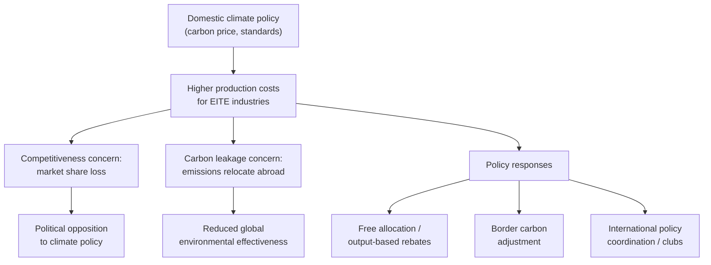

## Climate policy and international competitiveness concerns

### Definition

Climate policy and international competitiveness concerns refer to the economic and political tension that arises when a country adopts domestic climate regulation (carbon pricing, emissions standards, renewable energy mandates) while its trading partners maintain less stringent or unpriced climate policy, potentially disadvantaging domestic energy-intensive, trade-exposed (EITE) industries relative to foreign competitors.

### Conceptual Framework

#### The Asymmetric Regulation Problem

When domestic climate policy raises production costs for EITE industries without equivalent cost increases abroad, three interlinked concerns emerge:

1. **Competitiveness loss:** domestic firms in carbon-intensive sectors face higher costs than foreign competitors, potentially losing market share domestically and in export markets.
2. **Carbon leakage:** production (and associated emissions) shifts to jurisdictions with laxer climate policy, undermining the environmental effectiveness of the domestic policy — a mechanism closely related to the pollution haven hypothesis, but specifically focused on climate/carbon policy rather than environmental regulation broadly.
3. **Political sustainability:** competitiveness losses generate political opposition to climate policy from affected industries and their workers, potentially undermining the durability of climate policy itself.

$$\text{Net Domestic Cost Increase} = p_{CO_2} \times e_i - \text{(offsetting relief measures)}$$

where $p_{CO_2}$ is the domestic carbon price, $e_i$ is sector $i$'s emissions intensity, and offsetting relief measures include free allocation, output-based rebates, or border adjustments.

### Diagrammatic Overview

### Which Sectors Are Most Affected

#### EITE Sector Characteristics

Competitiveness concerns concentrate in sectors with a specific combination of characteristics:

- **High emissions intensity per unit of output:** cement, steel, aluminum, chemicals, and certain paper/pulp processes.
- **High trade exposure:** sectors where a large share of output is exported or where imports compete significantly with domestic production, making it easier for cost increases to translate into market share loss (as opposed to non-traded sectors like most services, where domestic cost increases affect all competitors equally).
- **Limited ability to pass costs to consumers:** commodity-like products facing intense price competition have limited market power to pass carbon costs through to final prices without losing sales, unlike differentiated or less price-sensitive goods.

$$\text{Leakage Risk} \propto \text{Emissions Intensity} \times \text{Trade Exposure} \times \frac{1}{\text{Price Pass-Through Ability}}$$

**Key Points**

- The theoretical leakage/competitiveness risk is concentrated in a relatively narrow set of EITE industries, not the broader economy.
- Non-traded sectors (many services, construction, local retail) face minimal direct competitiveness exposure from unilateral domestic climate policy, since foreign competitors cannot easily substitute into these markets.

### Policy Responses

#### Free Allocation of Emissions Allowances

Under cap-and-trade systems, EITE sectors are often allocated emissions permits for free (rather than requiring purchase at auction), preserving the marginal incentive to reduce emissions while avoiding a large upfront cost increase relative to untaxed foreign competitors. Free allocation is typically based on output-based benchmarks (emissions per unit of product) rather than historical emissions levels, to avoid rewarding inefficient incumbents and to maintain incentives for efficiency improvement.

#### Output-Based Rebating

A related mechanism where regulated firms pay the full carbon price but receive a rebate proportional to their output (not their actual emissions), preserving the incentive to reduce emissions intensity per unit of output while cushioning the aggregate cost burden relative to foreign competitors who face no carbon price at all.

#### Border Carbon Adjustments

As covered in the dedicated CBAM topic, border adjustments extend the domestic carbon price to imports (and sometimes rebate it on exports), directly addressing the competitiveness and leakage concern at its source rather than compensating domestic producers after the fact.

#### International Climate Policy Coordination ("Climate Clubs")

An alternative or complementary approach: rather than each country unilaterally managing competitiveness concerns, groups of countries coordinate carbon pricing levels and apply a common external tariff on non-members, reducing the asymmetric-regulation problem by construction. [Inference — climate club proposals (e.g., associated with economist William Nordhaus's theoretical work) remain largely conceptual/proposed rather than fully operational as of the available information, and any specific institutional status should be verified for time-sensitive claims]

**Key Points**

- Free allocation and output-based rebating address competitiveness concerns without directly involving trade policy, but at the cost of weakening the carbon price signal for affected firms.
- Border carbon adjustments and climate clubs represent trade-policy-integrated approaches to the same underlying problem.
- These mechanisms are not mutually exclusive; many real-world systems (e.g., the EU ETS transitioning to CBAM) combine free allocation phase-out with border adjustment phase-in.

### Empirical Evidence on Competitiveness and Leakage Effects

#### Magnitude of Observed Effects

Empirical studies of realized carbon pricing systems (EU ETS, various national carbon taxes) have generally found competitiveness and leakage effects to be smaller in magnitude than initially feared by industry stakeholders during policy design debates. [Inference — this is a commonly cited empirical finding in the climate economics literature, though effect sizes vary by study, sector, and time period, and should not be treated as a universal, unconditional result]

#### Explanations for Modest Observed Effects

- **Carbon prices have often been set at levels too low to generate large cost differentials** relative to other, larger cost determinants like labor, energy input costs generally, and transport costs.
- **Free allocation and other relief measures have substantially cushioned the EITE sectors** most theoretically exposed to leakage risk, meaning the "counterfactual" of full carbon cost exposure has rarely been tested in practice.
- **Relocation involves substantial fixed costs and lags**, meaning short-run studies may understate longer-run leakage risk if carbon prices rise significantly and relief measures are phased out (as is occurring with EU ETS free allocation phase-out alongside CBAM phase-in).

**Key Points**

- Modest historically observed effects should not be interpreted as proof that competitiveness/leakage concerns are unfounded at higher carbon price levels or after relief measures are withdrawn.
- The EU's current phase-out of free allocation alongside CBAM phase-in represents a live test of whether leakage risk becomes more material as protective measures are removed. [Speculation — outcome depends on future price levels, CBAM effectiveness, and trading partner responses not yet fully observable]

### Worked Example

**Example**

Consider a domestic steel producer facing a $50/tonne $CO_2$ carbon price, with emissions intensity of 1.8 tonnes $CO_2$ per tonne of steel:

$$\text{Carbon Cost per Tonne Steel} = 1.8 \times \$50 = \$90$$

If steel sells for $700/tonne and the firm has thin margins, a $90/tonne cost increase (roughly 13% of the sale price) could be commercially significant if foreign competitors face no equivalent carbon cost.

**Policy Response A — Free allocation (80% of benchmark emissions):**

$$\text{Net Carbon Cost} = (1.8 - 0.8 \times 1.8) \times \$50 = 0.36 \times \$50 = \$18/\text{tonne}$$

**Policy Response B — Border carbon adjustment on competing imports:**

Foreign steel imports face an equivalent $90/tonne charge (assuming similar emissions intensity and no foreign carbon price), fully neutralizing the competitiveness gap without reducing the domestic producer's own carbon price incentive.

This illustrates the core policy trade-off: free allocation preserves competitiveness by weakening the domestic firm's own emissions-reduction incentive, while border adjustment preserves the full incentive by extending the cost to foreign competitors instead. [Inference — illustrative figures for pedagogical purposes]

### Political Economy Dimensions

#### Industry Lobbying and Policy Design

EITE industries are typically well-organized, geographically concentrated (often significant regional employers), and have strong incentives to lobby for competitiveness relief measures, making free allocation and similar provisions politically persistent features of carbon pricing systems even where economic analysis suggests they blunt the policy's environmental effectiveness. [Inference]

#### Labor and Regional Impacts

Climate policy competitiveness debates frequently center on employment effects in specific regions where EITE industries are concentrated, linking the topic to broader "just transition" policy discussions about supporting affected workers and communities through structural economic change.

### Common Misconceptions

- **Misconception:** competitiveness concerns apply broadly across the whole economy. **Reality:** the theoretical and empirical concern concentrates in a relatively narrow set of emissions-intensive, trade-exposed sectors.
- **Misconception:** modest historically observed leakage effects prove the concern is unfounded. **Reality:** low observed leakage partly reflects protective measures (free allocation) and historically modest carbon price levels, not necessarily the absence of underlying economic pressure.
- **Misconception:** free allocation and border carbon adjustment are competing, mutually exclusive policy choices. **Reality:** many real-world systems use them sequentially, phasing out free allocation as border adjustment mechanisms phase in.

### Related Topics

- Pollution haven hypothesis
- Carbon border adjustment mechanisms
- Environmental Kuznets curve
- EU Emissions Trading System (ETS) design and free allocation
- Climate clubs and international carbon price coordination
- Just transition policy for EITE-industry workers
- Carbon leakage empirical literature
- Environmental standards in trade agreements