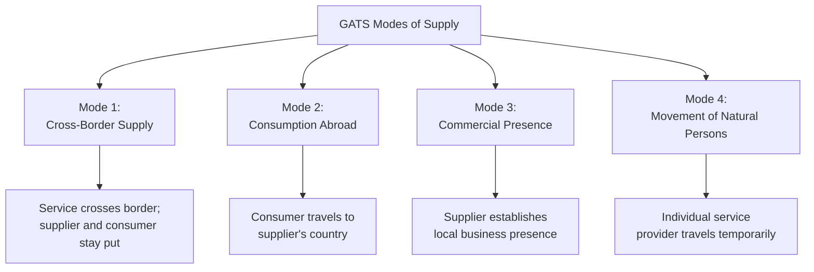

## The four modes of services supply under the GATS

### Definition

The General Agreement on Trade in Services (GATS), negotiated during the Uruguay Round and entering into force in 1995 as part of the WTO framework, defines trade in services through four distinct "modes of supply," classified according to the territorial location of the service supplier and the service consumer at the time the service is delivered. This classification framework is foundational to services trade because, unlike goods (which physically cross borders in a single, straightforward manner), services often require proximity or presence between supplier and consumer.

### Theoretical Rationale for the Modal Framework

#### Why Services Trade Requires Different Categorization

Goods trade is conceptually simple: a physical product crosses a border. Services frequently cannot be "shipped" in the same way — many require either the consumer or supplier to relocate, or require an ongoing local presence. The GATS drafters addressed this by defining trade in services as encompassing any of four distinct supply configurations, ensuring that liberalization commitments could meaningfully cover the full range of ways services are actually delivered internationally.

### Diagrammatic Overview

### Mode 1: Cross-Border Supply

#### Definition and Mechanics

Mode 1 covers services delivered from the territory of one member into the territory of another, without either the supplier or the consumer crossing a border — only the service itself moves. This is conceptually the closest services analogue to conventional goods trade.

#### Examples

- International telecommunications and data transmission.
- Cross-border financial services (e.g., a bank in one country processing transactions for a client in another via electronic channels).
- Software delivered electronically, online consulting, and remote business process outsourcing (call centers, back-office data processing).
- Distance education and telemedicine consultations.

#### Key Characteristics

Mode 1 has grown substantially in economic significance with the expansion of digital infrastructure, since many services that once required physical presence (consulting, certain financial services, education) can now be delivered electronically. [Inference — the general trend of digitally-enabled Mode 1 growth is well-established in trade literature, though precise current magnitudes should be verified against recent trade statistics for any specific quantitative claim]

### Mode 2: Consumption Abroad

#### Definition and Mechanics

Mode 2 covers situations where the consumer of a service travels to the territory of the supplying member to consume the service there. The service itself does not cross a border in the traditional sense — instead, the consumer physically relocates temporarily.

#### Examples

- **Tourism and travel services:** a tourist traveling abroad and consuming hotel, restaurant, and local transportation services.
- **Educational services:** a student traveling abroad to study at a foreign university (international student enrollment).
- **Medical tourism:** patients traveling abroad to receive medical treatment, often motivated by cost differentials or treatment availability.
- **Ship and aircraft repair abroad:** a vessel or aircraft registered in one country undergoing repair services in a foreign port.

**Key Points**

- Mode 2 statistics are often captured within broader travel and tourism trade statistics, which can make isolating "Mode 2 services trade" specifically from general tourism expenditure analytically complex.
- Unlike Mode 1, Mode 2 inherently requires consumer mobility, making it sensitive to factors like visa policy, travel costs, and cross-border mobility restrictions rather than purely digital infrastructure.

### Mode 3: Commercial Presence

#### Definition and Mechanics

Mode 3 covers a service supplied through the commercial presence of the supplier within the territory of another member — typically via foreign direct investment (FDI) to establish a subsidiary, branch, or representative office. This mode is closely linked to services-sector FDI rather than conventional cross-border trade flows.

#### Examples

- A foreign bank establishing a local branch or subsidiary to provide banking services to domestic customers.
- A multinational retail chain opening local stores.
- Foreign insurance companies establishing local underwriting operations.
- International hotel chains operating locally-branded properties through local subsidiaries or franchise/management arrangements.

#### Economic Significance

Mode 3 is generally regarded as the most commercially significant mode of services supply in terms of overall transaction value, since many services (particularly financial services, retail, and utilities) fundamentally require sustained local presence to serve a foreign market effectively. [Inference — this is a commonly cited characterization in services trade literature; the specific ranking can vary by sector and by which particular dataset or estimation methodology is used]

**Key Points**

- Mode 3 liberalization commitments intersect directly with a country's foreign investment policy, since commitments under GATS Mode 3 constrain the ability to restrict foreign ownership or establishment in scheduled sectors.
- This mode is often the most politically sensitive, since it involves foreign ownership of domestic productive assets and can raise concerns about foreign control of strategic sectors (banking, telecommunications, utilities).

### Mode 4: Movement of Natural Persons

#### Definition and Mechanics

Mode 4 covers the temporary movement of individuals from one member's territory to another for the purpose of supplying a service, distinct from permanent migration or employment-based immigration more broadly.

#### Examples

- A foreign consulting firm sending an employee to a client's country for a specific project engagement.
- Intra-corporate transferees (executives, managers, specialists moving temporarily within a multinational firm's international offices).
- Independent professionals (e.g., a foreign architect or engineer contracted for a specific project) providing services in another member's territory.
- Foreign contractual service suppliers under specific project-based agreements.

#### Distinctive Features and Constraints

Mode 4 is widely regarded as the most restricted and least liberalized of the four modes, because commitments in this area intersect directly with sensitive domestic immigration, labor market, and visa policy — areas where WTO members have generally been reluctant to make substantial binding commitments. [Inference — this characterization is a well-established observation in the trade-in-services literature]

**Key Points**

- Mode 4 explicitly excludes measures related to permanent residency, citizenship, or general labor market access unrelated to specific service supply.
- The gap between liberalization commitments in Mode 4 versus the other three modes is frequently cited as a major unresolved imbalance in the GATS framework, of particular interest to developing countries whose comparative advantage may lie partly in labor mobility for services like construction, IT, and healthcare.

### Comparative Summary

| Mode | What Moves | Location of Consumption | Primary Policy Sensitivity |
| --- | --- | --- | --- |
| Mode 1 (Cross-Border Supply) | The service itself | Consumer's home territory | Digital infrastructure, data flow regulation |
| Mode 2 (Consumption Abroad) | The consumer | Supplier's territory | Travel/visa policy, tourism regulation |
| Mode 3 (Commercial Presence) | The supplier's capital/investment | Supplier's foreign subsidiary location | Foreign investment/ownership restrictions |
| Mode 4 (Movement of Natural Persons) | The individual service supplier | Consumer's territory | Immigration and labor market policy |

### Schedules of Commitments

#### How Liberalization Is Recorded

GATS liberalization is not automatic or uniform; each WTO member submits a country-specific "Schedule of Specific Commitments" indicating, sector by sector and mode by mode, the extent of market access and national treatment it is willing to bind. Two key GATS principles govern how these commitments function:

1. **Market access (Article XVI):** commitments not to impose specified types of restrictions (e.g., quotas on the number of service suppliers, limits on foreign capital participation) beyond what is listed in the schedule.
2. **National treatment (Article XVII):** commitments to treat foreign services and service suppliers no less favorably than domestic ones, in scheduled sectors and modes, subject to any listed exceptions.

#### Positive List Approach

GATS follows a "positive list" (or "bottom-up") approach: members are only bound in sectors and modes they explicitly list, unlike a "negative list" approach (used in some regional agreements) where liberalization applies to all sectors except those explicitly excluded. This design gives members substantial flexibility to selectively liberalize, but also means overall GATS commitments have historically covered a smaller share of the services economy than many observers view as economically desirable. [Inference]

### Worked Example

**Example**

A software consulting firm based in India serves a client in Germany. Depending on how the service is delivered, this transaction could fall under different GATS modes:

- **If the firm's employees remain in India and deliver the consulting work remotely via video conferencing and digital deliverables** → Mode 1 (cross-border supply).
- **If the German client's staff travel to India to receive in-person training at the firm's facility** → Mode 2 (consumption abroad).
- **If the Indian firm establishes a German subsidiary to serve the local market on an ongoing basis** → Mode 3 (commercial presence).
- **If the Indian firm sends a team of consultants to work temporarily on-site in Germany for a six-month project** → Mode 4 (movement of natural persons).

This example illustrates how a single service sector (IT consulting) can be delivered through any of the four modes depending on business model choices, and how GATS commitments must be assessed separately for each mode even within the same sector. [Inference — illustrative scenario for pedagogical purposes]

### Illustrative Diagram: Modal Classification by Movement Direction

<svg xmlns="http://www.w3.org/2000/svg" viewBox="0 0 700 400">
<text x="350" y="25" text-anchor="middle" font-size="16" font-weight="bold" fill="#1a1a1a">GATS Modes of Supply (svg_diagram)</text>
<rect x="60" y="60" width="260" height="100" fill="none" stroke="#2980b9" stroke-width="2" rx="6" />
<text x="190" y="85" text-anchor="middle" font-size="13" font-weight="bold" fill="#2980b9">Country A</text>
<circle cx="120" cy="120" r="10" fill="#2980b9" />
<text x="120" y="145" text-anchor="middle" font-size="11" fill="#333">Supplier</text>
<rect x="380" y="60" width="260" height="100" fill="none" stroke="#c0392b" stroke-width="2" rx="6" />
<text x="510" y="85" text-anchor="middle" font-size="13" font-weight="bold" fill="#c0392b">Country B</text>
<circle cx="580" cy="120" r="10" fill="#c0392b" />
<text x="580" y="145" text-anchor="middle" font-size="11" fill="#333">Consumer</text>
<line x1="150" y1="120" x2="550" y2="120" stroke="#27ae60" stroke-width="2" marker-end="url(#arrow1)" />
<text x="350" y="110" text-anchor="middle" font-size="11" fill="#27ae60">Mode 1: service moves</text>
<line x1="580" y1="140" x2="120" y2="200" stroke="#f39c12" stroke-width="2" />
<text x="350" y="220" text-anchor="middle" font-size="11" fill="#f39c12">Mode 2: consumer travels to supplier</text>
<line x1="120" y1="140" x2="580" y2="260" stroke="#8e44ad" stroke-width="2" />
<text x="350" y="280" text-anchor="middle" font-size="11" fill="#8e44ad">Mode 3: supplier's capital establishes presence</text>
<line x1="120" y1="140" x2="580" y2="320" stroke="#16a085" stroke-width="2" stroke-dasharray="5,3" />
<text x="350" y="340" text-anchor="middle" font-size="11" fill="#16a085">Mode 4: supplier's personnel travel temporarily</text>
</svg>

### Relevance to the Digital Economy

The rise of digital trade has substantially increased the practical importance of Mode 1, since many services previously requiring physical proximity (financial services, consulting, education, media) can increasingly be delivered electronically. This has intensified policy debates about data flow restrictions, data localization requirements, and digital trade rules as a form of Mode 1 market access barrier not fully anticipated when GATS was negotiated in the early 1990s. [Inference — connects to the broader chapter theme of digital trade, which is expected to build on this modal framework]

### Common Misconceptions

- **Misconception:** GATS commitments apply uniformly across all service sectors once a country joins the WTO. **Reality:** commitments are sector-specific and mode-specific, following the positive-list approach — a country may be highly open in one mode/sector and highly restricted in another.
- **Misconception:** Mode 4 is equivalent to general labor migration policy. **Reality:** Mode 4 specifically covers temporary movement tied to service supply, explicitly excluding measures related to citizenship, permanent residency, or general labor market access.
- **Misconception:** the four modes are mutually exclusive categories for a given service sector. **Reality:** the same service sector (e.g., IT consulting, education, financial services) can often be delivered through multiple modes simultaneously, and country schedules must address each mode separately.

### Related Topics

- GATS market access and national treatment obligations
- Positive list vs. negative list liberalization approaches
- Mode 4 and labor mobility in developing country trade strategy
- Digital trade and cross-border data flow regulation
- Services sector FDI and Mode 3 investment liberalization
- WTO dispute settlement in services trade
- Regional trade agreements and services chapters (comparison with GATS)
- Trade in environmental goods and services (services trade intersection)