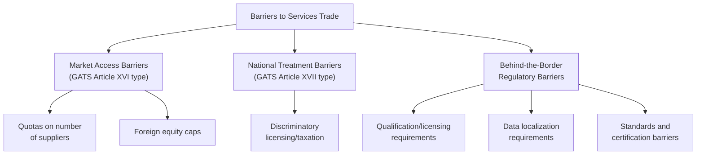

## Barriers to trade in services

### Definition

Barriers to trade in services are the regulatory, structural, and policy-based obstacles that restrict cross-border services transactions. Unlike goods trade, where tariffs are the dominant and most easily quantifiable barrier, services trade barriers are overwhelmingly regulatory and behind-the-border in nature, making them more difficult to identify, measure, and negotiate away.

### Why Services Barriers Differ Fundamentally from Goods Barriers

#### The Absence of Conventional Tariffs

Because most services are intangible and cannot pass through customs in the way physical goods do, traditional tariffs are largely inapplicable to services trade (with some exceptions in narrow areas). Instead, restrictions operate through domestic regulation — the same regulatory instruments used for legitimate public policy purposes (prudential regulation, consumer protection, licensing standards) often simultaneously function as market access barriers, whether or not that is their primary intent.

#### Regulatory Duality

$$\text{Domestic Regulation} = \text{Legitimate Public Interest Objective} + \text{(Possible) Protectionist Effect}$$

This duality creates a persistent analytical and negotiating challenge: distinguishing regulation that serves genuine public policy objectives (financial stability, patient safety, professional competence) from regulation that primarily functions to protect domestic incumbents from foreign competition.

### Diagrammatic Overview

### Categories of Services Trade Barriers

#### Market Access Restrictions (GATS Article XVI Type)

These are explicit quantitative or structural limitations on the ability of foreign suppliers to enter a market at all, regardless of whether they are treated equally to domestic firms once inside:

- **Numerical quotas on service suppliers:** limits on the number of foreign bank branches, insurance licenses, or telecommunications operators permitted.
- **Foreign equity limitations:** caps on the percentage of foreign ownership permitted in a domestic services firm (e.g., a 49% foreign ownership ceiling in a sensitive sector).
- **Legal form requirements:** mandates that foreign suppliers operate only through specific corporate structures (e.g., requiring a joint venture with a local partner rather than allowing a wholly foreign-owned subsidiary).
- **Economic needs tests:** requirements that a foreign supplier demonstrate market "need" before receiving authorization to operate, often applied with significant regulatory discretion that can function as an effective barrier.

#### National Treatment Barriers (GATS Article XVII Type)

These barriers allow foreign entry but treat foreign suppliers less favorably than domestic ones once operating:

- **Discriminatory taxation or subsidy access:** foreign-owned firms facing higher tax rates or exclusion from domestic subsidy programs available to local competitors.
- **Differential licensing fees or requirements:** foreign suppliers facing more burdensome or costly licensing processes than domestic firms for functionally equivalent services.
- **Restricted access to distribution networks or public procurement:** foreign services suppliers excluded from government contracts or key distribution channels available to domestic firms.

#### Behind-the-Border Regulatory Barriers

These operate regardless of nationality but disproportionately burden foreign suppliers due to lack of familiarity, recognition, or compatibility with home-country credentials:

- **Professional qualification and licensing recognition:** failure to recognize foreign professional credentials (medical, legal, engineering, accounting qualifications), effectively requiring foreign professionals to requalify domestically before practicing.
- **Technical standards and certification requirements:** divergent national standards for financial products, telecommunications equipment, or professional services that create compliance costs even absent explicit discrimination.
- **Data localization and cross-border data flow restrictions:** requirements that data be stored or processed domestically, which can significantly raise costs or block market entry for digitally-delivered services (particularly relevant to Mode 1 supply).
- **Transparency and administrative barriers:** opaque, unpredictable, or inconsistently applied regulatory approval processes that create de facto barriers through uncertainty and compliance cost, even without explicit discriminatory intent.

**Key Points**

- Market access and national treatment barriers are explicitly addressed by GATS's binding commitment structure (Articles XVI and XVII).
- Behind-the-border regulatory barriers are harder to discipline through trade agreements because they often serve legitimate non-trade objectives, requiring careful proportionality and necessity analysis rather than blanket prohibition.

### Measurement Challenges

#### Why Services Barriers Are Difficult to Quantify

Unlike an ad valorem tariff rate, which is directly observable in a customs schedule, most services barriers do not have a natural, single numeric expression. This creates significant empirical challenges for economists attempting to assess the restrictiveness of services trade regimes across countries.

#### Common Measurement Approaches

1. **Services Trade Restrictiveness Indices (STRIs):** composite indices, such as those developed by the OECD and World Bank, that assign scores based on the presence and severity of various regulatory restrictions across sectors, aggregated into comparable restrictiveness measures across countries. [Unverified — specific index methodologies and current coverage should be checked against the relevant institution's latest documentation for precise details]
2. **Frequency-type measures:** counting the number and type of restrictive measures present in a sector/country, without necessarily weighting by economic impact.
3. **Price-based (tariff-equivalent) measures:** econometric techniques that estimate the ad valorem tariff equivalent of a services barrier by comparing price or cost differentials between liberalized and restricted markets, allowing more direct comparison with goods trade barriers.

$$\text{Tariff Equivalent} = \frac{P_{restricted} - P_{competitive}}{P_{competitive}} \times 100\%$$

**Key Points**

- Composite restrictiveness indices are useful for cross-country comparison but involve subjective weighting choices about the relative severity of different barrier types.
- Price-based tariff-equivalent measures are conceptually appealing (directly comparable to goods tariffs) but require reliable price data and a credible competitive benchmark, which can be difficult to establish for many services.

### Sector-Specific Illustrations

#### Financial Services

Common barriers include foreign equity caps on banks and insurers, separate capital adequacy or licensing requirements for foreign-owned institutions, and restrictions on cross-border provision of specific financial products (e.g., insurance underwriting) without local establishment.

#### Telecommunications

Historically dominated by state-owned monopolies in many countries; barriers include restrictions on foreign ownership of telecom infrastructure, interconnection pricing disputes, and spectrum allocation processes that may favor domestic incumbents.

#### Professional Services (Legal, Accounting, Engineering, Medical)

Licensing and qualification recognition are the dominant barrier type; a foreign-trained professional may be fully qualified in their home jurisdiction but legally barred from practicing without domestic requalification, examination, or supervised practice requirements — closely tied to Mode 4 restrictiveness.

#### Digitally Delivered Services

Data localization requirements, restrictions on cross-border data transfer, and divergent data privacy/protection regimes (e.g., differing approaches to personal data protection across jurisdictions) increasingly function as the dominant barrier category for Mode 1 digital services trade. [Inference — this is an area of active and evolving policy development, and specific regulatory requirements change frequently]

### Worked Example

**Example**

A foreign insurance company wants to sell auto insurance policies in a target market. It may encounter barriers at each stage:

1. **Market access stage:** the country requires a minimum of 51% local ownership for any insurance license (Mode 3 market access restriction) → the firm must find a local partner or restructure its ownership.
2. **National treatment stage:** once licensed, foreign-owned insurers face a higher capital reserve requirement than domestic insurers (national treatment barrier) → higher compliance cost than local competitors.
3. **Behind-the-border stage:** actuaries and claims adjusters trained abroad are not recognized under domestic professional licensing rules (regulatory barrier tied to Mode 4) → the firm must hire and retrain local staff, or navigate a lengthy foreign credential recognition process.

Each barrier operates independently and would require separate negotiation or regulatory reform to resolve, illustrating why services liberalization is typically a slower, more incremental process than tariff-focused goods liberalization. [Inference — illustrative composite scenario for pedagogical purposes]

### Policy Responses

#### Mutual Recognition Agreements (MRAs)

Bilateral or plurilateral agreements in which two or more countries agree to recognize each other's professional qualifications, licensing standards, or regulatory approvals as equivalent, substantially reducing behind-the-border barriers in professional services without requiring full harmonization of underlying standards.

#### Regulatory Cooperation and Harmonization

Deeper integration approaches (common in regional agreements like the EU single market) that go beyond mutual recognition toward substantive alignment of regulatory standards themselves, reducing compliance costs but requiring a higher degree of policy convergence and institutional trust between parties.

#### GATS Domestic Regulation Disciplines

WTO members have negotiated additional disciplines (under GATS Article VI on domestic regulation) aimed at ensuring that licensing and qualification requirements are based on objective, transparent criteria and are not more burdensome than necessary to achieve legitimate regulatory objectives — a "necessity test" approach analogous in spirit to GATT Article XX's environmental exception jurisprudence. [Unverified — the specific WTO Reference Paper/disciplines on domestic regulation and their current implementation status should be verified for precise, time-sensitive claims]

### Illustrative Diagram: Barrier Severity by Type

<svg xmlns="http://www.w3.org/2000/svg" viewBox="0 0 700 380">
<text x="350" y="25" text-anchor="middle" font-size="16" font-weight="bold" fill="#1a1a1a">Services Barrier Types and Negotiability (svg_diagram)</text>
<line x1="90" y1="320" x2="620" y2="320" stroke="#333" stroke-width="2" />
<line x1="90" y1="320" x2="90" y2="60" stroke="#333" stroke-width="2" />
<text x="355" y="355" text-anchor="middle" font-size="12" fill="#333">Ease of Trade Negotiation Discipline</text>
<text x="30" y="190" text-anchor="middle" font-size="12" fill="#333" transform="rotate(-90 30 190)">Barrier Visibility</text>
<circle cx="180" cy="120" r="12" fill="#2980b9" />
<text x="180" y="100" text-anchor="middle" font-size="11" fill="#2980b9">Foreign equity caps</text>
<circle cx="280" cy="160" r="12" fill="#27ae60" />
<text x="280" y="145" text-anchor="middle" font-size="11" fill="#27ae60">Supplier quotas</text>
<circle cx="420" cy="230" r="12" fill="#e67e22" />
<text x="420" y="215" text-anchor="middle" font-size="11" fill="#e67e22">Licensing recognition</text>
<circle cx="540" cy="280" r="12" fill="#c0392b" />
<text x="540" y="265" text-anchor="middle" font-size="11" fill="#c0392b">Data localization rules</text>

<text x="150" y="300" font-size="10" fill="#888">Easier to discipline</text>

<text x="480" y="300" font-size="10" fill="#888">Harder to discipline</text>

</svg>

### Common Misconceptions

- **Misconception:** services trade barriers are primarily tariffs, similar to goods. **Reality:** conventional tariffs are largely inapplicable to services; the dominant barrier forms are regulatory (market access limits, national treatment gaps, and behind-the-border compliance costs).
- **Misconception:** all regulatory barriers to foreign services suppliers are protectionist in intent. **Reality:** many barriers arise from legitimate public policy objectives (financial stability, consumer protection); the challenge is distinguishing necessary regulation from protectionist regulation, not eliminating regulation altogether.
- **Misconception:** services trade barriers are as easily quantified as tariff rates. **Reality:** measurement requires composite restrictiveness indices or econometric tariff-equivalent estimation, both involving significant methodological judgment absent from simple ad valorem tariff schedules.

### Related Topics

- The four modes of services supply under the GATS
- GATS market access and national treatment obligations
- Mutual recognition agreements in professional services
- Data localization and cross-border data flow policy
- Services Trade Restrictiveness Index (STRI) methodology
- Regulatory harmonization vs. mutual recognition approaches
- Digital trade rules and e-commerce chapters in trade agreements
- Financial services liberalization and prudential carve-outs