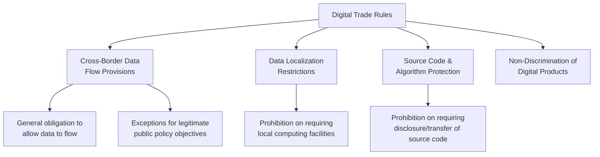

## Cross border data flows and digital trade rules

### Definition

Cross-border data flows and digital trade rules refer to the movement of digital information across national borders in the course of international commerce, and the legal and regulatory frameworks governing that movement — including provisions on data localization, computing facility location, source code protection, and non-discrimination of digital products. This area sits at the intersection of trade law, data protection/privacy regulation, and national security policy, and has emerged as one of the most actively contested areas of contemporary trade negotiation.

### Why Digital Trade Challenges Conventional Trade Frameworks

#### The Goods/Services Classification Problem

Traditional WTO rules are predicated on classifying a transaction as either goods (under GATT) or services (under GATS) and identifying which border a product or service crosses, but digital trade blurs these distinctions, since digital products often combine characteristics of both and may not fit cleanly into either existing legal category. This classification ambiguity has structural implications for which body of trade law (and its associated rules and exceptions) applies to a given digital transaction.

#### The Regulatory Interface Problem

Digital trade law is fundamentally not just about traditional market access, but about interfacing domestic regulatory regimes so as to provide interoperability between different countries' approaches to data protection, cybersecurity, and digital governance, rather than simply removing border barriers as in conventional goods trade. [Inference — this framing reflects a recurring theme in digital trade law scholarship]

### Diagrammatic Overview

### Core Regulatory Instruments

#### Cross-Border Data Flow Obligations

The central provision found across most modern digital trade agreements is a general commitment that parties will allow data to flow freely across borders and will prohibit data localization requirements, except where justified for legitimate purposes such as personal data protection. This is typically structured as a general obligation subject to a defined set of exceptions, rather than an unconditional prohibition on all data-related regulation.

#### Location of Computing Facilities Provisions

A related but distinct obligation prohibits parties from requiring the use or location of computing facilities within their territory as a condition of doing business there. This is the specific legal mechanism that disciplines data localization mandates (e.g., a law requiring that all customer data on citizens be stored on servers physically located within the country). Derogations from this obligation typically mirror those available for the general data flow obligation. [Inference — specific derogation structures vary by agreement text]

#### Source Code Non-Disclosure Provisions

Many digital trade agreements prohibit parties from requiring the transfer or access to source code (or, in some agreements, algorithms) as a condition for market access or use of software, protecting intellectual property and trade secrets of software and technology providers.

**Key Points**

- These three obligations — free data flow, no forced computing localization, no forced source code disclosure — form the core "trilogy" of substantive digital trade disciplines found across most contemporary agreements.
- Nearly universally, these obligations are subject to exceptions for legitimate public policy objectives (data privacy, cybersecurity, national security), making the scope and interpretation of those exceptions a central area of legal and policy contestation.

### Major Institutional Frameworks

#### CPTPP (Comprehensive and Progressive Agreement for Trans-Pacific Partnership)

CPTPP established relatively strong, binding digital trade disciplines, including provisions prohibiting data localization requirements as a condition of doing business, subject to defined derogations. These provisions have subsequently served as a template replicated in later agreements such as the Digital Economy Partnership Agreement.

#### DEPA (Digital Economy Partnership Agreement)

DEPA, initiated by Chile, New Zealand, and Singapore, is a standalone, open plurilateral agreement addressing emerging digital economy issues including artificial intelligence, digital identities, and digital inclusion, going beyond earlier-generation digital trade provisions to address newer policy areas. DEPA is structured as a modular, "digital-only" agreement (not embedded within a broader traditional trade agreement), and is open to accession by other WTO members. Korea has since joined the original three founding members. [Inference — accession status is an evolving area and should be checked for current membership at time of use]

#### RCEP (Regional Comprehensive Economic Partnership)

RCEP's digital trade provisions are broadly similar to CPTPP and DEPA but provide member countries somewhat greater latitude to restrict cross-border data flows, specifically recognizing that parties may adopt measures to restrict data flows to protect essential security interests, with such measures largely insulated from challenge. RCEP also lacks a specific enforcement mechanism for its digital trade provisions, meaning its disciplines function in a more voluntary, less binding manner compared to CPTPP-style agreements.

#### WTO Joint Statement Initiative (JSI) on E-Commerce

A plurilateral negotiation among a large subset of WTO members (not the full membership) aiming to establish global digital trade rules building on existing WTO standards and frameworks. As of the available information, Singapore has referenced its leadership at the WTO on an E-Commerce Agreement described as the first-ever set of global digital trade rules for inclusive e-commerce participation. [Unverified — the precise legal status, membership, and finalization timeline of this initiative should be verified for any time-sensitive or definitive claim, as this area has seen significant shifts in major-country participation]

**Key Points**

- The digital trade agreement landscape is fragmented across multiple overlapping plurilateral and regional instruments (CPTPP, DEPA, RCEP, bilateral Digital Economy Agreements) rather than a single unified multilateral framework.
- Agreements vary substantially in bindingness: CPTPP/DEPA-style provisions tend toward stronger, more enforceable disciplines, while RCEP-style provisions are comparatively more permissive and less enforceable.

### The U.S. Policy Shift and Its Systemic Impact

#### Historical U.S. Position

The United States generally promoted the free flow of data in its free trade agreements historically, including provisions limiting data localization, with limited exceptions, reflecting a longstanding U.S. preference for strong, binding cross-border data flow disciplines in trade negotiations.

#### 2023 Policy Reassessment

In fall 2023, the U.S. Trade Representative withdrew support for provisions on cross-border data flows, data localization, and the transfer of source code in the WTO Joint Statement Initiative on e-commerce, and suspended related digital trade talks in the Indo-Pacific Economic Framework for Prosperity. A joint statement on the JSI was subsequently released in July 2024 without the support of the United States and several other members, despite removal of the specific provisions the U.S. had objected to.

#### Systemic Implications

This shift represented a significant change from the U.S.'s prior role as a primary advocate for strong, binding digital trade rules, and reflects a broader policy reassessment regarding the relationship between digital trade liberalization and domestic regulatory autonomy (including data privacy, competition policy toward large technology platforms, and industrial policy considerations). [Inference — connects the specific 2023-2024 shift to a broader interpretive narrative common in digital trade policy commentary; the underlying policy rationale involves contested domestic political economy considerations]

### Recent Developments (2026)

#### EU-CPTPP Digital Trade Initiative

On March 27, 2026, at the 14th WTO Ministerial Conference in Yaoundé, Cameroon, the EU and CPTPP countries released a Joint Ministerial Statement agreeing to accelerate work toward a digital trade agreement covering e-commerce, cross-border data flows, and data localization, representing a combined economy of $35 trillion and 1.6 billion people. This initiative signals a shift toward a multi-bloc digital governance environment, with significant implications for data transfer architectures, cloud strategy, and AI governance for multinational companies operating across the EU and Asia-Pacific markets.

**Key Points**

- This development is very recent relative to standard reference material and represents an active negotiation rather than a concluded agreement; its eventual scope, ratification, and implementation timeline remain to be determined. [Unverified — status should be checked for the most current developments given how recently this initiative was announced]
- The initiative illustrates a broader trend toward "mega-regional" or multi-bloc digital trade governance arrangements emerging alongside, or in place of, stalled multilateral WTO-wide negotiations.

### The Public Policy Exception Framework

#### Balancing Trade Facilitation and Regulatory Autonomy

A central design challenge across all digital trade instruments is preserving a government's ability to regulate data flows for legitimate purposes — including personal data privacy, cybersecurity, and national security — without those exceptions becoming so broad as to undermine the underlying data-flow commitment. Differences in how strictly various regional trade agreements and Digital Economy Agreements draft and interpret these exceptions have led to inconsistent business outcomes, since compliance requirements can vary substantially depending on which agreement's framework applies to a given transaction.

$$\text{Effective Data Flow Openness} = \text{Nominal Commitment} - \text{Scope and Use of Exceptions}$$

**Key Points**

- The strength of a data-flow commitment cannot be assessed from the headline obligation alone; the breadth and enforceability of the accompanying exceptions determine the practical degree of liberalization.
- This tension is analogous to the necessity/proportionality tests found in GATT Article XX environmental exceptions and GATS Article VI domestic regulation disciplines — a recurring structural feature across different areas of trade law where legitimate regulation and market access considerations must be balanced.

### Worked Example

**Example**

A cloud services company based in Singapore wants to offer data storage and analytics services to customers in three markets with different digital trade rules:

1. **Market A (CPTPP-style discipline):** the company can freely provide services from servers located anywhere, since the market prohibits requiring local computing facilities as a condition of doing business, subject to narrow derogations for verified public policy needs.
2. **Market B (RCEP-style discipline):** the company faces greater regulatory latitude on the part of the host government, which retains broader ability to restrict data flows citing essential security interests, with limited recourse to challenge such restrictions.
3. **Market C (no digital trade agreement in force):** the company faces whatever domestic data localization law exists in that market, unconstrained by any specific trade-law discipline, potentially requiring local server infrastructure regardless of the underlying policy rationale.

This illustrates how a single company's global data architecture and compliance strategy must vary by jurisdiction depending on which (if any) digital trade framework governs its market access in that specific market. [Inference — illustrative composite scenario for pedagogical purposes]

### Illustrative Diagram: Digital Trade Agreement Bindingness Spectrum

<svg xmlns="http://www.w3.org/2000/svg" viewBox="0 0 700 340">
<text x="350" y="25" text-anchor="middle" font-size="16" font-weight="bold" fill="#1a1a1a">Digital Trade Framework Bindingness (svg_diagram)</text>
<line x1="80" y1="280" x2="620" y2="280" stroke="#333" stroke-width="2" />
<text x="350" y="310" text-anchor="middle" font-size="12" fill="#333">Enforceability / Bindingness</text>
<circle cx="180" cy="280" r="10" fill="#c0392b" />
<text x="180" y="255" text-anchor="middle" font-size="11" fill="#333">RCEP</text>
<text x="180" y="240" text-anchor="middle" font-size="10" fill="#888">(voluntary, wide security carve-out)</text>
<circle cx="350" cy="280" r="10" fill="#e67e22" />
<text x="350" y="255" text-anchor="middle" font-size="11" fill="#333">WTO JSI e-commerce</text>
<text x="350" y="240" text-anchor="middle" font-size="10" fill="#888">(plurilateral, evolving scope)</text>
<circle cx="500" cy="280" r="10" fill="#2980b9" />
<text x="500" y="255" text-anchor="middle" font-size="11" fill="#333">DEPA</text>
<text x="500" y="240" text-anchor="middle" font-size="10" fill="#888">(modular, accession-open)</text>
<circle cx="580" cy="280" r="10" fill="#27ae60" />
<text x="580" y="255" text-anchor="middle" font-size="11" fill="#333">CPTPP</text>
<text x="580" y="240" text-anchor="middle" font-size="10" fill="#888">(strong, enforceable)</text>
</svg>

### Economic Rationale

#### Efficiency Gains from Data Mobility

Free cross-border data flows support e-commerce and other digitally-enabled activities, such as data analytics and artificial intelligence, allowing firms to centralize data processing, achieve economies of scale in computing infrastructure, and deploy services across multiple markets without duplicative local infrastructure investment.

#### Costs of Fragmentation

Divergent national data localization and privacy regimes raise compliance costs for firms operating across multiple jurisdictions, potentially creating a form of "digital protectionism" that functions similarly to traditional non-tariff barriers by increasing the fixed cost of market entry — particularly burdensome for smaller firms lacking resources to build market-specific compliance infrastructure. [Inference]

### Common Misconceptions

- **Misconception:** digital trade rules mean data flows are entirely unregulated. **Reality:** essentially all digital trade agreements pair free-flow commitments with explicit exceptions for legitimate public policy objectives like privacy and security.
- **Misconception:** all digital trade agreements provide equivalent protections. **Reality:** enforceability varies substantially — from strongly binding frameworks like CPTPP to largely voluntary arrangements like RCEP.
- **Misconception:** digital trade governance is centralized at the WTO. **Reality:** the current landscape is fragmented across multiple overlapping plurilateral and regional instruments, with WTO-wide multilateral progress historically slower than regional and plurilateral initiatives.

### Related Topics

- The four modes of services supply under the GATS
- Barriers to trade in services
- Data localization and national data sovereignty policy
- Digital Economy Partnership Agreement (DEPA) accession framework
- WTO Joint Statement Initiative on E-Commerce
- GATS domestic regulation disciplines and necessity tests
- Data privacy regulation and trade law interoperability
- AI governance provisions in trade agreements