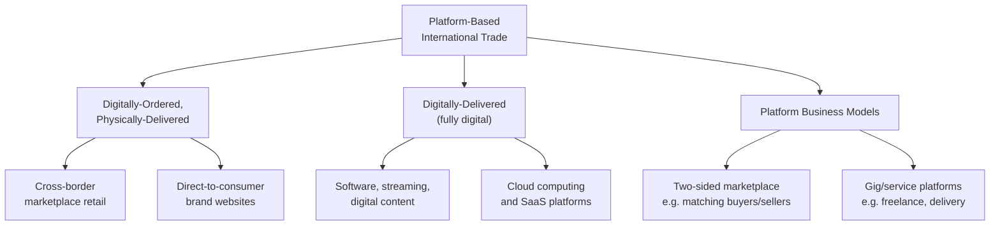

## E commerce and platform based international trade

### Definition

E-commerce and platform-based international trade refers to cross-border transactions in goods and services conducted through digital platforms — online marketplaces, direct-to-consumer retail websites, app-based services, and intermediary matching platforms — that connect buyers and sellers across national borders, often at a transaction scale and frequency not feasible under traditional trade channels. This includes both digitally-ordered physical goods shipped internationally and fully digital products and services delivered electronically.

### Structural Distinction: Digitally-Ordered vs. Digitally-Delivered Trade

#### Digitally-Ordered, Physically-Delivered Trade

Transactions where the ordering and payment process occurs digitally (via a platform or website) but the underlying product is a physical good requiring conventional cross-border shipping and customs clearance — for example, a consumer purchasing an item from a foreign online retailer that is shipped via international parcel post.

#### Digitally-Delivered Trade

Transactions where both the ordering and the delivery of the product occur electronically — software downloads, streaming media subscriptions, cloud computing services, and digital content purchases — corresponding closely to GATS Mode 1 (cross-border supply) as covered in the modes-of-supply framework.

$$\text{Total E-Commerce Trade} = \text{Digitally-Ordered Goods Trade} + \text{Digitally-Delivered Services Trade}$$

**Key Points**

- This distinction matters significantly for trade policy: digitally-ordered goods remain subject to conventional customs procedures, tariffs, and de minimis thresholds at the border, while digitally-delivered trade largely falls outside traditional customs enforcement mechanisms entirely.
- Trade statistics and classification systems have historically struggled to cleanly separate and measure these two categories, complicating empirical analysis of e-commerce's true economic scale.

### Diagrammatic Overview

### Platform Business Model Characteristics

#### Two-Sided Market Structure

E-commerce platforms typically function as two-sided (or multi-sided) markets, connecting distinct user groups (buyers and sellers, or service requesters and providers) who each derive value from the presence of the other side, generating network effects that can create significant platform market power once scale is achieved.

$$U_{buyer} = f(\text{Number and Quality of Sellers})$$

$$U_{seller} = f(\text{Number and Purchasing Power of Buyers})$$

This mutual dependency creates strong incentives for market concentration, since a platform with more buyers attracts more sellers, which in turn attracts more buyers — a self-reinforcing dynamic often termed a network effect.

#### Micro-Multinational Enablement

Platforms substantially lower the fixed costs traditionally required for a small firm to engage in international trade (establishing foreign distribution networks, navigating foreign retail relationships, marketing in unfamiliar markets), enabling small and medium enterprises to reach international customers directly without the traditional scale economies previously required for cross-border commerce. [Inference — this is a widely cited rationale in e-commerce and SME internationalization literature]

**Key Points**

- Platform-enabled trade has been associated with a broadening of the population of firms engaged in exporting, beyond traditionally large, established multinational exporters, though average transaction values per firm tend to be smaller.
- Network effects in platform markets raise distinct competition policy questions not fully addressed by traditional trade policy frameworks, since platform dominance can affect market access for third-party sellers independent of conventional trade barriers.

### Trade Policy Implications

#### De Minimis Thresholds

Most countries maintain a de minimis threshold — a value below which imported goods are exempt from tariffs and/or simplified customs procedures — originally designed for low-volume personal shipments but now central to e-commerce policy, since a very large share of cross-border e-commerce parcels fall below typical de minimis thresholds. This has generated significant policy debate:

- **Trade facilitation rationale:** low de minimis thresholds impose disproportionate administrative burden relative to revenue collected on low-value shipments, justifying simplified treatment.
- **Domestic industry competitiveness concern:** high-volume e-commerce imports entering under de minimis exemptions can create a competitive disadvantage for domestic retailers who must collect tariffs and taxes on functionally identical goods, generating political pressure to lower or eliminate de minimis thresholds. [Inference — this tension has become a live and actively debated policy issue in several major markets]

#### Customs Duty Moratorium on Electronic Transmissions

Since 1998, WTO members have maintained a moratorium on imposing customs duties on electronic transmissions (i.e., agreeing not to apply tariffs to digitally-delivered products crossing borders electronically), periodically renewed at WTO Ministerial Conferences. This moratorium has been a recurring point of negotiation tension, with some developing countries arguing it disproportionately benefits digitally-advanced exporting economies at the cost of foregone tariff revenue for importing countries with less-developed digital export capacity. [Unverified — the moratorium's renewal status should be verified against the most recent WTO Ministerial Conference outcomes for any time-sensitive claim]

#### Platform Liability and Marketplace Facilitator Rules

Many jurisdictions have shifted tax collection responsibility onto the platform itself (rather than the individual foreign seller), requiring marketplace facilitators to collect and remit applicable sales, value-added, or goods-and-services taxes on behalf of third-party sellers using their platform, reflecting the practical enforcement challenge of collecting tax from a large, dispersed population of small foreign sellers directly.

### Economic Effects

#### Trade Cost Reduction

Platforms reduce several categories of traditional trade costs simultaneously:

$$\text{Total Trade Cost} = \text{Search Cost} + \text{Transaction Cost} + \text{Logistics Cost} + \text{Trust/Information Cost}$$

- **Search costs:** platforms aggregate many sellers in a single searchable interface, reducing the cost for buyers to identify foreign suppliers.
- **Transaction costs:** integrated payment processing, standardized contracts, and dispute resolution mechanisms lower the cost of completing a cross-border transaction.
- **Trust/information costs:** platform reputation systems (ratings, reviews, seller verification) substitute for the trust traditionally built through long-term relationships or intermediary verification, lowering the informational barrier to transacting with an unfamiliar foreign counterparty.
- **Logistics costs:** many major platforms have developed integrated cross-border fulfillment and shipping infrastructure, reducing the individual seller's need to independently establish international logistics capability.

**Key Points**

- The trust/information cost reduction is often considered a particularly distinctive contribution of platform intermediation, since it addresses an information asymmetry problem that trade economists have long identified as a significant barrier to international trade, independent of tariffs or transport costs. [Inference]

### Worked Example

**Example**

A small artisanal goods producer in Vietnam wants to sell products to consumers in the United States. Consider two scenarios:

**Scenario A — Traditional export channel:**

The producer must identify a US distributor or retailer, negotiate wholesale terms, arrange international shipping logistics independently, and likely accept significant margin compression to the intermediary — a process requiring substantial fixed costs and specialized trade expertise the small producer may not possess.

**Scenario B — Platform-based channel:**

The producer lists products directly on an international e-commerce marketplace. The platform aggregates payment processing (handling currency conversion), provides built-in cross-border logistics/fulfillment options, and offers a reputation system allowing US consumers to trust an unfamiliar foreign seller based on verified reviews.

$$\text{Fixed Cost of Market Entry: Scenario A} \gg \text{Fixed Cost of Market Entry: Scenario B}$$

If the shipment value falls below the applicable US de minimis threshold, it may also avoid tariff and formal customs entry procedures, further lowering transaction friction relative to a traditional bulk wholesale shipment that would exceed such thresholds. [Inference — illustrative scenario; actual thresholds, fees, and logistics arrangements vary by platform and jurisdiction and are subject to policy change]

### Illustrative Diagram: Platform Trade Cost Reduction

<svg xmlns="http://www.w3.org/2000/svg" viewBox="0 0 700 380">
<text x="350" y="25" text-anchor="middle" font-size="16" font-weight="bold" fill="#1a1a1a">Trade Cost Components: Traditional vs Platform (svg_diagram)</text>

<text x="180" y="60" text-anchor="middle" font-size="13" font-weight="bold" fill="#333">Traditional Export</text>

<rect x="100" y="70" width="160" height="50" fill="`#c0392b`" />

<text x="180" y="100" text-anchor="middle" font-size="11" fill="white">Search Cost</text>

<rect x="100" y="120" width="160" height="60" fill="`#e67e22`" />

<text x="180" y="155" text-anchor="middle" font-size="11" fill="white">Transaction Cost</text>

<rect x="100" y="180" width="160" height="70" fill="`#f39c12`" />

<text x="180" y="220" text-anchor="middle" font-size="11" fill="white">Trust/Info Cost</text>

<rect x="100" y="250" width="160" height="60" fill="`#d35400`" />

<text x="180" y="285" text-anchor="middle" font-size="11" fill="white">Logistics Cost</text>

<text x="500" y="60" text-anchor="middle" font-size="13" font-weight="bold" fill="#333">Platform-Enabled</text>

<rect x="420" y="70" width="160" height="20" fill="`#27ae60`" />

<text x="500" y="84" text-anchor="middle" font-size="10" fill="white">Search Cost</text>

<rect x="420" y="90" width="160" height="25" fill="`#2ecc71`" />

<text x="500" y="107" text-anchor="middle" font-size="10" fill="white">Transaction Cost</text>

<rect x="420" y="115" width="160" height="30" fill="`#1abc9c`" />

<text x="500" y="134" text-anchor="middle" font-size="10" fill="white">Trust/Info Cost</text>

<rect x="420" y="145" width="160" height="35" fill="`#16a085`" opacity="0.8" />

<text x="500" y="166" text-anchor="middle" font-size="10" fill="white">Logistics Cost</text>

</svg>

### Policy Responses and Emerging Debates

#### De Minimis Policy Reform

Several major economies have moved toward tightening or restructuring de minimis exemptions specifically in response to high-volume e-commerce imports, reflecting the competitiveness concern noted above; specific threshold levels and reform timelines are jurisdiction-specific and subject to frequent revision. [Unverified — this area has been subject to significant, fast-moving policy change and any specific current threshold figures should be verified directly]

#### Data and Algorithm Governance

Platform-based trade raises overlapping policy questions from the digital trade rules framework (cross-border data flows, source code protection) since platforms rely heavily on cross-border data processing and proprietary algorithms for functions like search ranking, pricing, and fraud detection.

#### Competition Policy Intersection

Platform market concentration has prompted growing interest in competition policy tools — such as scrutiny of self-preferencing (a platform favoring its own products in search rankings over third-party sellers) — as a complement to traditional trade policy tools, since conventional trade remedies are not well-suited to addressing platform-specific market power dynamics. [Inference]

### Common Misconceptions

- **Misconception:** all e-commerce trade is "digital trade" in the same sense as software or streaming services. **Reality:** the large majority of cross-border e-commerce by value involves digitally-*ordered* but physically-*delivered* goods, which remain subject to conventional customs and tariff rules, unlike fully digitally-delivered products.
- **Misconception:** platforms have eliminated fixed costs of international trade entirely. **Reality:** platforms substantially reduce several categories of trade cost (search, trust, logistics) but do not eliminate all barriers, including regulatory compliance, tax collection obligations, and de minimis-related customs procedures.
- **Misconception:** de minimis thresholds are a stable, uncontroversial technical detail. **Reality:** de minimis policy has become an actively contested trade policy battleground due to its interaction with high-volume e-commerce import growth.

### Related Topics

- The four modes of services supply under the GATS
- Cross border data flows and digital trade rules
- De minimis customs thresholds and e-commerce trade policy
- WTO moratorium on customs duties for electronic transmissions
- Platform economics and two-sided market network effects
- SME internationalization and micro-multinational firms
- Marketplace facilitator tax collection rules
- Competition policy and digital platform market power