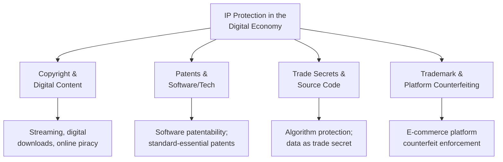

## Intellectual property protection in the digital economy

### Definition

Intellectual property protection in the digital economy refers to the legal frameworks — copyright, patent, trademark, trade secret, and related sui generis regimes — governing ownership, use, and enforcement of intangible creative and technical assets in digitally networked environments, and the distinctive trade policy challenges that arise when IP-embedded goods and services can be reproduced, transmitted, and consumed instantaneously and near costlessly across borders.

### Why Digital Technology Transforms IP Trade Policy

#### The Reproduction Cost Problem

Traditional IP economics rests on a fundamental asymmetry: high first-copy production cost paired with low marginal reproduction cost, which digital technology drives toward its theoretical extreme:

$$MC_{digital\ reproduction} \to 0$$

This near-zero marginal cost of digital reproduction dramatically intensifies the classic IP policy trade-off between providing sufficient incentive for creation/innovation (requiring some form of exclusivity) and maximizing access/diffusion (which is economically efficient once content exists, since the marginal cost of additional access is near zero).

#### The Border Irrelevance Problem

Digital content and technology can cross international borders through data transmission without passing through any physical customs checkpoint, fundamentally undermining conventional IP enforcement mechanisms that historically relied on inspecting physical shipments (counterfeit goods, pirated physical media) at the border.

### Diagrammatic Overview

### Copyright in Digital Trade

#### Distinctive Challenges

- **Piracy and unauthorized reproduction:** digital content can be copied and redistributed at scale with minimal quality loss and near-zero marginal cost, unlike physical counterfeiting which requires manufacturing infrastructure.
- **Jurisdiction and enforcement:** a copyright infringement occurring via a server in one country, accessed by users in dozens of other countries, raises complex questions about which jurisdiction's law applies and where enforcement action can practically be taken.
- **Technological protection measures (TPMs) and digital rights management (DRM):** legal frameworks increasingly protect not just the underlying copyrighted content but also the technical measures used to control access to it, with circumvention of such measures often independently prohibited regardless of whether the underlying content is actually infringed. [Inference — specific DRM/TPM legal treatment varies by jurisdiction]

#### International Framework

The WIPO Copyright Treaty and WIPO Performances and Phonograms Treaty (collectively often termed the "WIPO Internet Treaties") extended traditional copyright protections to address digital-era concerns, including explicit recognition of a right of communication to the public covering internet transmission, and obligations regarding technological protection measures. [Unverified — specific treaty provisions and current ratification status should be verified against primary WIPO documentation for precise claims]

### Patents in the Digital Economy

#### Software Patentability

Whether and to what extent software itself is patentable subject matter (as opposed to being covered solely by copyright, which protects the specific expression of code but not the underlying functional idea) varies substantially across jurisdictions, creating a fragmented global landscape for software and algorithm-related patent protection. [Inference — patentability standards remain an actively evolving and jurisdiction-specific area of law]

#### Standard-Essential Patents (SEPs)

Patents that are unavoidably infringed by compliance with a technical industry standard (e.g., telecommunications protocols) raise distinctive trade and competition policy questions, since SEP holders typically commit to licensing on "fair, reasonable, and non-discriminatory" (FRAND) terms in exchange for their technology's inclusion in the standard — a framework designed to balance patent holder incentive with the broader goal of enabling interoperable global technology standards.

**Key Points**

- Divergent national approaches to software patentability create genuine legal uncertainty for firms operating across multiple jurisdictions, unlike more harmonized areas of IP law.
- FRAND licensing disputes over standard-essential patents have become a recurring source of major international commercial litigation, reflecting the high economic stakes of technology standard-setting in globally networked industries.

### Trade Secrets and Algorithmic Protection

#### Source Code and Algorithm Confidentiality

As covered in the digital trade rules topic, many digital trade agreements now include explicit provisions prohibiting governments from requiring disclosure or transfer of source code as a condition of market access, functioning as a trade-policy-level protection for trade secrets embedded in software, complementing traditional domestic trade secret law.

#### Data as a Protected Asset

Proprietary datasets (training data for algorithms, aggregated user behavior data, or curated business intelligence) increasingly function as a valuable, trade-secret-like asset, though the legal protection framework for data itself (as opposed to the code or algorithms that process it) remains less settled than traditional IP categories, since raw data often does not meet conventional originality or inventiveness thresholds required for copyright or patent protection. [Inference — this is an actively developing area of IP and data law]

### Trademark Protection and Platform Counterfeiting

#### E-Commerce Counterfeit Challenges

The rise of platform-based international trade (as covered in the prior topic) has created new trademark enforcement challenges, since counterfeit goods can be listed by anonymous or hard-to-locate foreign sellers on legitimate marketplaces, requiring platforms to develop their own brand-protection and takedown mechanisms as a practical supplement to formal trademark enforcement through courts and customs authorities.

#### Platform Liability Frameworks

Legal frameworks vary in the extent to which they hold platforms themselves liable for counterfeit goods sold by third-party sellers using their marketplace, creating an ongoing policy debate about the appropriate allocation of enforcement responsibility between platforms, brand owners, and government customs/enforcement agencies. [Inference — liability standards vary significantly by jurisdiction and are subject to ongoing legal development]

**Key Points**

- Trademark enforcement in digital, platform-mediated commerce increasingly relies on private platform governance mechanisms (notice-and-takedown systems, seller verification) alongside traditional public legal enforcement.
- The scale and anonymity enabled by e-commerce platforms has made trademark counterfeiting enforcement substantially more resource-intensive than in traditional physical retail channels. [Inference]

### The TRIPS Agreement Foundation

#### Baseline Multilateral Framework

The WTO's Agreement on Trade-Related Aspects of Intellectual Property Rights (TRIPS) established minimum IP protection standards binding on WTO members, predating the digital economy's current scale but forming the baseline multilateral legal architecture upon which subsequent digital-era IP provisions in bilateral and regional trade agreements have been layered. [Unverified — specific TRIPS provision details should be verified against the primary treaty text for precise legal claims]

#### TRIPS-Plus Provisions

Many bilateral and regional trade agreements (particularly those involving countries with strong IP-exporting industries) include "TRIPS-plus" provisions — commitments exceeding the TRIPS baseline, often specifically addressing digital-era concerns like technological protection measure circumvention, extended copyright terms, or enhanced digital enforcement mechanisms. This has generated ongoing debate about whether TRIPS-plus provisions appropriately balance innovation incentives against access and development considerations, particularly for developing-country trading partners. [Inference — this framing reflects a recurring theme in international IP and trade policy literature]

### Worked Example

**Example**

A software company based in Country A develops a proprietary machine learning algorithm and wants to license access to it commercially in Country B, which is negotiating a bilateral digital trade agreement with Country A. Consider the layered IP protections potentially relevant:

1. **Copyright:** protects the specific written code implementing the algorithm (the literal expression), but not the underlying mathematical or functional concept itself.
2. **Patent (if the jurisdiction permits software patentability and novelty/non-obviousness requirements are met):** could protect the specific inventive technical method, providing broader protection than copyright alone but subject to jurisdiction-specific patentability standards.
3. **Trade secret protection:** the underlying training methodology and model weights, if kept confidential and not publicly disclosed, may be protected as a trade secret — reinforced at the trade-policy level if the bilateral agreement includes a source code non-disclosure provision preventing Country B from requiring code disclosure as a market access condition.
4. **Trademark:** protects the company's brand name and logo associated with the software product, separate from the underlying technology itself.

This illustrates how a single digital product typically relies on multiple, overlapping IP protection mechanisms simultaneously, each addressing a different dimension of the underlying intangible asset. [Inference — illustrative composite scenario for pedagogical purposes]

### Illustrative Diagram: Layered IP Protection for a Digital Product

<svg xmlns="http://www.w3.org/2000/svg" viewBox="0 0 700 360">
<text x="350" y="25" text-anchor="middle" font-size="16" font-weight="bold" fill="#1a1a1a">Layered IP Protection Model (svg_diagram)</text>
<circle cx="350" cy="200" r="140" fill="#2980b9" opacity="0.15" stroke="#2980b9" stroke-width="2" />
<text x="350" y="90" text-anchor="middle" font-size="12" fill="#2980b9">Trademark (brand identity)</text>
<circle cx="350" cy="200" r="105" fill="#27ae60" opacity="0.2" stroke="#27ae60" stroke-width="2" />
<text x="350" y="120" text-anchor="middle" font-size="12" fill="#27ae60">Copyright (code expression)</text>
<circle cx="350" cy="200" r="70" fill="#e67e22" opacity="0.25" stroke="#e67e22" stroke-width="2" />
<text x="350" y="165" text-anchor="middle" font-size="11" fill="#e67e22">Patent (technical method)</text>
<circle cx="350" cy="200" r="35" fill="#c0392b" opacity="0.35" stroke="#c0392b" stroke-width="2" />
<text x="350" y="204" text-anchor="middle" font-size="10" fill="white">Trade Secret</text>
</svg>

### Policy Tensions and Development Considerations

#### Innovation Incentive vs. Access

Stronger digital IP protection increases the incentive for firms to invest in creating digital content and technology, but simultaneously raises the cost of access for consumers and follow-on innovators, particularly in developing countries where affordability and technology diffusion are significant development policy concerns.

$$W = \text{Innovation Incentive Benefit} - \text{Access/Diffusion Cost}$$

The socially optimal level of IP protection balances these competing effects, though there is no consensus single "correct" protection level, and appropriate balance may reasonably differ based on a country's stage of development and position as a net IP importer or exporter. [Inference]

#### Technology Transfer Considerations

Digital-era IP protection debates intersect with broader development economics discussions about technology transfer, since strong IP protection can both incentivize legitimate technology transfer arrangements (licensing, joint ventures) and simultaneously restrict developing countries' ability to access and adapt frontier technology through imitation-based development pathways historically used by some newly industrialized economies. [Inference]

### Common Misconceptions

- **Misconception:** copyright alone fully protects software and digital products. **Reality:** most valuable digital products rely on multiple overlapping IP mechanisms — copyright, potentially patents, trade secrets, and trademark — each protecting a different aspect of the underlying asset.
- **Misconception:** digital IP enforcement operates the same way as physical goods enforcement. **Reality:** the absence of a physical border crossing point fundamentally changes enforcement mechanisms, shifting significant responsibility toward platform governance and international cooperation rather than traditional customs inspection.
- **Misconception:** TRIPS establishes a single global IP standard with no variation. **Reality:** TRIPS sets minimum standards, but many countries — particularly through bilateral and regional agreements — adopt "TRIPS-plus" provisions exceeding the baseline, creating substantial cross-country variation in actual protection levels.

### Related Topics

- Cross border data flows and digital trade rules
- E commerce and platform based international trade
- TRIPS Agreement and multilateral IP minimum standards
- Standard-essential patents and FRAND licensing disputes
- Technology transfer and development policy
- Trade in environmental goods and services (technology/IP intersection)
- Platform liability and trademark counterfeiting enforcement
- Source code non-disclosure provisions in digital trade agreements