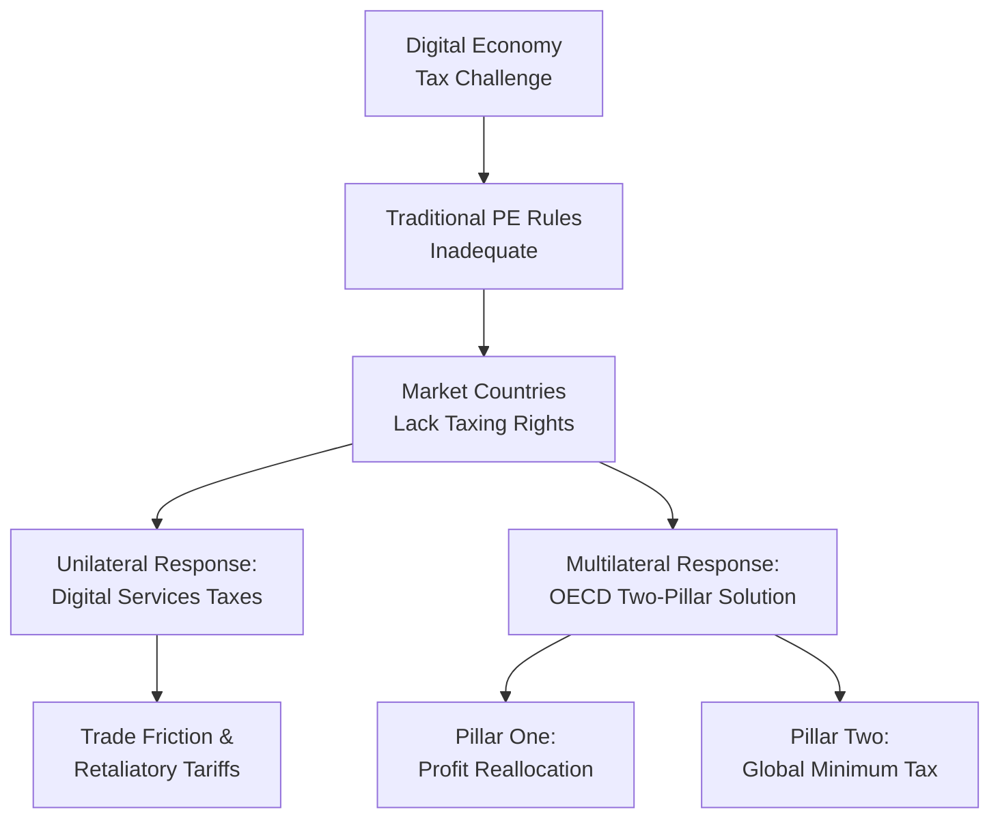

## Taxing the digital economy across borders

### Definition

Taxing the digital economy across borders refers to the set of international tax policy challenges and reform initiatives addressing how governments allocate taxing rights over profits earned by multinational enterprises whose business models are digitally-enabled and can generate significant economic value in a market jurisdiction without requiring the traditional physical presence historically used to establish a taxable nexus under international tax law.

### The Core Problem: Nexus and Physical Presence

#### Traditional International Tax Architecture

Historically, international tax law has relied on the concept of "permanent establishment" — generally requiring a fixed physical place of business (an office, factory, or dependent agent) in a country before that country could tax a foreign enterprise's business profits earned there. This framework was designed for an economy where extracting economic value from a market genuinely required physical presence.

#### The Digital Disruption

Digital business models — search advertising, social media platforms, app marketplaces, streaming services, cloud computing — can generate substantial revenue and user engagement value in a market jurisdiction entirely through remote digital interaction, with no local office, warehouse, or employees required. This creates a structural mismatch:

$$\text{Economic Value Generated in Market} \gg \text{Taxable Nexus under Traditional PE Rules}$$

Market countries where users and consumers are located, and where significant value is arguably created through user engagement and data generation, found themselves largely unable to tax the profits of highly digitalized multinationals under conventional international tax rules, generating pressure for reform.

### Diagrammatic Overview

### Unilateral Responses: Digital Services Taxes (DSTs)

#### Definition and Mechanics

A digital services tax is a levy on the gross revenue — not profit — that digital companies earn from users located in the taxing country, typically applied at rates between 1.5% and 7.5% on revenues from activities such as digital advertising, online marketplaces, and data monetization. Unlike conventional corporate income taxes, which tax net profit after deducting costs, DSTs tax top-line revenue directly, sidestepping the international profit-allocation framework entirely.

$$\text{DST Liability} = \text{Gross Digital Revenue from Domestic Users} \times \text{DST Rate}$$

#### Origins and Rationale

DSTs emerged during the 2018–2020 period as countries grew frustrated with the slow pace of OECD-led multilateral negotiations designed to give market countries taxing rights over digital multinationals' profits, representing a unilateral fallback measure adopted while multilateral reform remained unresolved.

#### Trade Policy Friction

Because DSTs predominantly affect large, mostly U.S.-headquartered technology companies, they have been perceived by the United States as discriminatory, and the U.S. has responded with retaliatory tariff threats, urging countries to abandon their DSTs. As of the current period, approximately half of all European OECD countries have either announced, proposed, or implemented a DST, and this trade friction dynamic has persisted despite multiple rounds of negotiation and specific country-level agreements that have since lapsed.

**Key Points**

- DSTs represent a fundamentally different tax base (gross revenue) than traditional corporate income tax (net profit), a design choice intended to sidestep complex international profit-allocation disputes but criticized by affected companies as economically distortive for low-margin digital businesses.
- The persistence of DSTs alongside stalled multilateral reform illustrates a central tension in this policy area: unilateral national action versus coordinated multilateral solutions, with significant trade policy spillover effects.

### Multilateral Response: The OECD/G20 Two-Pillar Solution

#### Background

In October 2021, over 135 jurisdictions joined the Two-Pillar Solution to Address the Tax Challenges Arising from the Digitalisation of the Economy, an agreement negotiated under the OECD/G20 Inclusive Framework on Base Erosion and Profit Shifting (BEPS), aiming to comprehensively update the international tax system for a globalized and digitalized economy.

#### Pillar One: Reallocation of Taxing Rights

Pillar One establishes new nexus and profit allocation rules allowing market jurisdictions to tax a share of the profits of the largest and most profitable multinational enterprises operating in their markets, even where the enterprise has no traditional permanent establishment there. Under the original design, Pillar One would allocate 25% of certain "residual" profits (termed Amount A) for large multinationals — defined by thresholds including global revenues of $20 billion or more and profit margins exceeding 10% — to be taxed by countries based on where their customers are located.

$$\text{Amount A} = (\text{Residual Profit Above Routine Return}) \times 25\%$$

Initially, Pillar One's scope was targeted specifically at automated digital services and consumer-facing businesses, but the scope has since broadened to apply to all business models subject to certain exceptions, moving beyond its original narrowly digital-economy-focused framing.

A central design feature is that Pillar One includes an agreement to repeal digital services taxes and disallow the allocation of profits to countries that retain or introduce DSTs, reflecting the multilateral solution's intent to fully substitute for the patchwork of unilateral DST measures.

#### Pillar One Implementation Status

As of the most recent available information, Pillar One remains unimplemented, despite the 2021 agreement in principle; while a Multilateral Convention to Implement Amount A of Pillar One (the MLC) was released in text form by the Inclusive Framework's Task Force on the Digital Economy in October 2023, and coordinates the reallocation of taxing rights alongside removal of digital services taxes, the timing for Pillar One's actual introduction remains unknown and depends on acceptance by a critical mass of jurisdictions, particularly given that U.S. congressional approval would likely be required given the large share of affected income attributable to U.S. multinationals.

**Key Points**

- Pillar One requires broad multilateral ratification (including, practically, U.S. Congressional approval) to take effect, creating a significant implementation bottleneck relative to Pillar Two.
- The scope expansion from purely "digital" businesses to nearly all large multinationals reflects the practical difficulty of drawing a clean line around what counts as a "digital" business for tax purposes — a definitional challenge echoing the classification problems seen in environmental goods and digital trade rules topics.

#### Pillar Two: Global Minimum Tax

Pillar Two establishes a global minimum tax ensuring that large multinational enterprises pay at least a 15% effective tax rate on profits, regardless of where they are headquartered or where they operate, addressing profit-shifting to low-tax jurisdictions independent of the digital-specific nexus problem addressed by Pillar One. Its two primary mechanisms are:

1. **Global Anti-Base Erosion (GloBE) Rules:** apply a top-up tax to bring a multinational's effective tax rate up to the 15% minimum in any jurisdiction where it falls below that threshold.
2. **Subject to Tax Rule (STTR):** applies when an intragroup payment is subject to a nominal tax rate in the payee jurisdiction below the minimum rate, allowing the source jurisdiction to impose additional withholding tax.

$$\text{Top-Up Tax} = (\text{15\%} - \text{ETR}) \times \text{Excess Profit}$$

where ETR is the multinational's effective tax rate in a given jurisdiction.

#### Pillar Two Implementation Status

Unlike Pillar One, Pillar Two has been implemented by most developed economies since early 2024, with notable exception of the United States, which has not formally adopted the framework. On January 20, 2025, a U.S. presidential executive order regarding the OECD Global Tax Deal indicated that prior U.S. commitments to the agreement had no domestic legal effect absent Congressional action, reflecting continued U.S. non-participation in the Pillar Two framework as implemented by other jurisdictions. Country-specific implementation mechanisms vary — for example, Japan has adopted an income inclusion rule, with the undertaxed payment rule expected to apply from 2026, illustrating the phased, jurisdiction-specific rollout pattern typical of Pillar Two adoption. [Unverified — country-by-country implementation details continue to evolve and should be checked against current trackers for precise, jurisdiction-specific claims]

**Key Points**

- Pillar Two has achieved substantially more real-world implementation than Pillar One, since it does not require the same degree of coordinated multilateral treaty ratification and can be adopted through domestic legislation modeled on OECD Model Rules.
- Non-participation by the United States — the headquarters jurisdiction for many of the largest affected multinationals — represents a significant gap in the framework's practical coverage and has been a persistent source of friction in the broader international tax reform effort.

### Why Pillar One Has Stalled While Pillar Two Advanced

#### Structural and Political Explanations

- **Coordination requirements:** Pillar One's mechanism for reallocating specific taxing rights between countries requires a genuinely multilateral treaty-based approach (the MLC) to avoid double taxation and ensure consistent application, whereas Pillar Two can be implemented more unilaterally through parallel domestic legislation in each jurisdiction, since each country simply enforces its own top-up tax independent of formal coordination with other countries' implementation.
- **U.S. political dynamics:** Pillar One in particular requires U.S. legislative approval given the concentration of affected large multinationals in the U.S., and this approval has not materialized amid broader U.S. political skepticism toward the OECD framework.
- **Persistent DST-driven friction:** because DSTs were meant to be repealed upon Pillar One's implementation, but Pillar One has stalled, the underlying DST-related trade tension that motivated the original multilateral effort has persisted rather than been resolved, creating an unresolved policy loop. [Inference]

### Worked Example

**Example**

Consider a large technology company headquartered in Country A, earning significant advertising revenue from users in Country B, where it has no physical office or employees.

**Under traditional international tax rules (pre-reform):**

Country B generally cannot tax the company's profits, since no permanent establishment exists there — all profit is taxed in Country A (or wherever the company has established nexus).

**Under a unilateral DST (Country B implements one):**

Country B taxes a percentage (e.g., 3%) of the company's gross advertising revenue attributable to Country B users, regardless of the company's actual profit margin on that revenue.

$$\text{DST Liability} = \text{Country B Ad Revenue} \times 3\%$$

**Under Pillar One (if implemented):**

Country B would instead receive an allocated share of the company's residual global profit (Amount A), calculated via a formula based on the company's overall profitability and Country B's share of relevant revenue, replacing the DST entirely and aligning with the traditional profit-based (rather than revenue-based) tax framework.

**Under Pillar Two (independent of the above):**

Regardless of where the company's profit is ultimately allocated, if its effective tax rate in any jurisdiction (including Country A) falls below 15%, a top-up tax applies to bring the effective rate to the minimum threshold, addressing profit-shifting concerns separately from the market-allocation question addressed by Pillar One.

This illustrates how the two pillars address distinct problems — Pillar One targets *where* profit is taxed, while Pillar Two targets the *minimum rate* at which it is taxed — and why a country's tax policy toward a given multinational could differ substantially depending on which frameworks are in force. [Inference — illustrative example for pedagogical purposes]

### Illustrative Diagram: Two-Pillar Framework Comparison

<svg xmlns="http://www.w3.org/2000/svg" viewBox="0 0 700 340">
<text x="350" y="25" text-anchor="middle" font-size="16" font-weight="bold" fill="#1a1a1a">Pillar One vs Pillar Two (svg_diagram)</text>
<rect x="60" y="60" width="280" height="240" fill="none" stroke="#2980b9" stroke-width="2" rx="8" />
<text x="200" y="90" text-anchor="middle" font-size="14" font-weight="bold" fill="#2980b9">Pillar One</text>
<text x="200" y="120" text-anchor="middle" font-size="11" fill="#333">Addresses: WHERE</text>
<text x="200" y="140" text-anchor="middle" font-size="11" fill="#333">profit is taxed</text>
<text x="200" y="175" text-anchor="middle" font-size="11" fill="#333">Reallocates profit to</text>
<text x="200" y="193" text-anchor="middle" font-size="11" fill="#333">market jurisdictions</text>
<text x="200" y="230" text-anchor="middle" font-size="11" fill="#c0392b">Status: Not yet</text>
<text x="200" y="248" text-anchor="middle" font-size="11" fill="#c0392b">implemented</text>
<rect x="360" y="60" width="280" height="240" fill="none" stroke="#27ae60" stroke-width="2" rx="8" />
<text x="500" y="90" text-anchor="middle" font-size="14" font-weight="bold" fill="#27ae60">Pillar Two</text>
<text x="500" y="120" text-anchor="middle" font-size="11" fill="#333">Addresses: MINIMUM</text>
<text x="500" y="140" text-anchor="middle" font-size="11" fill="#333">rate of taxation</text>
<text x="500" y="175" text-anchor="middle" font-size="11" fill="#333">15% global minimum</text>
<text x="500" y="193" text-anchor="middle" font-size="11" fill="#333">effective tax rate</text>
<text x="500" y="230" text-anchor="middle" font-size="11" fill="#27ae60">Status: Implemented by</text>
<text x="500" y="248" text-anchor="middle" font-size="11" fill="#27ae60">most developed economies</text>
</svg>

### Interaction with Broader Trade Policy

#### Tax Measures as Trade Friction

DSTs illustrate how domestic tax policy choices can generate international trade friction functionally similar to disputes over conventional trade barriers, since affected governments (notably the U.S.) have responded with trade policy tools (retaliatory tariff threats) rather than purely tax-policy channels, blurring the traditional separation between international tax policy and trade policy domains.

#### Comparison to Other Digital Trade Governance Challenges

The digital tax debate parallels other topics in this chapter — like data localization and digital trade rules — in that it reflects the broader structural challenge of applying border-and-presence-based legal frameworks (whether customs, trade nexus, or tax nexus) to economic activity that increasingly does not require physical border crossing or presence to generate value.

### Common Misconceptions

- **Misconception:** digital services taxes and the OECD Pillar One achieve the same policy goal through different means. **Reality:** while both aim to give market countries taxing rights over digital-economy profits, DSTs tax gross revenue unilaterally while Pillar One is a coordinated multilateral profit-reallocation mechanism intended to replace DSTs entirely.
- **Misconception:** the OECD's two-pillar solution has been uniformly implemented worldwide. **Reality:** Pillar Two has achieved substantial implementation among developed economies (notably excluding the U.S.), while Pillar One remains largely unimplemented despite the original 2021 agreement in principle.
- **Misconception:** taxing the digital economy is purely a domestic tax policy matter unrelated to trade policy. **Reality:** DST-related disputes have directly triggered trade policy responses, including retaliatory tariff threats, illustrating the close practical linkage between digital tax policy and international trade relations.

### Related Topics

- Cross border data flows and digital trade rules
- E commerce and platform based international trade
- Permanent establishment and international tax nexus rules
- OECD/G20 Base Erosion and Profit Shifting (BEPS) project
- Retaliatory tariffs and trade policy responses to tax disputes
- Carbon border adjustment mechanisms (comparative border-adjustment mechanism design)
- Multinational enterprise profit shifting and tax avoidance
- Global minimum tax (GloBE Rules) country implementation tracking