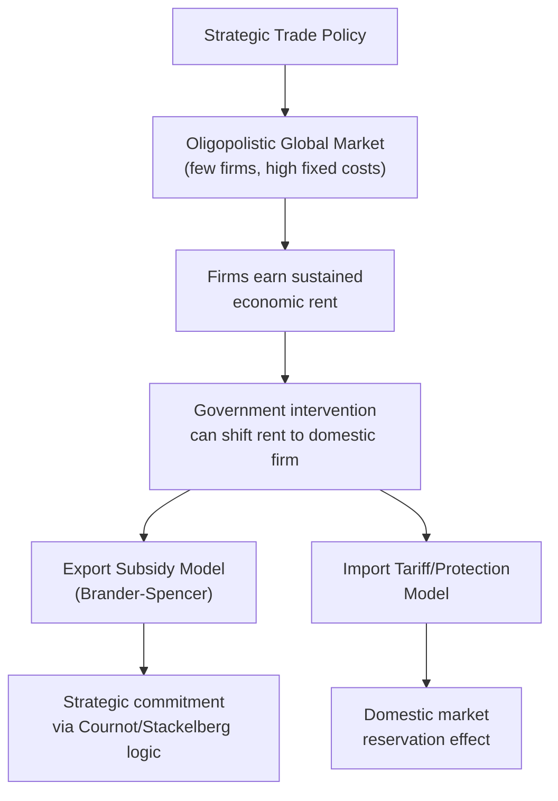
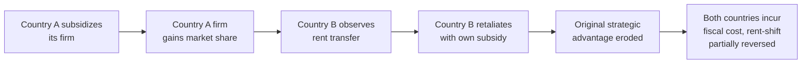

## Strategic trade policy under imperfect competition

### Definition

Strategic trade policy refers to government intervention — subsidies, tariffs, or other trade instruments — designed to shift economic profits (rents) from foreign to domestic firms in markets characterized by imperfect competition (oligopoly) and increasing returns to scale, where a small number of firms compete for market share in ways that make strategic government intervention potentially welfare-improving for the intervening country, in contrast to standard free-trade prescriptions derived from perfectly competitive market models.

### Theoretical Departure from Traditional Trade Theory

#### Why Perfect Competition Models Rule Out Strategic Intervention

Under the classical comparative advantage frameworks (Ricardian, Heckscher-Ohlin), markets are perfectly competitive, firms are price-takers, and economic profit is competed away to zero in equilibrium. Under these assumptions, government intervention (tariffs, subsidies) can only distort otherwise efficient market outcomes, providing the theoretical foundation for the traditional free-trade policy prescription.

#### The Imperfect Competition Departure

In industries characterized by oligopoly — a small number of firms, often with significant economies of scale, competing globally (aircraft manufacturing, semiconductors, telecommunications equipment) — firms can earn sustained positive economic profit (rent) in equilibrium, since the small number of competitors prevents the full profit erosion that perfect competition would produce. Strategic trade theory, developed prominently by economists including James Brander, Barbara Spencer, and Paul Krugman in the early 1980s, formalized conditions under which a government could use strategic intervention to shift a larger share of this rent toward domestic firms. [Unverified — specific attribution and publication dates should be checked against primary sources for precise citation]

### Diagrammatic Overview

### The Brander-Spencer Export Subsidy Model

#### Core Mechanism

The canonical strategic trade policy model considers two firms from different countries competing as duopolists in a third-country export market (avoiding complications from domestic consumer welfare effects). The two firms compete in quantities (Cournot competition), and each firm's profit depends on both its own and its rival's output choice.

#### Strategic Commitment Logic

The key insight is that a credible government subsidy to the domestic firm functions as a strategic commitment device, shifting the game's outcome analogous to a Stackelberg leader-follower structure rather than simultaneous Cournot competition:

$$\pi_{domestic} = R(q_{domestic}, q_{foreign}) - C(q_{domestic}) + s \cdot q_{domestic}$$

where $s$ is a per-unit export subsidy. The subsidy lowers the domestic firm's effective marginal cost, causing it to credibly commit to higher output. Because the foreign firm's best-response function is downward-sloping in a Cournot duopoly (each firm reduces output as its rival's output rises), the foreign firm's optimal response to the domestic firm's higher output is to reduce its own output:

$$\frac{\partial q_{foreign}^*}{\partial q_{domestic}} < 0$$

This output reduction shifts market share and profit from the foreign firm to the domestic firm, potentially by more than the cost of the subsidy itself, generating a net national welfare gain for the subsidizing country (even though the subsidy is a pure transfer from domestic taxpayers to the domestic firm, the *rent captured from the foreign firm* can exceed this transfer). [Inference — this is the standard theoretical mechanism as commonly presented in strategic trade theory literature]

**Key Points**

- The strategic effect operates through altering the *rival's* behavior, not merely through directly lowering the subsidized firm's costs — this is the theoretically distinctive feature relative to simple cost-reduction arguments for subsidies.
- The subsidy functions similarly to a first-mover advantage in a sequential game, converting simultaneous Cournot competition into an effective Stackelberg structure favoring the subsidized firm.

### Worked Numerical Example

**Example**

Consider two firms — Domestic (D) and Foreign (F) — competing in quantities in a third-country market with inverse demand $P = 100 - Q$, where $Q = q_D + q_F$, and both firms face constant marginal cost $c = 20$.

**Without subsidy (Cournot-Nash equilibrium):**

Each firm's best response: $q_i = \frac{100 - c - q_j}{2}$

Symmetric Cournot equilibrium: $q_D = q_F = \frac{100-20}{3} = 26.67$

Profit per firm: $\pi_i = (100 - 53.33 - 20) \times 26.67 \approx \$711$

**With a $10 per-unit export subsidy to the domestic firm:**

Domestic firm's effective marginal cost becomes $c_D = 20 - 10 = 10$.

New best-response functions:

$$q_D = \frac{100 - 10 - q_F}{2}, \quad q_F = \frac{100 - 20 - q_D}{2}$$

Solving simultaneously: $q_D \approx 36.67$, $q_F \approx 21.67$

Domestic firm profit (gross of subsidy cost): $\pi_D = (100 - 58.33 - 20) \times 36.67 \approx \$770$

Net domestic firm profit (subtracting subsidy cost of $10 \times 36.67 = \$366.7$ paid by government, but this is a domestic transfer): the relevant welfare calculation compares domestic firm profit *net of the true resource cost* against the pre-subsidy baseline, with the foreign firm's profit falling from $711 to approximately $470 (a rent transfer captured partly by the domestic economy in the exporting country's welfare accounting). [Inference — simplified stylized numerical illustration for pedagogical purposes only; actual welfare accounting requires careful specification of who bears the subsidy cost and how the rent transfer is measured]

### Import Protection as Export Promotion (Domestic Market Reservation)

#### Alternative Strategic Mechanism

A related strategic trade argument holds that protecting a firm's domestic market (via tariffs or import restrictions) can enhance that firm's ability to compete in *export* markets by guaranteeing it a secured, larger domestic sales base, allowing it to achieve scale economies or a stronger strategic position that improves its competitiveness abroad — sometimes associated with debates over Japanese industrial policy in sectors like semiconductors during the 1980s. [Unverified — the specific empirical validity and historical attribution of this argument to particular national industrial policy episodes remains contested among trade economists]

### Critiques and Limitations

#### Informational Requirements

Effective strategic trade policy requires the government to know, with considerable precision, market structure, cost functions, demand elasticities, and competitor behavior — informational requirements that are extremely demanding in practice and rarely available to policymakers with confidence. [Inference]

#### Retaliation Risk

If multiple governments simultaneously attempt strategic intervention in the same industries (a plausible outcome given that the theoretical logic is symmetric and available to all governments), the result can be a subsidy race that dissipates the rent-shifting benefit for all parties while imposing real fiscal costs, a dynamic resembling a prisoner's dilemma:

$$W_{global} < W_{no\ intervention\ by\ anyone}$$

if all major producing countries subsidize simultaneously, since the strategic advantage each government seeks is largely relative rather than absolute, and mutual intervention can leave all parties worse off than a coordinated no-intervention outcome.

#### Sector Selection Difficulty

Even if strategic trade policy is theoretically valid for *some* appropriately structured oligopolistic industries, correctly identifying which specific sectors meet the necessary conditions (few firms, significant economies of scale, meaningful rent available to shift) in advance, rather than after the fact, is an extremely demanding policy task prone to capture by politically influential industries regardless of their genuine strategic characteristics. [Inference]

#### Rent-Seeking and Political Economy Concerns

Because strategic trade policy explicitly proposes picking winning industries or firms for targeted government support, it creates strong incentives for industries to lobby for characterization as "strategic," independent of whether they genuinely meet the model's theoretical preconditions, a concern frequently raised as a primary practical objection to strategic trade policy implementation. [Inference]

**Key Points**

- The theoretical elegance of the Brander-Spencer model does not straightforwardly translate into a robust practical policy prescription, given the severe informational demands, retaliation risk, and political economy distortions involved.
- Most strategic trade theorists, including original contributors to the literature, have historically cautioned against treating the model as a general justification for interventionist industrial policy, emphasizing its narrow theoretical conditions. [Inference]

### Retaliation-Corrected Welfare Analysis

#### Game-Theoretic Extension

When the model is extended to allow the foreign government to also offer a strategic subsidy in response, the resulting subsidy competition can be modeled as a game where each government's optimal response depends on the other's policy choice:

**Key Points**

- Unilateral strategic trade policy analysis (assuming no foreign retaliation) tends to overstate the true welfare benefit available in practice, since it does not account for symmetric incentives facing all governments potentially engaged in similar industries.

### Contemporary Relevance and Connection to Industrial Policy

#### Semiconductor and Advanced Technology Sectors

Strategic trade policy logic has experienced renewed practical relevance in recent policy debates surrounding semiconductor manufacturing subsidies and other advanced technology sectors, where governments in multiple major economies have adopted large-scale industrial subsidy programs explicitly citing strategic and national security rationales alongside (or sometimes instead of) pure economic rent-shifting logic. [Inference — this connects the classical 1980s theoretical framework to a contemporary policy resurgence; specific current program details should be verified separately given the fast-evolving nature of this policy area]

#### Distinction from National Security-Based Industrial Policy

It is analytically important to distinguish rent-shifting strategic trade policy (the classical Brander-Spencer economic logic) from industrial policy justified primarily on national security or supply chain resilience grounds, since the latter rationale does not depend on the oligopolistic rent-shifting mechanism at all and instead rests on different welfare considerations (e.g., the value of avoiding strategic dependency on a potentially adversarial trading partner) — a distinction elaborated further in subsequent geoeconomics topics in this chapter. [Inference]

### Common Misconceptions

- **Misconception:** strategic trade policy provides a general theoretical justification for protectionism or industrial subsidies across the economy. **Reality:** the theoretical logic applies narrowly to oligopolistic industries with specific structural characteristics (few firms, significant rents, meaningful strategic interaction), not to competitive industries generally.
- **Misconception:** because the Brander-Spencer model shows subsidies can theoretically raise national welfare, this implies such policies are generally advisable. **Reality:** most strategic trade theorists emphasize the model's narrow theoretical conditions, severe informational requirements, and high retaliation risk as reasons for caution in practical policy application.
- **Misconception:** all industrial policy justified by reference to "strategic" industries follows the Brander-Spencer rent-shifting logic. **Reality:** much contemporary industrial policy is justified primarily on national security or supply-chain resilience grounds, which is analytically distinct from the classical economic rent-shifting mechanism.

### Related Topics

- National security and economic statecraft in trade policy
- Industrial policy and semiconductor subsidy programs
- Oligopoly models: Cournot and Stackelberg competition
- New trade theory and economies of scale (Krugman)
- Carbon border adjustment mechanisms (comparative strategic trade instrument)
- Export subsidies under WTO Subsidies and Countervailing Measures Agreement
- Geoeconomics and supply chain resilience policy
- Rent-seeking and political economy of trade policy