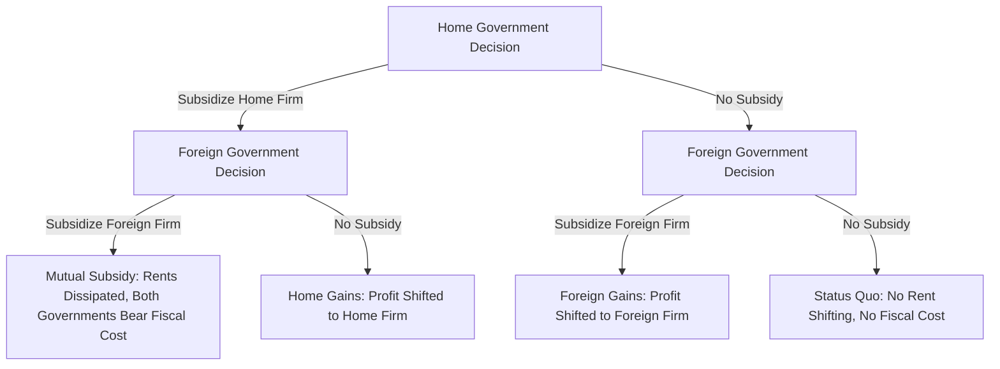

## Export Subsidies as Strategic Instruments

### Conceptual Foundation

Export subsidies are government payments, tax concessions, credit guarantees, or in-kind transfers that lower the effective cost of producing goods for foreign markets, thereby increasing the exporting firm's competitiveness abroad. In classical trade theory, subsidies are treated as distortionary and welfare-reducing for the subsidizing country. Strategic trade theory, developed primarily by Brander, Spencer, Krugman, and Dixit in the early-to-mid 1980s, overturned this presumption under specific market structure assumptions: when international markets are oligopolistic rather than perfectly competitive, a government can use export subsidies to shift profits from a foreign rival firm to a domestic firm, raising national welfare even though the subsidy itself is a transfer and creates production distortion.

The core insight is that in imperfectly competitive markets, firms earn economic rents (above-normal profits) that would not exist under perfect competition. A government that can credibly alter its firm's strategic position may capture a disproportionate share of these rents for domestic residents, even after subtracting the fiscal cost of the subsidy.

### The Brander-Spencer Model

The canonical model is a third-market duopoly under Cournot competition (quantity competition), though it generalizes to Bertrand (price) competition with different results.

**Setup:**

- Two firms, Home ($H$) and Foreign ($F$), compete in quantities in a third-country market (no domestic consumption effects, isolating the profit-shifting motive from terms-of-trade effects on consumers).
- Both firms choose output levels $q_H$ and $q_F$ simultaneously (or the government moves first, then firms move simultaneously — a two-stage game).
- Profit functions depend on both firms' output through an inverse demand function $P(Q)$ where $Q = q_H + q_F$.

**Sequence of the game:**

1. Home government commits to a per-unit subsidy $s$ to Home firm.
2. Firms observe $s$ and play Cournot competition, choosing $q_H$ and $q_F$ to maximize profits given reaction functions.

**Reaction functions:** Each firm's best-response output is decreasing in the rival's output (strategic substitutes in Cournot). The subsidy shifts Home's reaction function outward.

$$\pi_H = P(q_H + q_F)q_H - c_H(q_H) + s \cdot q_H$$

$$\pi_F = P(q_H + q_F)q_F - c_F(q_F)$$

**Mechanism:** A subsidy $s > 0$ lowers Home firm's effective marginal cost, shifting its reaction function $R_H(q_F)$ outward. Because reaction functions slope downward under Cournot competition, Foreign firm's best response is to *reduce* $q_F$. This raises Home's equilibrium output and market share, and — critically — can increase Home firm's profit by more than the subsidy cost, because the subsidy induces a Stackelberg-leader-like shift: Home firm behaves as if it has lower costs, and Foreign firm accommodates by contracting output.

**Key Points**

- The optimal export subsidy in this framework is generally positive (a subsidy, not a tax) under Cournot competition, because it credibly commits Home firm to be more aggressive, deterring Foreign firm's output.
- Under Bertrand (price) competition, the strategic logic reverses: reaction functions slope upward (strategic complements), and the optimal policy becomes an export *tax*, not a subsidy, because government wants to soften — not intensify — price competition.
- The result is highly sensitive to the assumed mode of competition (Cournot vs. Bertrand), the number of firms, conjectural variations, and whether entry is free. Eaton and Grossman (1986) showed that with Bertrand competition, the profit-shifting rationale for subsidies disappears entirely.

### Formal Welfare Decomposition

National welfare for the Home country in the third-market model equals Home firm's profit net of subsidy cost (assuming no domestic consumption):

$$W_H = \pi_H(q_H, q_F) - s \cdot q_H$$

Optimal subsidy $s^*$ satisfies the first-order condition derived from the government's maximization of $W_H$ with respect to $s$, internalizing how $s$ affects both $q_H$ and $q_F$ through the equilibrium of the firms' game:

$$\frac{dW_H}{ds} = \frac{\partial \pi_H}{\partial q_H}\frac{dq_H}{ds} + \frac{\partial \pi_H}{\partial q_F}\frac{dq_F}{ds} - q_H - s\frac{dq_H}{ds} = 0$$

Since firms optimize privately, $\partial \pi_H / \partial q_H = 0$ at the firm's equilibrium (envelope condition), leaving:

$$s^* \frac{dq_H}{ds} = \frac{\partial \pi_H}{\partial q_F}\frac{dq_F}{ds} - q_H$$

The term $\partial \pi_H/\partial q_F$ is negative (rival's output hurts Home profit), and $dq_F/ds$ is negative (subsidy causes Foreign to contract), so their product is positive — this is the **strategic profit-shifting term**. It is weighed against $q_H$, the direct fiscal transfer cost. The optimal subsidy is positive when the profit-shifting effect dominates.

### Diagram: Reaction Function Shift (svg_diagram)

<svg xmlns="http://www.w3.org/2000/svg" viewBox="0 0 640 480" font-family="Arial, sans-serif">
<text x="320" y="28" text-anchor="middle" font-size="18" font-weight="bold">Cournot Reaction Functions and Subsidy Shift (svg_diagram)</text>
<line x1="80" y1="420" x2="580" y2="420" stroke="black" stroke-width="2" />
<line x1="80" y1="420" x2="80" y2="60" stroke="black" stroke-width="2" />
<text x="580" y="440" font-size="14" text-anchor="end">q_H (Home output)</text>
<text x="55" y="60" font-size="14" text-anchor="end">q_F</text>

<line x1="100" y1="90" x2="480" y2="400" stroke="#1f77b4" stroke-width="2.5" />
<text x="490" y="405" font-size="13" fill="#1f77b4">R_F(q_H)</text>

<line x1="150" y1="400" x2="440" y2="100" stroke="#d62728" stroke-width="2.5" />
<text x="445" y="95" font-size="13" fill="#d62728">R_H(q_F), s=0</text>

<line x1="230" y1="400" x2="520" y2="100" stroke="#d62728" stroke-width="2.5" stroke-dasharray="6,4" />
<text x="525" y="95" font-size="13" fill="#d62728">R_H'(q_F), s&gt;0</text>

<circle cx="292" cy="248" r="5" fill="black" />
<text x="300" y="240" font-size="12">E0 (no subsidy)</text>
<circle cx="336" cy="212" r="5" fill="black" />
<text x="345" y="205" font-size="12">E1 (with subsidy)</text>
<line x1="292" y1="248" x2="336" y2="212" stroke="green" stroke-width="1.5" stroke-dasharray="3,3" />
<text x="345" y="240" font-size="11" fill="green">q_H rises, q_F falls</text>
</svg>

### Terms-of-Trade and Domestic-Market Extensions

The pure third-market model isolates profit-shifting, but real-world export subsidies interact with domestic consumers and terms-of-trade effects:

- **Domestic consumption case:** If the subsidized good is also consumed at home, an export subsidy raises the domestic price faced by consumers (since firms can sell abroad at world price plus subsidy, they arbitrage domestic price upward), producing a consumption distortion that offsets some of the profit-shifting gain.
- **Terms-of-trade effects:** An export subsidy that increases Home's export supply typically worsens Home's terms of trade (the price at which it sells its exports falls, or the price of its imports relative to exports moves adversely) — a classic negative externality of export promotion that strategic trade theory must net against the profit-shifting gain.
- **Retaliation:** If Foreign government also subsidizes its firm (symmetric response), both countries may end up in a subsidy race that dissipates the gains from unilateral intervention — a prisoner's dilemma structure formalized in the trade-policy game theory literature.

### Sensitivity and Critiques

**Key Points**

- **Informational requirements:** The optimal subsidy formula requires the government to know firms' cost functions, demand elasticities, and the mode of competition (Cournot, Bertrand, or conjectural variations) with precision that is empirically unattainable. Eaton and Grossman (1986) demonstrated that under Bertrand competition, the optimal policy flips sign entirely — an export tax, not a subsidy — meaning a government could easily choose the wrong instrument if it misjudges market conduct.
- **Retaliation and beggar-thy-neighbor dynamics:** Foreign governments are unlikely to remain passive. If Foreign subsidizes in response, the profit-shifting rents can be competed away, leaving both governments worse off (fiscal transfer with no strategic gain) — a standard trade-war/prisoner's-dilemma outcome (Dixit, 1984; Grossman, 1986).
- **Rent-seeking and political economy:** Because the model implies gains from targeted intervention, it creates strong incentives for firms and industries to lobby for "strategic" designation regardless of genuine oligopoly rents, risking capture of policy by politically connected sectors rather than economically justified ones (Krugman himself was an early and vocal critic of over-extending these results into policy advocacy).
- **Fragility to assumptions:** Results are highly sensitive to number of firms (gains shrink and can reverse as the number of competing firms rises toward a competitive benchmark), free entry (which dissipates rents entirely, per Horstmann and Markusen, 1986), and the precise conjectural variation firms hold about rivals' responses.
- Krugman (1987) concluded that despite its theoretical elegance, strategic trade policy offers a "thin" case for real-world protectionism given the fragility and information demands. [Inference] Most mainstream trade economists treat Brander-Spencer as an important theoretical benchmark illustrating conditions under which intervention *could* be welfare-improving, rather than a practical policy prescription.

### Empirical and Historical Applications

Export subsidies as strategic instruments are most commonly discussed in reference to high-fixed-cost, oligopolistic, technology-intensive industries where a small number of firms compete globally:

- **Civil aircraft (Airbus–Boeing):** The most frequently cited real-world illustration. European launch aid to Airbus and various U.S. supports to Boeing (including defense R&D spillovers and Export-Import Bank financing) have been analyzed through the Brander-Spencer lens, given the duopolistic structure of the wide-body aircraft market. This dispute was litigated extensively at the WTO (the *Boeing–Airbus* disputes, DS316 and DS353) over subsidy legality under the Agreement on Subsidies and Countervailing Measures (SCM Agreement).
- **Semiconductors:** Japanese and later Korean and Taiwanese state support for semiconductor manufacturing in the 1980s–2000s is often cited in strategic trade discussions, though attribution of outcomes purely to subsidy policy versus other factors (exchange rates, industrial organization, learning curves) is contested among economists.
- **Shipbuilding:** Long-standing subsidy competition among South Korea, Japan, China, and EU shipbuilders has been analyzed as a strategic-trade-style rent-shifting contest, with periodic OECD-negotiated disciplines attempting to cap subsidy races.
- **Contemporary semiconductor and EV/battery policy (2020s):** The U.S. CHIPS and Science Act (2022), EU Chips Act, and various country-level EV/battery subsidy programs are frequently framed in public and policy discourse using strategic-trade-style logic, though many economists note these programs are more directly justified by externality (spillover), supply-chain-resilience, and national-security rationales than by pure profit-shifting logic. [Inference] The relative weight of "profit-shifting" versus "market failure/externality" versus "geopolitical/security" justification in these specific 2020s programs is a matter of ongoing debate rather than settled empirical consensus.

### Legal Status Under WTO Rules

**Key Points**

- Export subsidies contingent on export performance are classified as **prohibited subsidies** ("red light" subsidies) under Article 3 of the WTO Agreement on Subsidies and Countervailing Measures (SCM Agreement), regardless of whether they cause material injury — no injury test is required for a challenge to succeed.
- This creates a direct tension: the Brander-Spencer welfare case for export subsidies exists in a policy environment where such subsidies are, for WTO members, generally illegal when clearly tied to export performance.
- Countries have historically pursued economically similar objectives through WTO-permissible instruments instead: domestic production subsidies, R&D support, government procurement preferences, credit guarantees not strictly tied to export volume, and currency/exchange-rate policy — all of which face different (and often less strict) WTO disciplines than explicit export subsidies.
- Countervailing duties (CVDs) are the primary WTO-sanctioned remedy available to an importing country injured by another country's subsidized exports, requiring a finding of subsidy, injury, and causal link.
- [Unverified] Precise current enforcement statistics and the status of any specific pending WTO disputes should be checked against current WTO Dispute Settlement Body records, as case status changes over time.

### Numerical Illustration

Consider a simplified linear-demand Cournot duopoly in a third market with inverse demand $P = 100 - Q$, where $Q = q_H + q_F$, and both firms initially have marginal cost $c = 40$.

**Without subsidy**, symmetric Cournot equilibrium:

$$q_H = q_F = \frac{100 - 40}{3} = 20, \quad P = 100 - 40 = 60$$

$$\pi_H = \pi_F = (60 - 40)(20) = 400$$

**With a per-unit subsidy $s = 10$** to Home firm (effective marginal cost becomes $30$):

Home reaction function: $q_H = \frac{100 - 30 - q_F}{2} = 35 - 0.5q_F$

Foreign reaction function: $q_F = \frac{100 - 40 - q_H}{2} = 30 - 0.5q_H$

Solving simultaneously:

$$q_H = 35 - 0.5(30 - 0.5q_H) = 35 - 15 + 0.25q_H \Rightarrow 0.75q_H = 20 \Rightarrow q_H = 26.67$$

$$q_F = 30 - 0.5(26.67) = 16.67$$

$$P = 100 - (26.67 + 16.67) = 56.67$$

Home firm's gross profit: $(56.67 - 30)(26.67) = 711.6$

Subsidy cost: $10 \times 26.67 = 266.7$

Home firm's net-of-subsidy profit accruing to Home welfare: $711.6 - 266.7 = 444.9$

**Result:** Home welfare rises from 400 (no subsidy) to 444.9 (with subsidy) — an increase of roughly 44.9, illustrating the profit-shifting gain net of fiscal cost, even though the subsidy itself is partially "wasted" as a transfer. Foreign firm's profit falls from 400 to $(56.67-40)(16.67) = 277.8$, confirming the rent is shifted from Foreign to Home.

**Example**

This numerical case demonstrates the qualitative Brander-Spencer result directly: a modest per-unit subsidy shifted roughly 122 units of output-adjusted rent from Foreign to Home firm, of which about 45 units survived as a net national welfare gain to Home after paying for the subsidy — the remainder being captured partly by Home firm beyond the transfer and partly reflecting output/price changes. [Inference] The specific magnitude of net gain is highly sensitive to the assumed cost symmetry, demand slope, and subsidy level chosen for this illustration, and does not generalize quantitatively beyond this parameterization.

### Comparison: Cournot vs. Bertrand Strategic Effects

| Dimension | Cournot (Quantity Competition) | Bertrand (Price Competition) |
| --- | --- | --- |
| Reaction function slope | Downward (strategic substitutes) | Upward (strategic complements) |
| Optimal government instrument | Export subsidy | Export tax |
| Strategic logic | Commit to aggression, deter rival's output | Commit to softer pricing, avoid price war |
| Effect on rival's choice variable | Rival reduces output | Rival raises price |
| Policy implication | Government wants firm to look "tougher" | Government wants firm to look "less aggressive" |

### Distinguishing Export Subsidies from Related Instruments

- **Export subsidy vs. production subsidy:** A production subsidy lowers costs on all output regardless of destination, avoiding the direct WTO "export contingency" prohibition, while still potentially conferring some competitive advantage in export markets — this distinction is central to how many countries structure industrial policy to remain WTO-compliant while pursuing similar strategic aims.
- **Export subsidy vs. tariff protection:** Tariffs protect the domestic market by raising the price of imports; export subsidies instead target foreign or third-country markets and do not directly shield domestic market share from import competition.
- **Export subsidy vs. exchange rate manipulation:** Currency undervaluation has sometimes been analyzed as a de facto export subsidy (raising foreign-currency competitiveness of exports) though it operates through macroeconomic channels rather than direct fiscal transfer, and is governed by IMF Articles of Agreement and WTO rules on exchange-rate-related trade measures rather than the SCM Agreement's subsidy disciplines directly.

### Strategic Trade Game Payoff Structure

### Related Topics

- Strategic trade theory and the Brander-Spencer model (foundational literature)
- Eaton-Grossman critique: Bertrand competition and the reversal to export taxes
- Countervailing duties and WTO Subsidies and Countervailing Measures (SCM) Agreement
- Infant industry protection and dynamic learning-curve justifications for intervention
- Industrial policy in semiconductors: CHIPS Act, EU Chips Act, and global subsidy competition
- Beggar-thy-neighbor policies and retaliatory trade wars
- Terms-of-trade externalities in trade policy
- Rent-seeking and political economy of trade protection
- Geoeconomic statecraft and weaponized interdependence
- Currency manipulation as an implicit export subsidy
- The Airbus–Boeing WTO disputes (DS316, DS353) as a case study