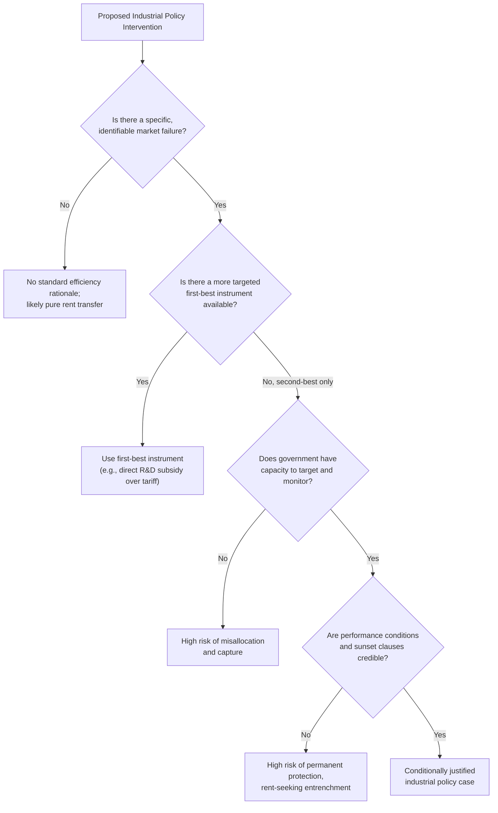

## The Rationale for and Critique of Industrial Policy

### Definitional Scope

Industrial policy refers to deliberate government action to shape the sectoral composition of an economy — targeting specific industries, technologies, or activities for support (or restriction) beyond what neutral, economy-wide policy would provide. Instruments include tariffs, export subsidies, tax credits, directed credit, state-owned enterprises, public R&D funding, local-content requirements, government procurement preferences, and coordinated infrastructure investment. It is distinguished from purely horizontal (economy-wide) policy such as general corporate tax rates, macroeconomic stabilization, or universal education spending, though the boundary between horizontal and selective policy is often blurred in practice.

### Theoretical Rationale I: Market Failures

**Key Points**

- **Externalities and knowledge spillovers:** If a firm's innovation or learning-by-doing generates benefits that spill over to other firms or the economy at large (positive externalities), private investment will be below the socially optimal level, because the innovating firm cannot capture the full social return. This is the classic Marshallian/Arrow rationale for subsidizing R&D-intensive or learning-intensive sectors.
- **Infant industry protection:** Originating with Friedrich List and Alexander Hamilton, and formalized by economists such as Robert Baldwin, the infant industry argument holds that new industries in developing economies may be unable to achieve competitive scale or accumulate tacit knowledge/learning-by-doing fast enough to survive competition from established foreign firms, even though they would be viable (and eventually internationally competitive) if given temporary protection. The theoretical condition for this argument to justify protection (rather than a subsidy) requires a capital-market failure preventing firms from borrowing against future profits to cover initial losses — a point emphasized by Baldwin (1969) as the "Baldwin critique": if capital markets functioned well, firms could simply borrow to finance the learning period, and protection would be unnecessary; tariff protection is a second-best (or third-best) instrument even when the underlying rationale is valid.
- **Coordination failures:** Investments across complementary sectors (e.g., steel, transport infrastructure, and downstream manufacturing) may exhibit strategic complementarities such that no single firm wants to invest first because profitability depends on other sectors' simultaneous investment. This is central to "big push" models (Rosenstein-Rodan, 1943; formalized by Murphy, Shleifer, and Vishny, 1989), where multiple equilibria exist and government coordination (or credible signaling) can shift the economy from a low-investment to a high-investment equilibrium.
- **Credit market imperfections:** In economies with underdeveloped financial systems, directed credit or development banks may address information asymmetries and screening costs that prevent capital from flowing to high-return but opaque or long-gestation projects (a rationale associated with development banking literature, e.g., Gerschenkron's analysis of late industrializers, and more formally with Stiglitz-Weiss credit rationing models).
- **Strategic trade rents:** As established in Brander-Spencer-style models, oligopolistic international markets can generate rents that industrial policy might shift toward domestic firms — though this rationale carries its own separate and extensive critique literature (see prior module on strategic export subsidies).

### Theoretical Rationale II: Structural Transformation and Comparative Advantage Dynamics

- **Dynamic/latent comparative advantage:** Some theorists (notably associated with the "New Structural Economics" school led by Justin Yifu Lin) argue that governments should identify sectors just beyond a country's current comparative advantage — determined by its factor endowments — and provide targeted facilitation (infrastructure, coordination, limited incentives) to accelerate the transition, rather than picking sectors far outside current capability.
- **Structural change and productivity-enhancing reallocation:** Industrial policy proponents (e.g., Dani Rodrik) argue that the central economic problem in developing economies is discovering which activities a country can produce competitively — an information externality, since the first entrant into a new activity reveals valuable cost-discovery information to imitators at private cost but social benefit. Rodrik's "self-discovery" framework (Hausmann and Rodrik, 2003) treats this as a rationale for coordinated support and information-generation subsidies rather than picking permanent winners.

### Formal Illustration: Learning-by-Doing and Infant Industry Protection

Consider a domestic firm with unit cost declining in cumulative output (learning curve) according to:

$$c(K_t) = c_0 \cdot K_t^{-\lambda}, \quad \lambda > 0$$

where $K_t = \sum_{\tau=0}^{t} q_\tau$ is cumulative production and $\lambda$ is the learning elasticity. If the world price is $p^*$ and initial cost $c(0) > p^*$, the firm cannot profitably enter without protection, even if $c(K_T) < p^*$ eventually as $K_T$ grows.

The welfare case for temporary protection requires:

$$\sum_{t=0}^{T} \delta^t \left[ p^* - c(K_t) \right] q_t > \text{PV of protection-period losses to consumers}$$

where $\delta$ is the discount factor, and $T$ is the point at which $c(K_T) \leq p^*$ (the industry becomes internationally competitive). The Baldwin critique notes that this expression alone does not establish that *trade protection* is the right instrument — if capital markets were complete, the firm could simply borrow against the discounted future profit stream $\sum_{t>T} \delta^t [p^* - c(K_t)]q_t$ to finance early losses, making protection redundant. Protection is justified only when a **specific market failure** (capital market imperfection, appropriability problem on the learning spillover, or similar) independently prevents this borrowing.

### Diagram: Nested Conditions for a Valid Industrial Policy Rationale (svg_diagram)

<svg xmlns="http://www.w3.org/2000/svg" viewBox="0 0 700 500" font-family="Arial, sans-serif">
<text x="350" y="28" text-anchor="middle" font-size="17" font-weight="bold">Conditions for a Valid Industrial Policy Case (svg_diagram)</text>
<rect x="60" y="60" width="580" height="410" rx="12" fill="none" stroke="#333" stroke-width="2" />
<text x="350" y="90" text-anchor="middle" font-size="14" font-weight="bold">1. Identify a genuine market failure</text>
<text x="350" y="110" text-anchor="middle" font-size="12">(externality, coordination failure, credit constraint)</text>
<rect x="100" y="130" width="500" height="320" rx="12" fill="none" stroke="#666" stroke-width="2" />
<text x="350" y="160" text-anchor="middle" font-size="14" font-weight="bold">2. Confirm no superior first-best instrument exists</text>
<text x="350" y="180" text-anchor="middle" font-size="12">(e.g., direct subsidy to spillover vs. tariff)</text>
<rect x="140" y="200" width="420" height="230" rx="12" fill="none" stroke="#999" stroke-width="2" />
<text x="350" y="230" text-anchor="middle" font-size="14" font-weight="bold">3. Government has capacity to target correctly</text>
<text x="350" y="250" text-anchor="middle" font-size="12">(information, administrative competence)</text>
<rect x="180" y="270" width="340" height="140" rx="12" fill="none" stroke="#bbb" stroke-width="2" />
<text x="350" y="300" text-anchor="middle" font-size="14" font-weight="bold">4. Political economy allows exit</text>
<text x="350" y="320" text-anchor="middle" font-size="12">(sunset clauses enforced, no capture)</text>
<circle cx="350" cy="370" r="35" fill="#2ca02c" opacity="0.25" stroke="#2ca02c" stroke-width="2" />
<text x="350" y="375" text-anchor="middle" font-size="13" font-weight="bold">Valid Case</text>
</svg>

### The Critique: Government Failure and Information Problems

**Key Points**

- **Information/knowledge problem:** Echoing the Hayekian critique of central planning, skeptics argue governments lack the dispersed, tacit, and rapidly changing information needed to identify which specific firms or technologies will generate genuine spillovers versus which are simply seeking rents — a knowledge problem distinct from, but related to, Hayek's broader critique of economic planning.
- **Picking winners vs. picking losers:** Empirically, the track record of governments successfully identifying ex ante winning sectors is mixed and contested; critics point to numerous costly failures (e.g., various countries' attempts to build national champions in autos, computers, or semiconductors that failed to achieve competitiveness) alongside cited successes, making it difficult to establish a generalizable predictive model of when targeting will succeed.
- **Political economy and capture:** Once created, industrial policy instruments generate concentrated beneficiaries (protected firms, their employees, and connected suppliers) with strong incentives to lobby for indefinite extension, while the costs are diffused across consumers and taxpayers — a classic collective-action asymmetry (Olson, 1965) that makes "temporary" protection politically difficult to remove even after its economic rationale expires. This is the primary critique of infant industry protection in practice: industries rarely "grow up" and exit protection voluntarily.
- **Rent-seeking costs:** Beyond capture, the anticipation of selective benefits induces costly lobbying and rent-seeking activity (Krueger, 1974; Tullock, 1967) that itself represents a real resource cost to the economy, separate from the direct fiscal or allocative cost of the policy.
- **Fiscal cost and opportunity cost:** Resources channeled into targeted sectors are unavailable for other uses (education, health, general infrastructure, or fiscal consolidation), and government-directed credit can crowd out private lending to arguably more productive uses if allocation is politically rather than commercially driven.
- **Cross-country and cross-border retaliation:** In an open trading system, unilateral industrial policy can provoke countervailing duties, WTO disputes, or matching subsidies from trade partners, potentially triggering costly subsidy races that dissipate rents for all parties (mirroring the retaliation critique of strategic export subsidies).
- **Distortion of resource allocation away from comparative advantage:** Neoclassical trade theorists argue that in the absence of a clearly identified and correctable market failure, industrial policy simply shifts resources away from a country's comparative-advantage-based efficient allocation, reducing static welfare, with no guarantee that dynamic gains materialize.

### Historical Evidence and Case Studies

- **East Asian industrialization (South Korea, Taiwan, Japan):** Frequently cited as evidence *for* industrial policy's potential effectiveness — South Korea's Heavy and Chemical Industry (HCI) drive of the 1970s and Japan's MITI-coordinated postwar industrial guidance are commonly referenced. However, the interpretation is contested: some scholars (e.g., Alice Amsden, Robert Wade) attribute much of the success to disciplined, performance-based intervention (subsidies tied to export performance and revocable on failure to meet targets) rather than industrial policy per se, while others (e.g., World Bank's 1993 "East Asian Miracle" report) attribute more of the success to macroeconomic stability, high savings/investment rates, and human capital investment, treating targeted intervention as a secondary factor at most. [Inference] The relative causal weight of targeted industrial policy versus other factors (macro stability, education, initial conditions, exchange rate policy) in East Asian growth remains a genuinely disputed empirical question among economic historians rather than a settled consensus.
- **Import-substitution industrialization (Latin America, mid-20th century):** Widely cited as a cautionary counter-example — prolonged, poorly disciplined protection in countries such as Argentina and Brazil is associated with persistent inefficiency, lack of export competitiveness, and eventual debt crises, contrasted with the export-discipline model of East Asian industrial policy.
- **China's industrial policy (reform era to present):** State-directed credit, SOE support, and targeted sectoral plans (e.g., "Made in China 2025") are cited by different observers as either a central driver of China's manufacturing ascent or as generating substantial overcapacity, misallocated credit, and inefficiency in specific sectors (e.g., steel, solar panel overcapacity episodes) — again reflecting contested interpretation rather than consensus.
- [Unverified] Specific up-to-date assessments of ongoing 2020s industrial policy programs (CHIPS Act outcomes, EU industrial strategy results) should be checked against current empirical literature, as effects on firm-level investment and long-run competitiveness are still being studied and data availability lags implementation.

### The "New" Industrial Policy: Design Principles from Recent Literature

Contemporary economists sympathetic to industrial policy (notably Dani Rodrik and Ricardo Hausmann) argue the debate should move past "whether" to "how," proposing design principles intended to mitigate the classical critiques:

**Key Points**

- **Embedded autonomy:** Government agencies should be closely connected to industry (to access information) while remaining autonomous from capture (Peter Evans' framework from *Embedded Autonomy*, 1995) — a balance historically associated with South Korea's and Taiwan's bureaucracies.
- **Performance-based reciprocity:** Support should be conditional and revocable — tied to measurable performance benchmarks (export success, productivity growth) with automatic sunset or withdrawal if targets are missed, rather than open-ended protection.
- **Public-private information exchange over static targeting:** Rodrik's "self-discovery" framework emphasizes policy as an iterative, information-generating process — using mechanisms like public-private deliberation councils to discover binding constraints on specific industries, rather than a one-time top-down sectoral bet.
- **Horizontal complements:** Effective industrial policy is argued to work best alongside (not instead of) strong horizontal fundamentals — infrastructure, basic R&D capacity, education, and macroeconomic stability — rather than substituting for them.
- **Narrow scope and clear sunset clauses:** To limit rent-seeking, proponents argue for narrowly defined interventions with explicit time limits and pre-committed exit conditions, though critics note that pre-commitment to exit is precisely what political economy models suggest is difficult to sustain in practice.

### Comparative Table: Rationale vs. Corresponding Critique

| Rationale | Core Mechanism | Primary Critique |
| --- | --- | --- |
| Externalities/knowledge spillovers | Private return < social return, underinvestment | Difficult to measure spillover magnitude; may subsidize activity with no real spillover |
| Infant industry protection | Learning-by-doing raises future competitiveness | Baldwin critique: capital market completeness makes protection redundant; industries rarely "grow up" |
| Coordination failures / big push | Multiple equilibria; government breaks low-investment trap | Requires accurate prediction of complementarities; risk of coordinating on the wrong sectors |
| Credit market imperfections | Directed credit corrects screening/info failures | Politically directed credit can be captured, misallocated, or crowd out private lending |
| Strategic trade rents | Profit-shifting in oligopolistic markets | Highly sensitive to competition mode (Cournot/Bertrand); invites retaliation |
| Self-discovery / structural transformation | Information externality of first movers | Requires sustained state capacity and non-capture; contested empirical support |

### Decision Framework Diagram

### Related Topics

- Strategic trade theory and export subsidies (Brander-Spencer framework)
- Infant industry protection and the Baldwin critique
- Big push models and coordination failure (Rosenstein-Rodan, Murphy-Shleifer-Vishny)
- Rodrik's self-discovery model and the economics of structural transformation
- State-owned enterprises and directed credit systems
- East Asian developmental state literature (Amsden, Wade, Johnson)
- Rent-seeking theory (Krueger, Tullock) and political economy of protection
- WTO Subsidies and Countervailing Measures (SCM) Agreement disciplines
- Import-substitution industrialization vs. export-oriented industrialization
- Contemporary industrial policy: CHIPS Act, EU Chips Act, green industrial policy