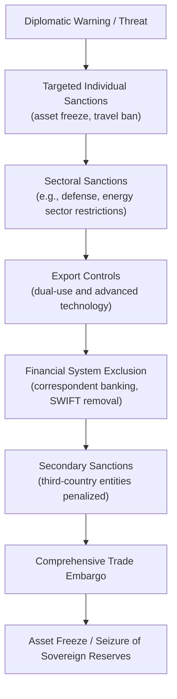

## Economic Statecraft and the Use of Sanctions

### Definitional Scope

Economic statecraft refers to the deliberate use of economic instruments — trade restrictions, financial sanctions, investment controls, export controls, tariffs, and aid — to achieve foreign policy, security, or geopolitical objectives, as distinct from using economic tools purely for domestic economic welfare. Sanctions are the most prominent instrument within this category: coercive economic measures imposed by one state (or coalition) against a target state, entity, or individual to compel a change in behavior, deter future action, signal disapproval, or constrain a target's capabilities.

### Taxonomy of Sanctions Instruments

**Key Points**

- **Trade sanctions:** Restrictions on exports (embargoes) or imports (boycotts) of goods, ranging from comprehensive trade bans (e.g., historical U.S. embargo on Cuba) to targeted product bans (e.g., restrictions on specific technology categories or luxury goods).
- **Financial sanctions:** Asset freezes, restrictions on access to correspondent banking, and prohibitions on transactions with designated individuals or entities (e.g., OFAC's Specially Designated Nationals, or SDN, list maintained by the U.S. Treasury).
- **Sectoral sanctions:** Restrictions targeting specific sectors of a target economy (e.g., energy, defense, financial services) without a full economic embargo, often used to apply graduated pressure while limiting humanitarian spillover.
- **Secondary sanctions:** Measures that penalize third-country entities for conducting business with a sanctioned target, extending the practical reach of the sanctioning country's jurisdiction extraterritorially — a particularly contested instrument because it binds non-nationals' economic behavior.
- **SWIFT/payment-system exclusion:** Removing designated banks from the SWIFT messaging network (used to coordinate cross-border payment instructions) sharply raises transaction costs and friction for international payments involving the target, though it does not by itself freeze assets or block all payment channels (alternative messaging and correspondent arrangements can partially substitute).
- **Export controls:** Restrictions on the sale of specific goods, services, or technologies (especially dual-use and advanced technology items) to a target country, exemplified by expanded U.S. semiconductor and semiconductor-manufacturing-equipment export controls on China beginning in October 2022 and expanded subsequently.
- **Arms embargoes:** Prohibitions on the sale or transfer of weapons and military equipment to a target.
- **Asset freezes and seizures:** Immobilizing a target's foreign-held financial assets; a further step (asset seizure/confiscation, as debated regarding Russian central bank reserves following 2022) raises distinct legal questions under sovereign immunity doctrines.

### Theoretical Rationale for Sanctions

- **Coercion model:** The classical rationale treats sanctions as a costly signal intended to inflict sufficient economic pain on a target state's population, elite, or economy that the target's government revises its cost-benefit calculation and changes the sanctioned behavior. This model, formalized in early game-theoretic treatments (Hufbauer, Schott, and Elliott's influential empirical studies beginning in 1985, updated through subsequent editions), treats sanctions success as a function of the target's regime type, the sanctioner's resolve, and the presence of alternative trade/financial partners for the target.
- **Signaling model:** Sanctions can serve an expressive or signaling function independent of their coercive economic effect — demonstrating resolve to domestic audiences, allied countries, or third parties considering similar behavior (deterrence-by-example), even when the sanctioner does not expect the specific target to comply.
- **Constraint model:** Rather than seeking behavioral change, sanctions may aim simply to degrade a target's material capacity to pursue a given objective (e.g., export controls constraining a military-industrial or advanced-technology program), succeeding by raising costs and slowing capability development rather than by inducing policy reversal.
- **Network/centrality model (contemporary "weaponized interdependence" literature):** Farrell and Newman's (2019) influential framework argues that globalized economic networks (financial messaging systems, internet infrastructure, dollar clearing systems) have identifiable structural "chokepoints" through which a small number of states — particularly the United States, given the dollar's role as the dominant reserve and invoicing currency — can exercise outsized coercive leverage over the entire network, independent of bilateral economic ties with any single target.

### Game-Theoretic Structure of Sanctions

A basic sender-target sanctions game can be represented as a sequential game:

1. Sender decides whether to threaten/impose sanctions.
2. Target decides whether to comply (change behavior) or resist.
3. If the target resists, sender decides whether to escalate, maintain, or abandon sanctions.

Target's decision to comply depends on comparing the cost of continued sanctions $C_S$ (weighted by probability of continuation $p$) against the cost of the concession being demanded $C_C$:

$$\text{Target complies if: } p \cdot C_S > C_C$$

Sender's decision to impose (given imposition is itself costly, $C_{sender}$, e.g., lost trade/investment) depends on whether expected coercive value exceeds this cost:

$$\text{Sender imposes if: } E[\text{Behavioral change value}] > C_{sender}$$

**Key Points**

- A central empirical and theoretical puzzle is that sanctions frequently fail to induce compliance even when they impose substantial economic costs on the target, because authoritarian or highly resolved target governments can shift the costs onto the general population rather than the ruling elite (a point emphasized in Kirshner's and others' analyses of sanctions' distributional effects within target states), preserving elite bargaining position even as aggregate welfare falls.
- "Rally-round-the-flag" effects can strengthen a target regime's domestic political position under external pressure rather than weakening it, particularly when the sanctioning country can be portrayed domestically as a hostile external actor.
- Sanctions effectiveness is generally found to be higher for narrow, well-defined objectives (e.g., release of a specific detainee) than for broad objectives (e.g., regime change or reversal of a major strategic program), per the empirical literature following Hufbauer, Schott, and Elliott's case-study database.

### Diagram: Sanctions Escalation Ladder

### The Dollar's Role and Weaponized Interdependence

**Key Points**

- The U.S. dollar's dominant role in global trade invoicing, foreign exchange reserves, and cross-border bank lending gives the United States disproportionate structural leverage, because most international transactions ultimately clear through U.S. correspondent banks or are subject to U.S. jurisdictional reach when dollar-denominated.
- OFAC's ability to designate entities and enforce compliance extraterritorially rests substantially on this dollar-clearing chokepoint: foreign banks generally comply with U.S. sanctions designations to preserve their own access to dollar-clearing and the broader U.S. financial system, a dynamic sometimes termed the "long arm" of U.S. financial jurisdiction.
- This structural position has prompted sanctioned and sanction-wary states (Russia, China, Iran) to develop alternative payment messaging systems (e.g., Russia's SPFS, China's CIPS) and to pursue de-dollarization of bilateral trade settlement, though [Inference] the extent to which these alternatives meaningfully substitute for dollar-based clearing at scale, as opposed to serving a smaller subset of transactions, is an actively debated and evolving empirical question that should be checked against current data given the pace of change in this area.
- Critics of extensive sanctions use (both inside and outside the U.S. policy community) warn of a long-run "exorbitant privilege erosion" risk: aggressive and broad application of financial weaponization could accelerate incentives for other countries to build parallel financial infrastructure, potentially eroding the network effects that give the dollar system its coercive value in the first place. [Speculation] The magnitude and timeline of any such erosion, if it occurs, is not resolved in the current literature and depends heavily on political and technological developments that are difficult to forecast.

### Case Studies

- **Iran (nuclear program sanctions, 2006–2015 and post-2018):** A multilateral sanctions regime (UN Security Council resolutions plus unilateral U.S. and EU measures) targeting Iran's oil exports and financial sector is widely credited with contributing to Iran's willingness to negotiate the 2015 Joint Comprehensive Plan of Action (JCPOA); the U.S. withdrawal from the JCPOA in 2018 and reimposition of sanctions illustrates the instrument's use both to compel initial negotiation and, later, to pressure renegotiation.
- **Russia (Crimea 2014 and full-scale invasion 2022):** The 2014 sanctions following the annexation of Crimea were comparatively narrow (sectoral, targeting specific individuals and financial/energy sectors); the 2022 sanctions following the full-scale invasion of Ukraine were far broader — including central bank reserve freezes, SWIFT exclusion for major banks, extensive export controls on technology, and G7-coordinated price caps on Russian oil exports. [Unverified] The precise long-run macroeconomic impact on Russia's growth trajectory, reserve accumulation workarounds, and sanctions evasion channels is still being assessed empirically and estimates vary across sources; current data should be checked for up-to-date figures.
- **North Korea:** A long-standing, near-comprehensive multilateral sanctions regime targeting the nuclear and missile programs illustrates the limits of sanctions coercion against a highly resolved, relatively autarkic target with an alternative patron (historically China) providing partial economic buffering.
- **U.S.–China technology export controls (2022–present):** Export controls on advanced semiconductors and semiconductor manufacturing equipment represent a shift toward using economic statecraft primarily for capability constraint (slowing China's advanced chip production) rather than behavioral coercion in the classical sanctions sense, reflecting the "constraint model" rationale described above.
- **Cuba embargo (1960–present):** Frequently cited as an example of a long-duration comprehensive embargo with limited demonstrated success in achieving its original stated political objectives, illustrating the general empirical finding that prolonged comprehensive sanctions against a resolved, adaptable target often shift toward primarily symbolic or domestic-signaling functions over time. [Inference] Characterizing the embargo's core current function as primarily symbolic reflects one interpretation in the literature rather than a universally agreed characterization.

### Critiques and Limitations

**Key Points**

- **Humanitarian costs:** Comprehensive sanctions, particularly those affecting food, medicine, and broad financial access, can impose substantial costs on general populations (documented extensively regarding 1990s Iraq sanctions), raising humanitarian and proportionality concerns and prompting the development of "smart" or targeted sanctions designed to concentrate costs on elites and decision-makers rather than the general public.
- **Effectiveness track record:** Empirical studies (notably the Peterson Institute's Hufbauer-Schott-Elliott database, updated across multiple editions) generally find that sanctions achieve their stated policy objective in a minority of cases — estimates vary across studies and specifications, and success is highly sensitive to how "success" is defined and measured. [Inference] Precise current success-rate estimates vary meaningfully by dataset, time period, and coding methodology, so any single percentage figure should be treated as method-dependent rather than a universal constant.
- **Sanctions-busting and adaptation:** Targeted states often develop evasion networks (shadow fleets for oil transport, intermediary trading jurisdictions, barter arrangements, cryptocurrency channels) that erode sanctions effectiveness over time, requiring continual adaptation and enforcement effort by the sanctioning coalition.
- **Coalition coordination problems:** Unilateral sanctions are generally less effective than multilaterally coordinated sanctions, because a target can reroute trade and financial relationships through non-participating countries; maintaining multilateral coalition discipline over an extended sanctions episode is itself a significant diplomatic and enforcement challenge (free-rider incentives for third countries to capture displaced trade).
- **Blowback and reputational costs to the sanctioner:** Sanctions can impose costs on the sanctioning country's own firms (lost export markets, disrupted supply chains) and can damage the sanctioner's reputation as a reliable economic partner, potentially accelerating target and third-country efforts to reduce future exposure to the sanctioner's economic leverage (a dynamic central to the "weaponized interdependence erosion" critique above).
- **Escalation risk:** Sanctions can provoke retaliatory countermeasures (target-imposed restrictions on the sanctioner's exports, e.g., critical mineral or agricultural export restrictions) or contribute to broader geopolitical escalation rather than resolution, particularly when a sanctioned state interprets sanctions as an act of economic warfare rather than a negotiable pressure tactic.

### Distinguishing Sanctions from Related Instruments

| Instrument | Primary Objective | Typical Legal Basis | Reversibility |
| --- | --- | --- | --- |
| Tariffs | Protect domestic industry / raise revenue / (sometimes) coerce | Domestic trade law, WTO-bound rates (or exceptions) | Generally high — can be adjusted administratively |
| Export controls | Constrain target's technological/military capability | National security export-control statutes (e.g., U.S. Export Administration Regulations) | Moderate — case-by-case licensing possible |
| Sanctions (financial/sectoral) | Coerce behavioral change, signal, or constrain | Executive authority under national-emergency statutes (e.g., U.S. IEEPA), UN Security Council resolutions | Moderate to low — often requires formal delisting process |
| Comprehensive embargo | Broad coercion or isolation | Same as above, applied economy-wide | Low — typically requires major policy reversal to lift |
| Aid conditionality | Incentivize reform through positive inducement | Bilateral/multilateral aid agreements | High — adjustable per review cycle |

### Legal and Institutional Architecture

- **United Nations Security Council sanctions:** Binding on all UN member states under Chapter VII of the UN Charter when adopted, but subject to veto by any of the five permanent members, limiting their use against major powers or their close allies.
- **Unilateral national sanctions regimes:** The U.S. framework centers on the International Emergency Economic Powers Act (IEEPA) and Treasury's Office of Foreign Assets Control (OFAC), which administers designation lists and licensing; the EU maintains its own autonomous sanctions regime requiring unanimous member-state agreement, creating distinct coordination dynamics from the more centralized U.S. process.
- **Extraterritorial jurisdiction and secondary sanctions:** The legal basis for secondary sanctions rests on the sanctioning country's assertion of jurisdiction over any transaction touching its financial system or currency, a doctrine that is contested under international law by targeted third countries but generally complied with in practice due to the practical costs of losing access to the sanctioner's financial system.

### Related Topics

- Weaponized interdependence and dollar-based financial chokepoints (Farrell and Newman framework)
- Export controls on dual-use and advanced technology (semiconductor case)
- Strategic trade theory and export subsidies (contrasting instrument for competitive advantage vs. coercion)
- De-dollarization efforts and alternative payment infrastructure (CIPS, SPFS)
- Sanctions evasion networks and shadow trade/shipping
- OFAC compliance architecture and the SDN list mechanism
- UN Security Council sanctions regimes and veto constraints
- Sovereign asset immunity and the debate over seizing frozen central bank reserves
- Geoeconomics as a field: coercion, inducement, and the blending of economic and security policy
- Case study deep-dive: Iran nuclear sanctions and the JCPOA negotiation dynamics