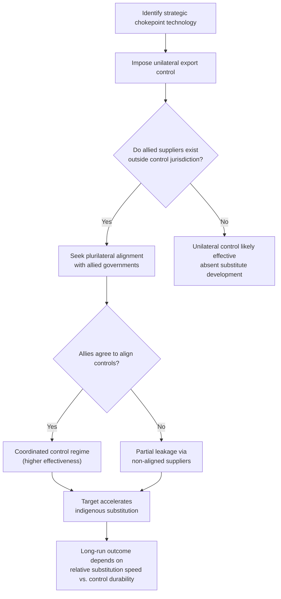

## Export Controls and Technology Competition

### Definitional Scope

Export controls are legal restrictions on the transfer of specific goods, software, technology, or technical data to foreign persons, entities, or countries, imposed for national security, foreign policy, or nonproliferation reasons. In the contemporary geoeconomic context, export controls have become a central instrument of great-power technology competition — most prominently in the U.S.–China relationship — shifting from a nonproliferation-focused tool (historically centered on weapons of mass destruction and conventional arms) toward a broader instrument for constraining a rival's advanced technological and military-industrial capability, particularly in semiconductors, artificial intelligence, and related dual-use technologies.

### Distinguishing Export Controls from Sanctions

**Key Points**

- Export controls restrict the *outbound* flow of specific goods, software, or technology from the controlling country (or from foreign-made items containing sufficient controlled-country content), whereas sanctions more broadly restrict transactions, financial dealings, or trade relationships with a designated target.
- Export controls are typically administered through licensing regimes (a transaction is prohibited unless a license is obtained or an exception applies), whereas many sanctions operate through blanket prohibitions or asset freezes on designated parties.
- The two instruments are frequently used in combination: a sanctioned entity may also appear on export-control denial lists, and export-control violations can trigger sanctions-style enforcement penalties.
- Export controls historically centered on multilateral nonproliferation regimes (weapons technology, missile technology, chemical/biological precursors), while their expanded use for broad technology-competition purposes against a systemic rival (rather than a rogue state or WMD proliferator) represents a comparatively recent extension of the instrument's traditional scope.

### The U.S. Export Control Legal and Institutional Architecture

- **Export Administration Regulations (EAR):** Administered by the Bureau of Industry and Security (BIS) within the U.S. Department of Commerce, the EAR governs "dual-use" items — goods and technologies with both civilian and military applications — covering the vast majority of controlled commercial and industrial technology, including semiconductors and semiconductor manufacturing equipment (SME).
- **International Traffic in Arms Regulations (ITAR):** Administered by the U.S. Department of State, ITAR governs inherently military items on the U.S. Munitions List, generally subject to stricter licensing requirements than EAR-controlled items.
- **Commerce Control List (CCL):** The master list of items subject to EAR jurisdiction, organized by Export Control Classification Number (ECCN), cross-referenced against Country Groups and specific license requirements based on destination, end-user, and end-use.
- **Entity List:** A BIS-administered list of specific foreign parties (companies, research institutions, individuals) subject to additional licensing requirements — often a presumption of denial — for exports of EAR-controlled items; a central mechanism for targeting specific foreign entities (e.g., Huawei's addition in 2019) without imposing blanket country-wide controls.
- **Foreign Direct Product Rule (FDPR):** A jurisdictional extension mechanism asserting U.S. export-control authority over foreign-made products if they are produced using specified U.S.-origin technology, software, or equipment — even when no U.S. person or U.S.-origin component is directly involved in the final transaction. The FDPR has been the key legal mechanism enabling the U.S. to restrict foreign semiconductor fabrication equipment makers (e.g., certain Dutch and Japanese toolmakers) from supplying advanced chipmaking tools to China, because much of the underlying process technology traces back to U.S.-origin design software, intellectual property, or manufacturing equipment components.
- **End-Use and End-User controls:** Restrictions triggered not by the item's classification alone but by concerns about the specific end use (e.g., military end use) or end user (e.g., military-linked entities), allowing more surgical restriction than blanket country controls.

### Diagram: U.S. Export Control Jurisdictional Reach

<svg xmlns="http://www.w3.org/2000/svg" viewBox="0 0 700 460" font-family="Arial, sans-serif">
<text x="350" y="28" text-anchor="middle" font-size="17" font-weight="bold">Export Control Jurisdictional Layers (svg_diagram)</text>
<rect x="60" y="60" width="580" height="120" rx="10" fill="#e8f0fe" stroke="#4285f4" stroke-width="2" />
<text x="350" y="90" text-anchor="middle" font-size="14" font-weight="bold">Direct Export</text>
<text x="350" y="110" text-anchor="middle" font-size="12">U.S.-origin item shipped directly from U.S. to foreign destination</text>
<text x="350" y="130" text-anchor="middle" font-size="12">Governed by EAR / ITAR based on ECCN classification</text>
<rect x="60" y="200" width="580" height="120" rx="10" fill="#fff4e5" stroke="#e69138" stroke-width="2" />
<text x="350" y="230" text-anchor="middle" font-size="14" font-weight="bold">Re-export / Deemed Export</text>
<text x="350" y="250" text-anchor="middle" font-size="12">Transfer between two foreign countries of item containing</text>
<text x="350" y="268" text-anchor="middle" font-size="12">controlled U.S.-origin content above de minimis threshold</text>
<rect x="60" y="340" width="580" height="100" rx="10" fill="#fce8e6" stroke="#cc4125" stroke-width="2" />
<text x="350" y="370" text-anchor="middle" font-size="14" font-weight="bold">Foreign Direct Product Rule (FDPR)</text>
<text x="350" y="390" text-anchor="middle" font-size="12">Foreign-made item produced using specified U.S. technology,</text>
<text x="350" y="408" text-anchor="middle" font-size="12">software, or equipment — no U.S.-origin component required</text>
</svg>

### The Semiconductor Export Control Regime (2022–Present)

**Key Points**

- **October 2022 controls:** BIS imposed sweeping restrictions on the export to China of advanced logic and memory chips above specified performance thresholds, semiconductor manufacturing equipment (SME) capable of producing advanced-node chips, and extended license requirements to U.S. persons supporting China-based advanced fabrication facilities — a notably aggressive expansion of both the FDPR and end-use/end-user control mechanisms.
- **October 2023 update:** BIS tightened performance thresholds (closing gaps that had allowed slightly-downgraded chips to remain uncontrolled), expanded the country scope to address transshipment risk, and added controls on additional SME categories.
- **Plurilateral coordination:** The U.S. has worked to align allied SME-producing countries — most significantly the Netherlands (home to ASML, the dominant maker of extreme ultraviolet, or EUV, lithography systems) and Japan (home to several critical SME toolmakers) — around parallel export restrictions, since unilateral U.S. controls alone would be substantially undermined if allied toolmakers could freely supply equivalent equipment.
- **Advanced AI chip controls:** Controls have specifically targeted graphics processing units (GPUs) and related AI accelerator chips above certain computational performance thresholds, reflecting a policy judgment that frontier AI compute capacity is itself a strategic chokepoint technology, separate from semiconductor manufacturing capacity generally.
- [Unverified] Specific current thresholds, country-scope details, and the latest amendments to these rules change relatively frequently and should be verified against current BIS Federal Register publications, since this is an actively evolving regulatory area.

### Chokepoint Theory and the "Small Yard, High Fence" Strategy

- **Chokepoint targeting:** Rather than attempting comprehensive technological decoupling, U.S. policy has been explicitly framed (per statements by National Security Advisor Jake Sullivan and others in 2022–2023) around a "small yard, high fence" approach — narrowly defining a limited set of strategically critical technologies (advanced semiconductors, AI, quantum computing, certain biotechnologies) for stringent control, while leaving the broader trade and technology relationship comparatively open.
- **Chokepoint identification logic:** The semiconductor supply chain is characterized by extreme concentration at several stages — EUV lithography (effectively a single supplier, ASML), advanced logic fabrication (concentrated in Taiwan via TSMC and South Korea via Samsung), and certain electronic design automation (EDA) software (concentrated among a small number of U.S. firms) — making these nodes especially amenable to chokepoint-style control, consistent with the "weaponized interdependence" framework (Farrell and Newman) applied to physical and software supply chains rather than financial networks.
- **Asymmetric dependency exploitation:** The strategic logic mirrors network-centrality arguments from the sanctions literature — a small number of irreplaceable nodes in a globally distributed supply chain confer outsized leverage on whichever jurisdiction controls or hosts them, independent of that jurisdiction's overall share of global semiconductor trade.

### China's Countermeasures and Responses

- **Critical mineral export restrictions:** China has imposed export licensing requirements and restrictions on gallium, germanium, and graphite (materials used in semiconductor and battery manufacturing, among other applications), representing a reciprocal chokepoint-style countermeasure given China's dominant global share of processing capacity for several critical minerals.
- **Domestic self-sufficiency drive:** Export controls have accelerated Chinese state investment in domestic semiconductor manufacturing equipment and advanced fabrication capability (via national investment funds and firms such as SMIC), reflecting the classic dynamic in which restricting an input source strengthens the target's incentive to build indigenous substitutes over the medium-to-long term. [Inference] The pace and ultimate success of China's indigenous substitution efforts relative to the frontier is a subject of active, unresolved debate among industry analysts and should be assessed against current, dated technical assessments rather than treated as settled.
- **Antitrust and regulatory retaliation:** China has used its own regulatory tools (antitrust investigations, unreliable entity lists, and export licensing for critical minerals) as reciprocal leverage points in the broader technology competition.

### Economic Analysis: Costs and Trade-offs of Export Controls

**Key Points**

- **Cost to the controlling country's firms:** Export controls impose direct revenue losses on domestic firms barred from selling to a major market (e.g., U.S. semiconductor equipment and chip firms losing access to Chinese customers), potentially reducing the R&D investment funded by that revenue and, in some analyses, incentivizing the targeted country to accelerate substitute domestic production — a dynamic critics term the "innovation stimulus" risk of export controls.
- **Allied coordination costs:** Because unilateral controls are easily circumvented if substitute suppliers exist in non-participating countries, effectiveness depends heavily on securing allied cooperation, which entails diplomatic costs and the risk of free-riding by allied firms seeking to capture displaced market share.
- **Enforcement and evasion challenges:** Controlled items can be diverted through transshipment via third countries, disguised through intermediary shell entities, or smuggled in finished-product form (e.g., controlled chips embedded within otherwise permissible equipment), requiring substantial and continually adapting enforcement resources.
- **Innovation and "yard" definition risk:** An excessively broad "yard" (scope of controlled technology) can impose disproportionate economic costs relative to security benefit, while an excessively narrow yard may fail to meaningfully constrain the targeted capability — this scope-calibration problem is structurally analogous to the targeting-precision critique found in general industrial policy and sanctions literature.
- **Long-run bifurcation risk:** Sustained, broad-based export controls between two major economies risk accelerating the formation of parallel, non-interoperable technology ecosystems (sometimes termed "tech bifurcation" or "splinternet"-style dynamics extended to hardware), with efficiency losses from duplicated R&D and lost economies of scale on both sides. [Speculation] The long-run magnitude of such bifurcation costs, and whether they will materialize as a durable structural feature of the global technology system or a more transitory phase, remains genuinely uncertain and contested among trade and technology economists.

### Comparative Table: Export Controls vs. Tariffs vs. Sanctions as Technology-Competition Instruments

| Dimension | Export Controls | Tariffs | Financial Sanctions |
| --- | --- | --- | --- |
| Primary target | Outbound technology/goods flow | Inbound goods (import competition) | Financial transactions, asset access |
| Core objective in tech competition | Constrain rival's capability | Protect/support domestic industry | Coerce behavior or degrade financial capacity |
| Key legal mechanism (U.S.) | EAR/ITAR, Entity List, FDPR | Section 301/232, standard tariff schedule | IEEPA, OFAC designations |
| Extraterritorial reach | High (via FDPR, deemed exports) | Low (applies at own border) | High (via secondary sanctions, dollar clearing) |
| Multilateral coordination need | High (allied toolmaker cooperation critical) | Low (can be applied unilaterally) | High (for maximum effectiveness) |

### Strategic Trade Theory Connection

Export controls in the technology-competition context can be viewed as an inverse application of strategic trade logic: rather than subsidizing a domestic firm to shift oligopoly rents toward it (Brander-Spencer), export controls aim to *deny inputs* to a foreign rival's firms, degrading their cost structure or capability relative to domestic and allied firms — a form of strategic denial rather than strategic promotion. Both instruments share the underlying premise that in concentrated, technologically advanced industries with few global suppliers, government intervention can materially shift the relative competitive position of domestic versus foreign firms, and both face analogous critiques regarding retaliation risk, targeting precision, and the political economy of sustaining a "temporary" intervention.

### Sequential Escalation Logic

### Related Topics

- Weaponized interdependence and supply-chain chokepoint theory (Farrell and Newman)
- Economic statecraft and the use of sanctions (comparative instrument analysis)
- Strategic trade theory and export subsidies (inverse logic: denial vs. promotion)
- Semiconductor supply chain geography (ASML, TSMC, Samsung concentration)
- Critical minerals and supply chain resilience policy
- CHIPS and Science Act and reshoring of semiconductor manufacturing
- Foreign Direct Product Rule mechanics and extraterritorial jurisdiction debates
- China's semiconductor self-sufficiency drive and indigenous innovation policy
- Decoupling vs. de-risking as competing framings of technology policy
- Dual-use technology governance and nonproliferation regime history