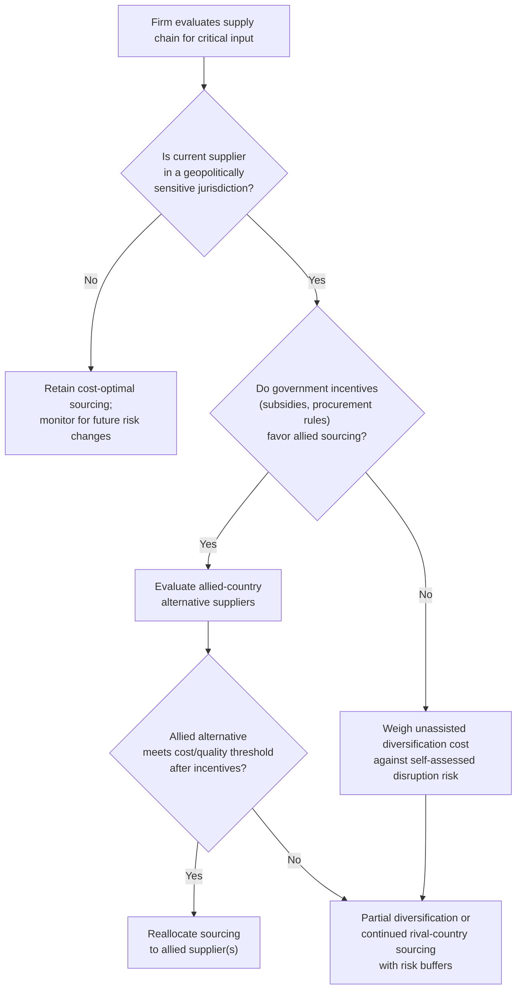

## Friendshoring and Economic Security Policy

### Definitional Scope

Friendshoring (also rendered "friend-shoring") refers to the deliberate reorganization of supply chains to concentrate sourcing, production, and investment among countries considered geopolitically aligned or trustworthy allies, rather than optimizing purely for lowest-cost production location regardless of the partner country's political alignment. The term was popularized by U.S. Treasury Secretary Janet Yellen in 2022 as a policy framing for reducing economic dependence on geopolitical rivals — most centrally China and Russia — while preserving the efficiency benefits of international specialization among trusted partners. It sits within the broader field of "economic security policy," which treats supply-chain resilience, critical technology protection, and reduced strategic dependence as legitimate objects of state policy alongside traditional efficiency and welfare considerations.

### Relationship to Adjacent Concepts

**Key Points**

- **Reshoring / onshoring:** Relocating production back to the home country entirely, eliminating cross-border dependence rather than merely redirecting it toward allied countries.
- **Nearshoring:** Relocating production to geographically proximate countries (e.g., U.S. firms shifting production to Mexico) primarily for logistics, cost, and time-zone reasons; nearshoring and friendshoring overlap substantially when the nearby country is also a geopolitical ally, but are conceptually distinct — nearshoring is organized around distance, friendshoring around political alignment.
- **Decoupling:** A more comprehensive severing of economic ties with a specific rival across most or all sectors, contrasted with friendshoring's narrower emphasis on redirecting specific supply chains while generally preserving broader trade relationships in non-strategic sectors.
- **De-risking:** A framing (prominently associated with European Commission President Ursula von der Leyen's 2023 usage and subsequently adopted in G7 communiqués) that explicitly positions itself as a moderated alternative to full decoupling — reducing exposure to specific critical dependencies and vulnerabilities without pursuing comprehensive economic separation; friendshoring is one practical instrument through which de-risking is implemented.
- **Supply chain resilience:** A broader objective (diversification, redundancy, inventory buffering, and geographic dispersion) of which friendshoring is one particular strategy, distinguished from resilience-through-diversification-among-any-low-risk-partners by its specific criterion of political alignment.

### Theoretical Rationale

- **Security externality of supply chain concentration:** Standard trade theory recommends sourcing from the lowest-cost global producer; economic security policy argues this calculus omits a negative externality — concentrated dependence on a single supplier (especially a geopolitical rival or an unstable region) creates vulnerability to coercive economic leverage, supply disruption during conflict, or deliberate withholding, a cost not priced into private firms' sourcing decisions because the security risk is a public good/externality rather than a private cost borne directly by the firm.
- **Weaponized interdependence exposure reduction:** Directly connected to the "weaponized interdependence" framework (Farrell and Newman) discussed in relation to sanctions and export controls — if global economic networks contain chokepoints exploitable for coercion, friendshoring aims to reduce a country's own exposure to being on the vulnerable end of such a chokepoint by diversifying critical dependencies toward trusted partners.
- **Optionality value under uncertainty:** Even absent an immediate crisis, maintaining diversified and allied-concentrated supply relationships preserves strategic optionality — the ability to pivot quickly if a geopolitical rupture occurs — which has option value that pure static cost-minimization does not capture. [Inference] Formal option-pricing treatments of this rationale exist in the broader risk-management and real-options literature but are less standardized specifically within the friendshoring policy discourse, which tends to remain qualitative.
- **Alliance-reinforcement rationale:** Beyond risk reduction, friendshoring is sometimes justified as a means of deepening economic interdependence among allied countries, reinforcing the political durability of alliance relationships through mutual economic stake — an argument with roots in classical liberal peace-through-trade theory, but applied selectively to allied rather than universal trade partners.

### Formal Framing: Cost-Risk Trade-off

A firm or government choosing a sourcing portfolio across countries $i = 1, \ldots, n$ can be modeled as minimizing expected cost adjusted for disruption risk:

$$\min_{\{x_i\}} \sum_i c_i x_i + \lambda \cdot \text{Var}\left(\sum_i r_i x_i\right)$$

subject to $\sum_i x_i = 1$, where $c_i$ is unit production cost in country $i$, $x_i$ is the sourcing share allocated to country $i$, $r_i$ is a random disruption-risk variable correlated with country $i$'s geopolitical alignment and stability, and $\lambda$ is the policymaker's (or firm's) risk-aversion parameter reflecting the weight placed on supply security relative to cost.

Friendshoring policy effectively argues for a higher implicit $\lambda$ than private firms would choose on their own (because firms do not fully internalize the systemic/national-security component of disruption risk), and further argues that $r_i$ should be modeled as *correlated across geopolitically aligned blocs* rather than treated as country-specific idiosyncratic risk — i.e., a crisis affecting one rival-bloc supplier raises disruption probability for other rival-bloc suppliers simultaneously, making bloc-level diversification (not just country-level diversification) the relevant risk-management unit.

### Diagram: Sourcing Reorganization Under Friendshoring

<svg xmlns="http://www.w3.org/2000/svg" viewBox="0 0 700 480" font-family="Arial, sans-serif">
<text x="350" y="28" text-anchor="middle" font-size="17" font-weight="bold">Supply Chain Reorganization Logic (svg_diagram)</text>

<text x="175" y="60" text-anchor="middle" font-size="14" font-weight="bold">Pure Cost-Minimizing Sourcing</text>

<circle cx="175" cy="150" r="70" fill="`#fce8e6`" stroke="`#cc4125`" stroke-width="2" />

<text x="175" y="145" text-anchor="middle" font-size="12">Lowest-cost</text>

<text x="175" y="163" text-anchor="middle" font-size="12">supplier</text>

<text x="175" y="181" text-anchor="middle" font-size="11">(regardless of alignment)</text>

<text x="175" y="240" text-anchor="middle" font-size="12" fill="`#cc4125`">High efficiency, high concentration risk</text>

<text x="525" y="60" text-anchor="middle" font-size="14" font-weight="bold">Friendshored Sourcing</text>

<circle cx="450" cy="150" r="45" fill="`#e8f0fe`" stroke="`#4285f4`" stroke-width="2" />

<text x="450" y="155" text-anchor="middle" font-size="11">Allied Supplier A</text>

<circle cx="560" cy="120" r="40" fill="`#e8f0fe`" stroke="`#4285f4`" stroke-width="2" />

<text x="560" y="125" text-anchor="middle" font-size="11">Allied Supplier B</text>

<circle cx="590" cy="210" r="38" fill="`#e8f0fe`" stroke="`#4285f4`" stroke-width="2" />

<text x="590" y="215" text-anchor="middle" font-size="11">Domestic</text>

<text x="525" y="270" text-anchor="middle" font-size="12" fill="`#4285f4`">Lower concentration risk, higher aggregate cost</text>

<line x1="255" y1="150" x2="395" y2="150" stroke="#333" stroke-width="2" stroke-dasharray="5,5" />
<text x="325" y="140" text-anchor="middle" font-size="11">Policy-driven</text>
<text x="325" y="155" text-anchor="middle" font-size="11">reallocation</text>
</svg>

### Policy Instruments Used to Implement Friendshoring

**Key Points**

- **Preferential procurement rules:** Government procurement preferences (e.g., "Buy American" provisions, domestic and allied-content requirements attached to public contracts) that favor allied-sourced inputs over lowest-cost global alternatives.
- **Targeted subsidies conditioned on allied supply chains:** Legislation such as the U.S. Inflation Reduction Act (2022) ties clean-energy and battery tax credits to sourcing thresholds for critical minerals and battery components from the U.S. or countries with U.S. free-trade agreements, explicitly incentivizing friendshored supply chains for strategic green-technology inputs.
- **Minilateral coordination frameworks:** Smaller, purpose-specific coalitions among aligned countries — such as the Minerals Security Partnership (critical minerals supply chains) or Chip 4 discussions (semiconductor supply chain coordination among the U.S., Japan, South Korea, and Taiwan) — designed to coordinate friendshoring without requiring full multilateral (e.g., WTO-wide) agreement.
- **Investment screening and outbound investment restrictions:** Screening mechanisms (e.g., the U.S. Committee on Foreign Investment in the United States, CFIUS) restricting inbound investment from geopolitical rivals in sensitive sectors, increasingly complemented by outbound investment screening restricting domestic firms' investment into rival countries' sensitive technology sectors.
- **Trade agreement structuring:** Negotiating or restructuring trade and economic partnership frameworks (e.g., the Indo-Pacific Economic Framework) around supply-chain-resilience chapters explicitly oriented toward allied-country coordination rather than traditional tariff liberalization alone.
- **Stockpiling and strategic reserves:** Government-held strategic reserves of critical inputs (extending the long-standing petroleum reserve model to critical minerals, semiconductors, and pharmaceutical ingredients) as a complement to friendshored private-sector sourcing.

### Critiques and Trade-offs

**Key Points**

- **Efficiency cost:** By definition, friendshoring sacrifices some of the comparative-advantage-based efficiency gains of unrestricted global sourcing, since allied suppliers are not necessarily the lowest-cost producers — this is the standard static welfare cost shared with other forms of politically-motivated trade redirection, including classical industrial policy and protectionism.
- **Ambiguous and shifting alignment criteria:** "Friend" is a fluid political category rather than a fixed economic one; alliance relationships can shift with changes in government, creating uncertainty for firms attempting to make long-duration capital investment decisions based on current geopolitical alignment classifications. [Inference] The durability of specific country groupings used in friendshoring policy (e.g., current "ally" classifications) is inherently subject to political change and should not be treated as a fixed technical parameter.
- **Incomplete risk reduction:** Concentrating supply chains among a narrower set of allied countries can simply relocate concentration risk rather than eliminate it — if a small number of allied suppliers dominate a friendshored critical input, that input remains vulnerable to non-geopolitical disruption (natural disaster, allied-country domestic instability, or accident) even after political risk is reduced.
- **Retaliation and Global South relations:** Countries excluded from "friend" groupings (including some developing and non-aligned countries) may perceive friendshoring frameworks as a form of bloc formation that disadvantages them economically, potentially straining broader diplomatic relationships and complicating global cooperation on other issues (climate, health, multilateral trade reform).
- **WTO compatibility concerns:** Preferential procurement and subsidy conditionality tied to geopolitical alignment rather than neutral economic criteria raise potential most-favored-nation (MFN) treatment concerns under WTO rules, creating legal exposure and prompting debate over whether national-security exceptions (GATT Article XXI) can be invoked to justify explicitly alignment-based discrimination — a legally contested and evolving area, since Article XXI's "essential security interests" language has historically been interpreted narrowly and its expanded invocation for broad economic-security policy is a relatively recent and unsettled practice.
- **Cost pass-through to consumers:** Efficiency losses from redirected sourcing are typically passed through, at least partially, to downstream consumers and firms in the form of higher input costs, representing a real economic trade-off against the risk-reduction benefit that policymakers must weigh, though [Speculation] precise aggregate cost estimates of friendshoring policies vary substantially across studies and are sensitive to modeling assumptions about substitution elasticities and the counterfactual baseline.

### Case Illustrations

- **Semiconductor supply chain reorganization:** The CHIPS and Science Act (U.S., 2022) and EU Chips Act incentivize domestic and allied-country semiconductor fabrication capacity, motivated substantially by the geographic concentration of advanced logic fabrication in Taiwan (a friendshoring rationale distinct from, though related to, the export-control chokepoint-denial logic discussed in relation to China).
- **Critical minerals and battery supply chains:** Given China's dominant global share of rare-earth processing and battery-material refining capacity, friendshoring initiatives (Minerals Security Partnership, IRA sourcing requirements) aim to build allied-country processing capacity as an alternative, though [Unverified] the current pace of allied-capacity buildout relative to China's existing processing dominance should be checked against up-to-date industry data given how quickly this landscape is evolving.
- **Pharmaceutical and medical supply chain diversification:** Post-pandemic policy attention to concentrated active pharmaceutical ingredient (API) manufacturing (heavily concentrated in China and India for certain product categories) has generated friendshoring and reshoring proposals in the U.S. and EU, motivated by public-health-security rather than military-security concerns, illustrating that the friendshoring logic extends beyond narrowly military-adjacent technologies.

### Comparative Table: Economic Security Policy Instruments

| Instrument | Primary Mechanism | Closest Related Concept |
| --- | --- | --- |
| Friendshoring incentives (subsidies, procurement) | Redirect sourcing toward aligned countries | De-risking, supply-chain resilience |
| Export controls | Restrict outbound technology to rivals | Technology denial, chokepoint theory |
| Sanctions | Restrict financial/trade access to targets | Economic coercion |
| Inbound investment screening (CFIUS-style) | Block rival investment in sensitive domestic sectors | National security review |
| Outbound investment screening | Restrict domestic investment into rival strategic sectors | Capability denial (inverse of inbound screening) |
| Strategic stockpiling | Build buffer inventory of critical inputs | Resilience through redundancy, not redirection |

### Decision Logic for Firms Navigating Friendshoring Pressure

### Related Topics

- Weaponized interdependence and supply-chain chokepoint theory
- Export controls and technology competition (chokepoint denial vs. friendshoring redirection)
- Economic statecraft and the use of sanctions
- CHIPS and Science Act, EU Chips Act, and semiconductor reshoring policy
- Critical minerals supply chains and the Minerals Security Partnership
- De-risking vs. decoupling as competing China-policy framings
- GATT Article XXI national security exceptions and WTO legal tension
- Global value chains and comparative advantage under geopolitical risk
- Reshoring, nearshoring, and offshoring: comparative supply-chain strategies
- Global South perspectives on bloc-based economic realignment