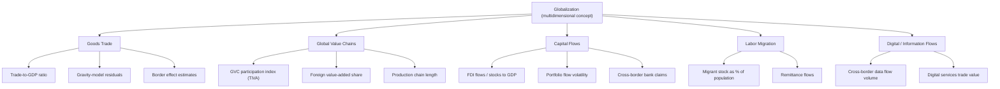

## Measuring Deglobalization and Slowbalization

### Definitional Scope

Measuring deglobalization and slowbalization concerns the empirical methods, indicators, and data series economists use to assess whether, and to what degree, international economic integration is reversing (deglobalization) or merely decelerating (slowbalization) relative to prior trends. Because "globalization" is a multidimensional phenomenon spanning trade, capital, labor, and information flows, no single indicator is sufficient; a rigorous assessment requires a portfolio of measures across goods trade, value-chain structure, capital flows, migration, and digital/information flows, each with distinct measurement challenges and interpretive limitations.

### Core Trade-Based Indicators

**Key Points**

- **Trade-to-GDP ratio (openness ratio):** The most widely cited headline indicator, calculated as $(\text{Exports} + \text{Imports}) / \text{GDP}$, tracked over time for individual countries or aggregated globally. A plateau or decline in this ratio after a sustained rise is the most common empirical basis cited for the "slowbalization" characterization of the post-2008 period.
- **Trade intensity index:** Refines the raw trade-to-GDP ratio by adjusting for country size (larger economies mechanically trade less as a share of GDP due to larger internal markets — a manifestation of the "home market effect" and gravity-model scale predictions), allowing more meaningful cross-country and over-time comparison.
- **Gravity-model residual analysis:** Rather than examining raw trade volumes, economists estimate a gravity equation (trade flow as a function of GDP, distance, and standard trade-cost variables) and examine whether the *residual* — trade beyond what gravity fundamentals predict — is shrinking over time, isolating a "policy and integration" component of trade from a purely "economic mass and distance" component.
- **Border effect estimates:** McCallum-style border-effect studies estimate how much smaller cross-border trade is relative to equivalent within-country trade at similar distances; a rising border effect over time is interpreted as evidence of increasing fragmentation, independent of gross trade-volume trends.
- **Extensive vs. intensive margin decomposition:** Distinguishing whether trade changes reflect the extensive margin (number of trading relationships/products/firms engaged in trade) versus the intensive margin (volume per existing relationship) provides a more granular picture — a decline concentrated in the extensive margin (fewer new trade relationships forming) can signal a different underlying dynamic than an intensive-margin decline (existing relationships shrinking).

### Formal Trade Intensity Measure

The trade intensity index between two countries relative to their share of world trade is commonly expressed as:

$$TII_{ij} = \frac{x_{ij} / X_i}{m_j / (M_w - M_i)}$$

where $x_{ij}$ is country $i$'s exports to country $j$, $X_i$ is $i$'s total exports, $m_j$ is $j$'s total imports, $M_w$ is world imports, and $M_i$ is $i$'s own imports (excluded from the denominator to avoid self-comparison distortion). A value above 1 indicates more-than-proportional bilateral trade intensity relative to the partner's share of world trade; tracking this measure over time for geopolitically significant pairs (e.g., U.S.-China) provides a more targeted deglobalization/fragmentation indicator than aggregate trade-to-GDP ratios.

### Global Value Chain (GVC) Participation Measures

**Key Points**

- **GVC participation index:** Constructed from input-output tables (notably using the OECD-WTO Trade in Value Added, TiVA, database), this measures the share of a country's gross exports that either use imported intermediate inputs (backward participation) or are used as intermediate inputs in a third country's exports (forward participation) — a decline in this composite index is interpreted as GVC "shortening" or de-fragmentation.
- **Foreign value-added share of exports:** A specific decomposition isolating what proportion of the value embedded in a country's exports originated outside its borders, distinguishing genuine production fragmentation from simple gross-trade volume changes (a country can maintain stable gross export volumes while reducing the foreign-value-added content, indicating supply-chain shortening even without an aggregate trade decline).
- **Vertical specialization index:** Related concept (Hummels, Ishii, and Yi, 2001) measuring the imported-input content of exports, historically used to document the *rise* of GVC fragmentation during the hyperglobalization era and, more recently, to test for its reversal or plateau.
- **Length of production chains (GVC length metrics):** Input-output-based metrics estimating the average number of production stages/border crossings embodied in final output, allowing researchers to test whether value chains have measurably "shortened" (fewer border crossings per unit of final output) in specific sectors (e.g., electronics, automotive) since 2018–2020.
- [Unverified] TiVA and related GVC databases are updated on multi-year lags and specific current-vintage figures should be checked directly against the OECD's latest published release, since these composite databases are not updated in real time.

### Diagram: Decomposing "Globalization" Into Measurable Components

### Capital Flow Indicators

**Key Points**

- **FDI flows and stocks relative to GDP:** UNCTAD's World Investment Report tracks global and bilateral FDI flows; a sustained decline in FDI-to-GDP ratios, or in specific bilateral corridors between geopolitical rivals, is used as evidence of investment-channel fragmentation, distinct from and sometimes diverging in direction from goods-trade measures.
- **Cross-border banking claims (BIS data):** The Bank for International Settlements' international banking statistics track cross-border bank lending; a decline in cross-border claims relative to domestic credit is used as a financial-integration deglobalization indicator, notably documented as having fallen substantially after the 2008 global financial crisis due to bank deleveraging and post-crisis regulatory changes — a pattern some researchers treat as a leading empirical example of genuine (financial) deglobalization, as distinct from the more debated "slowbalization" characterization applied to goods trade.
- **Portfolio investment home bias:** The persistence or intensification of "home bias" in equity and bond portfolios (investors holding a disproportionate share of domestic assets relative to what standard portfolio theory would predict absent frictions) serves as an indicator of financial market fragmentation, thought to be sensitive to both structural (currency, information) and policy-driven (capital control, geopolitical risk) factors.
- **Screened/blocked investment transaction data:** Tracking the volume and value of cross-border investment transactions blocked or modified by investment-screening mechanisms (CFIUS in the U.S., equivalent EU and other national mechanisms) provides a more policy-specific, if narrower, measure of investment-channel fragmentation directly tied to the economic-security and friendshoring dynamics discussed in the prior chapter.

### Geopolitical Fragmentation-Specific Indicators

**Key Points**

- **Trade flow redirection along geopolitical bloc lines:** IMF and other researchers (notably work associated with the IMF's 2023 *Geoeconomic Fragmentation* analyses) have constructed bloc-based trade indicators, grouping countries by voting alignment (e.g., UN General Assembly voting similarity with the U.S. versus China/Russia) and tracking whether trade is growing faster within blocs than across blocs — a "friend-shoring" or "geopolitical distance" indicator distinct from simple geographic distance in gravity models.
- **"Geopolitical distance" gravity augmentation:** Some recent empirical trade literature augments standard gravity models with a geopolitical-alignment variable (e.g., UN voting similarity) alongside physical distance, testing whether the coefficient on geopolitical distance has become more statistically and economically significant in explaining trade patterns in recent years relative to earlier periods — rising significance is interpreted as evidence of alignment-based fragmentation net of standard gravity fundamentals.
- **Export control and sanctions coverage ratios:** Tracking the share of global trade value subject to export controls, sanctions, or related restrictive measures (compiled from sources such as Global Trade Alert) provides a direct policy-based fragmentation measure, complementing outcome-based trade-flow measures.
- **Reshoring/nearshoring announcement tracking:** Private-sector and some government-affiliated trackers compile announced corporate reshoring, nearshoring, and friendshoring investment decisions (e.g., the U.S. Reshoring Initiative's data), though [Inference] announcement-based data captures stated corporate intent rather than realized, completed relocation, and can overstate actual supply-chain reconfiguration if announced projects are delayed, scaled back, or cancelled.

### The "Slowbalization" vs. "Deglobalization" Distinction: Measurement Implications

**Key Points**

- **Level vs. growth-rate distinction:** A rigorous empirical distinction separates a *decline in the level* of an integration indicator (genuine reversal, i.e., deglobalization) from a *deceleration in the growth rate* of that indicator while it remains at or near historic highs (slowbalization) — much of the post-2008 goods-trade evidence is more consistent with the latter (plateau at a high level) than the former (outright decline), which is the empirical basis for the "slowbalization" terminology rather than "deglobalization" for that specific indicator.
- **Divergence across indicator categories:** A central empirical finding in recent literature is that different globalization dimensions are moving in different directions simultaneously — goods trade and GVC length show plateau/slowbalization patterns, financial/banking integration shows a more pronounced post-2008 decline consistent with genuine deglobalization in that specific channel, while digital/data flows and services trade have continued to grow robustly — meaning any single-indicator summary judgment about "globalization" as a whole risks being misleading, and disaggregated, multi-indicator analysis is methodologically preferred.
- **Cyclical vs. structural decomposition:** Part of any observed trade slowdown reflects ordinary business-cycle effects (e.g., the 2008–09 and 2020 recessions mechanically depress trade volumes along with GDP), requiring researchers to distinguish cyclical trade weakness from structural/trend changes in trade intensity — typically addressed through detrending methods, comparison of trade growth to GDP growth elasticities over time (a declining trade-to-GDP growth elasticity across cycles is a more structural signal than a single-cycle trade decline), or explicit business-cycle-adjusted indices.
- **China-specific compositional effects:** A meaningful share of the apparent global GVC-participation plateau/decline is attributed in some studies to China-specific structural change (rising domestic value-added share in Chinese exports as its economy matures and increasingly substitutes domestic inputs for imported components) rather than a broad-based global fragmentation trend — meaning a portion of the aggregate slowbalization signal may reflect a single large economy's development trajectory rather than a systemic reversal in the propensity of countries generally to engage in fragmented production. [Inference] The precise quantitative weight of this China-specific compositional effect relative to genuinely systemic fragmentation forces is contested and sensitive to the specific decomposition methodology used across different studies.

### Comparative Table: Indicator Behavior by Category, Approximate Post-2008 Pattern

| Indicator Category | Typical Post-2008 Pattern | Interpretation |
| --- | --- | --- |
| Goods trade-to-GDP ratio | Plateau at high level, modest decline in some years | Consistent with "slowbalization" rather than outright reversal |
| GVC participation / foreign value-added share | Plateau or mild decline in several major economies | Mixed; partly compositional (China maturation), partly genuine shortening |
| Cross-border bank claims / GDP | Marked decline post-2008 | Stronger evidence of genuine deglobalization in financial-sector integration |
| FDI flows / GDP | Volatile, some bilateral-corridor declines (esp. China-U.S.) | Fragmentation more visible at bilateral/bloc level than in aggregate |
| Cross-border data flows | Continued strong growth | Counter-trend; digital integration deepening even as goods trade plateaus |
| Geopolitical-bloc trade redirection | Rising significance in gravity-residual studies (post-2018) | Emerging, policy-relevant fragmentation signal distinct from aggregate trends |

### Methodological Caveats and Data Limitations

**Key Points**

- **Transshipment and re-routing distortion:** Bilateral trade data can mask underlying fragmentation dynamics if firms reroute trade through intermediary countries to avoid tariffs or export controls (e.g., goods routed through Vietnam or Mexico rather than shipped directly from China to the U.S.); aggregate bilateral figures between the ultimate origin and destination pair may understate the degree of policy-driven redirection unless researchers specifically trace value-added origin through GVC-based methods rather than gross bilateral trade statistics.
- **Data lag in value-added and GVC databases:** TiVA and similar input-output-based databases are constructed with significant lags (often 2–4 years) relative to real-time trade data, meaning the most current fragmentation dynamics are frequently assessed using gross trade statistics as an imperfect proxy while more precise value-added measures remain pending.
- **Aggregation masking bilateral/sectoral heterogeneity:** Global or even national aggregate indicators can mask sharply divergent trends at the bilateral (e.g., U.S.-China specifically) or sectoral (e.g., semiconductors specifically) level; sector- and pair-specific analysis is generally required to assess targeted fragmentation in strategically sensitive areas, since aggregate data dominated by non-strategic sectors can obscure meaningful reconfiguration occurring in a smaller set of critical sectors.
- **Definitional inconsistency across studies:** Different researchers use different thresholds, base years, and country groupings when constructing bloc-based or alignment-based fragmentation indices, limiting direct comparability across studies; [Unverified] readers should check the specific methodology of any cited fragmentation index rather than assuming standardized measurement across the literature.

### Related Topics

- Historical waves of globalization (prior chapter item; provides the trend baseline against which recent deceleration is measured)
- Global value chains and production fragmentation
- Friendshoring and economic security policy (policy driver of some measured fragmentation)
- IMF geoeconomic fragmentation research program
- OECD-WTO Trade in Value Added (TiVA) database methodology
- Gravity models of international trade
- Home bias in international portfolio investment
- Export controls, sanctions coverage, and Global Trade Alert-style policy tracking
- China's export structure evolution and domestic value-added rise
- Reshoring and nearshoring investment tracking methodologies