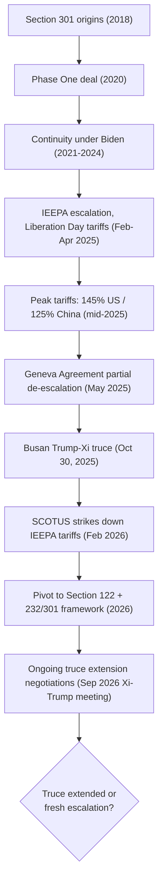

## The United States-China Trade Conflict

### Definitional Scope

The United States-China trade conflict refers to the escalating series of tariffs, non-tariff barriers, export controls, and investment restrictions imposed bilaterally between the U.S. and China since 2018, along with the periodic negotiations, truces, and legal challenges that have shaped its trajectory. Formally dated by many trackers from January 22, 2018 (when the first major U.S. tariff actions took effect) to the present, the conflict remains characterized as a period of continuous negotiations and strategic competition rather than a fully resolved dispute. The conflict spans three analytically distinct but overlapping tracks: tariff policy (Section 301, Section 232, and emergency-authority-based tariffs), export controls on advanced technology, and broader structural/systemic disputes over industrial subsidies, intellectual property, and market access. [Wikipedia](https://en.wikipedia.org/wiki/China%E2%80%93United_States_trade_war)

### Phase 1: Origins and Section 301 Tariffs (2018–2020)

**Key Points**

- The initial legal basis for U.S. tariff action was Section 301 of the Trade Act of 1974, invoked following a USTR investigation into Chinese intellectual property practices, forced technology transfer requirements, and industrial policy (centered on complaints connected to the "Made in China 2025" industrial strategy).
- Tariffs were imposed in four successive tranches ("Lists 1 through 4"), ultimately covering roughly $370 billion in Chinese goods, with China retaliating on approximately $110 billion in U.S. goods. [TariffTax](https://www.tarifftax.org/us-china-trade-war-2026)
- The conflict was formally paused (though not resolved) by the January 2020 "Phase One" agreement, under which China committed to $200 billion of additional U.S. purchases, a target that was ultimately missed. [MS Advisory](https://msadvisory.com/china-us-tariffs-guide/)
- The Biden administration (2021–2024) largely kept the Section 301 tariffs intact and added new targeted tariffs, including a 100% tariff on Chinese electric vehicles, 25% on batteries, and 50% on solar cells following a 2024 USTR review — indicating substantial bipartisan continuity in the use of tariffs as a China-policy tool despite differing rhetorical framing. [MS Advisory](https://msadvisory.com/china-us-tariffs-guide/)

### Phase 2: Second Trump Administration Escalation (2025)

**Key Points**

- In February 2025, the second Trump administration invoked IEEPA (International Emergency Economic Powers Act) emergency authority to impose an initial 10%, later raised to 20%, tariff on all Chinese imports, citing fentanyl precursor chemical exports as the emergency justification. [MS Advisory](https://msadvisory.com/china-us-tariffs-guide/)
- Between April and November 2025, a "reciprocal tariff" regime was announced at an initial 34% rate, which escalated rapidly through tit-for-tat retaliation to a peak of 145% on the U.S. side, with China responding with a 125% tariff on American goods — the highest bilateral tariff rates of the conflict to date. [MS Advisory](https://msadvisory.com/china-us-tariffs-guide/)[Wikipedia](https://en.wikipedia.org/wiki/China%E2%80%93United_States_trade_war)
- This escalation period is associated with the April 2, 2025 "Liberation Day" tariff announcement, a broader set of sweeping U.S. tariffs applied to many trading partners, with particularly high rates targeting China specifically. [Wikipedia](https://en.wikipedia.org/wiki/China%E2%80%93United_States_trade_war)
- These tariff measures were projected to cause approximately a 0.2% loss in global merchandise trade, illustrating the macro-scale trade impact of the peak-escalation period, though both sides maintained carve-outs: both countries excluded certain items from their tariff lists while continuing efforts to find a resolution. [Wikipedia](https://en.wikipedia.org/wiki/China%E2%80%93United_States_trade_war)[Wikipedia](https://en.wikipedia.org/wiki/China%E2%80%93United_States_trade_war)

### Phase 3: De-escalation, Truces, and Legal Reversal (Late 2025–2026)

**Key Points**

- A Geneva agreement in May 2025 provided initial, partial de-escalation: the agreement suspended 24 percentage points of reciprocal tariffs for a 90-day period. [TariffTax](https://www.tarifftax.org/us-china-trade-war-2026)
- The most significant de-escalation occurred at the Trump-Xi summit on the sidelines of the APEC meeting in Busan, South Korea, on October 30, 2025 — the first such summit of Trump's second term. The two leaders agreed to a one-year trade truce lowering tariffs and export controls; the United States reduced tariffs on Chinese exports from 57% to 47%, while China agreed to suspend its most recent rare earth export controls for one year. [cfr](https://www.cfr.org/articles/united-states-and-china-agree-trade-truce)
- Per the White House fact sheet on the resulting deal: the United States lowered fentanyl-related tariffs on Chinese imports by removing 10 percentage points of the cumulative rate effective November 10, 2025, and extended the suspension of heightened reciprocal tariffs until November 10, 2026, with the 10% reciprocal tariff remaining in effect during the suspension period. China agreed to suspend global implementation of its expansive new rare earth export controls announced October 9, 2025. [The White House](https://www.whitehouse.gov/fact-sheets/2025/11/fact-sheet-president-donald-j-trump-strikes-deal-on-economic-and-trade-relations-with-china/)
- As part of the deal, China committed to purchasing at least 12 million metric tons of U.S. soybeans in the final two months of 2025 and at least 25 million metric tons annually in 2026, 2027, and 2028, alongside resumed purchases of sorghum and hardwood/softwood logs. The U.S. also suspended for one year the implementation of an interim rule expanding end-user export controls to affiliates of listed entities, and suspended responsive actions from a Section 301 investigation targeting China's maritime, logistics, and shipbuilding sector dominance. [The White House](https://www.whitehouse.gov/fact-sheets/2025/11/fact-sheet-president-donald-j-trump-strikes-deal-on-economic-and-trade-relations-with-china/)[The White House](https://www.whitehouse.gov/fact-sheets/2025/11/fact-sheet-president-donald-j-trump-strikes-deal-on-economic-and-trade-relations-with-china/)
- A major independent legal shock reshaped the tariff architecture in early 2026: on February 20, 2026, the Supreme Court ruled in *Learning Resources, Inc.* that struck down the "reciprocal tariffs" announced on Liberation Day, the fentanyl-related IEEPA tariffs on China, Canada, and Mexico, and an additional tariff on Brazil. The ruling did not eliminate all tariffs, since Section 232 (metals and autos) and Section 301 (China) tariffs rest on separate legal authority and remained fully intact, but it forced the administration to pivot to a new legal footing — a Section 122 global baseline tariff framework. Following the SCOTUS ruling, the earlier Geneva framework became largely moot, with current China tariffs resting on Section 301 and Section 122 authority instead. [US Tariffs 2026: Complete Guide to Current Rates | TariffTax +2](https://www.tarifftax.org/us-tariffs-2026-guide)
- Diplomatic momentum continued into September 2026: Chinese and U.S. officials have been discussing whether Chinese business leaders will join President Xi Jinping's delegation on a visit to the United States, with Xi expected to meet Trump in Washington on September 24, as the two sides prepare to extend the one-year Busan trade agreement. [Unverified] Given how recently these developments occurred relative to this content's compilation, the outcome of the September 24 meeting and the terms of any truce extension should be checked against current reporting. [South China Morning Post](https://www.scmp.com/news/china/diplomacy/article/3365440/chinese-executives-may-join-xis-us-trip-trade-truce-extension-almost-certain)

### Current Tariff Architecture (as of Mid-2026)

**Key Points**

- U.S. tariffs as of mid-2026 operate under four main legal authorities: a Section 122 global baseline (approximately 10%, applying to nearly all imports), Section 232 duties (25–50% on steel, aluminum, copper, autos, semiconductors, and lumber), Section 301 duties specifically targeting China (7.5–100%), and residual IEEPA-based measures where still applicable post-SCOTUS ruling. [TariffTax](https://www.tarifftax.org/us-tariffs-2026-guide)
- Most Chinese goods face a combined minimum rate around 17.5% (10% Section 122 plus 7.5% Section 301 List 4A), with many goods facing around 35% (10% plus 25% under Section 301 Lists 1–3). [TariffTax](https://www.tarifftax.org/us-china-trade-war-2026)
- Targeted strategic sectors face substantially higher combined rates: Chinese EVs face over 100% in combined duties, solar cells face 60%+, and steel articles can face 85%+ when Section 232 duties stack on top of other measures. [TariffTax](https://www.tarifftax.org/us-china-trade-war-2026)
- A blended, trade-weighted effective tariff rate on Chinese imports was estimated around 33% as of May 2026 per the Peterson Institute for International Economics tariff tracker, stacking MFN rates (~3.4%), Section 301 (7.5–25%), IEEPA fentanyl-related tariffs (20% at that time), and the reciprocal tariff (10% during the truce extension then in effect). [MS Advisory](https://msadvisory.com/china-us-tariffs-guide/)
- In July 2026, USTR announced a further 12.5% Section 301 tariff addition tied to China's alleged failure to prohibit and enforce against forced-labor-produced goods, effective July 24, 2026, raising the overall tariff burden on Chinese goods by approximately 2.5 percentage points net — illustrating that even during the broader truce period, incremental, narrowly targeted tariff actions have continued. [China Briefing](https://www.china-briefing.com/news/us-china-tariff-rates-2025/)
- [Unverified] Given the pace of legal and policy change in this specific area (ongoing Section 301 investigations, the pending "excess capacity" investigation covering 60 countries launched in March 2026, and the approaching truce extension decision), precise current rates should be verified against the latest USTR and Federal Register publications.

### Diagram: Tariff Legal Authority Stack

<svg xmlns="http://www.w3.org/2000/svg" viewBox="0 0 700 420" font-family="Arial, sans-serif">
<text x="350" y="28" text-anchor="middle" font-size="16" font-weight="bold">Overlapping U.S. Tariff Legal Authorities on Chinese Goods (svg_diagram)</text>
<rect x="80" y="60" width="540" height="60" fill="#e8f0fe" stroke="#4285f4" stroke-width="2" />
<text x="350" y="95" text-anchor="middle" font-size="13" font-weight="bold">Section 122 Global Baseline (~10%) — applies broadly to most imports</text>
<rect x="80" y="130" width="540" height="60" fill="#fff4e5" stroke="#e69138" stroke-width="2" />
<text x="350" y="165" text-anchor="middle" font-size="13" font-weight="bold">Section 301 China-Specific Duties (7.5%–100%) — List 1-4, plus 2026 additions</text>
<rect x="80" y="200" width="540" height="60" fill="#fce8e6" stroke="#cc4125" stroke-width="2" />
<text x="350" y="235" text-anchor="middle" font-size="13" font-weight="bold">Section 232 Sector Duties (25%–50%) — steel, aluminum, autos, semiconductors</text>
<rect x="80" y="270" width="540" height="60" fill="#e6f4ea" stroke="#34a853" stroke-width="2" />
<text x="350" y="305" text-anchor="middle" font-size="13" font-weight="bold">Residual/Historical IEEPA Measures — largely voided by Feb 2026 SCOTUS ruling</text>

<text x="350" y="360" text-anchor="middle" font-size="12" font-style="italic">Combined/stacked rate varies by HS code — from ~17.5% baseline to 100%+ on targeted sectors</text>

</svg>

### Chinese Retaliation and Structural Response

**Key Points**

- Since 2025, most PRC retaliation to U.S. tariffs has involved nontariff actions, as China ran out of tariff-eligible items to target effectively given the size of the bilateral trade imbalance. Instead, China has canceled orders, imposed market restrictions, and enacted export controls on production inputs, expanding controls to cover more trade and requiring disclosure about end use of Chinese-origin inputs — likely raising Chinese visibility into and leverage over U.S. supply chains. [Congress.gov](https://www.congress.gov/crs-product/IF11284)[Congress.gov](https://www.congress.gov/crs-product/IF11284)
- This dynamic has produced a distinctive negotiating pattern: PRC actions appear to have fostered a dynamic in which U.S. officials seek to delay Chinese measures in exchange for concurrent delays in U.S. actions — a pattern of tactical, transactional de-escalation that may distract from U.S. efforts to address more systemic, structural issues. [Congress.gov](https://www.congress.gov/crs-product/IF11284)
- Rare earth export controls have emerged as China's most potent leverage point, given its dominant global processing position: China controls nearly 90% of global rare earth element refining capacity, and its October 2025 announcement of expanded export controls on additional rare earth elements — subsequently postponed as part of the Busan truce — secured U.S. firms roughly another year to stockpile before controls could take effect, though structural dependence on Chinese refining remains a persistent vulnerability. [Coface](https://www.coface.com/news-economy-and-insights/us-china-trade-agreement-a-tactical-truce-not-a-strategic-shift)
- China's export composition has shifted markedly to reduce direct exposure to the U.S. market: China posted a record trade surplus of $1.189 trillion in 2025, driven substantially by exporters shifting production toward the EU and Southeast Asia rather than the U.S. market, with export growth to non-U.S. destinations significantly outpacing overall export growth. [tradingeconomics](https://tradingeconomics.com/china/balance-of-trade/news/475485)

### Trade Flow Redirection and the "Whack-a-Mole" Pattern

**Key Points**

- The bilateral trade deficit fell from $420 billion in 2018 to an estimated $194 billion in 2025 — a 54% decline — while China nonetheless remained America's third-largest trading partner in 2025. [TariffTax](https://www.tarifftax.org/us-china-trade-war-2026)
- Despite this apparent bilateral rebalancing, the overall U.S. trade deficit barely changed, as imports shifted to Vietnam, Mexico, India, and other third countries — often for goods that still contain substantial Chinese-origin components, illustrating the transshipment and value-chain-rerouting dynamic (discussed in the prior module on measuring deglobalization) rather than genuine aggregate decoupling. [TariffTax](https://www.tarifftax.org/us-china-trade-war-2026)
- This pattern is consistent with the broader empirical finding that bilateral trade statistics between the U.S. and China specifically can understate the true degree of Chinese economic involvement in U.S.-bound supply chains, since gross bilateral figures do not capture indirect, third-country-routed value-added content.

### Semiconductor and Technology Track

**Key Points**

- The technology dimension of the conflict operates substantially through the export-control mechanisms detailed in the prior chapter module (Foreign Direct Product Rule applications, Entity List designations, and advanced-chip performance thresholds), running as a parallel track to tariff policy with its own escalation and negotiation dynamics.
- Advanced AI chip access has remained a specific unresolved friction point even amid the broader tariff truce: at the October 2025 Trump-Xi summit, there was no agreement on whether to give China access to the United States' most advanced computer chips, though Trump did not rule out future discussion, noting the administration would be talking to Nvidia and other firms about the issue. [PBS](https://www.pbs.org/newshour/show/trump-and-xi-outline-deal-to-ease-u-s-china-trade-war-but-tensions-remain)
- The Nexperia semiconductor dispute illustrates the interlinkage between the tariff and technology tracks: as part of the November 2025 truce, China agreed to take measures ensuring the resumption of trade from Nexperia's China-based facilities, allowing production of critical legacy chips to resume flowing to the rest of the world — a dispute that had emerged as a distinct flashpoint involving a Dutch-headquartered, Chinese-owned chipmaker caught between competing jurisdictional export-control regimes. [Supply Chain Dive](https://www.supplychaindive.com/news/us-china-trade-truce-donald-trump-xi-jinping-apec/804233/)

### Policy Framing and Strategic Posture

**Key Points**

- Official U.S. strategic framing has moderated in tone even as material measures remained extensive: the Trump administration's national security strategy issued in November 2025 does not name China as a competitor, instead discussing "winning the economic future" in Asia by rebalancing trade and countering predatory, state-directed subsidies and industrial strategies and unfair trading practices, while maintaining a genuinely mutually advantageous economic relationship with Beijing. [Congress.gov](https://www.congress.gov/crs-product/IF11284)
- In April 2026, USTR Jamieson Greer stated that the President seeks stability and is not looking for a "massive confrontation" or "full-on conflict" with China, suggesting practical limits on U.S. willingness to escalate pressure given deep economic interdependence and China's demonstrated tendency to retaliate. [Congress.gov](https://www.congress.gov/crs-product/IF11284)
- Analysts characterize the current equilibrium as fundamentally tactical and fragile rather than a durable structural resolution: the October 2025 tactical agreement allowed the U.S. to gain time to diversify rare earth supply sources and allowed China to manage deflationary pressures and pursue technological self-reliance, but the agreement remains fragile — several major disputes persist, particularly over semiconductors and rare earths, and each party retains leverage that could reignite trade hostilities. Analysis from Brookings similarly characterized the Trump-Xi meeting as producing a shallow truce with limited deliverables rather than a breakthrough deal, with both bureaucracies remaining poised to implement new export control measures should their leaders come away disappointed from continued bilateral engagements. [Coface](https://www.coface.com/news-economy-and-insights/us-china-trade-agreement-a-tactical-truce-not-a-strategic-shift)[Brookings](https://www.brookings.edu/articles/what-happened-when-trump-met-xi/)

### Comparative Table: Conflict Phases

| Phase | Period | Primary Legal Basis | Peak/Key Tariff Level | Defining Event |
| --- | --- | --- | --- | --- |
| Origins | 2018–2020 | Section 301 | Lists 1–4 (~$370B covered) | Phase One deal (Jan 2020) |
| Continuity | 2021–2024 | Section 301 (retained/expanded) | New EV (100%), battery (25%), solar (50%) tariffs | 2024 USTR review |
| Escalation | Feb–Nov 2025 | IEEPA emergency authority | Peak 145% (US) / 125% (China) | "Liberation Day" (Apr 2, 2025) |
| De-escalation | May–Nov 2025 | Geneva Agreement, Busan truce | Reduced from 57% to 47%; reciprocal rate to 10% | Trump-Xi Busan summit (Oct 30, 2025) |
| Legal restructuring | Feb 2026–present | Section 122 + Section 232/301 (IEEPA struck down) | Blended ~33% effective rate (May 2026) | SCOTUS *Learning Resources* ruling (Feb 20, 2026) |

### Escalation-De-escalation Cycle Diagram

### Related Topics

- Export controls and technology competition (semiconductor/rare earth technology track)
- Economic statecraft and the use of sanctions (Entity List, secondary sanctions overlap)
- Friendshoring and economic security policy (trade redirection to Vietnam, Mexico, India)
- Measuring deglobalization and slowbalization (transshipment and value-added rerouting)
- Section 301 and Section 232 legal authority mechanics
- IEEPA emergency tariff authority and the *Learning Resources* Supreme Court ruling
- Rare earth element supply chains and Chinese refining dominance
- China's export structure evolution and trade surplus diversification
- U.S.-China Phase One agreement and purchase commitment enforcement
- Strategic trade theory applications to EV, battery, and solar tariff policy