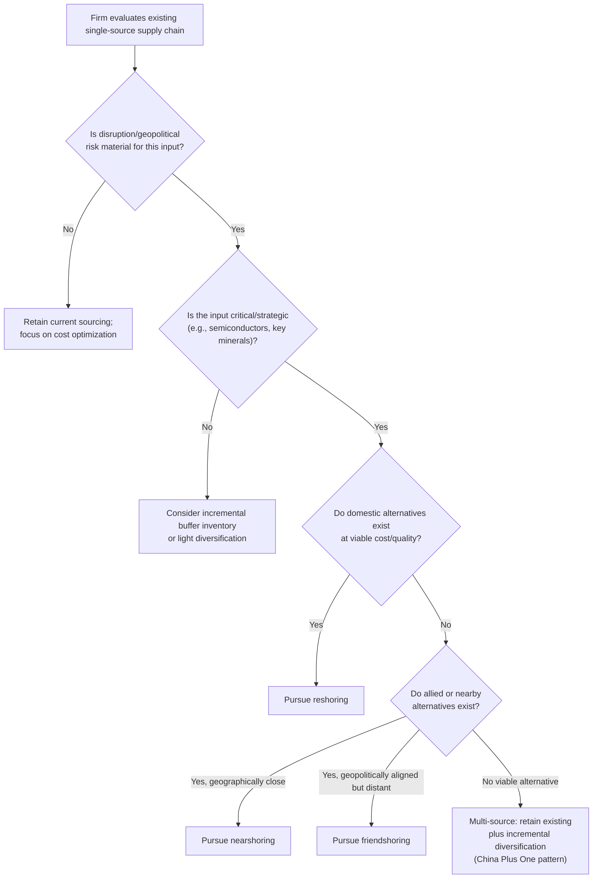

## Reshoring and Supply Chain Diversification Trends

### Definitional Scope

Reshoring and supply chain diversification trends refers to the corporate and policy-driven movement to relocate production back to the home country (reshoring), redistribute it among geographically or geopolitically alternative locations (diversification, nearshoring, friendshoring), or build redundancy into previously concentrated single-source supply chains. This trend has accelerated markedly since approximately 2018–2020, driven by a convergent set of pressures: rising Chinese labor costs, U.S.-China tariff escalation, COVID-19 pandemic disruptions, and growing policy emphasis on economic security discussed in earlier chapter modules.

### Taxonomy of Supply Chain Reconfiguration Strategies

**Key Points**

- **Reshoring (onshoring):** Relocating production entirely back to the home country, eliminating cross-border sourcing for the relevant good or component.
- **Nearshoring:** Relocating production to geographically proximate countries, typically to reduce logistics costs, transportation time, and time-zone/coordination friction (e.g., U.S. firms shifting to Mexico, or EU firms shifting to Central/Eastern Europe or North Africa).
- **Friendshoring:** Redirecting sourcing toward politically aligned countries regardless of geographic proximity, as detailed in the earlier module on economic security policy.
- **Multi-sourcing / dual-sourcing:** Maintaining production or supplier relationships in two or more locations for the same input, explicitly sacrificing some cost efficiency for redundancy and negotiating leverage.
- **"China Plus One" strategy:** A specific corporate diversification pattern in which firms retain existing China-based production capacity (given sunk investment and established supplier ecosystems) while simultaneously establishing at least one additional production base elsewhere (commonly Vietnam, India, or Mexico) for incremental capacity and risk mitigation, rather than pursuing full relocation.
- **Inventory and buffer strategies:** A non-relocation form of resilience-building — increasing safety stock levels and buffer inventory to reduce vulnerability to short-term supply disruptions, representing a shift away from the "just-in-time" inventory minimization paradigm that dominated global value chain management prior to the pandemic, toward a "just-in-case" risk-buffering approach for critical inputs.

### Drivers of Reconfiguration

**Key Points**

- **Rising Chinese labor and input costs:** Chinese manufacturing wages have risen substantially over the past two decades, progressively eroding the pure labor-cost-arbitrage rationale that originally drove offshoring to China in the 1990s–2000s, independent of any policy-driven pressure.
- **Tariff escalation:** The U.S.-China tariff conflict (detailed in the prior chapter module) has directly raised the effective cost of China-sourced inputs and finished goods for U.S.-bound production, creating a direct financial incentive for relocation that operates independently of underlying production-cost economics.
- **COVID-19 supply chain disruption:** The 2020–2021 pandemic exposed acute vulnerabilities in highly optimized, geographically concentrated, just-in-time supply chains — port congestion, factory shutdowns, and shipping container shortages produced extended shortages and cost spikes across numerous sectors (notably semiconductors, affecting automotive and electronics production), providing a vivid, widely publicized demonstration of concentration risk that significantly elevated corporate and policymaker attention to supply chain resilience.
- **Geopolitical risk premium:** Heightened concern about potential future disruption from geopolitical conflict (particularly regarding Taiwan and semiconductor supply, and more broadly U.S.-China strategic competition) has raised the perceived risk-adjusted cost of maintaining concentrated single-country dependence, even absent any current disruption.
- **Automation and reshoring cost economics:** Advances in industrial automation and robotics have reduced the labor-cost share of total production cost in many manufacturing processes, weakening the traditional comparative-cost rationale for offshoring to low-wage locations and making domestic or near-shore production comparatively more viable for some product categories than in earlier decades.
- **Policy incentives:** Government subsidies and tax incentives (CHIPS and Science Act, Inflation Reduction Act sourcing requirements, EU Chips Act, and equivalent programs) directly subsidize the cost differential associated with reshoring or friendshoring specific strategic sectors, discussed in depth in the earlier economic-security-policy module.
- **Environmental and carbon-cost considerations:** Rising attention to the carbon footprint of long-distance shipping, alongside prospective carbon border adjustment mechanisms (e.g., the EU's Carbon Border Adjustment Mechanism), incrementally raises the relative cost of long-distance, carbon-intensive supply chains relative to more geographically proximate alternatives, though [Inference] the quantitative magnitude of this specific driver relative to cost, tariff, and geopolitical-risk drivers appears smaller in the current literature and is not typically treated as a primary causal factor.

### Diagram: Supply Chain Reconfiguration Decision Tree

### Sectoral Patterns

**Key Points**

- **Semiconductors:** Among the most policy-visible reshoring sectors, given the extreme geographic concentration of advanced logic fabrication in Taiwan (TSMC) and South Korea (Samsung); CHIPS Act-subsidized fabrication investments by TSMC, Samsung, Intel, and others in the United States represent a direct, heavily subsidized reshoring/friendshoring response, though building advanced fabrication capacity requires multi-year lead times, meaning realized capacity shifts lag policy announcements substantially.
- **Apparel and light manufacturing:** A longer-standing diversification pattern predates the recent tariff conflict, with apparel and footwear manufacturing progressively shifting from China toward Vietnam, Bangladesh, and other lower-wage Southeast and South Asian countries since the 2010s, driven primarily by labor-cost arbitrage rather than geopolitical risk mitigation — illustrating that not all diversification away from China reflects the newer economic-security-driven pattern.
- **Automotive and electronics assembly:** Significant nearshoring activity has concentrated in Mexico, benefiting from USMCA preferential access to the U.S. market, geographic proximity, and lower relative labor costs compared to the U.S. while avoiding China-specific tariff exposure — though a portion of Mexican-based production has itself drawn scrutiny regarding the extent of embedded Chinese-origin components and Chinese direct investment in Mexican manufacturing facilities, illustrating the transshipment/rerouting dynamic discussed in the earlier deglobalization-measurement module.
- **Pharmaceutical active ingredients (APIs):** Post-pandemic attention to concentrated API manufacturing (heavily concentrated in China and India for specific product categories) has generated reshoring and diversification proposals motivated by public-health-security concerns, though the pharmaceutical sector has historically shown particular reshoring difficulty due to high capital costs, long regulatory approval timelines for manufacturing facility changes, and thin margins on generic products that limit the economic feasibility of relocating production absent substantial subsidy.
- **Critical minerals and battery materials:** Given China's dominant processing (rather than necessarily raw extraction) position in rare earths and several battery-relevant minerals, diversification efforts have focused disproportionately on building allied-country *processing and refining* capacity rather than solely extraction capacity, reflecting recognition that the most acute chokepoint lies in midstream processing rather than upstream raw-material availability.

### Evidence on Realized vs. Announced Reshoring

**Key Points**

- **Announcement-realization gap:** Corporate reshoring and nearshoring announcements have significantly outpaced completed, operational relocation in many sectors — trackers compiling announced projects (such as the U.S. Reshoring Initiative's data) capture stated corporate intent, but announced facilities frequently face delays, cost overruns, or scaling-back relative to original announcements, meaning announcement-based metrics likely overstate the pace of realized supply chain reconfiguration. [Inference] The precise magnitude of this announcement-realization gap varies by sector and is difficult to quantify comprehensively given inconsistent public disclosure of project cancellations or downsizing.
- **Persistence of aggregate China dependence:** Despite substantial diversification activity at the margin, China has retained a dominant position in numerous manufacturing categories (particularly electronics assembly and many industrial inputs), and much of the observed U.S. import diversification toward Vietnam, Mexico, and India reflects final-assembly relocation while upstream components and materials often remain sourced from China — a pattern that limits the degree of genuine value-chain "decoupling" relative to headline trade-flow shifts, consistent with the value-added rerouting dynamic discussed in the deglobalization-measurement module.
- **Speed differential across strategies:** Nearshoring and multi-sourcing strategies for less capital-intensive goods (textiles, simple assembly) have generally proceeded more quickly than reshoring or friendshoring for capital-intensive, technologically complex sectors (semiconductors, advanced pharmaceuticals), where facility construction lead times of several years constrain the pace of realized diversification regardless of policy incentive strength or corporate intent.

### Cost-Benefit Framework for Firm-Level Reconfiguration Decisions

A firm evaluating whether to diversify or reshore a given input can be modeled as comparing the expected total cost of the status quo concentrated sourcing arrangement against the expected total cost of a diversified arrangement:

$$E[TC_{status\ quo}] = C_{base} + p_{disrupt} \cdot L_{disrupt}$$

$$E[TC_{diversified}] = C_{base}(1 + \delta) + p_{disrupt}' \cdot L_{disrupt}'$$

where $C_{base}$ is baseline production/procurement cost under concentrated sourcing, $\delta > 0$ represents the incremental cost premium of diversified/reshored sourcing (typically positive, reflecting the efficiency loss from moving away from the lowest-cost single source), $p_{disrupt}$ is the probability of a supply disruption event, $L_{disrupt}$ is the loss magnitude if disruption occurs, and the primed terms represent the corresponding (generally lower) probability and/or loss magnitude under a diversified arrangement.

Diversification is rational when:

$$C_{base} \cdot \delta < (p_{disrupt} \cdot L_{disrupt}) - (p_{disrupt}' \cdot L_{disrupt}')$$

— that is, when the additional baseline cost of diversification is smaller than the reduction in expected disruption losses it achieves. This formalizes why the post-2020 environment has shifted many firms' calculus toward diversification: perceived $p_{disrupt}$ (probability of major disruption) and $L_{disrupt}$ (severity, given how visible and costly the 2020–2021 disruptions were) both rose substantially in firms' risk assessments, shifting the inequality in favor of diversification even without any change in the underlying cost premium $\delta$.

### Diagram: Reshoring Cost-Risk Trade-off

<svg xmlns="http://www.w3.org/2000/svg" viewBox="0 0 680 420" font-family="Arial, sans-serif">
<text x="340" y="28" text-anchor="middle" font-size="16" font-weight="bold">Cost Premium vs. Risk Reduction Trade-off (svg_diagram)</text>
<line x1="80" y1="360" x2="620" y2="360" stroke="black" stroke-width="2" />
<line x1="80" y1="360" x2="80" y2="60" stroke="black" stroke-width="2" />
<text x="620" y="382" font-size="12" text-anchor="end">Degree of Diversification</text>
<text x="55" y="60" font-size="12" text-anchor="end">Cost / Risk</text>
<polyline points="80,340 200,300 320,240 440,170 560,110" fill="none" stroke="#cc4125" stroke-width="3" />
<text x="560" y="95" font-size="12" fill="#cc4125">Cost premium (rising)</text>
<polyline points="80,90 200,140 320,190 440,240 560,290" fill="none" stroke="#4285f4" stroke-width="3" />
<text x="560" y="305" font-size="12" fill="#4285f4">Expected disruption loss (falling)</text>
<circle cx="330" cy="215" r="6" fill="#34a853" />
<text x="345" y="210" font-size="12" fill="#34a853" font-weight="bold">Optimal diversification point</text>
<line x1="330" y1="215" x2="330" y2="360" stroke="#34a853" stroke-width="1.5" stroke-dasharray="4,4" />
</svg>

### Critiques and Limitations of the Reshoring Trend

**Key Points**

- **Persistent cost differential:** For many labor-intensive manufacturing categories, the underlying cost differential between domestic production and offshore alternatives remains substantial even accounting for tariffs and shipping costs, meaning full reshoring is economically unattractive for many product categories absent large and durable subsidies — limiting reshoring's scope primarily to strategically prioritized sectors rather than manufacturing broadly.
- **Skills and workforce gaps:** Reshoring initiatives in advanced manufacturing sectors (notably semiconductors) have encountered domestic workforce and specialized-skills shortages in host countries, constraining the pace at which announced capacity can become fully operational regardless of capital availability.
- **Redundant capacity and efficiency loss:** Diversification and multi-sourcing strategies inherently sacrifice some of the scale economies and specialization benefits of concentrated production, representing a real, ongoing efficiency cost that is the mirror image of the efficiency costs associated with friendshoring and industrial policy discussed in earlier modules — this is not a free risk-reduction strategy but a genuine cost-risk trade-off.
- **Uneven distributional effects:** Reshoring-driven manufacturing investment tends to concentrate geographically and in specific skill categories (e.g., high-capital-intensity but comparatively lower-labor-intensity advanced manufacturing), meaning the employment impact may differ substantially in composition from the broader manufacturing employment base that existed prior to the original offshoring wave — [Inference] whether reshoring meaningfully reverses aggregate historical manufacturing employment losses at a national level, versus creating a smaller number of more capital-intensive, higher-skill positions concentrated in specific regions, remains a debated empirical question rather than settled consensus.
- **Durability of the trend:** Given that a meaningful share of the reshoring/diversification push depends on the durability of tariff policy, subsidy programs, and the current phase of U.S.-China tensions (as opposed to purely underlying cost economics), [Speculation] the trend's persistence over a multi-decade horizon is uncertain and contingent on future policy continuity, an assessment that should be revisited as tariff truces, subsidy program renewals, and geopolitical developments unfold.

### Comparative Table: Reconfiguration Strategy Trade-offs

| Strategy | Typical Cost Premium | Risk Reduction | Implementation Speed | Best Suited For |
| --- | --- | --- | --- | --- |
| Reshoring | High | High | Slow (multi-year for capital-intensive sectors) | Strategic/critical sectors with subsidy support |
| Nearshoring | Moderate | Moderate-High | Moderate | Time-sensitive, moderate-complexity manufacturing |
| Friendshoring | Moderate-High | Moderate (geopolitical only) | Moderate | Inputs with clear allied-country alternatives |
| Multi-sourcing / China Plus One | Low-Moderate | Moderate | Fast (incremental) | Most manufacturing categories; low-disruption approach |
| Inventory buffering | Low (holding cost) | Low-Moderate (delay only, not elimination) | Fast | Complement to any structural strategy above |

### Related Topics

- Friendshoring and economic security policy
- Measuring deglobalization and slowbalization (value-added rerouting and transshipment)
- The United States-China trade conflict (primary policy driver of recent reshoring activity)
- CHIPS and Science Act and semiconductor reshoring economics
- Global value chains and production fragmentation
- COVID-19 pandemic supply chain disruption case studies
- USMCA and Mexico's role in North American nearshoring
- Critical minerals processing capacity and midstream chokepoints
- Just-in-time vs. just-in-case inventory management paradigms
- Automation, robotics, and the changing economics of offshoring