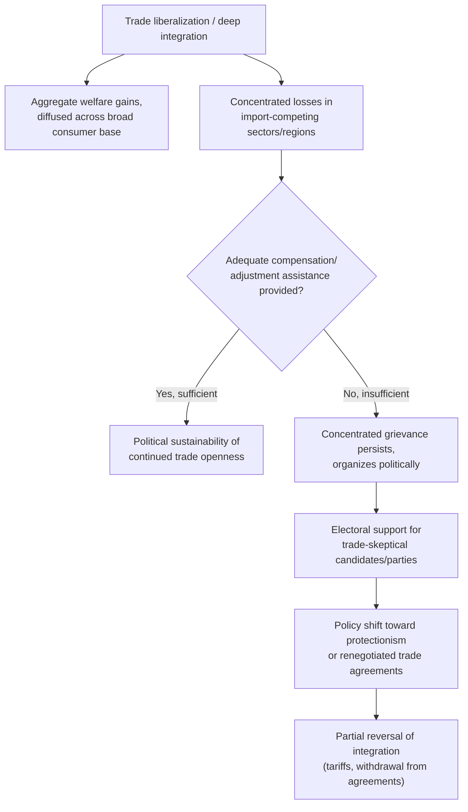

## Political Backlash and Populism Against Trade Openness

### Definitional Scope

Political backlash and populism against trade openness refers to the political movements, electoral outcomes, and policy shifts driven by public opposition to the distributional consequences and perceived sovereignty costs of deep international economic integration. This backlash has been most prominently associated with the post-2016 period in advanced economies — marked by the UK's Brexit referendum, the election of Donald Trump on an explicitly protectionist platform, and the rise of trade-skeptical populist parties across Europe — but has intellectual and empirical roots extending back to earlier trade-adjustment episodes and longer-standing theoretical predictions about the distributional effects of trade liberalization.

### Theoretical Foundations: Why Trade Generates Winners and Losers

**Key Points**

- **Stolper-Samuelson theorem:** The foundational trade-theory prediction is that trade liberalization raises the real return to a country's abundant factor of production and lowers the real return to its scarce factor. In advanced economies with relatively abundant capital and skilled labor but scarce low-skilled labor (relative to labor-abundant developing-country trade partners), the theorem predicts that low-skilled workers in advanced economies bear disproportionate adjustment costs from trade liberalization with labor-abundant countries, even as aggregate national welfare rises.
- **Specific-factors model:** In the shorter run, before factors can fully reallocate across sectors, the specific-factors (Ricardo-Viner) model predicts that factors tied to import-competing sectors (specific capital and labor in those industries) bear concentrated losses from trade liberalization, regardless of their skill level, while factors in export-oriented sectors gain — implying that *sectoral* location, not just skill level, shapes who experiences trade as beneficial versus harmful, particularly in the transition period before full economy-wide reallocation occurs.
- **Concentrated losses, diffused gains:** A recurring empirical and political-economy observation is that trade's aggregate welfare gains are typically diffused across the entire consumer base (via lower prices and greater product variety) in small per-capita increments, while its losses are concentrated among specific workers, firms, and communities tied to import-competing industries — a classic collective-action asymmetry (in the tradition of Olson, 1965) that gives loss-bearing groups stronger incentive and capacity to organize politically than the broader, diffusely-benefiting public.
- **Adjustment cost persistence:** Standard trade theory's welfare gains from trade typically assume relatively frictionless factor reallocation (displaced workers and capital smoothly moving to expanding sectors); empirical labor-economics research (notably the "China Shock" literature, discussed below) has documented that in practice, adjustment costs can be substantial and persistent rather than rapidly self-correcting, meaning the standard theoretical prediction of net aggregate benefit can coexist with prolonged, geographically concentrated regional and individual harm.

### The "China Shock" Literature

**Key Points**

- The most influential empirical body of work documenting concentrated trade-adjustment costs is the series of studies by David Autor, David Dorn, and Gordon Hanson (beginning with their 2013 paper "The China Syndrome" and extended in subsequent work), examining the labor-market effects of rising Chinese import competition on U.S. local labor markets following China's 2001 WTO accession.
- Their core finding: U.S. commuting zones more exposed to Chinese import competition (based on their pre-existing industry mix) experienced significantly larger declines in manufacturing employment, lower overall employment-to-population ratios, and lower wages, with effects that persisted for a substantially longer period than standard trade-adjustment models would predict, rather than being rapidly offset by worker reallocation to other sectors or regions.
- Subsequent extensions of this research program examined political effects directly, finding that more trade-exposed U.S. congressional districts exhibited greater political polarization and, in various specifications, showed increased support for candidates and platforms explicitly associated with protectionist trade positions — providing a direct empirical link between localized trade-adjustment costs and subsequent electoral behavior.
- [Inference] While the China Shock literature is highly influential and widely cited, some other economists have argued the estimated employment effects, while real, should be considered alongside offsetting consumer-welfare gains from lower prices, and that the framework's precise quantitative conclusions and methodology have been subject to ongoing academic debate and refinement rather than being treated as a fully settled, final estimate.

### Rodrik's Political Trilemma of the World Economy

Dani Rodrik's influential trilemma framework (formalized in *The Globalization Paradox*, 2011) argues that a country can achieve at most two of the following three objectives simultaneously:

1. **Deep economic integration** (hyperglobalization)
2. **National sovereignty** (autonomous domestic policy-making)
3. **Democratic politics** (broad democratic accountability for policy outcomes)

**Key Points**

- Rodrik's argument is that hyperglobalization requires harmonizing regulatory and policy standards across countries to a degree that either constrains national sovereignty (ceding policy autonomy to supranational rules or competitive pressure) or constrains democratic responsiveness (insulating certain policy domains, such as trade and monetary policy, from ordinary democratic contestation, as through independent central banks or binding trade-agreement dispute-resolution mechanisms).
- The framework is frequently applied retrospectively to interpret both interwar backlash against first-wave globalization and post-2016 populist backlash: when the "sovereignty-constraining" or "democracy-constraining" costs of deep integration become sufficiently visible and politically salient to a critical mass of voters, a democratic polity may reassert either sovereignty or direct democratic control at the expense of the integration objective, precisely the dynamic Rodrik argues explains the emergence of political trade backlash in democratic societies.
- Rodrik's own policy conclusion is not that globalization should be abandoned, but that architects of trade policy have historically pursued integration further and faster than the underlying political trilemma can comfortably sustain in democratic societies, generating a predictable political correction rather than a purely irrational or misinformed backlash.

### Diagram: Rodrik's Political Trilemma

<svg xmlns="http://www.w3.org/2000/svg" viewBox="0 0 640 560" font-family="Arial, sans-serif">
<text x="320" y="28" text-anchor="middle" font-size="16" font-weight="bold">Rodrik's Political Trilemma (svg_diagram)</text>
<polygon points="320,80 540,460 100,460" fill="none" stroke="#333" stroke-width="2" />
<circle cx="320" cy="80" r="8" fill="#4285f4" />
<text x="320" y="60" text-anchor="middle" font-size="13" font-weight="bold">Deep Economic Integration</text>
<text x="320" y="75" text-anchor="middle" font-size="11">(Hyperglobalization)</text>
<circle cx="540" cy="460" r="8" fill="#e69138" />
<text x="560" y="450" text-anchor="start" font-size="13" font-weight="bold">National Sovereignty</text>
<circle cx="100" cy="460" r="8" fill="#34a853" />
<text x="90" y="450" text-anchor="end" font-size="13" font-weight="bold">Democratic Politics</text>

<text x="430" y="230" text-anchor="middle" font-size="12" fill="#666">"Bretton Woods Compromise"</text>

<text x="430" y="248" text-anchor="middle" font-size="11" fill="#666">(Integration + Sovereignty,</text>

<text x="430" y="264" text-anchor="middle" font-size="11" fill="#666">limited democratic scope)</text>

<text x="210" y="230" text-anchor="middle" font-size="12" fill="#666">"Global Federalism"</text>

<text x="210" y="248" text-anchor="middle" font-size="11" fill="#666">(Integration + Democracy,</text>

<text x="210" y="264" text-anchor="middle" font-size="11" fill="#666">limited national sovereignty)</text>

<text x="320" y="420" text-anchor="middle" font-size="12" fill="#666">"Golden Straitjacket" /</text>

<text x="320" y="438" text-anchor="middle" font-size="11" fill="#666">Nation-State Compromise</text>

<text x="320" y="454" text-anchor="middle" font-size="11" fill="#666">(Sovereignty + Democracy,</text>

</svg>

### Key Political and Electoral Episodes

**Key Points**

- **Brexit (2016):** The UK referendum vote to leave the EU is widely analyzed as substantially motivated by concerns over sovereignty (regulatory and legal autonomy from EU institutions) and immigration control, intertwined with — though not solely reducible to — economic dislocation concerns in post-industrial regions; voting patterns showed notable correlation with measures of local economic decline and lower educational attainment, though academic analyses differ on the relative explanatory weight of economic versus cultural/identity factors.
- **2016 U.S. presidential election:** Donald Trump's campaign featured explicit protectionist positioning (criticism of NAFTA, threats of tariffs on China, opposition to the Trans-Pacific Partnership), with subsequent analyses (including extensions of the China Shock research program) finding correlations between local trade-exposure measures and shifts in political support, alongside cultural, racial, and identity-based factors emphasized in other strands of the political science literature. [Inference] The relative causal weight of economic trade-exposure factors versus cultural and identity-based factors in explaining 2016 U.S. voting patterns remains genuinely contested across different scholarly disciplines and should not be reduced to a single dominant explanation.
- **European populist party performance:** Trade-skeptical and immigration-skeptical populist parties (across France, Germany, Italy, and other EU member states) have shown sustained or growing electoral performance in various national and European Parliament elections since the mid-2010s, with academic analyses linking regional trade and import-competition exposure to populist vote-share increases in several European country studies, echoing the U.S. findings in a distinct institutional and political context.
- **Trans-Pacific Partnership (TPP) withdrawal:** The U.S. withdrawal from the TPP in January 2017 exemplifies a concrete policy manifestation of the broader backlash — a major multilateral trade agreement negotiated over several years was abandoned in direct response to the domestic political climate generated by the broader trade-backlash sentiment, notably enjoying bipartisan skepticism (including significant opposition within the Democratic Party primary contest as well) rather than being a purely partisan phenomenon.

### Polanyi's "Double Movement" Framework

**Key Points**

- Karl Polanyi's *The Great Transformation* (1944) proposed that market expansion in a society tends to generate a societal counter-movement seeking to reassert social protection against market-driven dislocation — a "double movement" in which the expansion of market relations (the first movement) provokes a protective political-social response (the second movement), including labor regulation, social insurance, or protectionist trade policy.
- This framework is frequently invoked to interpret both the emergence of the post-WWII welfare state and embedded-liberalism compromise (understood partly as a protective societal response to the disruptions of first-wave globalization and the interwar collapse) and the contemporary backlash against hyperglobalization, positioning current populist trade skepticism as a recognizable historical pattern rather than a wholly novel phenomenon.
- Ruggie's concept of "embedded liberalism" (1982), describing the post-WWII Bretton Woods compromise combining international trade openness with extensive domestic social-welfare provision and macroeconomic stabilization policy, is often read as the institutional embodiment of Polanyi's double-movement logic applied to the postwar international economic order — and its erosion (via welfare-state retrenchment and accelerated capital-account liberalization from the 1980s onward) is cited by some scholars as a contributing structural condition for the more recent backlash, since the domestic compensatory mechanisms that had made earlier trade openness more politically sustainable were weakened even as trade integration itself deepened.

### Policy Responses to Trade-Adjustment Backlash

**Key Points**

- **Trade Adjustment Assistance (TAA):** The primary U.S. policy instrument explicitly designed to compensate and retrain workers displaced by import competition, providing extended unemployment benefits, retraining funding, and job-search assistance to workers certified as having lost employment due to increased imports or plant relocation abroad.
- **Critiques of adjustment assistance adequacy:** TAA and comparable programs in other advanced economies have been widely criticized in the academic and policy literature as underfunded relative to the scale of documented adjustment costs (per the China Shock literature's employment and wage findings), administratively cumbersome to access, and insufficiently effective at successfully transitioning displaced workers into comparably compensated new employment — a mismatch between the scale of documented harm and the scale of compensatory policy response that some scholars argue directly contributed to the political backlash, since the theoretical "compensate the losers" solution long proposed by trade economists (tracing to Paul Samuelson's compensation-principle framework) was not adequately implemented in practice.
- **Place-based industrial policy:** More recent policy responses (including elements of the U.S. CHIPS and Science Act and Inflation Reduction Act) have incorporated explicit place-based and regional-development components, partly motivated by a policy-design intent to address the geographically concentrated nature of trade- and technology-driven economic dislocation more directly than traditional individual-worker-focused adjustment assistance.
- **Renewed protectionism as political response:** Rather than compensating trade's losers while maintaining openness, a substantial share of the actual post-2016 policy response in several major economies has instead involved re-imposing trade barriers (tariffs, discussed extensively in the prior chapter module on the U.S.-China conflict) — representing a policy choice to partially reverse integration itself, rather than to better cushion its distributional consequences, reflecting the practical political economy reality that compensation mechanisms proved more difficult to sustain or expand than protectionist alternatives.

### Comparative Table: Theoretical Frameworks for Trade Backlash

| Framework | Core Mechanism | Primary Scholar(s) | Key Prediction |
| --- | --- | --- | --- |
| Stolper-Samuelson | Factor-price effects of trade on scarce vs. abundant factors | Stolper, Samuelson (1941) | Low-skilled labor in advanced economies bears concentrated losses |
| Specific-factors model | Sector-specific factor immobility in the short run | Ricardo-Viner tradition | Import-competing sector workers/capital lose regardless of skill level |
| Political trilemma | Integration vs. sovereignty vs. democracy trade-off | Dani Rodrik (2011) | Deep integration provokes sovereignty/democracy reassertion |
| Double movement | Market expansion provokes protective counter-movement | Karl Polanyi (1944) | Backlash is a recurring historical pattern, not a novel anomaly |
| Collective action asymmetry | Concentrated losses organize more effectively than diffused gains | Mancur Olson (1965) | Protectionist coalitions form more readily than free-trade coalitions |

### Backlash Dynamics Diagram

### Contemporary Relevance and Ongoing Debate

**Key Points**

- The political backlash literature connects directly to the "slowbalization" and deglobalization-measurement discussions in earlier chapter modules — a meaningful share of the actual observed plateau in trade-to-GDP ratios and GVC participation since roughly 2016 is attributed by some researchers to this specific political dynamic, rather than being solely a function of underlying economic factors (automation, cost convergence) discussed in the reshoring module.
- The debate over the relative weight of economic versus cultural/identity explanations for populist trade backlash remains active across economics, political science, and sociology, with different disciplinary traditions emphasizing different causal weights; [Unverified] any single definitive resolution of this interdisciplinary debate should not be assumed, and current research in this actively developing area should be consulted for the latest empirical findings.
- Looking forward, the durability of the current backlash-driven protectionist policy environment (detailed in the U.S.-China trade conflict module) is itself contingent on whether adjustment-assistance and place-based policy responses more effectively address the underlying distributional grievances than prior compensation efforts, a question with direct bearing on whether current tariff and industrial policy measures represent a durable structural shift or a more transitory political phase. [Speculation] This forward-looking assessment is inherently uncertain and depends on political and policy developments not yet resolved at the time of this content's compilation.

### Related Topics

- Historical waves of globalization (interwar backlash as historical parallel)
- Measuring deglobalization and slowbalization (political backlash as a contributing causal factor)
- The United States-China trade conflict (concrete policy manifestation of backlash-driven protectionism)
- Reshoring and supply chain diversification trends (overlapping but analytically distinct driver set)
- The "China Shock" literature (Autor, Dorn, Hanson) and local labor market effects
- Trade Adjustment Assistance program design and effectiveness critiques
- Rodrik's globalization trilemma and embedded liberalism (Ruggie)
- Polanyi's double movement and historical parallels in social protection
- Brexit referendum political economy analysis
- Place-based industrial policy as a response to geographically concentrated trade adjustment costs