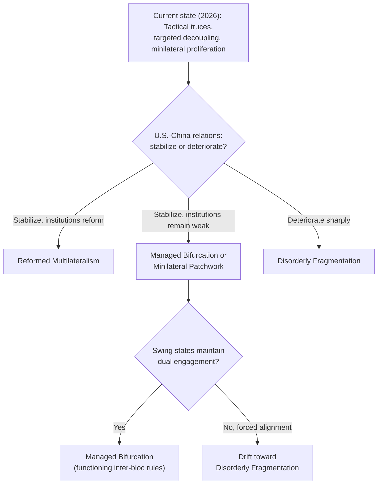

## Scenarios for the Future International Economic Order

### Definitional Scope

Scenarios for the future international economic order refers to structured frameworks economists, political scientists, and policy institutions use to characterize plausible trajectories for how global trade, monetary, financial, and technological governance might evolve over the coming decades, given the deglobalization, geoeconomic, and industrial-policy pressures documented throughout this chapter. Because the future is inherently uncertain, this material is necessarily more speculative than earlier historical and empirical modules, and is best understood as a structured mapping of plausible pathways and their respective conditions, rather than a forecast of a single expected outcome.

### Why Scenario Analysis Rather Than Point Forecasting

**Key Points**

- Given the path-dependent, multi-actor, strategically interactive nature of international economic order formation (shaped by the interacting choices of the U.S., China, the EU, and numerous other states, each with incomplete information about others' future actions), point forecasting is particularly unreliable in this domain compared to more structurally stable areas of economic analysis.
- Scenario planning methodology (originating in corporate and military strategic planning, notably associated with Royal Dutch Shell's scenario planning practice from the 1970s) is widely used by international economic institutions (IMF, World Bank, OECD) and geopolitical risk consultancies specifically because it allows structured reasoning about a range of plausible futures and their respective policy implications, without requiring false precision about which single scenario will materialize.
- [Speculation] All content in this module describing prospective future scenarios should be understood as structured possibility-mapping rather than prediction; the relative probability weight assigned to any given scenario is inherently contestable and will be informed by developments occurring after this content's compilation.

### Scenario Framework: Two Key Axes

A common approach to structuring international economic order scenarios uses two primary axes of uncertainty:

1. **Degree of fragmentation:** Ranging from continued broadly multilateral, rules-based integration at one extreme, to full bifurcation into separate, largely non-interoperable economic blocs at the other.
2. **Degree of institutional adaptation:** Ranging from existing institutions (WTO, IMF, World Bank) successfully reforming and adapting to new geoeconomic realities, to those institutions becoming increasingly marginalized in favor of ad hoc, minilateral, or purely bilateral arrangements.

### Diagram: Scenario Quadrant Framework

<svg xmlns="http://www.w3.org/2000/svg" viewBox="0 0 680 560" font-family="Arial, sans-serif">
<text x="340" y="28" text-anchor="middle" font-size="16" font-weight="bold">Future International Economic Order: Scenario Quadrants (svg_diagram)</text>
<line x1="340" y1="70" x2="340" y2="500" stroke="black" stroke-width="2" />
<line x1="100" y1="285" x2="580" y2="285" stroke="black" stroke-width="2" />

<text x="340" y="55" text-anchor="middle" font-size="12" font-weight="bold">High Institutional Adaptation</text>

<text x="340" y="520" text-anchor="middle" font-size="12" font-weight="bold">Low Institutional Adaptation</text>

<text x="90" y="285" text-anchor="end" font-size="12" font-weight="bold">Continued Multilateral Integration</text>

<text x="590" y="285" text-anchor="start" font-size="12" font-weight="bold">Bloc Fragmentation</text>

<rect x="150" y="100" width="160" height="150" fill="#e6f4ea" stroke="#34a853" stroke-width="2" />
<text x="230" y="130" text-anchor="middle" font-size="13" font-weight="bold">Reformed</text>
<text x="230" y="148" text-anchor="middle" font-size="13" font-weight="bold">Multilateralism</text>
<text x="230" y="175" text-anchor="middle" font-size="11">WTO/IMF adapt,</text>
<text x="230" y="190" text-anchor="middle" font-size="11">integration continues</text>
<rect x="370" y="100" width="160" height="150" fill="#fff4e5" stroke="#e69138" stroke-width="2" />
<text x="450" y="130" text-anchor="middle" font-size="13" font-weight="bold">Managed</text>
<text x="450" y="148" text-anchor="middle" font-size="13" font-weight="bold">Bifurcation</text>
<text x="450" y="175" text-anchor="middle" font-size="11">Blocs form, but with</text>
<text x="450" y="190" text-anchor="middle" font-size="11">functioning inter-bloc rules</text>
<rect x="150" y="320" width="160" height="150" fill="#e8f0fe" stroke="#4285f4" stroke-width="2" />
<text x="230" y="350" text-anchor="middle" font-size="13" font-weight="bold">Minilateral</text>
<text x="230" y="368" text-anchor="middle" font-size="13" font-weight="bold">Patchwork</text>
<text x="230" y="395" text-anchor="middle" font-size="11">Ad hoc coalitions,</text>
<text x="230" y="410" text-anchor="middle" font-size="11">institutions weakened</text>
<rect x="370" y="320" width="160" height="150" fill="#fce8e6" stroke="#cc4125" stroke-width="2" />
<text x="450" y="350" text-anchor="middle" font-size="13" font-weight="bold">Disorderly</text>
<text x="450" y="368" text-anchor="middle" font-size="13" font-weight="bold">Fragmentation</text>
<text x="450" y="395" text-anchor="middle" font-size="11">Bloc conflict, weak rules,</text>
<text x="450" y="410" text-anchor="middle" font-size="11">elevated economic risk</text>
</svg>

### Scenario 1: Reformed Multilateralism

**Key Points**

- **Core features:** WTO dispute-settlement mechanisms are restored and reformed (addressing the long-standing paralysis of the Appellate Body), major economies recommit to rules-based trade governance, and geoeconomic tensions are channeled through updated multilateral rules (e.g., new disciplines on industrial subsidies, digital trade, and state-owned-enterprise competition) rather than unilateral action.
- **Conditions favoring this scenario:** Would likely require a reduction in acute U.S.-China strategic rivalry, renewed leadership commitment from major economies to multilateral institution-building (echoing the post-WWII Bretton Woods institution-building moment), and successful updating of WTO rules to address genuine gaps (digital trade, subsidies, state capitalism) that have fueled unilateral action in their absence.
- **Historical precedent:** Analogous to the postwar embedded-liberalism compromise and the successful conclusion of the Uruguay Round (1994) despite substantial negotiating friction, suggesting institutional reform is not unprecedented even after periods of significant international economic strain.
- [Speculation] Given the extent of current WTO Appellate Body paralysis and the depth of U.S.-China strategic competition as of this content's compilation, this scenario is generally treated in the policy literature as facing substantial headwinds relative to the other scenarios described below, though assessment of its relative likelihood should be updated against the latest developments in WTO reform negotiations and U.S.-China relations.

### Scenario 2: Managed Bifurcation ("Two Blocs, Functioning Rules")

**Key Points**

- **Core features:** The global economy substantially reorganizes around two (or more) geopolitically aligned blocs — broadly, a U.S.-aligned bloc and a China-aligned bloc, with a substantial group of non-aligned or "swing" states (India, Gulf states, much of the Global South) maintaining economic ties with both — but with functioning rules governing interactions *between* blocs (e.g., negotiated tariff schedules, dispute-resolution mechanisms for the more limited inter-bloc trade that continues) rather than open economic conflict.
- **Conditions favoring this scenario:** Requires sufficient mutual economic interest on both sides to maintain negotiated, rules-based inter-bloc engagement even amid reduced overall integration — consistent with current evidence that both the U.S. and China have repeatedly pursued negotiated truces and tactical agreements (as documented in the U.S.-China trade conflict module) rather than full economic rupture, suggesting mutual economic interdependence continues to constrain unrestrained escalation on both sides.
- **Role of non-aligned "swing states":** A distinguishing feature of this scenario relative to Cold War-style bipolar economic separation is the substantial economic weight and strategic optionality of non-aligned major economies (India, Indonesia, Gulf states, and others), which can trade and invest with both blocs, potentially acting as a moderating force against complete bifurcation and creating economic incentives for both blocs to maintain workable engagement rules to avoid pushing swing states entirely into the rival bloc.
- [Inference] Many current policy analyses (including IMF geoeconomic fragmentation research) treat some version of this managed-bifurcation scenario as more consistent with observed developments through 2026 (truces, tactical agreements, targeted rather than comprehensive decoupling) than either full reformed multilateralism or disorderly fragmentation, though this characterization reflects an interpretation of current evidence rather than a settled consensus forecast.

### Scenario 3: Minilateral Patchwork

**Key Points**

- **Core features:** Existing multilateral institutions (WTO, and to a lesser extent IMF/World Bank) become increasingly marginalized in practical significance, replaced by a proliferating patchwork of minilateral agreements among smaller coalitions of like-minded countries — regional trade agreements, sector-specific coalitions (e.g., critical minerals partnerships, chip-supply-chain coordination groups), and bilateral arrangements — without a coherent overarching architectural logic connecting them.
- **Conditions favoring this scenario:** Consistent with the observed proliferation of minilateral frameworks discussed in the earlier friendshoring module (Minerals Security Partnership, Chip 4 discussions, Indo-Pacific Economic Framework) even while the WTO's core dispute-settlement and negotiating functions remain substantially impaired, suggesting this pattern may already be partially underway regardless of which broader quadrant ultimately describes the medium-term equilibrium.
- **Risk of incoherence:** A key vulnerability of this scenario is the potential for overlapping, sometimes contradictory rules and commitments across the proliferating minilateral agreements, raising compliance complexity and transaction costs for multinational firms navigating multiple, potentially inconsistent regulatory and trade regimes simultaneously — a concrete, firm-level cost distinct from the macro-level fragmentation costs discussed in earlier modules.

### Scenario 4: Disorderly Fragmentation

**Key Points**

- **Core features:** Bloc formation proceeds without functioning inter-bloc governance mechanisms, elevating risk of trade wars, competitive subsidy races (echoing the retaliation dynamics discussed in the strategic-trade-theory and industrial-policy modules), financial market fragmentation, and potentially serious macroeconomic instability from disrupted supply chains and capital flows.
- **Conditions that could produce this scenario:** Would likely require a significant deterioration in U.S.-China relations beyond current tensions (e.g., a acute crisis over Taiwan, a major military conflict, or a sudden breakdown of the tactical truce architecture described in the trade-conflict module), a broader retreat from negotiated de-escalation of the kind observed at the Busan summit, or a self-reinforcing cycle of retaliatory economic measures that overwhelms both sides' apparent mutual interest in avoiding full rupture.
- **Economic costs:** Standard trade-theory and empirical trade-cost estimates suggest this scenario would impose substantially larger welfare losses than the managed-bifurcation or minilateral-patchwork scenarios, given the loss of scale economies, disrupted long-term investment planning, and the compounding effect of financial-market fragmentation on top of goods-trade disruption — though [Unverified] precise quantitative welfare-loss estimates for a full disorderly-fragmentation scenario vary substantially across different modeling exercises (IMF, World Bank, and various academic estimates) and depend heavily on assumed elasticities and scenario-specific assumptions that should be checked against the most current modeling work if precision is required.
- [Speculation] As of this content's compilation, most mainstream policy and economic analyses treat this scenario as a lower-probability tail risk rather than a central expected outcome, given the demonstrated mutual interest of both major powers in negotiated de-escalation observed through 2025–2026; this assessment is inherently sensitive to future geopolitical developments and should be revisited as circumstances evolve.

### Cross-Cutting Structural Forces Relevant to All Scenarios

**Key Points**

- **Currency and financial system evolution:** The future role of the U.S. dollar as the dominant reserve and invoicing currency (and the associated "weaponized interdependence" leverage discussed in the sanctions module) is a key structural variable across all scenarios — continued dollar dominance is more consistent with managed-bifurcation or minilateral-patchwork scenarios in which the U.S. retains substantial structural leverage, while more rapid multipolar currency diversification (via expanded use of alternative payment systems and reserve currencies) could be both a cause and consequence of movement toward more disorderly fragmentation.
- **Climate policy and green industrial competition:** The intersection of climate policy (carbon border adjustment mechanisms, green subsidy competition in clean energy and EV supply chains) with geoeconomic fragmentation represents an increasingly significant cross-cutting force — green industrial policy could either become a new arena of fragmentation-reinforcing subsidy competition (echoing the strategic-trade and industrial-policy dynamics from earlier modules) or, alternatively, a domain of renewed multilateral cooperation given the genuinely global nature of climate externalities, with the actual trajectory likely depending substantially on the broader scenario pathway that materializes.
- **Artificial intelligence and technology governance:** The governance of frontier AI development and deployment represents an emerging and highly consequential domain of technology competition that could reinforce fragmentation (if AI development bifurcates along the same geopolitical bloc lines as semiconductor supply chains) or could become a distinct area of negotiated international governance (given shared interest among major powers in managing catastrophic and safety-related AI risks) — [Speculation] the relative weight of competitive versus cooperative dynamics in AI governance specifically is a highly active and unsettled area of both policy development and academic analysis, and any characterization here should be treated as provisional.
- **Global South agency and multipolarity:** Across all scenarios, developing and middle-income economies' increasing economic weight and diplomatic assertiveness (including through platforms such as BRICS expansion and enhanced South-South economic cooperation) represents a structural force independent of the primary U.S.-China axis, with the potential to shape which scenario materializes — particularly through the "swing state" dynamic discussed under managed bifurcation — regardless of how the bilateral U.S.-China relationship specifically evolves.

### Comparative Table: Scenario Summary

| Scenario | Fragmentation Level | Institutional Adaptation | Key Enabling Condition | Relative Welfare Cost |
| --- | --- | --- | --- | --- |
| Reformed Multilateralism | Low | High | Renewed multilateral leadership, WTO reform | Lowest |
| Managed Bifurcation | Moderate-High | Moderate | Mutual interest in negotiated inter-bloc rules | Moderate |
| Minilateral Patchwork | Moderate | Low-Moderate | Proliferation of sector/coalition-specific agreements | Moderate-High (compliance complexity) |
| Disorderly Fragmentation | High | Low | Breakdown of negotiated de-escalation, acute crisis | Highest |

### Scenario Pathway Diagram

### Implications for Policymakers and Firms

**Key Points**

- **Policy design under uncertainty:** Given the genuine uncertainty across these scenarios, policy institutions increasingly emphasize building resilience and optionality (diversified alliance relationships, flexible trade agreement structures) rather than committing irreversibly to a single scenario's assumptions — a risk-management approach analogous to the firm-level diversification logic discussed in the reshoring module, applied at the level of national and institutional strategy.
- **Firm-level strategic planning:** Multinational firms face a parallel scenario-planning challenge, needing to evaluate capital investment, supply chain, and market-access decisions against multiple plausible future trajectories rather than a single base case, given the potentially large divergence in the operating environment across the scenarios described above (e.g., the viability of integrated global supply chains differs enormously between the reformed-multilateralism and disorderly-fragmentation scenarios).
- **Monitoring indicators:** The empirical measurement tools discussed in the earlier "measuring deglobalization" module (trade-to-GDP trends, GVC participation, geopolitical-bloc trade redirection, financial fragmentation indicators) serve as the practical early-warning indicators policymakers and analysts use to assess which scenario the international system appears to be tracking toward in real time, making that measurement toolkit directly relevant to ongoing scenario reassessment rather than purely a historical/retrospective exercise.

### Related Topics

- Historical waves of globalization (long-run historical pattern against which future scenarios are benchmarked)
- Measuring deglobalization and slowbalization (empirical indicators for scenario tracking)
- The United States-China trade conflict (primary bilateral relationship shaping scenario pathways)
- Friendshoring and economic security policy (minilateral patchwork scenario evidence)
- Political backlash and populism against trade openness (domestic political constraint on scenario pathways)
- WTO Appellate Body paralysis and dispute-settlement reform prospects
- De-dollarization and the future of international reserve currency arrangements
- Carbon border adjustment mechanisms and green industrial policy competition
- AI governance and technology competition as an emerging fragmentation axis
- BRICS expansion and Global South economic agency in a multipolar order