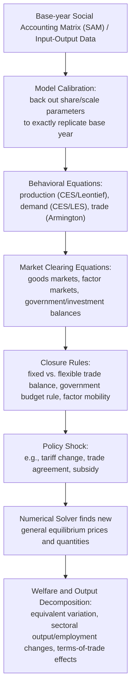

## Computable General Equilibrium Trade Models

### Definitional Scope

Computable general equilibrium (CGE) trade models are large-scale numerical simulation models that represent an economy (or the global economy) as a system of interlinked markets — for goods, factors of production, and often financial assets — solved simultaneously to determine equilibrium prices and quantities under specified behavioral assumptions. In international economics, CGE models are the primary quantitative tool used to simulate the economy-wide effects of trade policy changes (tariffs, trade agreements, non-tariff barrier reductions) that are too complex for closed-form analytical solution, translating theoretical trade models (Ricardian, Heckscher-Ohlin, monopolistic competition) into empirically calibrated, numerically solvable systems.

### Core Structural Components

**Key Points**

- **Production block:** Specifies production functions (commonly nested constant elasticity of substitution, CES, functions) determining how firms in each sector combine factors of production (labor, capital, land) and intermediate inputs to produce output, calibrated to match a base-year input-output structure.
- **Demand block:** Specifies household (and often government and investment) demand functions — commonly derived from a utility-maximization framework such as a Cobb-Douglas, CES, or more flexible functional form (e.g., a Linear Expenditure System or Almost Ideal Demand System) — determining how income is allocated across goods.
- **Trade block:** Represents international trade flows, typically incorporating the **Armington assumption** (Armington, 1969) — treating goods from different countries of origin as imperfect substitutes even within the same product category, which allows the model to generate two-way ("intra-industry") trade in the same product category and avoids the extreme specialization outcomes that a standard Heckscher-Ohlin model with perfect substitutability would otherwise imply.
- **Market clearing conditions:** A system of equations requiring that supply equal demand in every market (goods markets, factor markets) simultaneously, with prices adjusting to clear all markets — the defining "general equilibrium" feature distinguishing CGE models from partial equilibrium analysis that examines a single market in isolation.
- **Closure rules:** A set of assumptions specifying which variables are treated as exogenously fixed versus endogenously determined (e.g., whether the government budget is balanced by adjusting a specific tax rate, whether the trade balance is fixed or allowed to adjust, whether capital stock is fixed in the short run or fully mobile in a long-run closure) — closure rule choices frequently have first-order effects on simulation results and are a critical, sometimes underappreciated, methodological choice.

### The Armington Assumption in Detail

The Armington structure specifies a CES aggregation function combining domestically produced and imported varieties of a good (often further disaggregated by source country):

$$Q_i = \left[ \gamma_i D_i^{-\rho_i} + (1-\gamma_i) M_i^{-\rho_i} \right]^{-1/\rho_i}$$

where $Q_i$ is the composite good available for consumption in sector $i$, $D_i$ is the domestically produced quantity, $M_i$ is the imported quantity, $\gamma_i$ is a share parameter, and $\rho_i$ relates to the elasticity of substitution $\sigma_i = 1/(1+\rho_i)$ between domestic and imported varieties.

**Key Points**

- The Armington elasticity $\sigma_i$ is one of the single most influential parameters in any CGE trade simulation: higher values imply domestic and imported goods are closer substitutes, generating larger quantity responses (and correspondingly smaller price responses) to a given tariff change, while lower values generate the reverse pattern.
- Because Armington elasticities are difficult to estimate precisely and vary substantially across studies and product categories, sensitivity analysis over a plausible range of elasticity values is considered standard best practice, and results that are highly sensitive to the specific elasticity assumed should be reported with appropriate qualification rather than presented as point estimates.
- Extensions incorporating firm heterogeneity and new-trade-theory features (e.g., Melitz-style monopolistic competition with heterogeneous firm productivity) have been developed to address some limitations of the basic Armington structure, particularly its inability to generate extensive-margin trade responses (new firms/varieties entering or exiting export markets) that more recent trade theory and micro-level empirical evidence suggest are quantitatively important.

### Diagram: CGE Model Architecture

### Major CGE Modeling Frameworks

**Key Points**

- **GTAP (Global Trade Analysis Project):** The most widely used multi-region, multi-sector CGE database and modeling framework, maintained at Purdue University, providing a standardized global Social Accounting Matrix (SAM) covering a large number of countries/regions and sectors, along with a standard reference model — its widespread adoption makes it the most common baseline for comparative academic and policy CGE studies of trade agreements and tariff changes.
- **MIRAGE:** A CGE model developed and used substantially by French and European research institutions (CEPII), frequently applied to EU trade policy analysis and known for particular attention to detailed treatment of preferential trade agreements and rules-of-origin effects.
- **WorldScan and ENVISAGE:** Models with particular strength in incorporating environmental and energy modules alongside standard trade blocks, used for combined trade-and-climate-policy analysis (e.g., interactions between tariff policy and carbon border adjustment mechanisms).
- **Country-specific and institutional models:** Various national statistical agencies, central banks, and international institutions (World Bank's LINKAGE model, USITC's models) maintain their own CGE frameworks, often tailored to specific policy-analysis mandates (e.g., official U.S. trade agreement impact assessments conducted by the U.S. International Trade Commission).
- [Unverified] The specific current versions, database vintages, and comparative technical specifications of these models are periodically updated, and researchers should consult each project's current documentation directly for the latest release details rather than relying on potentially dated version-specific information.

### Static vs. Dynamic CGE Models

**Key Points**

- **Static CGE models:** Compare a single pre-policy equilibrium to a single post-policy equilibrium, without explicitly modeling the time path of adjustment between the two states — computationally simpler and more transparent, but silent on transition dynamics, adjustment costs, and the specific time horizon over which the projected long-run effects would materialize.
- **Recursive-dynamic CGE models:** Solve a sequence of static equilibria linked across time periods through capital accumulation (investment in one period augmenting the capital stock available in subsequent periods) and other slowly evolving state variables, allowing analysis of the transition path and providing year-by-year projections rather than only an eventual long-run comparison.
- **Fully dynamic (intertemporal) CGE models:** Incorporate forward-looking optimizing behavior by households and firms (rational expectations regarding future prices and policy), most rigorous theoretically but substantially more complex to calibrate, solve, and validate; less common in mainstream trade-policy CGE analysis relative to static and recursive-dynamic approaches, given the standard trade-off between theoretical completeness and interpretability introduced by increased model complexity.

### Standard Applications in International Economics

**Key Points**

- **Ex ante trade agreement impact assessment:** CGE models are the standard tool used by government agencies (e.g., USITC assessments of prospective U.S. trade agreements) and international institutions to project the economy-wide effects of a proposed trade agreement before it is implemented, generating estimates of aggregate GDP effects, sectoral output and employment shifts, and welfare changes used to inform legislative and public debate.
- **Tariff and trade war impact simulation:** CGE frameworks are extensively used to simulate the effects of tariff increases (such as those in the U.S.-China trade conflict detailed in the earlier chapter module), providing quantitative estimates of GDP, price, and welfare effects that complement the qualitative and partial-equilibrium analysis often reported in real-time policy commentary.
- **Regional and preferential trade agreement analysis:** CGE models are used to assess trade creation versus trade diversion effects (Viner's classical customs-union theory concepts) of specific preferential trade agreements, quantifying the net welfare implications given a particular agreement's tariff-preference structure and rules of origin.
- **Combined trade-climate policy analysis:** Increasingly used to jointly model the interaction between trade policy and climate policy instruments (carbon border adjustment mechanisms, green subsidy programs), given the growing overlap between these two policy domains highlighted in the earlier chapter's future-scenarios module.

### Methodological Critiques and Limitations

**Key Points**

- **Calibration versus econometric estimation:** Most CGE model parameters are "calibrated" — chosen so that the model, run at pre-shock baseline values, exactly reproduces the observed base-year data — rather than statistically estimated with associated confidence intervals in the manner of standard econometric regression; this practice, while standard, means CGE results generally do not come with the same kind of statistical uncertainty quantification that econometric estimates provide, a limitation increasingly addressed through systematic sensitivity analysis but not fully resolved by it.
- **Parameter uncertainty and elasticity sensitivity:** As noted regarding the Armington elasticity above, CGE results can be highly sensitive to key behavioral parameters (trade elasticities, labor supply elasticities, capital mobility assumptions) that are subject to substantial estimation uncertainty in the underlying empirical literature — a well-documented limitation sometimes summarized as "the elasticities drive the results," meaning any single-point CGE estimate should be interpreted alongside its underlying elasticity assumptions rather than treated as a precise, assumption-free prediction.
- **Perfect competition assumption in traditional frameworks:** Earlier-generation CGE models often assumed perfect competition and constant returns to scale throughout, potentially understating the welfare gains (or losses) associated with trade policy changes in sectors characterized by significant scale economies or imperfect competition — a limitation addressed by newer-generation models incorporating monopolistic competition (Melitz-style heterogeneous-firm structures) but not universally implemented across all commonly used frameworks.
- **Full employment and factor mobility assumptions:** Standard CGE closure rules often assume full employment of labor and capital, with factors reallocating costlessly (or with only modest frictions) across sectors in response to policy shocks — an assumption in tension with the persistent, geographically concentrated adjustment costs documented in the empirical "China Shock" literature discussed in the earlier political-backlash module, representing a recognized gap between standard CGE modeling practice and more recent micro-empirical findings on adjustment friction.
- **Static welfare gains typically modest relative to political salience:** A frequently noted empirical regularity is that CGE-estimated aggregate welfare effects of most real-world trade agreements and tariff changes tend to be relatively modest as a share of GDP (commonly low single-digit percentage points or less, cumulated over many years), which can create a communication and political-economy tension when such technically modest aggregate effects are used to justify or oppose policies that generate outsized political controversy — this modest-aggregate-effect finding is itself sometimes cited as indirect evidence supporting the distributional (rather than purely aggregate-efficiency) framing of trade's political salience discussed in the backlash module. [Inference] The precise magnitude of estimated aggregate welfare effects varies considerably by study, model, and specific policy scenario, so this generalization should be treated as an illustrative pattern rather than a specific universal quantitative benchmark.

### Comparative Table: CGE Model Types

| Model Type | Time Dimension | Key Strength | Key Limitation |
| --- | --- | --- | --- |
| Static CGE | Single before/after comparison | Simplicity, transparency, faster to solve | No transition path or adjustment-cost detail |
| Recursive-dynamic CGE | Sequential period-by-period path | Captures capital accumulation, year-by-year projections | Backward-looking expectations; more complex calibration |
| Intertemporal (fully dynamic) CGE | Forward-looking optimization | Theoretically most complete | High complexity; harder to calibrate/validate; less common in trade-policy practice |
| Armington-based | N/A (structural feature) | Generates realistic intra-industry trade | May understate extensive-margin (firm entry/exit) responses |
| Melitz-style heterogeneous-firm CGE | N/A (structural feature) | Captures firm-level extensive margin and productivity sorting | Substantially more complex; data-intensive calibration |

### Illustrative Simplified Welfare Decomposition

A standard CGE-derived welfare measure is the **equivalent variation (EV)** — the amount of income, at initial prices, that would leave a household equally well off as the proposed policy change. For a representative household with an expenditure function $e(p, u)$:

$$EV = e(p^0, u^1) - e(p^0, u^0)$$

where $p^0$ is the initial (pre-policy) price vector, $u^0$ is initial utility, and $u^1$ is utility following the policy change. Aggregate EV across all household groups in the model, decomposed by sector and income group, forms the standard basis for welfare-effect reporting in CGE-based trade policy analysis, allowing researchers to report not only an aggregate national welfare effect but a full distributional breakdown across the household types represented in the model's Social Accounting Matrix — directly relevant to assessing the distributional concerns raised in the political-backlash module using the model's own internal structure rather than requiring a separate distributional analysis.

### Related Topics

- Gravity models of international trade (complementary/alternative empirical trade methodology)
- The "China Shock" literature and reduced-form empirical trade impact estimation
- Political backlash and populism against trade openness (distributional tension with CGE aggregate results)
- Armington assumption and elasticity of substitution estimation
- Melitz model and heterogeneous-firm trade theory
- GTAP database and standard reference model documentation
- Social Accounting Matrix (SAM) construction and input-output analysis
- Trade creation vs. trade diversion in preferential trade agreement analysis
- Carbon border adjustment mechanism modeling and trade-climate policy interaction
- Equivalent variation and compensating variation as welfare measures